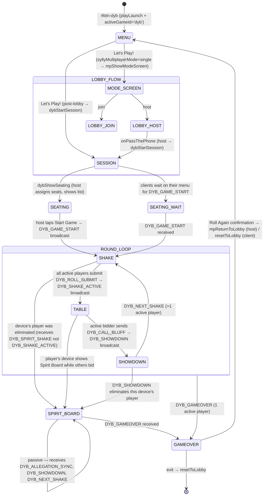

# New Game Technical Spec — Dicey Bluffs (DYB)
**Document type:** Phase 2 — Technical Specification
**Status:** CONFIRMED — implementation may begin
**Source brief:** `docs/new-ideas/new-game-brief-dicey-bluffs.md`
**Implementation notes:** `docs/implementation-notes/dyb-implementation-notes.md`

---

## Consistency Audit

| Check | Finding |
|-------|---------|
| Terminology collisions | "The Shake", "The Allegation", "The Showdown", "The Spirit Board", "The Clean Out", "House Rules", "Call Bluff!" — all unique across 10 games |
| Brand colour `pill-active-stone` exists? | No — must be added. Also `game-toggle-on-stone` and `dyb-range` (3 new CSS classes) |
| Abbreviation `dyb` conflicts? | Clean — confirmed against all 10 prefixes: li5, gm, ss, jec, ygi, lttp, nat, dsd, gth, bld |
| Screen IDs conflict? | None — all `screen-dyb-*` confirmed clear in `allScreens[]` |
| New data file needed? | No — pure RNG, no data assets |
| Reusable engine functions? | `showScreen`, `resetToLobby`, `play*()` audio catalogue, `mpReturnToLobby`, `mpLockSync/mpUnlockSync`. No `showWhoFirst` (no teams). No pass-gate (no private role reveals) |

**Flags:** 3 new CSS classes (`pill-active-stone`, `game-toggle-on-stone`, `dyb-range`) required before first browser test. Also add `'dyb': 'dyb-range'` to `updateSliderTheme()` in `engine.js`. Tailwind stone-400 = `#a8a29e`.

---

## §1 — Identity

| Field | Value |
|-------|-------|
| Full name | Dicey Bluffs |
| Short ID / abbreviation | dyb |
| Plugin file | `js/games/dyb.js` |
| Brand colour | stone-400 (`#a8a29e`) |
| Active pill class | `pill-active-stone` — add to `css/styles.css` |
| Toggle class | `game-toggle-on-stone` — add to `css/styles.css` |
| Range class | `dyb-range` — add to `css/styles.css` |
| Lobby button ID | `#btn-dyb` |
| Play CTA label | Let's Play! |
| Menu screen tagline | Trust no one, count every face. |

### New CSS classes (add to css/styles.css — follow existing pattern)

```css
/* Dicey Bluffs — stone-400 (#a8a29e) */
.pill-active-stone {
  background-color: #a8a29e;
  color: #ffffff;
  font-weight: 600;
}
.game-toggle-on-stone {
  background-color: #a8a29e;
  color: #ffffff;
  border-radius: 9999px;
  padding: 0.4rem 1.2rem;
  font-weight: 700;
  font-size: 0.9rem;
  transition: background 0.2s, color 0.2s;
  border: none;
  cursor: pointer;
}
.dyb-range {
  -webkit-appearance: none;
  appearance: none;
  height: 6px;
  border-radius: 9999px;
  background: linear-gradient(to right, #e7e5e4, #a8a29e);
  outline: none;
  cursor: pointer;
}
.dyb-range::-webkit-slider-thumb {
  -webkit-appearance: none;
  appearance: none;
  width: 22px; height: 22px;
  border-radius: 50%;
  background: #a8a29e;
  border: 3px solid #fff;
  box-shadow: 0 1px 4px rgba(0,0,0,0.2);
}
.dyb-range::-moz-range-thumb {
  width: 22px; height: 22px;
  border-radius: 50%;
  background: #a8a29e;
  border: none;
  box-shadow: 0 1px 4px rgba(0,0,0,0.2);
}
```

---

## §2 — State Flow



**Sub-states within screens:**

| Screen | Sub-states | State variable |
|--------|-----------|----------------|
| `screen-dyb-table` | active-bidder (inputs visible) / waiting (inputs locked) | `dybCurrentBidderIdx === mpMyPlayerIdx` |
| `screen-dyb-shake` | rolling / submitted-waiting | `dybShakeReadyCheck[mpMyPlayerIdx]` |
| `screen-dyb-showdown` | animating / resolved | local animation flag only |

**Pass-the-phone gate points:** None required — all players have identical mechanical roles; no private information that requires a handoff confirmation.

**`showWhoFirst()` usage:** Not applicable — no teams. Turn order is seat-based; opener is loser of previous shake.

**Screen layout patterns:**

| Screen ID | Pattern | Reason |
|-----------|---------|--------|
| `screen-dyb-menu` | Content-height (no min-h-screen) | Standard game menu |
| `screen-dyb-seating` | `min-h-screen` centred | Short list, no sticky CTA needed |
| `screen-dyb-shake` | `h-screen overflow-hidden` | Shake CTA must stay in thumb zone |
| `screen-dyb-table` | `h-screen overflow-hidden` | Dice hand + Call Bluff must always be visible |
| `screen-dyb-showdown` | `min-h-screen` centred | Informational reveal, scrolls if needed |
| `screen-dyb-gameover` | `min-h-screen` centred | Standard gameover layout |
| `screen-dyb-spirit-board` | `h-screen overflow-hidden` | Live grid with up to 8 player rows |

---

## §3 — Screen Registry

| Screen ID | Purpose | Notes |
|-----------|---------|-------|
| `screen-dyb-menu` | Main hub | Settings, How to Play, Let's Play!, ← Back to the Box |
| `screen-dyb-seating` | Seat assignments (MDLM host) | Host sees list + Start button; clients wait for DYB_GAME_START |
| `screen-dyb-shake` | Simultaneous roll (The Shake) | All active players tap to roll; ready check gates transition to Table |
| `screen-dyb-table` | Active bidding (The Whispering Table) | Active bidder sees inputs; all others locked with waiting message |
| `screen-dyb-showdown` | Reveal (Slamming the Cup) | Animated tally; all devices see this |
| `screen-dyb-gameover` | Final leaderboard (The Clean Out) | Winner + standings; Roll Again / Walk Away |
| `screen-dyb-spirit-board` | Ghost view (The Spirit Board) | Eliminated players; live dice grid, green flash on bluffs |

**Total new screens: 7** — all added to `allScreens[]` in `engine.js`.

---

## §4 — State Variables

```javascript
// ── Settings (persist between play-agains) ─────────────────────────────────
let dybWildcardsStyle = 'classic';  // 'strict' | 'classic' | 'volatile'
let dybStartingHand   = 5;           // 3 | 4 | 5
let dybSyllyMode      = false;
let dybSyllyIntensity = 5;           // 5–10 (% per special die type, slider)

// ── Roster (from mpPlayerSlots; persists across play-agains) ────────────────
let dybPlayerCount  = 0;
let dybPlayerNames  = [];            // string[N]
let dybSeatNumbers  = [];            // int[N] — seatNumbers[playerIdx] = seat (1..N)

// ── Match state (reset each play-again) ────────────────────────────────────
let dybDiceInHand       = [];        // int[N] — dice remaining per player
let dybActivePlayers    = [];        // int[] — playerIdx of non-eliminated players
let dybCurrentOpenerIdx = 0;         // who opens the next Shake
let dybShakeNumber      = 0;
let dybEliminationOrder = [];        // int[] — playerIdx in order eliminated

// ── Shake state (reset each Shake) ─────────────────────────────────────────
let dybShakeReadyCheck = [];         // bool[N] — true when player submitted their roll
let dybAllRolls        = [];         // int[][] — host only; all players' dice this shake

// ── Round state (reset each Shake) ─────────────────────────────────────────
let dybCurrentFace       = 0;        // current alleged face (0 = no bid yet)
let dybCurrentQty        = 0;        // current alleged quantity (0 = no bid yet)
let dybCurrentBidderIdx  = 0;        // whose turn it is to bid or challenge
let dybOnesStripped      = false;    // Volatile Wilds: true after 1s directly alleged
let dybAllegationHistory = [];       // {playerIdx, qty, face}[]

// ── Per-device roll state (private; not broadcast until showdown) ────────────
let dybMyRoll       = [];            // int[] — this device's current dice values
let dybSpecialTypes = [];            // string[] — 'standard'|'loaded'|'phantom'|'slick'|'cracked'|'snake'
let dybSlickFaces   = [];            // int[] — assigned face per die index (Slick only; -1 = unassigned)

// ── UI state ───────────────────────────────────────────────────────────────
let dybHandVisible  = true;          // stealth veil toggle
```

**Derived at runtime (never stored):**
- Active bidder: `dybCurrentBidderIdx === mpMyPlayerIdx`
- Bid floor: `newQty >= dybCurrentQty` (and `> currentQty` if same face)
- Wild 1s active: `dybWildcardsStyle !== 'strict' && !dybOnesStripped`

---

## §5 — Settings

**Settings overlay title block:**
- Heading: `House Rules 📋`
- Subtitle: `Set the table before anyone picks up their cup.`

**Settings table:**

| Setting name (display) | Options | Default | Internal variable | Internal values |
|---|---|---|---|---|
| Wildcards Style | Strict Numbers / Classic Wilds / Volatile Wilds | Classic Wilds | `dybWildcardsStyle` | `'strict'` / `'classic'` / `'volatile'` |
| Starting Hand | 3 Dice / 4 Dice / 5 Dice | 5 Dice | `dybStartingHand` | `3` / `4` / `5` |
| ✨ Sylly Mode (Devil's Luck) | OFF / ON | OFF | `dybSyllyMode` | `bool` |

**Plain-English card descriptions:**

| Setting | Description text |
|---------|-----------------|
| Wildcards Style | How the 1-face behaves during active Allegations. |
| Starting Hand | How many dice each player holds at the start of the game. |
| ✨ Devil's Luck | Each die has a chance to be secretly modified — loaded, phantom, cracked, slick, or a snake. |

**Wildcards Style pill descriptions (shown below the pill group):**
- **Strict Numbers:** "1s are just 1s — no wild business."
- **Classic Wilds:** "1s count toward any face. Can't be directly alleged."
- **Volatile Wilds:** "1s are wild until someone bids them — then they strip and lock."

**Devil's Luck sub-option (visible when Sylly Mode ON):**
- Label: "Chaos level"
- Slider: `#dyb-sylly-intensity-slider`, class `dyb-range`, range 5–10 (step 1)
- Display label: e.g. `5% chaos per die` (updates live)
- Same pattern as LI5 Wild Words intensity slider

**Locked settings in Lobby Mode:** None.

---

## §6 — Scoring Logic

DYB is elimination-based — no numeric points. "Score" = `dybDiceInHand[i]`.

| Outcome | Who | Effect |
|---------|-----|--------|
| Showdown: real count < claim | Bidder loses | `dybDiceInHand[bidderIdx]--` |
| Showdown: real count ≥ claim | Challenger loses | `dybDiceInHand[challengerIdx]--` |
| Player dice reaches 0 | That player | Remove from `dybActivePlayers`; device navigates to Spirit Board; add to `dybEliminationOrder` |
| 1 player in `dybActivePlayers` | — | `DYB_GAMEOVER` broadcast |

**Loser determination:** Called in `dybResolveShowdown()`. Bidder = `dybCurrentBidderIdx`. Challenger = the player who sent `DYB_CALL_BLUFF`.

**Post-showdown opener:** `dybCurrentOpenerIdx = dybLoserIdx` (loser leads next shake). If loser was just eliminated (0 dice), use the next player in seat order from `dybActivePlayers`.

**Real count formula — `dybComputeRealCount(face)`:**

Standard: count all dice across `dybAllRolls` where `die === face` OR (wild 1s active AND `die === 1`)

Devil's Luck modifiers per die:
- `'loaded'`: if `die === face` → counts as 2
- `'phantom'`: counts normally at its actual rolled value (player just didn't see it)
- `'slick'`: counts as `dybSlickFaces[i]` if assigned; else 0
- `'cracked'`: counts 0 regardless of face
- `'snake'`: if `die === face` → subtracts 1 from total (can push total negative)

**Volatile Wilds — face lock:** When `dybWildcardsStyle === 'volatile'` and a bid is submitted with `face === 1`: set `dybOnesStripped = true` globally; 1s no longer count as wild for the rest of this Shake; subsequent bids must have `face === 1`.

---

## §7 — Validation Rules

| Input | Block condition | Error / behaviour | Animation |
|-------|----------------|-------------------|-----------|
| Raise submit | `newQty < dybCurrentQty` | Disable submit (real-time) | qty counter floor enforced |
| Raise submit | `newFace === dybCurrentFace && newQty <= dybCurrentQty` | Disable submit (real-time) | qty counter blocked at current+1 when same face selected |
| Raise submit | `newFace < dybCurrentFace` | Face picker: lower faces greyed/disabled | — |
| Face picker | `dybWildcardsStyle === 'classic' && face === 1` | Face 1 greyed out / unselectable | — |
| Face picker | `dybOnesStripped && face !== 1` | All faces except 1 greyed out / unselectable | — |
| Slick Die — unassigned at showdown | — | Contributes 0 to tally; shows `—` in hand dock | — |

**Bid validation is enforced in real-time** (disable the Raise button, grey invalid face options) — not only on submit.

---

## §8 — Overlay Registry

| Overlay ID | Pattern | z-index | Trigger | Notes |
|------------|---------|---------|---------|-------|
| `dyb-settings-overlay` | Data (slide-up) | z-[80] | `#btn-dyb-menu-settings` | "House Rules 📋" |
| `dyb-how-to-overlay` | Data (slide-up) | z-[90] | `#btn-dyb-menu-how-to`, `#btn-dyb-how-to` | "How to Play 🎲" |
| `dyb-quit-overlay` | Decision modal | z-[80] | `.btn-dyb-quit-open` | "Walk Away?" |
| `dyb-new-game-overlay` | Decision modal | z-[90] | `#btn-dyb-gameover-again` on gameover | "Roll Again?" |

**Quit overlay copy:**
- Emoji: 🚪
- Heading: "Walk Away?"
- Subtext: "Your dice go with you. The game carries on without you."
- Confirm: "Yeah, I'm out."
- Cancel: "Keep bluffing!"

**Play-again overlay copy:**
- Emoji: 🎲
- Heading: "Roll Again?"
- Subtext: "New seats, new cups, same room code."
- Confirm (host): "Restart in Lobby 🔄"
- Confirm (client): "Leave Session"
- Confirm (single): "Roll Again 🎲"

**Exact inner div class strings:**

Data slide-up:
```html
<div class="overlay-data-inner settings-slide-up bg-stone-50 w-full max-w-sm rounded-t-3xl flex flex-col">
```
Decision modal:
```html
<div class="overlay-modal-inner bg-stone-50 w-full max-w-sm rounded-3xl px-6 pt-6 pb-8 flex flex-col gap-4 text-center border border-stone-300">
```

---

## §9 — Audio Map

| Game moment | Audio function |
|-------------|---------------|
| Game entry / Let's Play! tap | `playLaunch()` |
| Shake / tap-to-roll CTA | `playLaunch()` |
| Raise Allegation submit | `playDone()` |
| Call Bluff tap | `playExit()` |
| Showdown tally — per die counted | `playTick()` |
| Loser drops a die | `playBoing()` |
| Player eliminated (0 dice) | `playBoing()` + 600ms delay to Spirit Board |
| Winner declared | `playSuccess()` |
| Settings pill toggle | `playPillClick()` |
| Overlay open / confirm / close | `playDone()` |
| Devil's Luck toggle ON | `playSyllyOn()` |
| Devil's Luck toggle OFF | `playSyllyOff()` |

No new audio functions required.

---

## §10 — Word Bank & Data

**Source:** None — DYB is pure RNG, no data file.

**Roll generation — `dybGenerateRoll(count)`:**
```javascript
// Standard mode
return Array.from({length: count}, () => Math.floor(Math.random() * 6) + 1);

// Devil's Luck: additionally assign die types
const specialRate = dybSyllyIntensity / 100;
const typeOrder = ['loaded', 'phantom', 'slick', 'cracked', 'snake'];
const specialTypes = roll.map(() => {
  const r = Math.random();
  for (let i = 0; i < typeOrder.length; i++) {
    if (r < specialRate * (i + 1)) return typeOrder[i];
  }
  return 'standard';
});
```

**Secret Mode / expansion pack:** Not applicable — no word pool. `applyExpansionOverrides()` hook not needed.

**SW precache:** No new data assets. Only `js/games/dyb.js` added to precache. Bump SW version on first deploy.

---

## §11 — Multiplayer Configuration

| Field | Value |
|-------|-------|
| Mode | MDLM only |
| `multiplayerOnly` | `true` |
| `supportedModes` | `['mdlm']` |
| `recommendedMode` | `'mdlm'` |
| `rosterConfig` | `{ type: 'none', showTeamNamesInPreLobby: false, defaultTeamNames: null, hasCaptain: false }` |
| Min players | 3 |
| Max players | 8 |

**MP_GAME_CONFIGS entry (add to `engine-multiplayer.js`):**
```javascript
dyb: {
  gameName:       'Dicey Bluffs',
  emoji:          '🎲',
  brandBtnClass:  'bg-stone-400 hover:bg-stone-500',
  ptpLabel:       "Let's Play! 🎲",
  menuScreen:     'screen-dyb-menu',
  onPassThePhone: () => {
    if (window.syllyMultiplayerMode === 'host') {
      dybPlayerCount = mpPlayerSlots.length;
      dybPlayerNames = mpPlayerSlots.map(p => p.nickname);
      dybShowSeating();
    }
    // 'client': waits for DYB_GAME_START SYNC
  },
  recommendedMode:  'mdlm',
  supportedModes:   ['mdlm'],
  multiplayerOnly:  true,
  lobbyCtaLabel:    "Let's Play! 🎲",
  rosterConfig: { type: 'none', showTeamNamesInPreLobby: false, defaultTeamNames: null, hasCaptain: false },
  getMaxPlayers:    () => 8,
},
```

**mpSerialiseSettings entry:**
```javascript
case 'dyb': return { dybWildcardsStyle, dybStartingHand, dybSyllyMode, dybSyllyIntensity };
```

**Menu play CTA dual context (MDLM pattern from `logic-engine.md`):**
```javascript
document.getElementById('btn-dyb-menu-play').addEventListener('click', () => {
  playLaunch();
  if (window.syllyMultiplayerMode !== 'single') {
    dybStartSession();       // post-lobby: names ready, go to seating
  } else {
    mpShowModeScreen('dyb'); // pre-lobby: enter lobby first
  }
});
```

**Per-phase intercept points:**

| Phase | Single | Multiplayer |
|-------|--------|-------------|
| Game start | N/A (MDLM only) | Host assigns `dybSeatNumbers` (shuffle 1..N), broadcasts `SYNC: DYB_GAME_START {playerNames, seatNumbers, diceInHand, firstOpenerIdx, wildcards, startingHand, syllyMode, syllyIntensity}` |
| Roll (The Shake) | N/A | All active players: `ACTION: DYB_ROLL_SUBMIT {roll, specialTypes, slickFaces}`. Host ready-checks `dybActivePlayers`. When all in: broadcasts `SYNC: DYB_SHAKE_ACTIVE {}` to active players + `SYNC: DYB_SPIRIT_SHAKE {allRolls, specialTypes}` to eliminated players |
| Bid escalation | N/A | Active bidder: `ACTION: DYB_ALLEGATION {face, qty}`. Host validates + broadcasts `SYNC: DYB_ALLEGATION_SYNC {face, qty, bidderIdx, nextBidderIdx, allegationExceedsReal}` to all |
| Challenge | N/A | Active bidder: `ACTION: DYB_CALL_BLUFF {}`. Host calls `dybResolveShowdown()`, broadcasts `SYNC: DYB_SHOWDOWN {allRolls, specialTypes, slickFaces, loserIdx, newDiceInHand, eliminatedIdx}` |
| Post-showdown | N/A | If game continues: `SYNC: DYB_NEXT_SHAKE {nextOpenerIdx, activePlayers}`. If game ends: `SYNC: DYB_GAMEOVER {winnerIdx, eliminationOrder}` |

**Private information routing:**

| Information | Sent to | How |
|-------------|---------|-----|
| Each player's dice values during Shake | Host only until showdown | Submitted via `DYB_ROLL_SUBMIT` ACTION; not broadcast until `DYB_SHOWDOWN` |
| All dice for Spirit Board live view | Eliminated players | `DYB_SPIRIT_SHAKE` broadcast; only renders on `screen-dyb-spirit-board` |

No targeted Firebase writes required — couch security model sufficient.

**readyCheck matrix:**
```javascript
dybShakeReadyCheck = new Array(dybPlayerCount).fill(false);
// set true when player i submits DYB_ROLL_SUBMIT
// advance when: dybActivePlayers.every(i => dybShakeReadyCheck[i])
```

---

## §12 — Sylly Mode Technical Spec

**Thematic name:** Devil's Luck
**Internal variable:** `dybSyllyMode = false`

**What changes (code-level):**
1. `dybGenerateRoll()` also assigns `dybSpecialTypes[]` using `dybSyllyIntensity`
2. Hand dock (`dybRenderHand()`) renders per-type visual indicators:
   - `'loaded'`: amber border glow
   - `'phantom'`: `?` instead of number (player knows they have it, not the value)
   - `'slick'`: `—` until assigned; tapping opens face picker on the Table screen
   - `'cracked'`: greyed out
   - `'snake'`: crimson red background
3. `dybComputeRealCount(face)` applies per-type modifiers (see §6)
4. `DYB_ROLL_SUBMIT` includes `specialTypes[]` and `slickFaces[]` so host can tally
5. Intensity slider (`#dyb-sylly-intensity-slider`, class `dyb-range`) visible when Sylly Mode ON

**Slick Die assignment (Table screen, active bidder only):**
- Tapping an unassigned Slick Die opens an inline face picker (1–6)
- `dybAssignSlickFace(dieIdx, face)` updates `dybSlickFaces[dieIdx]`, re-renders the die
- Picker can be opened/changed freely while it's the player's turn
- At Raise or Call Bluff submit: current `dybSlickFaces` values sent in payload
- If unassigned at showdown (triggered by someone else): contributes 0

**Modified functions:** `dybGenerateRoll`, `dybRenderHand`, `dybComputeRealCount`, `DYB_ROLL_SUBMIT` payload builder.
**New helper:** `dybAssignSlickFace(dieIdx, face)`.

---

## §13 — resetToLobby() Additions

```javascript
// DYB teardown
document.getElementById('dyb-settings-overlay').style.display = 'none';
document.getElementById('dyb-how-to-overlay').style.display = 'none';
document.getElementById('dyb-quit-overlay').style.display = 'none';
document.getElementById('dyb-new-game-overlay').style.display = 'none';
dybMyRoll = [];
dybAllRolls = [];
dybActivePlayers = [];
dybOnesStripped = false;
dybAllegationHistory = [];
dybShakeReadyCheck = [];
```

---

## §14 — index.html Section Header

```html
<!-- ════ DICEY BLUFFS ════
     Screens : screen-dyb-menu, screen-dyb-seating, screen-dyb-shake,
               screen-dyb-table, screen-dyb-showdown, screen-dyb-gameover,
               screen-dyb-spirit-board
     Overlays: dyb-settings-overlay, dyb-how-to-overlay, dyb-quit-overlay,
               dyb-new-game-overlay
  ════════════════════════════════════════════════════════════════ -->
```

---

## §15 — Implementation Checklist

### Foundation
- [ ] `js/games/dyb.js` created with dependency comment
- [ ] `<script>` tag added after `gth.js`, before `secret-mode.js`
- [ ] All 7 screen IDs added to `allScreens[]` in `engine.js`
- [ ] Overlay teardown added to `resetToLobby()` in `engine.js` (§13)
- [ ] Section header added to `index.html` (§14)
- [ ] `pill-active-stone`, `game-toggle-on-stone`, `dyb-range` added to `css/styles.css`
- [ ] `'dyb': 'dyb-range'` added to `updateSliderTheme()` in `engine.js`
- [ ] Lobby button wired: `playLaunch(); activeGameId = 'dyb'; showScreen('screen-dyb-menu');`

### Game Menu
- [ ] Let's Play! (dual context §11), How to Play, Settings, ← Back to the Box
- [ ] Settings button: `bg-stone-100 hover:bg-stone-200 text-stone-700`
- [ ] `playLaunch()` on Let's Play!

### Settings Overlay
- [ ] Wildcards Style: 3-pill group, `pill-active-stone`
- [ ] Starting Hand: 3-pill group, `pill-active-stone`
- [ ] Devil's Luck toggle (`game-toggle-on-stone`), Sylly Mode last
- [ ] Intensity slider (`dyb-range`) — hidden when Sylly OFF, visible when ON
- [ ] Thematic title block: "House Rules 📋" + subtitle; `scrollTop = 0` on open (target `.overlay-data-inner`)

### How-to Overlay
- [ ] Title block + `scrollTop = 0` on open
- [ ] Step cards: The Shake → The Allegation → Raise or Challenge → Winning and Scoring → ✨ Devil's Luck

### Screens
- [ ] `.btn-open-sound` + ✕ on every screen
- [ ] `#btn-dyb-how-to` always visible in table screen header → `dyb-how-to-overlay`
- [ ] All screens use layout pattern from §2
- [ ] Mid-game ✕ → quit overlay → game menu
- [ ] Post-game ✕ → `playExit(); resetToLobby()`

### DYB SEATING (`screen-dyb-seating`)
- [ ] Host: shows seat assignments (name + seat number); "Start Game" → `dybStartGame()` (assigns random `dybSeatNumbers`, broadcasts `DYB_GAME_START`)
- [ ] Clients: "Waiting for host to deal the seats…" — navigate to SHAKE on `DYB_GAME_START`

### DYB SHAKE (`screen-dyb-shake`)
- [ ] Shows shake opener: "Your deal — open the table." (opener only) or "[Name]'s deal."
- [ ] Large tap-to-roll sticky CTA → `dybGenerateRoll()` → renders dice + type indicators if Sylly Mode
- [ ] "Ready" → `ACTION: DYB_ROLL_SUBMIT {roll, specialTypes, slickFaces}` → button disabled; shows waiting state
- [ ] Stealth veil eye icon to show/hide dice hand

### DYB TABLE (`screen-dyb-table`)
- [ ] Header: room code + `[?]` + ✕
- [ ] Player pip row: all active players with dice pip count; active bidder highlighted
- [ ] Allegation display: current qty × face (large centred)
- [ ] Bid history: last 3 entries scrollable
- [ ] **Active bidder:** face picker (1–6, restrictions applied per wildcard style) + qty counter (floor enforced) + "Raise the Stakes" submit + "Call Bluff!" button — both have `btn-mp-action` class
- [ ] **Active bidder (Devil's Luck):** Slick Die tappable in hand dock → face picker (1–6) → `dybAssignSlickFace(dieIdx, face)`. Picker can be opened/changed freely until Raise or Call Bluff is submitted. Unassigned at submit → counts 0
- [ ] **Waiting players:** "Waiting for [name]…" — inputs locked
- [ ] Stealth veil eye toggle

### DYB SHOWDOWN (`screen-dyb-showdown`)
- [ ] "SLAMMING THE CUP" heading
- [ ] Claimed: "X × [face]"
- [ ] Animated tally: counts 0 → real count (400ms per `playTick()`)
- [ ] Result banner: "Real count: N — [CLAIM HOLDS / BLUFF CALLED]"
- [ ] Loser: "[Name] loses a die." (or "…and is out!" if eliminated)
- [ ] All players' hands revealed (with type indicators if Sylly Mode)
- [ ] "Next Shake →" — host only; clients see "Waiting for host…"

### DYB SPIRIT BOARD (`screen-dyb-spirit-board`)
- [ ] Header: "THE SPIRIT BOARD 👻"
- [ ] Live dice grid: all active players' hands (full values visible)
- [ ] Green flash on player row when `allegationExceedsReal` received in `DYB_ALLEGATION_SYNC`
- [ ] Current allegation mirrored (qty × face)
- [ ] Updates on: `DYB_SPIRIT_SHAKE`, `DYB_ALLEGATION_SYNC`, `DYB_SHOWDOWN`, `DYB_NEXT_SHAKE`
- [ ] Navigates to GAMEOVER on `DYB_GAMEOVER`

### DYB GAMEOVER (`screen-dyb-gameover`)
- [ ] "THE CLEAN OUT" heading
- [ ] Winner announced
- [ ] Standings in elimination order
- [ ] "Roll Again?" → `dyb-new-game-overlay`
- [ ] Post-game ✕ → `playExit(); resetToLobby()`

### Overlays
- [ ] Decision modal inners: `border border-stone-300`
- [ ] Quit overlay copy per §8
- [ ] Play-again overlay copy per §8; confirm label updates dynamically
- [ ] All `setTimeout` calls have inline WHY comment

### Scoring & Logic
- [ ] `dybComputeRealCount(face)` handles Strict / Classic / Volatile Wilds + Devil's Luck modifiers
- [ ] `dybResolveShowdown()` — decrements loser dice, updates `dybActivePlayers`, eliminates if 0, sets next opener, checks for game over
- [ ] Bid validation enforced real-time (disable button, grey face options) per §7
- [ ] `dybOnesStripped` set and locked for rest of Shake under Volatile Wilds

### Multiplayer
- [ ] `dyb` entry added to `MP_GAME_CONFIGS` in `engine-multiplayer.js`
- [ ] `dyb` case added to `mpSerialiseSettings`
- [ ] `dybHandleEnvelope(env)` with all ACTION + SYNC handlers per §11
- [ ] `btn-mp-action` on Raise + Call Bluff
- [ ] `mpReturnToLobby()` in play-again confirm (host path)

### Service Worker
- [ ] `js/games/dyb.js` added to `sw.js` precache
- [ ] SW version bumped from v98

### Documentation
- [ ] `docs/code-map.md` updated with DYB section (screens, overlays, key functions, packets)
- [ ] `game-identities.md` updated with full DYB entry
- [ ] `CLAUDE.md` updated (SW version, current focus, key references)
- [ ] `docs/implementation-notes/dyb-implementation-notes.md` updated throughout implementation

---

## §16 — Clarifications Resolved

| # | Question | Resolution |
|---|----------|-----------|
| 1 | Phantom Die display | `?` icon confirmed — player sees mystery placeholder; value revealed at showdown |
| 2 | Slick Die assignment | Assigned on Table screen during your active bidding turn. Unassigned at showdown = 0 contribution. Face picker accessible any time it's the active bidder's turn; can change up until Raise or Call Bluff submitted |
| 3 | Shake timer | Player-paced confirmed — no countdown |

---

## §17 — Deviations from Phase 1 Brief

| # | Brief said | Spec does instead | Reason |
|---|-----------|------------------|--------|
| 1 | "Pull Up a Chair (Setup): Host sets House Rules; players join via room code." | House Rules = settings overlay from game menu; lobby join = shared `screen-mp-lobby-host/join` parameterised screens | All games use the parameterised lobby architecture — no per-game lobby UI |
| 2 | "The Shake: players physically shake their phone via device motion sensors" | Rapid-tap only for v1; no accelerometer/DeviceMotion API | DeviceMotion requires HTTPS + permission gesture; unreliable across Android browsers |
| 3 | No explicit seating screen mentioned | `screen-dyb-seating` added (MDLM host trigger for game start) | MDLM architecture requires an explicit host action to broadcast `DYB_GAME_START`; this screen serves that purpose and communicates seat order to all players |
