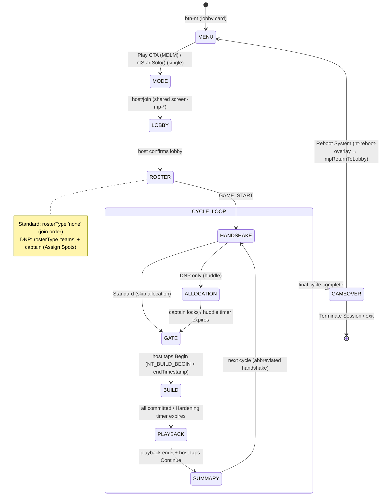

# New Game Technical Spec — Net-Trace (NT)
**Document type:** Phase 2 — Technical Specification
**Status:** DRAFT — awaiting project-owner confirmation before any implementation begins
**Source brief:** `docs/new-ideas/new-game-brief-net-trace.md`
**Author:** Claude Code (June 2026)

> This spec was written after reading the Phase 1 brief in full and auditing the real codebase
> (`engine-multiplayer.js`, `engine.js`, `css/styles.css`, all 12 plugin configs, `game-identities.md`,
> `logic-engine.md`, `ui-style.md`, `definitions.md`, `code-map.md`). Where the brief made a codebase
> claim, it was verified against source — findings are in the Consistency Audit below and §17.
>
> **Net-Trace is the most architecturally novel game in the suite.** It is the first game with:
> a real-time `requestAnimationFrame` canvas animation engine, a BFS pathfinding engine, a
> host-computed deterministic playback timeline, a roster topology that depends on a *setting*
> (not lobby style), and a continuous cross-Node relay (DNP). None of these reuse an existing
> engine primitive. Treat the risk flags in §16/§17 as first-class — several have no precedent.

---

## Consistency Audit (completed before any other section)

| Check | Finding |
|-------|---------|
| Terminology collisions across the 12 games? | **None.** "Bridge", "Node", "Honeypot", "Breach Vector", "SER", "Ingress/Egress", "Bad Sector", "Firewall Segment", "Network Hardening", "Diagnostic Summary", "Reboot System", "Terminate Session" — all unique. ⚠️ Minor: "Native"/"Allocated" are NT-internal qualifiers, no collision. DSD owns "Sonar/Payload/Valour" — no overlap. |
| Brand colour `pill-active-emerald` exists in `css/styles.css`? | **No.** Highest existing is `pill-active-zinc` (PASS). `pill-active-emerald`, `game-toggle-on-emerald`, and `.nt-range` (slider) must be **added** (3 small CSS additions — no SW bump for CSS-only changes, but NT's JS/HTML will require a bump anyway). |
| Abbreviation `nt` conflicts with an existing prefix? | **No.** Active prefixes: `li5, gm, ss, jec, ygi, lttp, nat, dsd, gth, dyb, bld, pass`. `nt` is free. ⚠️ Visual-similarity note: `nt` vs `nat` (Natural Selection) — distinct strings, no code collision, but keep grep patterns exact. |
| Proposed screen IDs conflict with `allScreens[]` (`engine.js:20`)? | **No.** All `screen-nt-*` IDs are new. |
| New data file needed, or reuse `words.json` / `ygi-data.json`? | **Neither.** Net-Trace is 100% procedural — maps are generated algorithmically host-side. No word bank, no data file, no Secret Mode / expansion hook (those are word-bank features; N/A here — see §10 + §17-D5). |
| Reusable engine functions / shared modules? | **`showWhoFirst`** — NOT used (DNP team order is irrelevant; the relay runs both teams independently). **`normaliseWord`** — N/A (no text input). **Pass-gate pattern** — N/A (no private role reveal; build privacy is per-device, not pass-the-phone). **`Cards` / `CanvasDraw`** — `CanvasDraw` is a freehand stroke-capture module (pointer→delta strokes), **NOT an animation-loop renderer**; NT needs its own game-local RAF canvas renderer (confirmed in brief §12). **Pathfinding (BFS)** — does not exist anywhere; new. **`mpRcHasCaptain` / `type:'teams'` roster** — reused (see §11). |

**Audit flags carried into the spec:**
1. **Roster topology depends on a setting, not lobby style** — NT is always MDLM; Standard wants an `individual`/`none` roster, DNP wants a `teams`+captain roster. `mpGetRosterType()` (`engine-multiplayer.js:1619`) resolves `type` as `t(window.mpLobbyStyle)` only. **Resolution (no engine change needed):** make `type` and `hasCaptain` *functions that read the `ntSyllyMode` global* (settings are locked before the host creates the room, so `ntSyllyMode` is known by `mpHostCreateRoom`). Set `showTeamNamesInPreLobby: false` and collect DNP team/captain names on the Assign-Spots roster screen (`mp-roster-team-0-input` already exists, `engine-multiplayer.js:1976`). See §17-D1.
2. **Solo = single-device path, not "lobby of one"** — `mpConfirmRoster` hard-bounces any lobby with `< 2` players (`engine-multiplayer.js:2016`). Solo must run as **PTP single-device** (`supportedModes: ['ptp','mdlm']`, `multiplayerOnly: false`). See §17-D2.
3. **No "difficulty (word tier)" setting** — the new-game checklist's difficulty item is word-bank-specific; NT has no word bank. Matrix Scale + Bad-Sector density band are the equivalent difficulty dials. See §17-D5.

---

## §1 — Identity

| Field | Value |
|-------|-------|
| Full name | Net-Trace |
| Short ID / abbreviation | `nt` |
| Plugin file | `js/games/nt.js` |
| Brand colour (UI chrome only) | **emerald-500** (`#10b981`) |
| Active pill class | `pill-active-emerald` — **add to `css/styles.css`** |
| Toggle ON class | `game-toggle-on-emerald` — **add to `css/styles.css`** |
| Range slider class | `nt-range` (emerald-200 → emerald-600) — **add to `css/styles.css`** + map in `updateSliderTheme()` + `getMuteToggleOnClass()` |
| Lobby button ID | `#btn-nt` (lobby card on `screen-lobby`) |
| Emoji / icon | ⚡ — used on the menu title/heading and lobby card, never on the Play CTA (Settings Card Standard bans emoji on CTA start-game buttons) |
| Play CTA label | **"Initialise System"** (no emoji; single-device CTA — in MDLM the menu Play routes to mode screen) |
| Menu screen tagline | "Out-engineer the automated breach before your system data is extracted." |

**Playfield palette (canvas only — NOT brand):** firewall = cyan-500 `#06b6d4`, honeypot = fuchsia-500 `#d946ef`, breach = red-500 `#ef4444`, bad sector = slate-700 `#334155`, canvas base = slate-900 `#0f172a`. These are gameplay-legibility colours, deliberately separate from the emerald UI chrome (brief §18).

---

## §2 — State Flow

Two distinct flows share most screens. **Standard Mode** (solo single-device OR MDLM individuals) and **DNP / Sylly Mode** (MDLM, 2 teams + captains). DNP inserts the Shared Allocation Hub before each build.



**Solo (single-device) variant:** `MENU → ntStartSolo()` skips MODE/LOBBY/ROSTER and runs `CYCLE_LOOP` locally (no HANDSHAKE network sync, no ALLOCATION — solo is always Standard). Everything else identical; SER is trivially 100% so raw-ms is the headline (brief §5).

**Sub-states within screens:**

| Screen | Sub-states | State variable |
|--------|-----------|----------------|
| `screen-nt-allocation` (DNP) | `editing` / `locked` / `unallocated-warning` | `ntHuddlePhase` |
| `screen-nt-build` | `routing-valid` / `routing-exception` (transient flash) | `ntRoutingState` |
| `screen-nt-playback` | `tracing` / `paused` / `scrubbing` / `ended` (Standard); `relay-leg-N` / `bridge-pan` / `ended` (DNP) | `ntPlaybackPhase` |
| `screen-nt-summary` | `cycle` (between rounds) / `match` (final) | `ntSummaryMode` |

**Pass-the-phone gate points:** **None.** NT reveals no private role information requiring a physical hand-off — every device shows only its own Node, and build privacy is enforced by each player being on their own device (couch model, like NAT/SS). The `screen-nt-gate` ("Cycle Initialization Gate") is a *readiness* confirm, not a private-info pass-gate (no "who is holding the phone" semantics). Confirmed: no `screen-nt-pass-gate` needed.

**`showWhoFirst()` usage:** Not used. DNP is not a turn-order game — both teams build and run their relays independently; there is no "who goes first".

**Screen layout pattern decision:**

| Screen ID | Layout pattern | Reason |
|-----------|---------------|--------|
| `screen-nt-menu` | `min-h-screen` centred (default) | Standard menu, no sticky footer |
| `screen-nt-handshake` | `h-screen overflow-hidden` | Full-bleed boot animation; no scroll |
| `screen-nt-allocation` | `h-screen` sticky-footer | "Lock Allocations" CTA must stay visible above the huddle timer regardless of roster length |
| `screen-nt-gate` | `min-h-screen` centred | Single readiness CTA, short content |
| `screen-nt-build` | `h-screen overflow-hidden` | Commit Runtime button must stay pinned; the VM window is fixed-frame, grid scales inside it (brief §17) |
| `screen-nt-playback` | `h-screen overflow-hidden` | Scrubber + Continue/Skip must stay visible; canvas is fixed-frame |
| `screen-nt-summary` | `min-h-screen` centred | Scoreboard scrolls naturally; Reboot/Terminate below |
| `screen-nt-standby` | `min-h-screen` centred | Passive "waiting for host" / "waiting for cluster" message |

---

## §3 — Screen Registry

All IDs added to `allScreens[]` in `engine.js`. Lobby/mode screens are the **shared** `screen-mp-*` set (NT does not define its own).

| Screen ID | Purpose | Notes |
|-----------|---------|-------|
| `screen-nt-menu` | Main hub (Play / How to Play / Settings / ← Back to the Box) | Standard menu |
| `screen-nt-handshake` | System Flavour Handshake — boot/sync animation (`INITIALISING OS… CONNECTING TO CLUSTER… SECURING INGRESS`) | Full at match start; abbreviated + skippable between cycles (brief §11.4) |
| `screen-nt-allocation` | **DNP only** — Shared Allocation Hub (huddle): allocation pool + all team-bridged Nodes; captain-only `[+]/[-]` adjusters | Sticky-footer "Lock Allocations" |
| `screen-nt-gate` | Cycle Initialization Gate — readiness confirm before build; host taps "Begin Hardening" | readyCheck (`ntGateReadyCheck[]`) |
| `screen-nt-build` | Network Hardening Field — the VM-window build screen (brief §17) | Canvas/DOM hybrid; build timer |
| `screen-nt-playback` | Signal Trace Playback Panel (brief §16) | Canvas RAF renderer; scrubber; Continue/Skip |
| `screen-nt-summary` | Diagnostic Summary Console — cycle scores + match result; per-leg breakdown (DNP); Reboot/Terminate | `ntSummaryMode` cycle/match |
| `screen-nt-standby` | Passive client wait state (during host-driven transitions / cluster resolution) | "⏳ Waiting for the host…" |

**Total new screens:** **8** — all added to `allScreens[]` in `engine.js`.

**Team setup screens:** None bespoke. DNP team names + captains are assigned on the **shared** `screen-mp-roster` (Assign Spots) using its existing team-name inputs (`mp-roster-team-0-input` / `-1-input`) — no `screen-nt-setup` / `screen-nt-players` needed.

---

## §4 — State Variables

All `nt`-prefixed. Grouped by lifecycle.

```javascript
// ── Settings (persist between play-agains) ─────────────────────────────────
let ntMatrixScale    = 9;        // 8 | 9 | 10  — grid bounds (NT_GRID_BOUNDS default)
let ntIterations     = 5;        // 5 | 7 | 10  — Simulation Iterations (rounds)
let ntHardeningWin   = 90;       // 45 | 60 | 90 | 120 (seconds) — build timer
let ntNativeHoneypots= 2;        // 0 | 1 | 2   — max Native Honeypots baked into seed
let ntSyllyMode      = false;    // DNP (Distributed Network Protocol) — always last setting

// ── Roster (set in lobby, persist across play-agains) ──────────────────────
let ntPlayerCount    = 1;        // total players (1 solo … 8 MDLM)
let ntPlayerNames    = [];       // from mpPlayerSlots[i].nickname
let ntTeamIdx        = [];       // DNP: per-player team (0|1) from mpLobbyRoster.playerTeamIdx
let ntTeamNames      = ['Amaze Inc.', 'Pender Securities']; // DNP team names
let ntCaptainSlots   = [-1, -1]; // DNP: per-team captain player index (mpLobbyRoster.captainSlots)

// ── Match state (reset each play-again / Reboot) ───────────────────────────
let ntCycle          = 0;        // current Simulation Cycle (0-indexed)
let ntCycleSERs      = [];       // [cycleIdx][playerIdx] = number (%) — Standard
let ntTeamCycleSERs  = [];       // [cycleIdx][teamIdx]   = number (%) — DNP
let ntOverallSER     = [];       // rolling average per player (Standard) / team (DNP)
let ntRafHandle      = null;     // requestAnimationFrame handle — TIMER, must be cancelled everywhere
let ntBuildTimer     = null;     // setInterval handle for the Hardening countdown
let ntHuddleTimer    = null;     // setInterval handle for the DNP huddle countdown

// ── Cycle / Node state (reset each cycle) ──────────────────────────────────
let ntNode           = null;     // { scale, ingress:{x,y}, egress:{x,y}, badSectors:[], nativeHoneypots:[] }
let ntInventory      = { firewall: 0, honeypot: 0 }; // randomised per cycle, identical for all players
let ntMyPlacements   = [];       // this device's [{x,y,type:'firewall'|'honeypot'}]
let ntFirewallUsed   = 0;        // live counters (derived from ntMyPlacements but cached for UI)
let ntHoneypotUsed   = 0;
let ntPlaybackData   = null;     // host-broadcast: per-player/per-team { timeline, latencyMs }
let ntViewingUid     = null;     // which player's maze is loaded in the playback comparison slot

// ── DNP cycle state ────────────────────────────────────────────────────────
let ntTeamNodes      = [];       // [teamMemberIdx] = Node for each leg of this team's relay
let ntAllocationPool = { firewall: 0, honeypot: 0 }; // team total
let ntAllocations    = [];       // [teamMemberIdx] = { firewall, honeypot } assigned by captain
let ntHuddlePhase    = 'editing';// 'editing' | 'locked'

// ── MP readyCheck matrices (reset each phase) ──────────────────────────────
let ntGateReadyCheck = [];       // per-player ready at Cycle Initialization Gate
let ntCommitReadyCheck = [];     // per-player committed at build phase

// ── UI / transient state ───────────────────────────────────────────────────
let ntRoutingState   = 'valid';  // 'valid' | 'exception' (drives status-bar flash)
let ntPlaybackPhase  = 'tracing';
let ntSummaryMode    = 'cycle';
let ntOverclockTheme = false;    // easter-egg monochrome/amber theme (triple-tap AMAZE_INC_v1.2)
let ntLongPressTimer = null;     // long-press gesture threshold handle (build screen)
```

**Variables derived at runtime (never stored):**
- `ntIsDNP` = `ntSyllyMode === true` (mirrors the `isSylly` pattern — never persisted).
- `ntCycleCeiling` (Standard) = `Math.max(...players' latencyMs this cycle)` — computed at scoring time.
- `ntClusterCeiling` (DNP) = `Σ max(teamA legN, teamB legN)` — computed at scoring time.
- Per-cell render colour, remaining inventory (`ntInventory.firewall - ntFirewallUsed`).

**Engine balancing constants** (top of `nt.js`, exactly as brief §15 — `NT_BASE_TILE_TIME`, `NT_TURN_DELAY`, `NT_HONEYPOT_RADIUS`, `NT_HONEYPOT_SLOW`, `NT_HONEYPOT_DURATION`, `NT_HONEYPOT_COOLDOWN`, `NT_TRAIL_ALPHA`, and the `NT_COLOR_*` hexes). These are calibration knobs, not settings.

---

## §5 — Settings

**Settings overlay title block:**
- Heading: `SYS.CONFIG ⚡`
- Subtitle: `root@amaze_inc:~# ./sys.config` (terminal flavour, `text-xs`)

**Settings table** (Sylly Mode last; no word-difficulty setting — see §17-D5):

| Setting (display) | Options | Default | Internal variable | Internal values |
|-------------------|---------|---------|-------------------|-----------------|
| Matrix Scale | 8×8 / 9×9 / 10×10 | 9×9 | `ntMatrixScale` | `8` / `9` / `10` |
| Simulation Iterations | 5 / 7 / 10 | 5 | `ntIterations` | `5` / `7` / `10` |
| Hardening Window | 45s / 60s / 90s / 120s | 90s | `ntHardeningWin` | `45` / `60` / `90` / `120` |
| Native Honeypots | 0 / 1 / 2 | 2 | `ntNativeHoneypots` | `0` / `1` / `2` |
| ✨ Sylly Mode (Distributed Network Protocol) | OFF / ON | OFF | `ntSyllyMode` | `bool` |

**Plain-English card descriptions:**

| Setting | Description text |
|---------|-----------------|
| Matrix Scale | "The size of each Node. Bigger grids mean more room to maze — but smaller touch targets on a phone. 10×10 is best on a larger screen." |
| Simulation Iterations | "How many Vulnerability Simulations make up a full match." |
| Hardening Window | "How long you get to build each Node before the layout locks." |
| Native Honeypots | "The most Honeypots the system can bake into the Node itself, before you place your own." |
| ✨ Sylly Mode | "Distributed Network Protocol — form two corporate clusters, pool your resources, and chain your Nodes into one continuous relay. A Lead Systems Engineer allocates the team's inventory; everyone builds a leg of the pipeline." |

**Settings forced/disabled in multiplayer:**
- **DNP requires MDLM.** When `ntSyllyMode === true`, the menu Play CTA must route to MDLM (skip the solo/PTP option) — DNP cannot run single-device (no teammates). See §11.
- No setting is *hidden* in MDLM, but `ntSyllyMode` toggling changes the lobby roster topology (Standard `none` ↔ DNP `teams`+captain). Because roster type is resolved at lobby-confirm time from the locked `ntSyllyMode` global, the host must set Sylly Mode **before** hosting (standard flow — settings live on the menu, opened before Play).

---

## §6 — Scoring Logic

**System Efficiency Rating (SER)** — percentage, rolling average. Two decimal places.

### Standard Mode (per cycle)

| Outcome | Who scores | Formula | Turn end? |
|---------|-----------|---------|-----------|
| Breach Vector reaches Egress | The player who built the Node | `cycleSER = (yourLatencyMs / cycleCeilingMs) × 100` | N/A |
| Cycle ceiling (longest latency) | Best player that cycle | `100.00` (exact) | N/A |

- `cycleCeilingMs = Math.max(...allPlayers.latencyMs)` for that cycle.
- `latencyMs` = host-computed total delay along the deterministic shortest path: `Σ tile crossings (NT_BASE_TILE_TIME) + Σ turns (NT_TURN_DELAY) + Σ honeypot slow time`. (Honeypot slow does **not** stack — brief §15.)
- **Overall SER** = `Σ cycleSER / completedCycles` (rolling average, not cumulative).
- **Solo:** ceiling == your latency every cycle ⇒ SER trivially `100.00%`; headline = **raw accumulated latency (ms)**, SER shown as a quiet subtitle or omitted (brief §5).

### DNP Mode (Cumulative Cluster Ceiling)

```
For each relay leg position n:  Ceiling_n = max(teamA leg_n latency, teamB leg_n latency)
Total Cluster Ceiling          = Σ Ceiling_n
Team SER                       = (team's actual total latency / Total Cluster Ceiling) × 100
```
- Longest actual pipeline ⇒ 100.00%; other team proportional.
- Per-leg latency contributions shown on the summary (social payoff; rank decided by Team SER).

### Tie-break rule
1. Tied SERs **share the rank equally** (brief §4) — no forced tie-break. Display joint position (e.g. two "1st").
2. Display order among equals: by raw latency descending, then by `mpPlayerSlots` index (stable, deterministic).

**Scoring function:** `ntResolveCycle()` — called on the host when all latencies for the cycle exist (after `NT_PLAYBACK`), pushes into `ntCycleSERs`/`ntTeamCycleSERs`, recomputes `ntOverallSER`, broadcasts `NT_SUMMARY`.

**Zero-sum / balance check:** SER is relative-to-ceiling, so exactly one player/team is pinned at 100% each cycle and everyone else is a fair fraction. Rolling average prevents one bad cycle from burying a player. Balanced by construction.

---

## §7 — Validation Rules

Build-phase placement is checked **instantly, preventively** — invalid placements are blocked (never placed), with a red cell flash + status-bar `ROUTING: EXCEPTION DETECTED` flash + a short warning sound (brief §17).

| Input | Block condition | Feedback | Animation |
|-------|----------------|----------|-----------|
| Place Firewall / Honeypot (tap / long-press empty) | Placement would **isolate the Egress** from the Ingress (BFS flood-fill: Egress no longer reachable) | Red cell flash + status bar flips `ROUTING: VALID`→`EXCEPTION DETECTED` (red) for ~600ms + `playBoing()` | `el.classList.remove('nt-cell-reject'); void el.offsetWidth; el.classList.add('nt-cell-reject');` |
| Place Firewall | `ntFirewallUsed >= ntInventory.firewall` (out of inventory) | Counter pulse; placement blocked | counter shake |
| Place Honeypot (empty / upgrade) | `ntHoneypotUsed >= ntInventory.honeypot` | Counter pulse; placement blocked | counter shake |
| Place on Ingress / Egress / Bad Sector / Native Honeypot | Reserved cell — never placeable | Silent no-op (or brief flash) | none |
| Upgrade Firewall→Honeypot (long-press existing firewall) | No honeypot inventory remaining | Counter pulse | counter shake |

**Validity check = connectivity only (two-stage logic, brief §12/§17):** During build there is **no shortest-path computation** — only a BFS flood-fill "is Egress still reachable?" run on every attempted placement. The shortest path + full playback timeline is computed **once, at Commit**, host-side.

**Stemmer / fuzzy match:** N/A — no text input anywhere in NT.

**Pathfinder spec:** Vanilla **BFS** on a ≤100-cell grid (well under 1ms). Two uses:
1. **Build-time** (every placement): flood-fill reachability of Egress. Reject if unreachable.
2. **Commit-time** (once): shortest path Ingress→Egress with **deterministic tie-break** — evaluate neighbours in fixed **N, E, S, W** clock order so the same Node always yields the same path (enables advanced "path-flipping"). Host computes; devices replay the broadcast timeline.

---

## §8 — Overlay Registry

Two patterns only. All added to `resetToLobby()` teardown.

| Overlay ID | Pattern | z-index | Trigger | Notes |
|------------|---------|---------|---------|-------|
| `nt-settings-overlay` | Data (slide-up) | z-[80] | `#btn-nt-menu-settings` | "SYS.CONFIG ⚡" |
| `nt-how-to-overlay` | Data (slide-up) | z-[90] | `#btn-nt-menu-how-to` + `#btn-nt-how-to` (build/playback header `[?]`) | Holds the symbol legend + controls + Sylly card (brief §17 — legend lives here, not on grid) |
| `nt-quit-overlay` | Decision modal | z-[80] | `.btn-nt-quit-open` | "Terminate Session?" |
| `nt-reboot-overlay` | Decision modal | z-[90] | `#btn-nt-reboot` on summary | "Reboot System?" — play-again confirm (never resets directly) |

**Quit overlay copy:**
- Emoji: ⚡ (or 🔌)
- Heading: "Terminate Session?"
- Subtext: "Your current simulation data will be wiped."
- Confirm: "Yeah, kill it"
- Cancel: "Keep tracing"

**Play-again overlay copy (`nt-reboot-overlay`):**
- Emoji: ⚡
- Heading: "Reboot System?"
- Subtext: "Wipes all SER history and reseeds the cluster."
- Confirm (single): "Reboot 🔄" · (host MDLM): "Restart in Lobby 🔄" · (client): "Leave Session" — dynamic per `syllyMultiplayerMode` (logic-engine § Play-Again Return Pattern).
- Cancel: "Stay here"

**Shared tip overlay:** **Not required.** NT has exactly one contextual help target (the build screen), and its legend/controls belong in the How-to overlay per brief §17. No `nt-tip-overlay`.

**Exact inner div class strings — use verbatim:**

Data slide-up:
```html
<div class="overlay-data-inner settings-slide-up bg-stone-50 w-full max-w-sm rounded-t-3xl flex flex-col">
```
Decision modal:
```html
<div class="overlay-modal-inner bg-stone-50 w-full max-w-sm rounded-3xl px-6 pt-6 pb-8 flex flex-col gap-4 text-center border border-emerald-300">
```

---

## §9 — Audio Map

| Game moment | Audio function | Notes |
|-------------|---------------|-------|
| Game entry / Initialise / Commit Runtime | `playLaunch()` | |
| Settings pill toggle | `playPillClick()` | |
| Close/confirm overlay | `playDone()` | |
| Destructive confirm (Terminate / Reboot) | `playExit()` | |
| Build timer tick (final 10s) | `playTick()` | |
| Build / Hardening timer expiry | `playAlarm()` | Auto-commit on expiry |
| Routing Exception (invalid placement) | `playBoing()` | Reused as the "EXCEPTION DETECTED" warning blip |
| Breach Vector reaches Egress | `playSuccess()` | Trace complete |
| Honeypot "clap" (shockwave fires) | **[NEW AUDIO NEEDED]** | A short fuchsia "pulse" blip per honeypot trigger; could prototype with `playTick()` and replace. Flag for owner: is a new synth tone wanted, or reuse `playTick()`? |
| Overclock easter-egg glitch transition | **[NEW AUDIO NEEDED — optional]** | Brief glitch sweep; reuse `playWhoosh()` acceptable for v1 |

Two `[NEW AUDIO NEEDED]` items are both **optional** — v1 can ship reusing existing tones. Flagged in §16.

---

## §10 — Word Bank & Data

**Source:** None. Net-Trace generates everything procedurally, host-side.

**Map generation pipeline (host-side, canonical order — brief §6, do not deviate):**
```
1. Matrix init (ntMatrixScale × ntMatrixScale empty grid)
2. Place Bad Sectors (density band) + Ingress/Egress
       Standard: Ingress/Egress on RANDOM edges
       DNP:      Ingress pinned LEFT edge, Egress pinned RIGHT edge
3. Path validation gate — BFS Ingress→Egress; if unreachable, DISCARD seed, re-roll from step 2
4. Native Honeypot conversion — convert random subset of existing Bad Sectors
       count = random(0, min(ntNativeHoneypots, availableBadSectors))
       (cannot break validity — Native Honeypot is a solid obstacle identical to Bad Sector)
5. Inventory generation — randomised firewall + allocated-honeypot budget (same for all players)
6. Hand off — broadcast finished Node to all devices; start Hardening timer
```

**Bad Sector density band:**
- Per cycle: `count = random(floor, ceil)` where `floor = max(ceil(0.08 × tiles), ntNativeHoneypots + 2)`, `ceil = round(0.18 × tiles)`.
- The `+2` headroom clause guarantees the conversion pool always has candidates (brief §6).

| Grid | Tiles | Min Bad Sectors | Max Bad Sectors |
|------|-------|-----------------|-----------------|
| 8×8 | 64 | ~5 (floor honours `ntNativeHoneypots+2`) | ~11 |
| 9×9 | 81 | ~6 | ~14 |
| 10×10 | 100 | ~8 | ~18 |

**Inventory generation:** randomised per cycle, **not** tied to grid size (brief §6 note). Honeypot cap = 4 total (≤2 Native + ≤2 Allocated). Allocated honeypot count for the cycle ≤ `4 − nativeHoneypotsThisCycle`, clamped to ≤2. Firewall count tuned by feel (constant band, e.g. `random(0.18×tiles, 0.30×tiles)` — calibrate during prototyping; expose as a labelled constant).

**Secret Mode / expansion:** **N/A** — no word pool. The `applyExpansionOverrides()` hook (a word-bank feature) is intentionally omitted. Documented as a deviation (§17-D5).

---

## §11 — Multiplayer Configuration

| Field | Value |
|-------|-------|
| Multiplayer mode | **Standard = MDLM (individual devices)** + **single-device solo via PTP**; **DNP = MDLM, 2 teams + per-team captain** |
| `supportedModes` | `['ptp', 'mdlm']` — `ptp` is the **solo single-device** path (NOT hotseat; build privacy requires own devices) |
| `multiplayerOnly` | `false` (solo exists) |
| `recommendedMode` | `'mdlm'` |
| New screens for MP | None — uses shared `screen-mp-mode` / `screen-mp-lobby-host` / `screen-mp-lobby-join` / `screen-mp-roster` |
| `getMaxPlayers` | `() => 8` (Standard MDLM individuals; DNP 2 teams × ≤4) |
| `getMinPlayers` | `() => 2` (engine hard-floor; solo bypasses the lobby via PTP). DNP *recommended* ≥4 (2v2) — soft, surfaced on the mode screen copy |
| `rosterConfig` | see below — **function-form, reads `ntSyllyMode`** |

**`rosterConfig` (the novel part — verified against `mpGetRosterType`/`mpRcHasCaptain`):**
```javascript
rosterConfig: {
  type: () => (typeof ntSyllyMode !== 'undefined' && ntSyllyMode) ? 'teams' : 'none',
  showTeamNamesInPreLobby: false,   // DNP team names collected on the Assign-Spots screen instead
  defaultTeamNames: ['Amaze Inc.', 'Pender Securities'],
  hasCaptain: () => (typeof ntSyllyMode !== 'undefined' && ntSyllyMode),
},
```
- `type`/`hasCaptain` are invoked **host-side at lobby-confirm time**, after settings are locked, so `ntSyllyMode` is known. The roster machinery is already function-aware (`mpGetRosterType` calls `t(...)`; `mpRcHasCaptain` calls `rc.hasCaptain()`). **No engine change required.** (See §17-D1 for why `showTeamNamesInPreLobby:false`.)
- Standard ⇒ `type:'none'` (join order, no Assign-Spots, like the other MDLM games). DNP ⇒ `type:'teams'` + captain ⇒ Assign-Spots screen with per-team captain selection + team-name inputs; produces `mpLobbyRoster = { teamNames, playerTeamIdx, captainSlots }`.

**Menu Play CTA branch** (logic-engine § Multiplayer-only game routing pattern, adapted):
```javascript
document.getElementById('btn-nt-menu-play').addEventListener('click', () => {
  playLaunch();
  if (syllyMultiplayerMode !== 'single') { ntStartSession(); return; } // post-lobby (onPassThePhone fired)
  // pre-lobby: DNP must be multiplayer; Standard offers solo + multiplayer
  mpShowModeScreen('nt'); // mode screen lists Solo (ptp) + Multiplayer (mdlm); when ntSyllyMode, hide the Solo (ptp) option entirely
});
```
- **Solo path:** selecting Solo (ptp) → `onPassThePhone` (single) → `ntStartSolo()` (skips lobby). v1 ships strict single-player solo only — no sequential multi-player pass-the-phone variant. **Note (owner, June 2026):** a pass-the-phone *turn-taking* mode (several players sharing one device, each building during their own turn behind a handover gate) would not actually conflict with build privacy — privacy only matters for simultaneous builds, and `ntGateReadyCheck[]`/`ntCommitReadyCheck[]` already exist as the readiness-gate infrastructure that would drive it. Deliberately out of scope for v1 (no extra screens/state needed if revisited later — it would reuse the existing gate pattern, not add one).
- **DNP guard:** when `ntSyllyMode`, the mode screen must not offer the single-device option. (Small contextual branch in the mode-screen render, or a guard in the ptp button handler — flagged §16-Q2.)

**`onPassThePhone`:**
```javascript
onPassThePhone: () => {
  if (window.syllyMultiplayerMode === 'host') {
    ntPlayerCount = mpPlayerSlots.length;
    ntPlayerNames = mpPlayerSlots.map(p => p.nickname);
    if (window.mpLobbyRoster?.playerTeamIdx) {       // DNP
      ntTeamIdx      = window.mpLobbyRoster.playerTeamIdx;
      ntTeamNames    = window.mpLobbyRoster.teamNames || ntTeamNames;
      ntCaptainSlots = window.mpLobbyRoster.captainSlots || [-1,-1];
    }
    ntStartMatch(); // generates cycle 1 Node + broadcasts NT_GENERATE / huddle for DNP
  } else if (window.syllyMultiplayerMode === 'single') {
    ntStartSolo();
  }
  // 'client': waits for NT_GENERATE / NT_HUDDLE_START SYNC
},
```

**Per-phase intercept points:**

| Game phase | Single-device | Multiplayer intercept |
|-----------|---------------|----------------------|
| Node generation | local | Host runs the §10 pipeline; broadcasts `SYNC NT_GENERATE` (full Node + inventory + cycle#). Clients render. |
| DNP huddle | n/a (DNP is MDLM) | Host broadcasts `SYNC NT_HUDDLE_START` (team nodes + pool). Captain edits → `ACTION NT_ALLOCATION_UPDATE` → host re-broadcasts `SYNC NT_ALLOCATION_SYNC` (live, so specialists see it). Captain locks → `ACTION NT_ALLOCATION_LOCK`; host marks ready. |
| Cycle Initialization Gate | local tap | Each device `ACTION NT_GATE_READY`; host `ntGateReadyCheck.every(Boolean)` → host taps "Begin Hardening" → `SYNC NT_BUILD_BEGIN { endTimestamp }` (host-gated timer, GTH pattern). |
| Build (Hardening) | local timer | All build privately. Each commits `ACTION NT_COMMIT { placements }` (or auto on timer). Host collects via `ntCommitReadyCheck`. |
| Commit → playback compute | local BFS + timeline | Host runs BFS shortest-path + builds playback timeline + latency for **every** player (Standard) or stitches the continuous relay per team (DNP). Broadcasts `SYNC NT_PLAYBACK { perPlayer/perTeam: {timeline, latencyMs} }`. |
| Playback | local RAF | All devices replay the broadcast timeline locally (RAF). Scrubber is local; comparison-panel maze selection is local (`ntViewingUid`). Live raw-ms counter ticks locally off the shared timeline. |
| Advance to next cycle | local "Continue" | Confirmation-gated; **host-only** "Continue" → host `ntResolveCycle()` → `SYNC NT_SUMMARY`; clients render (must NOT re-resolve — see §17-D4). Next cycle: host taps through → `SYNC NT_GENERATE` (cycle n+1). |
| Match end | local | Final cycle → host broadcasts `SYNC NT_GAMEOVER` (final SERs); gates the summary→gameover transition (clients don't advance locally). |

**Private information routing:** No true secrets, but **build layouts are not synced until Commit** (each device keeps `ntMyPlacements` local). DNP team data (team nodes, allocation pool) is broadcast to **all** devices and each renders only its own team (couch model — same as SS vault / NAT roles). Sufficient for a same-room game; full per-device separation would need targeted Firebase writes (out of scope, consistent with SS/NAT).

**Settings overrides in Lobby Mode:** None forced beyond the DNP-requires-MDLM routing guard. `mpSerialiseSettings` must serialise all five settings (`ntMatrixScale, ntIterations, ntHardeningWin, ntNativeHoneypots, ntSyllyMode`).

**readyCheck matrices:**
- `ntGateReadyCheck[]` — Cycle Initialization Gate (host advances on `.every(Boolean)`).
- `ntCommitReadyCheck[]` — build commit (host computes playback when `.every(Boolean)` OR Hardening timer expires; non-committers get an empty/last-valid layout).
- **Host self-submission:** the host marks its own slot **directly** in its local submit functions (never via a self-sent ACTION — the dedup guard drops `originId === syllyDeviceUid`). Reference: GTH/BLD.

**Full ACTION / SYNC packet table** (the missing-handler audit — logic-engine § Interceptor Pattern; covers *all* phases incl. DNP huddle + endgame):

| Direction | Packet | Payload | Phase |
|-----------|--------|---------|-------|
| ACTION | `NT_GATE_READY` | `{}` | Cycle Initialization Gate |
| ACTION | `NT_ALLOCATION_UPDATE` | `{ allocations:[{firewall,honeypot}] }` | DNP huddle (captain only) |
| ACTION | `NT_ALLOCATION_LOCK` | `{}` | DNP huddle (captain only) |
| ACTION | `NT_COMMIT` | `{ placements:[{x,y,type}] }` | Build |
| SYNC | `NT_GENERATE` | `{ cycle, node, inventory }` | Node ready (Standard + DNP) |
| SYNC | `NT_HUDDLE_START` | `{ teamNodes, pool }` | DNP huddle begin |
| SYNC | `NT_ALLOCATION_SYNC` | `{ allocations, locked, unallocated }` | DNP huddle live update |
| SYNC | `NT_BUILD_BEGIN` | `{ endTimestamp, assignedInventory }` | Host-gated build start |
| SYNC | `NT_PLAYBACK` | `{ perPlayer/perTeam:{ timeline, latencyMs }, ceiling }` | Playback data |
| SYNC | `NT_SUMMARY` | `{ cycleSERs, overallSER, perLeg? }` | Cycle Diagnostic Summary |
| SYNC | `NT_GAMEOVER` | `{ finalSER, standings }` | Match end |
| ACTION | `NT_PLAYER_LEFT` | `{}` | Client quit (PASS dissolve contract) |
| SYNC | `NT_MATCH_DISSOLVED` | `{}` | Host dissolves on any departure → all `resetToLobby()` |

> **Missing-handler audit result:** every non-host submission above has an `ntHandleEnvelope` ACTION branch; every host SYNC has a render-only client branch. The DNP huddle and the endgame summary — the two phases most often shipped pass-the-phone-only in past games — both have explicit packets. ✅

---

## §12 — Sylly Mode Technical Spec (DNP — Distributed Network Protocol)

**Internal variable:** `ntSyllyMode = false`.

**What changes from Standard (code-level):**
- **Roster:** `type:'teams'` + `hasCaptain` (vs `'none'`). 2 teams, per-team captain (Lead Systems Engineer).
- **Node generation:** Ingress pinned LEFT, Egress pinned RIGHT (vs random edges) so Nodes chain horizontally. One Node generated **per team member** (the team's relay legs).
- **New phase:** Shared Allocation Hub (`screen-nt-allocation`) — huddle before build. Pool = team's total firewall+honeypot. All team members see the pool + all bridged Nodes; **only the captain** edits `[+]/[-]` adjusters. Huddle timer = `ntHardeningWin × playersPerTeam`. Pulsing orange `UNALLOCATED INVENTORY` warning if the captain advances with reserve (warning only — does not block; brief §7).
- **Build:** each specialist builds their assigned leg with only their allocated inventory.
- **Playback:** one **continuous** Breach Vector per team; camera **pans Node→Node** at each Bridge (no side-by-side). **Velocity + remaining slow-duration carry across the Bridge** (the high-risk bit — see §16-risk). Live raw-ms counter (team SER can't finalise until all teams' totals exist).
- **Scoring:** Cumulative Cluster Ceiling (§6) instead of per-player cycle ceiling. Per-leg breakdown on summary.

**New screens added:** `screen-nt-allocation` (DNP-only; registered in `allScreens[]` regardless).

**Modified functions (branch on `ntSyllyMode`/`ntIsDNP`):** `ntGenerateNode()` (edge pinning + per-member nodes), `ntStartMatch()` (huddle vs gate), `ntComputePlayback()` (continuous relay stitch + cross-Bridge state), `ntResolveCycle()` (cluster ceiling), `ntRenderSummary()` (per-leg breakdown), the rosterConfig functions.

**Equal-teams requirement (RESOLVED — owner, June 2026):** DNP **requires equal team sizes** (each team must have the same number of legs, so the Cluster Ceiling sums cleanly per leg position with no absent-leg special case). The generic Assign-Spots roster does **not** enforce this, so NT adds a guard: `ntValidateTeams()` runs host-side before `ntStartMatch()` — if the two teams are unequal (or total players is odd), block the start with an inline message ("Clusters must be balanced — N vs M") and return to the roster screen. Valid DNP player counts: **4 (2v2), 6 (3v3), 8 (4v4).** (Surface this in the mode-screen/roster copy.)

**Edge cases:**
- **Mid-game departure (RESOLVED — owner, June 2026):** the engine cannot gracefully continue after a player leaves mid-game — the `/players` watcher is cancelled at `GAME_START`, so a client drop is never detected and any `readyCheck.every(Boolean)` phase hangs (verified in source). NT follows the **PASS dissolve contract** (the cleanest in the suite, per `logic-engine.md` § MDLM Mid-Game Quit Contract): host quit → `resetToLobby()` broadcasts `HOST_END_GAME` + tears down the room; **client quit → broadcasts `NT_PLAYER_LEFT` then `resetToLobby()`; host dissolves the match for everyone (`NT_MATCH_DISSOLVED` → all `resetToLobby()`).** No captain-promotion / mid-game continuation logic is built — a departure ends the simulation for all. (An *unexpected* drop/refresh that sends no `NT_PLAYER_LEFT` will still hang the relay; this is a suite-wide limitation, not NT-specific, and is out of scope for v1.)
- Cross-Bridge slow still active when a leg has zero remaining tiles: clamp duration to the next leg's timeline start.

---

## §13 — `resetToLobby()` Additions

```javascript
// NET-TRACE (NT) teardown
if (ntRafHandle)    { cancelAnimationFrame(ntRafHandle); ntRafHandle = null; }   // RAF is a timer
if (ntBuildTimer)   { clearInterval(ntBuildTimer);  ntBuildTimer  = null; }
if (ntHuddleTimer)  { clearInterval(ntHuddleTimer); ntHuddleTimer = null; }
if (ntLongPressTimer){ clearTimeout(ntLongPressTimer); ntLongPressTimer = null; }
['nt-settings-overlay','nt-how-to-overlay','nt-quit-overlay','nt-reboot-overlay'].forEach(id => {
  const el = document.getElementById(id); if (el) el.style.display = 'none';
});
ntOverclockTheme = false; document.body.classList.remove('nt-overclock'); // easter-egg theme off
ntNode = null; ntPlaybackData = null; ntMyPlacements = [];
```
Also confirm the playback canvas context is not left mid-frame (the RAF cancel above handles it). The build/playback screens use `h-screen` (no stray `fixed inset-0` overlay), so no ghost-interceptor teardown beyond the four overlays.

---

## §14 — `index.html` Section Header

```html
<!-- ════ NET-TRACE (NT) ════
     Screens : screen-nt-menu, screen-nt-handshake, screen-nt-allocation, screen-nt-gate,
               screen-nt-build, screen-nt-playback, screen-nt-summary, screen-nt-standby
     Overlays: nt-settings-overlay, nt-how-to-overlay, nt-quit-overlay, nt-reboot-overlay
     Canvas  : #nt-playback-canvas (RAF renderer — game-local, NOT shared js/lib)
  ════════════════════════════════════════════════════════════════ -->
```
Place after the PASS section, before the `<script>` tags. **⚠️ index.html edit caution (project memory):** for systematic/bulk insertions into `index.html`, use a Node.js script — never bulk Edit — to avoid UTF-8 mojibake corruption.

---

## §15 — Implementation Checklist

> **Build order follows Protocol B (Skeleton-First).** Do not inject logic before the skeleton + exit routing are verified. The pathfinding/canvas engine is injected **after** the screen flow is navigable.

### Foundation
- [ ] `js/games/nt.js` created with dependency comment + engine constants block (§4/§15-brief)
- [ ] `<script src="js/games/nt.js">` added to `index.html` in load order (after `pass.js`, before `secret-mode.js`)
- [ ] All 8 screen IDs added to `allScreens[]` in `engine.js`
- [ ] All overlay teardown + timer/RAF cancels added to `resetToLobby()` (§13)
- [ ] Section header comment added to `index.html` (§14)
- [ ] `pill-active-emerald`, `game-toggle-on-emerald`, `.nt-range` added to `css/styles.css`; `nt` added to `updateSliderTheme()` + `getMuteToggleOnClass()` maps
- [ ] Lobby card `#btn-nt` → `playLaunch(); activeGameId = 'nt'; showScreen('screen-nt-menu');`

### Game Menu
- [ ] Play CTA ("Initialise System" — no emoji), How to Play, Settings, ← Back to the Box — all four; menu heading carries the ⚡ icon
- [ ] Play CTA branches on `syllyMultiplayerMode` (post-lobby `ntStartSession()` vs pre-lobby `mpShowModeScreen('nt')`)

### Settings + How-to Overlays
- [ ] Settings: 4 game options then ✨ Sylly Mode (DNP) last; every setting in a white card; SYS.CONFIG title block; `scrollTop=0` on open; toggles carry `shrink-0`
- [ ] How-to: thematic title block + symbol legend + controls table (tap/long-press) + Winning&Scoring + ✨ Sylly Mode (DNP) card; `scrollTop=0` on open

### Screens (skeleton first)
- [ ] `.btn-open-sound` + ✕ on every screen; `[?]` (`#btn-nt-how-to`) on build + playback headers (always visible)
- [ ] Each screen uses its §2 layout pattern (build/playback/allocation = `h-screen`; rest = centred)
- [ ] Mid-game ✕ → `nt-quit-overlay` → game menu; post-game ✕ → `resetToLobby()`
- [ ] Full screen flow navigable before any logic (Protocol B Step 3) + exit routing (Step 4)

### Engine (logic injection — one system at a time)
- [ ] **BFS pathfinder** — `ntFloodReachable(grid, from, to)` (build validity) + `ntShortestPath(grid, ingress, egress)` (deterministic N/E/S/W tie-break)
- [ ] **Map generator** — §10 pipeline, host-side, with re-roll gate + density band + headroom clause
- [ ] **Playback timeline builder** — `ntComputeTimeline(path, honeypots)` → discrete timed events (tile crossings, turns, honeypot slows; no stacking)
- [ ] **Canvas RAF renderer** — fading trail (`NT_TRAIL_ALPHA` overfill), corner easing (light-redirect), honeypot shockwave rings, glow; `ntRafHandle` cancelled in all three teardown paths
- [ ] **Build screen** — DOM/CSS grid; tap/long-press contextual gestures; `touch-action:none` + callout/selection suppression + tuned long-press threshold; live counters; preventive validity flash + status bar
- [ ] **Scoring** — `ntResolveCycle()` (cycle ceiling SER + rolling average); DNP cluster ceiling; ties share rank
- [ ] Solo path — raw-ms headline, SER subtitle/omitted

### Multiplayer
- [ ] `MP_GAME_CONFIGS.nt` entry (function-form `rosterConfig`, `getMaxPlayers/getMinPlayers`, `onPassThePhone`, `supportedModes:['ptp','mdlm']`, `multiplayerOnly:false`)
- [ ] `ntHandleEnvelope` ACTION/SYNC branches for every packet in §11 table
- [ ] `mpSerialiseSettings` entry covers all 5 settings
- [ ] Host-gated build start (`NT_BUILD_BEGIN` + `endTimestamp`, GTH pattern); readyCheck matrices; host self-submits directly
- [ ] DNP huddle packets (`NT_HUDDLE_START`/`NT_ALLOCATION_*`); captain-only edit guard with client early-return
- [ ] Client SYNC handlers render-only (no re-resolve / no double-push)
- [ ] `btn-mp-action` on submittable buttons; `window.`-prefix rule respected (no `window.mpMyPlayerIdx`)
- [ ] DNP-requires-MDLM mode-screen guard

### Service Worker
- [ ] `sw.js` precache: add `js/games/nt.js`; bump `CACHE_NAME` (v103 → v104)

### Documentation
- [ ] `docs/code-map.md` — NT section (screens, overlays, key functions, packets)
- [ ] `game-identities.md` — full NT entry (Game 13)
- [ ] `CLAUDE.md` — project structure + current focus + SW version
- [ ] `logic-engine.md` — note the RAF-as-timer + roster-by-setting patterns if elevated
- [ ] `docs/implementation-notes/nt-implementation-notes.md` — created during build
- [ ] `docs/content-prompts/new-game-brief-prompt.md` — roster + abbreviations + Sylly-name list synced
- [ ] `docs/phase[N]-snapshot.md` written + confirmed

---

## §16 — Clarifications Required Before Implementation

| # | Question | Section | Default assumption if unanswered |
|---|----------|---------|----------------------------------|
| Q1 | Honeypot "clap" sound — new synthesised tone, or reuse `playTick()` for v1? Same for the overclock glitch (reuse `playWhoosh()`)? | §9 | **RESOLVED (owner):** reuse existing tones for v1 — `playTick()` (honeypot), `playWhoosh()` (overclock glitch); bespoke audio deferred. |
| Q2 | DNP-requires-MDLM: hide the Solo option on the mode screen when Sylly Mode is on, or show it disabled with a "DNP needs a cluster" note? | §11 | **RESOLVED (owner):** hide the Solo option entirely when `ntSyllyMode` — mode screen lists Multiplayer only. |
| Q3 | DNP unequal team sizes? | §12 | **RESOLVED (owner):** not allowed — `ntValidateTeams()` forces equal teams (4/6/8 only). |
| Q4 | DNP captain disconnect handling? | §12 | **RESOLVED (owner):** moot — engine can't continue after any mid-game departure (verified). NT follows the PASS **dissolve** contract; no captain-promotion logic. |
| Q5 | Playback **time-compression factor** — confirm a target (e.g. 4×–6× real time) or leave as a tunable constant to dial by feel during prototyping? | §16-brief | **RESOLVED (owner):** tunable constant `NT_PLAYBACK_SPEED`, start 5× — dial by feel during Stage 3 prototyping. |
| Q6 | `10×10` on a narrow phone yields ~36px cells (below 44px ideal). Ship all three sizes, or gate `10×10` behind a "best on tablet" note? | §17-brief | **RESOLVED (owner):** ship all three sizes; add a one-line note in the Matrix Scale description flagging `10×10` as best on a larger screen. |

---

## §17 — Deviations from Phase 1 Brief

| # | Brief said | Spec does instead | Reason |
|---|-----------|------------------|--------|
| D1 | DNP reuses `rosterConfig: { type:'teams', hasCaptain:true }` | `type`/`hasCaptain` are **functions reading `ntSyllyMode`**; `showTeamNamesInPreLobby:false` (team/captain names entered on the Assign-Spots screen) | `mpGetRosterType()` resolves type from `mpLobbyStyle` only; a static `'teams'` would force teams in Standard mode too. Function-form keys read the locked setting — **no engine change**. Pre-lobby team-name overlay is bypassed because it's read as a static boolean. |
| D2 | "Solo is just a lobby of one" | Solo runs as a **single-device PTP path** (`supportedModes:['ptp','mdlm']`, `multiplayerOnly:false`); MDLM lobby stays ≥2 | The MDLM lobby hard-bounces `< 2` players (`engine-multiplayer.js:2016`). A lobby of one is impossible; PTP single-device is the correct solo channel. Multi-player-on-one-device is NOT supported (build privacy needs own devices). |
| D3 | New-game checklist implies a word-difficulty setting | **No word-difficulty setting** | NT has no word bank. Matrix Scale + Bad-Sector density band are the difficulty dials. The checklist item is word-tier-specific (`d1`/`d1+d2`/`d3`) and N/A here. |
| D4 | (implied) clients could compute their own playback | **Host computes all paths/timelines + every cycle's SER**; clients render only | Determinism + couch-model authority. A client SYNC handler must NOT re-run `ntResolveCycle()` or re-push history (elevated cross-game lesson — ss/ygi/bld). |
| D5 | (Secret Mode checklist item) | **No `applyExpansionOverrides()` hook** | Secret Mode is a word-bank expansion feature; NT has no word pool to substitute. |
| D6 | `canvas-draw.js` mentioned as reference | NT ships its **own game-local RAF canvas renderer** in `nt.js`; not promoted to `js/lib/` | `CanvasDraw` is a stroke-capture module, not an animation loop (brief §12 confirms). YAGNI until a 2nd animation game appears. |

---

## Confluence Snapshot (Documentation Pause — architectural)

**Decision:** Net-Trace's Stage 2 spec is complete and ready for confirmation; it introduces three first-in-suite architectures (RAF canvas engine, BFS pathfinding, setting-dependent roster topology) plus a single-device solo channel.

**Rationale:** The brief is unusually thorough, but three of its codebase assumptions needed correcting against source (roster-by-setting, "lobby of one", word-difficulty). Resolving them up front (with no engine changes required) keeps implementation surgical.

**Technical impact:** New plugin `js/games/nt.js`; 8 new screens; 4 new overlays; 3 new CSS classes; `MP_GAME_CONFIGS.nt`; SW bump v103→v104. No changes to existing games. `engine-multiplayer.js` roster machinery reused as-is (function-form rosterConfig).

**Wait:** Per Stage 2 gate — **no game code will be written until the project owner confirms this spec** and answers the §16 clarifications (or accepts the defaults).

---

## §18 — Revised Scope & Outstanding Work Plan (June 2026 — post-solo)

> **Status update.** The **solo single-device game shipped and is in playtesting.** Multiplayer, the
> SW bump, and all canonical documentation remain outstanding. During the solo build the game also
> **diverged materially from this spec** (grid, placement, pathing — see §18.5). This section is
> **additive** — it records the new decisions and the outstanding plan without rewriting the earlier
> sections. Where §18 contradicts an earlier resolution, **§18 wins** (and the contradiction is
> called out explicitly).

### 18.1 — Decisions revised from §16/§17

| Ref | Earlier resolution | Revised (June 2026) | Why |
|-----|-------------------|---------------------|-----|
| **§17-D2** | "Solo is single-player only; multi-player-on-one-device NOT supported." | **PTP is now a full pass-the-phone 1–8 player mode** (JEC/YGI style — player-count setup + per-player turn-taking behind a handover gate). 1 player = today's solo. | Owner request. Build privacy only matters for *simultaneous* builds; a sequential turn-taking flow reuses the existing gate infrastructure (`ntGateReadyCheck[]`/`ntCommitReadyCheck[]`) — this was already flagged feasible in §11 (line ~422). |
| **§16-Q2** | "Hide the Solo option entirely when `ntSyllyMode` is on." | **Show-but-fade, symmetric.** The mode screen always shows all three options; whichever are unavailable are dimmed with a one-line hint. | Owner request — consistent option display (fade, don't hide). |

### 18.2 — Mode screen ("How are you playing?") — the three requests

**Vocabulary clarification (important):** NT's **"Team" mode = DNP = MDLM with a 2-cluster teams roster** (each player on their own device, grouped into 2 clusters). It is **NOT** the engine's existing `tlm` ("2 devices, teams share a device"). So:
- `supportedModes` stays **`['ptp','mdlm']`** — "Team" is **not** a new `supportedModes` entry.
- "Team" is a **presentational sub-mode of MDLM, gated by the `ntSyllyMode` Settings toggle.** You enable Sylly Mode in Settings first → Team unlocks on the mode screen. This preserves the roster-by-setting architecture (§11 / §17-D1) untouched.

**Symmetric-fade matrix** (Q1 answer):

| `ntSyllyMode` | Recommended | Other options | Faded (with hint) |
|---------------|-------------|---------------|-------------------|
| **OFF** | MDLM — individual devices | Pass the Phone (1–8) | **Team** — "Enable Sylly Mode to play Team Mode" |
| **ON** | **Team** — clusters (2v2 / 3v3 / 4v4) | — | Pass the Phone — "Disable Sylly Mode for solo / pass-the-phone"; MDLM individual — same hint |

| # | Request | Implementation | Engine touch? |
|---|---------|----------------|---------------|
| 1 | MDLM recommended + PTP under "other options" | Automatic from `recommendedMode:'mdlm'` + `supportedModes:['ptp','mdlm']`. | No |
| 2 | PTP = full 1–8 setup (JEC/YGI style) | New PTP path — see §18.3. The PTP option no longer jumps straight to `ntStartSolo()`. | NT-only (new screen + flow) |
| 3 | Team option always shown, faded + hint when locked; symmetric per Sylly toggle | The shared mode screen already has a dim pattern (`opacity-40 pointer-events-none`, `mpBuildModeSection`, ~line 351) but it is **only** driven by `online`. Needs a **small generic hook**: a per-game "extra/locked option" descriptor (label + unlock predicate + locked-hint) that `mpShowModeScreen` renders faded, plus a recommended-swap when the predicate flips. | **YES — `engine-multiplayer.js` (`mpShowModeScreen` / `mpBuildModeSection`).** Highest-uncertainty item; confirm approach before coding (see §18.6-R1). |

### 18.3 — PTP turn-taking flow (new — supports request #2)

- **New screen `screen-nt-setup`** (register in `allScreens[]`): player-count pills **1–8** + name inputs (NAT/JEC roster pattern). The spec previously said "no `screen-nt-setup`" — that was for the MDLM-only assumption; PTP needs it.
- **Flow per cycle:** one Node is generated for the cycle (shared by all PTP players, as in MDLM); then **sequentially**, behind a handover gate (`screen-nt-gate` reused as the "pass to [name]" confirm), each player builds the same Node privately and commits → next player. After the last player commits, the host-equivalent (the single device) computes every player's timeline and runs the **combined comparison playback** + summary.
- **1 player ⇒ identical to today's solo** (no handover gate, SER trivially 100%, raw-ms headline).
- **No new MP/Firebase work for PTP** — it is all single-device, reusing the gate + commit + playback that already exist for solo. The only new pieces are the roster screen and the sequential loop.
- **[RESOLVED — §18.6-R2]:** combined comparison playback confirmed. All players shown at once — main `screen-nt-playback` canvas shows the selected player's animated trace; a `#nt-comparison-panel` (shown only when `ntPlayerCount > 1`) holds: (1) a horizontal chip row (`#nt-player-chips`) — one pill per player labelled "NAME · SER%", tapping switches the main canvas; (2) a thumbnail row (`#nt-thumbnail-row`) — one 80×80 canvas per player showing a static maze render with the player's placement layout; active player's chip + thumbnail border highlighted emerald. Default selection = seat 0. Solo play hides the panel entirely.

### 18.4 — Outstanding work plan (phased)

> Build order respects Protocol B: skeleton/flow before logic; verify each phase in-browser before the next.

**Phase A — PTP full mode (single-device, no Firebase)** ✅ COMPLETE
- [x] `screen-nt-setup` (1–8 player count + names); register in `allScreens[]` + `resetToLobby()`
- [x] PTP sequential build loop (handover gate reuse → `ntBeginPtpTurn` → `ntCommitPtp`) → combined comparison playback (`ntShowComparisonPlayback`, `ntRenderComparisonPanel`, `ntSelectComparisonPlayer`) → SER leaderboard in `ntRenderSummary`
- [ ] PTP play-again / quit routing verified (in-browser testing)

**Phase B — Mode screen (3 requests)** ✅ COMPLETE
- [x] `MP_GAME_CONFIGS.nt` entry (function-form `rosterConfig` reading `ntSyllyMode`; `getMaxPlayers:()=>8`, `getMinPlayers:()=>2`; `supportedModes:['ptp','mdlm']`; `multiplayerOnly:false`; `onPassThePhone`; `getLockedModes`)
- [x] Menu Play CTA branch: post-lobby `ntStartSession()` vs pre-lobby `mpShowModeScreen('nt')`
- [x] **Generic locked-option hook** in `mpBuildModeSection` — optional `getLockedModes()` on any game config returns `[{mode, reason}]`; affected options render faded + disabled + reason note. R1 resolved as generic/reusable.
- [x] Symmetric-fade wiring driven by `ntSyllyMode` (via `getLockedModes` on NT config — PTP locked when DNP active)

**Phase C — MDLM Standard multiplayer**
- [ ] `ntHandleEnvelope` ACTION/SYNC branches per §11 table (replace stub at nt.js ~1358)
- [ ] `ntStartMatch()` host Node-gen + broadcast (replace stub at nt.js ~164)
- [ ] Host-gated build start (`NT_BUILD_BEGIN` + `endTimestamp`, GTH pattern); `ntGateReadyCheck`/`ntCommitReadyCheck`; host self-submits directly
- [ ] Client SYNC handlers render-only (no re-resolve / no double-push)
- [ ] `mpSerialiseSettings.nt` covers all 5 settings; `btn-mp-action` on submittable buttons; `window.`-prefix rule respected
- [ ] PASS dissolve contract (`NT_PLAYER_LEFT` / `NT_MATCH_DISSOLVED`)

**Phase D — DNP / Team multiplayer**
- [ ] `screen-nt-allocation` huddle + captain-only allocation (`NT_HUDDLE_START` / `NT_ALLOCATION_*`)
- [ ] Continuous relay playback (cross-Bridge velocity/slow carry) + Cluster-Ceiling scoring
- [ ] `ntValidateTeams()` equal-teams guard (4/6/8 only)

**Phase E — Service Worker**
- [ ] Add `js/games/nt.js` to `sw.js` `PRECACHE_URLS`; bump `CACHE_NAME` v103 → v104; update `logic-engine.md` precache list

**Phase F — Documentation reconciliation (additive — see §18.5)**
- [ ] **Create `docs/implementation-notes/nt-implementation-notes.md`** ⚠️ *does not exist yet* — backfill the big decisions/changes already made during the solo build (the §18.5 deviations), then keep current going forward
- [ ] `game-identities.md` — full **Game 13** entry (terminology, settings, overlays, screens, MP config)
- [ ] `docs/code-map.md` — NT section (screen IDs, overlay IDs, key functions, ACTION/SYNC packets)
- [ ] `CLAUDE.md` — project structure (add `nt.js`), game count 12→13, current focus, SW version
- [ ] `logic-engine.md` — elevate RAF-as-timer + roster-by-setting + (new) generic locked-mode-option patterns if reusable
- [ ] **This spec** — additive sub-sections at §5/§7/§10 reconciling the as-built mechanics (§18.5), per the "add, don't replace" doc rule
- [ ] `docs/content-prompts/new-game-brief-prompt.md` — roster table + taken abbreviations + Sylly-name list
- [ ] `docs/phase[N]-snapshot.md` written + confirmed

### 18.5 — As-built deviations not yet captured in canonical docs

These shipped in `nt.js` (sources: `docs/new-ideas/net-trace-issues.md`, `net-trace-issues-2.md`) but the spec/code-map/identities still describe the *original* model. To be folded in additively during Phase F:

| Area | Spec (original) | As-built | Spec §to amend |
|------|-----------------|----------|----------------|
| Matrix Scale | 8 / 9 / 10 (default 9) | **16 / 18 / 20 (default 18)** | §4, §5 |
| Placement | 1-tile unit, BFS reachability | **2×2 block footprint**, any integer anchor, 1-tile snapping → 1-tile corridors | §7, §10 |
| Pathing | BFS tile-time + `NT_TURN_DELAY` | **continuous vector**, 0.5-tile runner hitbox; corners delay emerges from geometry (no turn-delay timer) | §6, §7 |
| Port spacing | random edges (Standard) | **Perimeter Manhattan distance ≥ 6–8 re-roll**; ports drawn as edge rectangles bisected by the border | §10 |
| Controls | tap + long-press | **tap-cycle** (empty→firewall→honeypot→empty) **+ right-click** direct honeypot; tap active asset removes/refunds | §7 |
| Honeypot | radius/slow | **7,000 ms state-lockout debounce** (one trigger = one slow + one radial recharge sweep animation); native honeypots desaturated/undeletable | §6, §12 |
| Density / inventory | 8% floor | **lowered floor (~2%)** for sparse "sandbox" nodes; **inventory floor ~5 total** for scarcity nodes | §10 |
| Playback HUD | three floating rows | **integrated media-player bar** (play/pause, scrub-and-resume, skip-to-end); 15% grid lines; solid round polyline; pruned easter-egg watermark on playback | §2 sub-states, §16-brief |

### 18.6 — Open risks / confirm before the relevant phase

| # | Item | Phase | Default if unanswered |
|---|------|-------|----------------------|
| R1 | Generic locked-mode-option hook — extend the shared mode screen generically (reusable by future games) vs an NT-only mode-screen override. | B | Generic hook (reusable, smaller long-term cost; one careful `engine-multiplayer.js` edit). |
| R2 | PTP (N>1) playback — combined comparison panel like MDLM, or strictly sequential per-player playback? | ~~A~~ **RESOLVED** | Combined comparison — confirmed and built. See §18.3 details. |
| R3 | Does enabling/disabling Sylly Mode on the **mode screen** flip a Settings value, or is Sylly only toggled in Settings (mode screen read-only reflects it)? | B | Read-only — Sylly is toggled in Settings; the mode screen only reflects/gates (matches "enable Sylly Mode to play Team Mode" wording). |
| R4 | Equal-teams guard surfacing — inline on roster vs mode-screen copy. | D | Both: mode-screen copy notes 4/6/8; `ntValidateTeams()` blocks at start (§12). |
