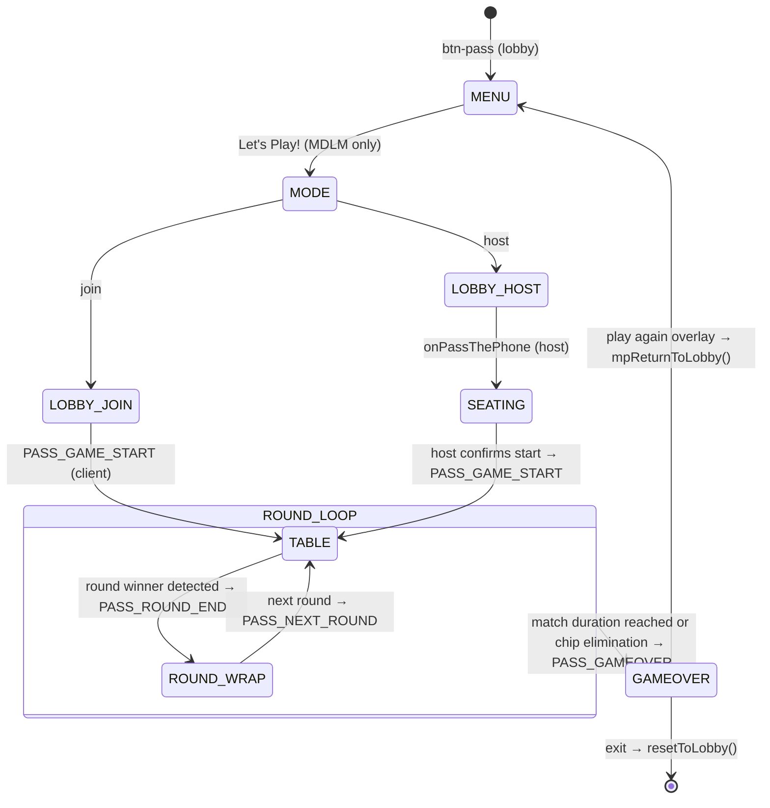

# New Game Technical Spec — Pass
**Document type:** Phase 2 — Technical Specification
**Who fills this in:** Claude Code, after reading the Phase 1 brief and all rule files
**Status:** DRAFT — awaiting confirmation before implementation begins

---

## Consistency Audit

| Check | Finding |
|-------|---------|
| Terminology collisions | **"The Abyss"** — shares the word "Abyss" with DSD's Sylly Mode name "Mission Abyss". Different games, different contexts — acceptable. **"Sequence"** — also used in DSD (crew's ordered grid taps). Again different context — acceptable. Both noted. |
| Brand colour `pill-active-zinc` | Does **not** exist in `css/styles.css` — must be added. Also add `game-toggle-on-zinc` and `pass-range`. |
| Abbreviation `pass` | **Free** — not used by any existing plugin prefix (li5, gm, ss, jec, ygi, lttp, nat, dsd, gth, dyb, bld). |
| Screen ID conflicts | No `screen-pass-*` IDs exist in `allScreens[]`. |
| Engine reuse | `normaliseWord()` — not needed (no word input). `showWhoFirst()` — not needed (no teams). DYB is the reference implementation for MDLM-only games with automatic seat assignment. |
| Data file | No new data file needed — deck generated programmatically at runtime. |

**Flags:** `pill-active-zinc`, `game-toggle-on-zinc`, `pass-range` must be added to `css/styles.css` before Stage 3 Foundation step. Add `'pass': 'pass-range'` entry to `updateSliderTheme()` map in `engine.js`.

---

## §1 — Identity

| Field | Value |
|-------|-------|
| Full name | Pass |
| Short ID / abbreviation | `pass` |
| Plugin file | `js/games/pass.js` |
| Brand colour (Tailwind class) | `zinc-900` (`#18181b`) |
| Active pill class | `pill-active-zinc` — confirm added to `css/styles.css` |
| Lobby button ID | `#btn-pass` |
| Play CTA label | `Let's Play!` |
| Menu screen tagline | `Win big, or stare helplessly and pass.` |

---

## §2 — State Flow



**Sub-states within `screen-pass-table`** (driven by `passPhase`):

| Sub-state | Description | Variable value |
|-----------|-------------|---------------|
| Active player's turn | Own hand interactive — select cards, Play / Pass available | `'your-turn'` |
| Non-active player waiting | Hand visible, action buttons locked | `'waiting'` |
| Abyss draft in progress | Sylly Mode: post-detonation card distribution loop | `'abyss-draft'` |
| Round over flash | Brief win flash before navigating to round-wrap | `'round-over'` |

**Pass-gate points:** None — MDLM means all players are on their own devices; no physical handover.

**`showWhoFirst()` usage:** Not used — no competing teams.

**Screen layout pattern decisions:**

| Screen ID | Layout pattern | Reason |
|-----------|---------------|--------|
| `screen-pass-menu` | content-height (no `min-h-screen`) | Standard game menu — absolute-positioned sound button |
| `screen-pass-seating` | `min-h-screen overflow-y-auto` centred | Roster display; CTA button sits naturally below content |
| `screen-pass-table` | `h-screen overflow-hidden` sticky-footer | Play/Pass CTAs must be visible at all times regardless of hand size |
| `screen-pass-round-wrap` | `min-h-screen overflow-y-auto` centred | Scrollable chip summary; no sticky CTA needed |
| `screen-pass-gameover` | `min-h-screen overflow-y-auto` centred | Leaderboard flows naturally |

---

## §3 — Screen Registry

| Screen ID | Purpose | Notes |
|-----------|---------|-------|
| `screen-pass-menu` | Main hub — Let's Play!, How to Play, Settings, Back | |
| `screen-pass-seating` | MDLM host pre-game roster display | Host only; mirrors DYB seating pattern |
| `screen-pass-table` | Main gameplay — hand, table combo, Abyss pool, turn controls | Central screen; sub-states drive what's interactive |
| `screen-pass-round-wrap` | Round-end chip adjustments + badge per player | All devices show simultaneously via PASS_ROUND_END |
| `screen-pass-gameover` | Final leaderboard + winner announcement | |

**Total new screens: 5** — all must be added to `allScreens[]` in `engine.js`.

No team setup screens — player names come from `mpPlayerSlots[i].name` in MDLM (same pattern as BLD, DYB).

---

## §4 — State Variables

```js
// ── Settings (persist between play-agains) ─────────────────────────────────
let passHandSize          = 5;           // 5 | 6 | 7
let passChipStack         = 100;         // 50 | 100 | 150
let passMatchDuration     = '5';         // '5' | '10' | 'endless'
let passBombStrictness    = 'standard';  // 'standard' | 'heavy'
let passMidGameDraw       = false;
let passMinSequenceLength = 3;           // 3 | 4 | 5
let passJokerCount        = 2;           // 0 | 2 | 4
let passSkyJokerVariant   = false;
let passSyllyMode         = false;       // The Abyss — always last setting

// ── Roster (set at game start, persist across play-agains) ─────────────────
let passPlayerCount  = 0;
let passPlayerNames  = [];
let passSeatNumbers  = [];   // seat = mpPlayerSlots index (join order; host = seat 1) — NOT shuffled.
                             // Turn order = ascending seat index, wrapping (the "clockwise circuit").
                             // Deliberate deviation from DYB/BLD random seats: Pass has no role
                             // assignment, so join order is fair and predictable.

// ── Match state (reset each play-again) ────────────────────────────────────
let passMatchRound = 0;
let passChips      = [];   // [playerCount] current chip totals
let passRoundsWon  = [];   // [playerCount] round wins for tie-break
let passMatchOver  = false;

// ── Round state (reset each round) ─────────────────────────────────────────
let passDeck           = [];    // remaining draw pile — card objects { rank, suit, deckIdx }
let passHands          = [];    // [playerCount][] of card objects
let passTableCombo     = null;  // { type, rank, count } | null = open table
let passTableLeaderIdx = -1;    // player index who laid the current table combo
let passPassCount      = [];    // [playerCount] consecutive passes per player — drives "Staring..." escalation
let passHasPlayedCard  = [];    // [playerCount] bool — played any card this round
let passAbyss          = [];    // Sylly Mode: face-up central pool
let passRoundWinnerIdx = -1;
let passConsecPasses   = 0;     // consecutive passes since last valid play — triggers table clear
let passDeckIdx        = 0;     // 0 = Deck 1 (charcoal grey), 1 = Deck 2 (crimson red)

// ── Turn state (reset each turn) ───────────────────────────────────────────
let passCurrentPlayerIdx  = 0;
let passSelectedCardIdxs  = [];        // indices into passHands[mpMyPlayerIdx]
let passPhase             = 'your-turn'; // 'your-turn' | 'waiting' | 'abyss-draft' | 'round-over'
let passLastWinningCombo  = null;      // { type, rank, count } of the most recently played combo — used by Sylly Mode detonation audit on round win

// ── Constants ──────────────────────────────────────────────────────────────
const PASS_RANK_VALUES = {
  '3':1,'4':2,'5':3,'6':4,'7':5,'8':6,'9':7,'10':8,'J':9,'Q':10,'K':11,'A':12,'2':13
  // Joker = 14 (base); Sky Joker ON: single Joker = 16, Double Joker = 17
};
const PASS_SUITS = ['♠','♥','♦','♣'];
const PASS_RANKS = ['3','4','5','6','7','8','9','10','J','Q','K','A','2'];
```

**Values derived at runtime (never stored):**
- Combo type and rank → derived from `passSelectedCardIdxs` on submit, via `passDetectCombo()`
- Penalty tier → derived from `passHasPlayedCard[i]` and `passHands[i].length` at round end
- Badge text → derived from penalty tier + `passSyllyMode` at display time

---

## §5 — Settings

**Settings overlay title block:**
```
House Rules 🃏
Tweak the deck before you deal.
```

**Settings table:**

| Display name | Options | Default | Internal variable | Internal values |
|-------------|---------|---------|------------------|----------------|
| Starting Hand Size | 5 / 6 / 7 | 5 | `passHandSize` | int |
| Chip Stack | 50 / 100 / 150 | 100 | `passChipStack` | int |
| Match Duration | 5 Rounds / 10 Rounds / Endless | 5 Rounds | `passMatchDuration` | `'5'` / `'10'` / `'endless'` |
| Bomb Strictness | Standard / Heavy | Standard | `passBombStrictness` | `'standard'` / `'heavy'` |
| Mid-Game Draw | Off / On | Off | `passMidGameDraw` | bool |
| Minimum Sequence Length | 3 / 4 / 5 | 3 | `passMinSequenceLength` | int |
| Jokers | 0 / 2 / 4 | 2 | `passJokerCount` | int |
| Sky Joker Variant | Off / On | Off | `passSkyJokerVariant` | bool |
| ✨ Sylly Mode (The Abyss) | Off / On | Off | `passSyllyMode` | bool |

**Plain-English card descriptions (shown below setting name in overlay):**

| Setting | Description text |
|---------|-----------------|
| Starting Hand Size | Cards dealt to each player at the start of each round. |
| Chip Stack | How many chips everyone starts with. Reach 0 and you're out. |
| Match Duration | Endless loops until someone is cleaned out. Round options end after that many rounds, with emergency stoppage if anyone hits 0 first. |
| Bomb Strictness | Standard: three-of-a-kind is a Bomb. Heavy: only four-of-a-kind qualifies. |
| Mid-Game Draw | When a trick clears, every player (starting from the trick winner, clockwise) draws one card from the talon. Drawing stops if the talon runs dry mid-draw. |
| Minimum Sequence Length | How many consecutive cards make a valid Sequence. |
| Jokers | Wildcards added to the deck — substitute in any combo type. Single Joker play is blocked except as a last-card lead. |
| Sky Joker Variant | Enables single Jokers as rank 16 in regular climbing play (beats Single 2). Two Jokers together are always the highest Bomb regardless of this setting. |
| ✨ Sylly Mode (The Abyss) | Every pass feeds a central face-up pool. Only a Bomb or Sequence detonates it — forcing everyone else to absorb those cards. |

**Note on difficulty setting:** Pass uses a programmatically generated card deck — there is no word difficulty tier (d1/d1+d2/all). The Starting Hand Size setting serves an analogous complexity role (more cards = longer, more complex game).

**Multiplayer setting overrides:** None — all settings are compatible with MDLM as-is.

---

## §6 — Scoring Logic

**Chip model:** Every player starts each match with `passChipStack` chips. Chips are lost via round-end penalties; the round winner gains the sum of all penalties paid that round. Players can go below 0.

**Penalty tiers — evaluated in priority order (highest priority wins):**

| Priority | Condition | Formula | Standard badge | Abyss badge |
|----------|-----------|---------|----------------|-------------|
| 1 (highest) | `hand.length >= 13` at round end | `hand.length × 3` | "Loaded Down" | "Total Despair" |
| 2 | `passHasPlayedCard[i] === false` | `hand.length × 2` | "Caught Sleeping" | "Dragged Under" |
| 3 (baseline) | Played ≥1 card and `hand.length < 13` | `hand.length × 1` | "Clean Exit" | "Surviving the Wake" |

**Why `>= 13`, not `=== 13`:** The 13-card hand cap only exists in Sylly Mode (Abyss drafts skip capped players). In standard mode with Mid-Game Draw ON, a hand can exceed 13 (e.g. 7 dealt + many trick draws) — `=== 13` would leave a 14-card hand matching no tier. In Sylly Mode the cap guarantees `hand.length` never exceeds 13, so `>= 13` evaluates identically to the brief's "exactly 13" there.
| — | Shed all cards (round winner) | `+sum(all round penalties paid)` | — | — |

**Priority rule:** Priority 1 overrides Priority 2 — a player at 13 cards who played zero cards pays 3× (not 3× × 2×). No compounding.

**Scoring function:** `passResolveRound()` — called the instant `passHands[playerIdx].length === 0` after a valid play submission. Sets `passRoundWinnerIdx`, runs the detonation audit if `passSyllyMode === true` (see §12), computes chip deltas, updates `passChips[]` and `passRoundsWon[]`.

Note: `passConsecPasses` returning to `passTableLeaderIdx` triggers a **table clear** only (trick ends → winner leads a new combo). It does NOT trigger `passResolveRound()`. These are distinct events.

**Match termination check (after `passResolveRound`):**
- `'5'` / `'10'`: `passMatchRound >= parseInt(passMatchDuration)` OR any `passChips[i] <= 0`
- `'endless'`: any `passChips[i] <= 0`

**Tie-break at match end:**
1. Most rounds won (`passRoundsWon[]`)
2. Still tied → earlier seat number

**Zero-sum check:** Winner gains exactly what losers collectively pay — chip pool is conserved within each round.

---

## §7 — Validation Rules

| Input | Block condition | Error / response | Animation |
|-------|----------------|-----------------|-----------|
| Submit play | No cards selected | "Select cards to play." | Shake submit button |
| Submit play | `passDetectCombo()` returns null | "That's not a valid combo." | Shake |
| Submit play | Single Joker submitted AND `passSkyJokerVariant === false` AND (`hand.length > 1` OR `passTableCombo !== null`) | "A Joker can only lead on its own as your very last card." | Shake |
| Submit play | Sequence or DoubleSequence contains fewer than 2 natural (non-Joker) cards | "A run needs at least two real cards." | Shake |
| Submit play | Combo type doesn't match `passTableCombo.type`, not a Bomb, and `passTableCombo.type !== 'DoubleJoker'` | "Must match the current combo type." | Shake |
| Submit play | Rank not exactly +1 above `passTableCombo.rank` (non-Bomb, non-2 play) | "Must be one rank higher." | Shake |
| Submit play | Sequence or DoubleSequence count doesn't match `passTableCombo.count` | "Sequence length must match." | Shake |
| Submit play | Sequence or DoubleSequence contains a 2 | "Sequences can't include 2s." | Shake |
| Submit play | Triplet submitted as Bomb when `passBombStrictness === 'heavy'` | "Heavy mode: only Quads are Bombs." | Shake |
| Submit play | Bomb played on Bomb, same tier, submitted rank not strictly higher than `passTableCombo.rank` | "Must beat with a higher rank." | Shake |
| Submit play | Bomb played on Bomb, submitted tier is lower than `passTableCombo`'s Bomb tier | "Must play a higher-tier Bomb." | Shake |
| Submit play | Any non-pass play when `passTableCombo.type === 'DoubleJoker'` | "The table is closed. You must pass." | Shake |

**Combo detection (`passDetectCombo(cards)`):**
```
1 card — Joker, hand.length === 1, passTableCombo === null
                                    → Single-Joker-Lead (special endgame exception)
1 card                              → Single (rank = PASS_RANK_VALUES[card.rank])
2 cards, both Jokers                → DoubleJoker Bomb (rank: max, always highest tier)
2 cards, same rank                  → Pair (rank = card rank; Joker fills as wildcard)
3 cards, same rank                  → Triplet (Bomb when passBombStrictness === 'standard'; Joker fills)
4 cards, same rank                  → Quad Bomb (always Bomb; Joker fills)
2N cards (N ≥ 2 pairs),
  N pairs of consecutive ranks      → DoubleSequence (rank = highest rank in run; count = N;
                                       Jokers fill pair slots; 2s excluded;
                                       Two-Natural-Card Anchor applies)
M cards (M ≥ passMinSequenceLength),
  consecutive PASS_RANK_VALUES      → Sequence (rank = highest rank in run; count = M;
                                       Jokers fill gaps and/or extend ends; 2s excluded;
                                       Two-Natural-Card Anchor applies)
otherwise                           → null (invalid)
```

**Two-Natural-Card Anchor (Sequence + DoubleSequence):** Multiple Jokers may fill plural gaps or extend the ends of a run, but the submission must contain **at least 2 natural (non-Joker) cards** — the anchors that deterministically fix the run's position. An all-Joker or one-natural-card "phantom sequence" is invalid.

**Deterministic Joker placement:** When end-extension makes multiple run positions possible (e.g. `5-6 + 2 Jokers` could be 3-4-5-6 up to 5-6-7-8):
- **Beating a table Sequence:** the engine solves for the one placement that yields `passTableCombo.rank + 1` — if no placement achieves it, the play is invalid.
- **Leading (open table):** the engine maximises the run's rank (2s never included, so A-high is the ceiling).
This rule must be explained to players — see the `[?]` tip point in §8 and the How to Play card in §15.

**Joker wildcard scope — all contexts:**
- `Joker + 6` → Pair of 6s (rank 4)
- `8-8-Joker` → Triplet Bomb of 8s
- `9-9-9-Joker` → Quad Bomb of 9s
- `5-Joker-7` → Sequence 5-6-7 (Joker fills the 6 slot; rank = 5, count = 3)
- `3-3-Joker-Joker-5-5` → DoubleSequence of 3-4-5 pairs (Jokers fill the 4-4 slot; rank = 5, count = 3 pairs)
- `Joker + Joker` → DoubleJoker Bomb (highest, always)

**Bomb tier ordering (low → high):**
- Tier 1: Triplet (only when `passBombStrictness === 'standard'`)
- Tier 2: Quad
- Tier 3: DoubleJoker (absolute cap — all must pass after this)

**Rank comparison rules:**
- Non-Bomb plays: exact +1 rank required; combo type and count must match
- **2s ARE an exception to the +1 rule:** a Single 2 (rank 13) beats any single; a Pair of 2s beats any pair — no +1 requirement. (2s themselves can only be beaten by a Bomb, or by a single Joker when Sky Joker is ON.)
- Bomb on non-Bomb table: always valid (overrides regardless of rank)
- Bomb on same-tier Bomb: any strictly higher rank — not +1, any higher
- Bomb on lower-tier Bomb: any rank of higher tier beats it
- **Sky Joker ON:** single Joker = rank 16 — a second exception to the +1 rule; beats any single including a 2. Sky Joker OFF: single Joker hard-blocked (endgame exception aside)

**Shake animation pattern (standard):**
```js
el.classList.remove('shake'); void el.offsetWidth; el.classList.add('shake');
```

No `normaliseWord()` usage — no text input validation in this game.

---

## §8 — Overlay Registry

| Overlay ID | Pattern | z-index | Trigger | Notes |
|------------|---------|---------|---------|-------|
| `pass-settings-overlay` | Data (slide-up) | z-[80] | `#btn-pass-menu-settings` | "House Rules 🃏" |
| `pass-how-to-overlay` | Data (slide-up) | z-[90] | `#btn-pass-menu-how-to`, `#btn-pass-how-to` | |
| `pass-quit-overlay` | Decision modal | z-[80] | `.btn-pass-quit-open` (table + round-wrap) | "Walk Away?" |
| `pass-new-deal-overlay` | Decision modal | z-[90] | `#btn-pass-go-new` on gameover | "Next Deal?" — required; no direct restart |

**Quit overlay copy:**
- Emoji: 🃏
- Heading: "Walk Away?"
- Subtext: "This ends the match for everyone — Pass can't continue with an empty seat."
- Confirm: "Yeah, I'm done."
- Cancel: "Keep playing!"
- Confirm handler: triggers the Match Dissolution flow (§11) — NOT a silent local exit

**Play-again overlay copy:**
- Emoji: 🃏
- Heading: "Next Deal?"
- Subtext: "Chips carry over. New hands are dealt."
- Confirm (single / host): "Deal Me In"
- Confirm (MDLM host): "Restart in Lobby 🔄"
- Confirm (MDLM client): "Leave Session"
- Cancel: "Stay here"

**Exact inner div class strings — use verbatim:**

Data slide-up:
```html
<div class="overlay-data-inner settings-slide-up bg-stone-50 w-full max-w-sm rounded-t-3xl flex flex-col">
```

Decision modal (zinc brand):
```html
<div class="overlay-modal-inner bg-stone-50 w-full max-w-sm rounded-3xl px-6 pt-6 pb-8 flex flex-col gap-4 text-center border border-zinc-300">
```

---

## §9 — Audio Map

| Game moment | Audio function | Notes |
|-------------|---------------|-------|
| Lobby button tap / Play CTA | `playLaunch()` | |
| Valid card play confirmed | `playSuccess()` | |
| Invalid play / validation block | `playBoing()` | |
| Pass tapped | `playWhoosh()` | |
| Settings pill toggle | `playPillClick()` | |
| Overlay close / confirm | `playDone()` | |
| Quit confirm / exit game | `playExit()` | |
| Round winner declared | `playLaunch()` | Re-use; big-moment feel |
| "THE ABYSS GAZES BACK..." detonation | `playAlarm()` | Abyss Sylly Mode |
| "THE ABYSS FRACTURES..." overflow | `playAlarm()` | Abyss Sylly Mode |

No new audio functions needed — all moments covered by existing catalogue.

---

## §10 — Word Bank & Data

**Source:** No external data file. Deck generated programmatically at runtime.

**Deck generation (`passBuildDeck(deckIdx)`):**
- 52 standard cards: 4 suits × 13 ranks → `{ rank, suit, deckIdx }`
- + `passJokerCount` Jokers: `{ rank: 'Joker', suit: '', deckIdx }` — empty string, NOT `null` (see Firebase caution below)
- Fisher-Yates shuffle
- Returns shuffled array → assigned to `passDeck`

**⚠️ Firebase RTDB serialisation caution:** Firebase Realtime Database **strips `null` values and empty arrays** from written payloads. A Joker stored as `{ suit: null }` arrives on clients as `{ rank: 'Joker' }` — `suit === null` checks silently fail (`undefined`). Likewise `abyss: []` in a SYNC payload arrives as a missing key. Rules:
- Joker `suit` is always `''` (empty string), never `null`
- Every SYNC receiver defaults array fields: `passAbyss = payload.abyss || [];` — same for `hands`, `draftCards`, `talonDraws`

**Two-deck support (Sylly Mode):** When `passDeck` runs empty mid-round, call `passBuildDeck(1)` to build Deck 2. Cards with `deckIdx: 1` receive a `pass-card-back-deck2` CSS class — renders as Crimson Red back. Deck 1 (`deckIdx: 0`) renders as Charcoal Grey. Visual distinction alerts players that fresh duplicates have entered the pool.

**No `sw.js` update needed for data** — see Card Rendering Module below for the lib file precache requirement.

**Secret Mode / expansion pack:** Not applicable — no word bank to override.

---

## §10b — Card Rendering Module

**File:** `js/lib/cards.js` — loaded before `pass.js`
**Global:** `window.Cards`
**Pattern:** Follows `js/lib/canvas-draw.js` → `window.CanvasDraw` exactly. Suite-wide lib — not Pass-specific; any future card game uses the same module.

**Public API:**

| Function | Returns | Notes |
|----------|---------|-------|
| `Cards.buildEl(cardData)` | DOM element | Card face — rank + suit, SVG-drawn |
| `Cards.buildBackEl(deckIdx)` | DOM element | Face-down card; `deckIdx 0` = charcoal grey, `deckIdx 1` = crimson red |

**Data contract (rendering-agnostic — never changes):**
```js
{ rank: 'Q', suit: '♥', deckIdx: 0 }     // face card
{ rank: 'Joker', suit: '', deckIdx: 0 }   // Joker — suit is '' not null (Firebase strips nulls; see §10)
```
Suit symbols rendered as Unicode glyphs (♠ ♥ ♦ ♣) — work on every device, zero CDN.

**`pass-card-back-deck1/2` CSS classes:** Applied internally by `Cards.buildBackEl(deckIdx)` — never by `pass.js`. CSS rules live in `css/styles.css` as before.

**Wrapper pattern — future asset swap:**
```js
// v1 (SVG inline — current):
Cards.buildEl = function(cardData) { return renderSvgCard(cardData); }

// v2 (future — custom image assets):
Cards.buildEl = function(cardData) {
  const img = document.createElement('img');
  img.src = `assets/cards/${cardData.suit}_${cardData.rank}.webp`;
  img.alt = `${cardData.rank} of ${cardData.suit}`;
  return img;
}
```
One function body changes. `pass.js` and every future card game are untouched — they only ever call `Cards.buildEl(cardData)`.

**`sw.js` precache:** `js/lib/cards.js` must be added to the precache list when the file is created.

---

## §11 — Multiplayer Configuration

| Field | Value |
|-------|-------|
| Multiplayer mode | MDLM only |
| `multiplayerOnly` | `true` |
| `supportedModes` | `['mdlm']` |
| `recommendedMode` | `'mdlm'` |
| Min players | 3 |
| Max players | 6 |
| `rosterConfig` | `{ type: 'none', showTeamNamesInPreLobby: false, defaultTeamNames: null, hasCaptain: false }` |
| New game-specific screens | None — uses shared `screen-mp-mode`, `screen-mp-lobby-host`, `screen-mp-lobby-join` |

**`onPassThePhone` (host path):**
```js
passPlayerCount = mpPlayerSlots.length;
passPlayerNames = mpPlayerSlots.map(p => p.nickname); // field is .nickname, NOT .name — slots are { uid, nickname }
passShowSeating(); // host sees roster before confirming start
```
Client path: waits for `PASS_GAME_START` SYNC.

**`passStartSession()`** — called by the menu Play CTA when `syllyMultiplayerMode !== 'single'` (post-lobby context): `if (window.syllyMultiplayerMode === 'client') return; passShowSeating();` — same shape as `dybStartSession()`.

**`MP_GAME_CONFIGS` entry:**
```js
pass: {
  gameName:        'Pass',
  emoji:           '🃏',
  brandBtnClass:   'bg-zinc-900 hover:bg-zinc-800',
  ptpLabel:        "Let's Play!",
  menuScreen:      'screen-pass-menu',
  onPassThePhone:  () => {
    if (window.syllyMultiplayerMode === 'host') {
      passPlayerCount = mpPlayerSlots.length;
      passPlayerNames = mpPlayerSlots.map(p => p.nickname);
      passShowSeating();
    }
    // client: waits for PASS_GAME_START
  },
  recommendedMode: 'mdlm',
  supportedModes:  ['mdlm'],
  multiplayerOnly: true,
  lobbyCtaLabel:   "Let's Play!",
  rosterConfig:    { type: 'none', showTeamNamesInPreLobby: false, defaultTeamNames: null, hasCaptain: false },
  getMaxPlayers:   () => 6,
  getMinPlayers:   () => 3,
}
```

**`mpSerialiseSettings` entry:**
```js
case 'pass': return {
  passHandSize, passChipStack, passMatchDuration, passBombStrictness,
  passMidGameDraw, passMinSequenceLength, passJokerCount, passSkyJokerVariant, passSyllyMode
};
```

**Per-phase intercept points:**

| Game phase | Single-device behaviour | Multiplayer intercept |
|-----------|------------------------|----------------------|
| Game start | `passStartRound()` locally | Host: deal all hands → `SYNC: PASS_GAME_START { playerNames, seatNumbers, hands, chips, handSize }` |
| Play card (active player) | Validate + apply locally | Client → `ACTION: PASS_PLAY_SUBMIT { playerIdx, cardIndices }`; Host validates, applies, resolves Mid-Game Draw if trick cleared → `SYNC: PASS_TURN_RESULT` (with `talonDraws` + `talonRemaining` if `passMidGameDraw` ON and trick cleared) |
| Pass (active player) | Apply locally + Abyss logic | Client → `ACTION: PASS_PASS_SUBMIT { playerIdx }`; Host applies Abyss card, → `SYNC: PASS_TURN_RESULT` |
| Abyss draft (any trigger: mid-trick detonation / round-win detonation / 13-card fracture) | Immediate distribution | Host resolves clockwise draft → `SYNC: PASS_ABYSS_DRAFT { trigger, draftOrder, draftCards, newHands }` |
| Round end | `passResolveRound()` | Host scores → `SYNC: PASS_ROUND_END { winnerIdx, chipDeltas, newChips, badges, finalHandCounts }` |
| Next round | Deal + reset | Host deals → `SYNC: PASS_NEXT_ROUND { hands, chips, roundNum }` |
| Game over | Show gameover | Host → `SYNC: PASS_GAMEOVER { winnerIdx, finalChips, roundsWon }` |

**ACTION packets:**

| Packet | Direction | Payload |
|--------|-----------|---------|
| `PASS_PLAY_SUBMIT` | Client → Host | `{ playerIdx, cardIndices }` |
| `PASS_PASS_SUBMIT` | Client → Host | `{ playerIdx }` |
| `PASS_PLAYER_LEFT` | Client → Host | `{ playerIdx }` — sent on quit confirm; Host re-broadcasts as `PASS_MATCH_DISSOLVED` |

**SYNC packets:**

| Packet | Direction | Payload |
|--------|-----------|---------|
| `PASS_GAME_START` | Host → All | `{ playerNames, seatNumbers, hands, chips, handSize }` |
| `PASS_TURN_RESULT` | Host → All | `{ playerIdx, action, tableCombo, nextPlayerIdx, abyss, passStreak, tableCleared, talonDraws?, talonRemaining? }` — `talonDraws: [{ playerIdx, card }]` and `talonRemaining: int` present only when `tableCleared === true && passMidGameDraw === true`; absent otherwise |
| `PASS_ABYSS_DRAFT` | Host → All | `{ trigger, draftOrder, draftCards, newHands }` — `trigger: 'detonation'` (mid-trick clear via Bomb/Sequence) \| `'round-win'` (winner hit 0 via Bomb/Sequence) \| `'fracture'` (13-card pool cap). One packet for all three Abyss draft paths — every draft changes multiple hands, so `newHands` must always be broadcast |
| `PASS_ROUND_END` | Host → All | `{ winnerIdx, chipDeltas, newChips, badges, finalHandCounts }` — `finalHandCounts: int[]` drives the "N cards × M" penalty display on the round-wrap screen |
| `PASS_NEXT_ROUND` | Host → All | `{ hands, chips, roundNum }` |
| `PASS_GAMEOVER` | Host → All | `{ winnerIdx, finalChips, roundsWon }` |
| `PASS_MATCH_DISSOLVED` | Host → All | `{ leaverIdx }` — match aborted; all devices route to `screen-pass-menu` with status banner |

**Seat numbers = clockwise turn index:** A player's `mpPlayerSlots` index IS their seat (displayed as Seat 1..N, i.e. index + 1). All clockwise iteration (turn advance, Mid-Game Draw loop, Abyss drafts) is `(idx + 1) % passPlayerCount`. No shuffle, no manual assignment — `rosterConfig.type: 'none'`.

**Private information routing:**

| Information | Sent to | Method |
|------------|---------|--------|
| All hands | All devices via `PASS_GAME_START` | Each device renders only `hands[mpMyPlayerIdx]`; others shown as face-down card count (couch-security model — same as NAT, DYB) |

**Settings override in Lobby Mode:** None required.

**Match Dissolution (quit-in-MDLM):**

Pass is strictly turn-based — a missing player permanently stalls the game. A deliberate quit therefore dissolves the match for everyone:

- **Client quit confirm:** send `ACTION: PASS_PLAYER_LEFT { playerIdx }` → then `resetToLobby()` locally. Host receives it and broadcasts `SYNC: PASS_MATCH_DISSOLVED { leaverIdx }`.
- **Host quit confirm:** broadcast `SYNC: PASS_MATCH_DISSOLVED { leaverIdx: 0 }` directly, then `resetToLobby()` (which removes the Firebase room — clients' existing room watcher provides a second safety net).
- **All devices on `PASS_MATCH_DISSOLVED`:** halt the table state machine, `showScreen('screen-pass-menu')`, show an **inline status banner** on the menu — "`[Name]` walked away. Match dissolved." The banner is a plain `<p id="pass-menu-status">` element on the menu screen (hidden by default, cleared on next Play tap) — **NOT an overlay** (no teardown surface, no ghost-interceptor risk).
- Quit overlay subtext must warn: "This ends the match for everyone."

**Known limitation (v1):** An *unexpected* client disconnect (browser closed, connection lost) is NOT detected mid-game — the engine's `/players` watcher (`mpPlayersListener`) is active only during the host lobby. The game stalls on that player's turn until the group quits manually. Host disconnects ARE handled: Firebase `onDisconnect` removes the room → clients get the existing `mp-host-disconnected-overlay`. Mid-game client-disconnect detection would be new engine work — deferred.

**Missing handler audit (per-phase):**

| Phase | Non-host can submit? | ACTION handler required |
|-------|---------------------|------------------------|
| Play card | Yes (non-active players cannot, but active non-host clients can) | `PASS_PLAY_SUBMIT` ✓ |
| Pass | Yes (active non-host client) | `PASS_PASS_SUBMIT` ✓ |
| Quit mid-game | Yes (any client, any time) | `PASS_PLAYER_LEFT` ✓ |
| Seating confirm | Host only | No ACTION needed |
| Round-wrap next round | Host only | No ACTION needed |
| Gameover play-again | Handled via `pass-new-deal-overlay` → `mpReturnToLobby()` | No ACTION needed |

---

## §12 — Sylly Mode Technical Spec (The Abyss)

**Internal variable:** `passSyllyMode = false`

**What changes from standard play:**

1. On every Pass: engine draws 1 card from `passDeck` → pushes face-up to `passAbyss`. Abyss pool rendered on `screen-pass-table` for all to see (see Abyss Pool Rendering below).
2. **Mid-trick detonation** — trick clears (full-circle pass, winner leads new combo) via Bomb or Sequence → "THE ABYSS GAZES BACK..." banner → `playAlarm()` → clockwise Abyss draft starting from player after trick winner (trick winner exempt; any player at `hand.length === 13` is skipped) → `SYNC: PASS_ABYSS_DRAFT { trigger: 'detonation', ... }`.
3. Mid-trick: trick clears via Single or Pair → Abyss rolls over (pool stays, does NOT distribute).
4. **Round-win detonation audit** — `passHands[playerIdx].length === 0` after a play → round freezes immediately → audit `passLastWinningCombo.type`:
   - `'Triplet'` / `'Quad'` / `'DoubleJoker'` / `'Sequence'` / `'DoubleSequence'` → detonation fires ("THE ABYSS GAZES BACK..." → clockwise draft from player after winner) → `SYNC: PASS_ABYSS_DRAFT { trigger: 'round-win', ... }` → then `passResolveRound()`
   - `'Single'` / `'Pair'` → `passAbyss = []` (silent discard, no draft) → `passResolveRound()` immediately
5. If `passAbyss.length === 13` and another pass would push it over → force immediate distribution before processing the pass → "THE ABYSS FRACTURES..." banner → `playAlarm()` → `SYNC: PASS_ABYSS_DRAFT { trigger: 'fracture', ... }`.
6. Hand cap: `passHands[playerIdx].length === 13` → skip that player during any Abyss draft iteration.
7. **Two-deck:** when `passDeck.length === 0` mid-round, call `passBuildDeck(1)` to create Deck 2. Cards from Deck 2 (`deckIdx: 1`) receive CSS class `pass-card-back-deck2` (crimson red). Deck 1 = `pass-card-back-deck1` (charcoal grey).

**Abyss Pool Rendering — inline horizontal scroll, NO overlay:**
The Abyss is a dedicated layout box on `screen-pass-table`: `overflow-x-auto flex flex-row` with cards overlapping via negative horizontal margins (e.g. `-ml-6` on every card after the first). Players swipe left/right directly on the strip to audit the full stack and its order — newest card appended at the right end. **Deliberately NOT a tap-to-expand overlay** — DYB BUG-05 (the slick-picker ghost interceptor surviving a mid-game quit) is the cautionary precedent for any `fixed inset-0` element openable mid-game. Inline scroll has zero teardown surface.

**Badge rename in Sylly Mode:**
- "Clean Exit" → "Surviving the Wake"
- "Caught Sleeping" → "Dragged Under"
- "Loaded Down" → "Total Despair"

**New screens added:** None — Abyss pool is a UI element within `screen-pass-table`.

**Functions that branch on `passSyllyMode`:**
- `passResolveTurn()` — adds Abyss card on pass; checks mid-trick detonation on Bomb/Sequence; checks round-win detonation audit when `hand.length === 0`
- `passResolveAbyssDetonation(exemptPlayerIdx)` — clockwise draft loop (exempt given player, skip 13-cap players); called by both mid-trick and round-win paths
- `passCheckAbyssCap()` — called before each Abyss card addition; triggers fracture at 13
- `passRenderTable()` — shows/hides Abyss pool display section
- `passGetBadge(playerIdx)` — returns Abyss-themed badge text when `passSyllyMode === true`

---

## §13 — `resetToLobby()` Additions

Add after existing game teardowns in `engine.js`:

```js
// PASS teardown
document.getElementById('pass-settings-overlay').style.display = 'none';
document.getElementById('pass-how-to-overlay').style.display = 'none';
document.getElementById('pass-quit-overlay').style.display = 'none';
document.getElementById('pass-new-deal-overlay').style.display = 'none';
```

No timers — Pass has no countdown intervals.

---

## §14 — `index.html` Section Header

```html
<!-- ════ PASS ════
     Screens : screen-pass-menu, screen-pass-seating, screen-pass-table,
               screen-pass-round-wrap, screen-pass-gameover
     Overlays: pass-settings-overlay, pass-how-to-overlay, pass-quit-overlay,
               pass-new-deal-overlay
  ════════════════════════════════════════════════════════════════ -->
```

---

## §15 — Implementation Checklist

Tick each item as built. Do not mark complete until verified in the browser.

### Pre-implementation
- [ ] **§16 clarifications answered** by project owner before proceeding past Foundation

### Foundation
- [ ] `js/lib/cards.js` created — `window.Cards` global; public API: `Cards.buildEl(cardData)`, `Cards.buildBackEl(deckIdx)` (see §10b)
- [ ] `<script src="js/lib/cards.js"></script>` added to `index.html` after `canvas-draw.js`, before `pass.js`
- [ ] `js/games/pass.js` created with dependency comment: `// Depends on: engine.js (showScreen, playLaunch, ...), engine-multiplayer.js (mpSendEnvelope, ...), cards.js (Cards.buildEl, Cards.buildBackEl)`
- [ ] `<script src="js/games/pass.js"></script>` added to `index.html` after `dyb.js`, before `secret-mode.js`
- [ ] All 5 screen IDs added to `allScreens[]` in `engine.js`
- [ ] Overlay teardown added to `resetToLobby()` in `engine.js` (§13)
- [ ] Section header added to `index.html` (§14 format)
- [ ] `pill-active-zinc`, `game-toggle-on-zinc`, `pass-range` added to `css/styles.css`
- [ ] `'pass': 'pass-range'` added to `updateSliderTheme()` map in `engine.js`
- [ ] Lobby button `#btn-pass` → `playLaunch(); activeGameId = 'pass'; showScreen('screen-pass-menu');`

### Game Menu
- [ ] Let's Play!, How to Play, Settings, ← Back to the Box — all four present
- [ ] `playLaunch()` on Play CTA
- [ ] Play CTA branches (GTH/DYB pattern — post-lobby starts session, pre-lobby opens mode screen): `if (window.syllyMultiplayerMode !== 'single') { passStartSession(); } else { mpShowModeScreen('pass'); }`
- [ ] `passStartSession()` defined: `if (window.syllyMultiplayerMode === 'client') return; passShowSeating();` — mirrors `dybStartSession()` (client guard prevents clients self-routing to the seating screen — DYB BUG-04)

### Settings Overlay
- [ ] Settings in order: Hand Size, Chip Stack, Match Duration, Bomb Strictness, Mid-Game Draw, Minimum Sequence Length, Jokers, Sky Joker Variant, ✨ Sylly Mode last
- [ ] Every setting in a white card
- [ ] Thematic title block (`House Rules 🃏`) as first child of `overlay-data-inner`
- [ ] `scrollTop = 0` on open — selector: `.overlay-data-inner` (not `.overflow-y-auto`)
- [ ] All toggles have `shrink-0`
- [ ] `applyExpansionOverrides()` hook noted as not applicable (no word bank)

### How-to Overlay
- [ ] Thematic title block + `scrollTop = 0` on open

### Screens
- [ ] `.btn-open-sound` + ✕ on every screen
- [ ] `passRenderHand()` — calls `Cards.buildEl(card)` for each card in `passHands[mpMyPlayerIdx]`; calls `Cards.buildBackEl(deckIdx)` for opponent card-count indicators; never renders cards inline
- [ ] `passRenderAbyss()` — calls `Cards.buildEl(card)` for each card in `passAbyss[]`; never renders cards inline
- [ ] `#btn-pass-how-to` on `screen-pass-table` header — always visible, wired to `pass-how-to-overlay`
- [ ] Every screen uses layout pattern from §2 table
- [ ] Round-wrap "Next Round" button is host-only: hidden on clients, replaced with "Waiting for the host…" text (BLD Bug 13 — independent button taps advancing shared state are a race condition; the SYNC drives client transitions)
- [ ] Mid-game ✕ (table / round-wrap) → `pass-quit-overlay` → quit-in-MDLM flow (see §11 Match Dissolution)
- [ ] Post-game ✕ (`#btn-pass-gameover-exit`) → `playExit(); resetToLobby()`
- [ ] No pass-gate screens needed (MDLM)

### Overlays
- [ ] Data slide-up inners use exact class string from §8
- [ ] Decision modal inners use exact class string from §8 — including `border border-zinc-300`
- [ ] Quit overlay copy matches §8 (game-voiced)
- [ ] Play-again overlay (`pass-new-deal-overlay`) — MDLM host: `mpReturnToLobby()`, client: `resetToLobby()`
- [ ] No shared tip overlay needed (fewer than 3 contextual `[?]` tip points)
- [ ] All `setTimeout` calls have inline WHY comment

### Core Logic
- [ ] `passBuildDeck(deckIdx)` — 52 cards + jokers, Fisher-Yates shuffle
- [ ] `PASS_RANK_VALUES` constant defined
- [ ] `passDetectCombo(cards)` — returns `{ type, rank, count }` or null; types: `Single | Pair | Triplet | Quad | DoubleJoker | Sequence | DoubleSequence | null`
- [ ] `passDetectCombo` — DoubleSequence detection: 2N cards, N ≥ 2, N pairs of consecutive ranks (2s excluded); Joker fills one pair slot
- [ ] `passDetectCombo` — Joker wildcard in Pairs, Triplets, Quads: Joker fills one slot as any rank
- [ ] `passDetectCombo` — Joker wildcard in Sequences: Joker fills one positional gap in an otherwise consecutive run (2s excluded)
- [ ] `passIsValidPlay(combo)` — checks type match, rank +1 rule, Bomb override, 2s override, Sky Joker ranks
- [ ] `passIsValidPlay` — Bomb escalation: same-tier Bomb on same-tier Bomb requires any strictly higher rank (NOT +1 exactly); cross-tier requires higher-tier Bomb of any rank
- [ ] `passIsValidPlay` — Double Joker Cap: when `passTableCombo.type === 'DoubleJoker'`, ALL play attempts are blocked — hard reject with "The table is closed. Pass."
- [ ] `passIsValidPlay` — Single Joker hard block: if selected combo is a single Joker AND (`hand.length > 1` OR `passTableCombo !== null`), reject with "A Joker can only lead on its own as your very last card."
- [ ] Sequence validator: consecutive `PASS_RANK_VALUES` check across `passMinSequenceLength` threshold; count must match table count exactly
- [ ] First-player determination (round 1): 3♠ holder leads if dealt; otherwise the holder of the lowest dealt card leads (NOTE: with small hands the 3♠ is usually in the talon — the "fallback" is the majority path); tie between equal lowest ranks → lowest seat number. Rounds 2+: previous round winner leads.
- [ ] `passPassCount[]` per-player increment on pass; "Staring..." banner text branches on 1 / 2 / 3+ consecutive passes
- [ ] `passConsecPasses` tracks consecutive passes since last valid play — **table-clear only** (NOT round-end trigger); reset to 0 after each valid play
- [ ] `passLastWinningCombo` set to the played combo object whenever a valid play is submitted; reset to null when a trick clears and the winner leads a new combo
- [ ] `passResolveRound()` — triggered by `hand.length === 0`, NOT by full-circle pass; runs detonation audit (Sylly Mode) before scoring
- [ ] Detonation audit in `passResolveRound()`: if `passSyllyMode` and `passLastWinningCombo.type` is Bomb or Sequence → call `passResolveAbyssDetonation(winnerIdx)` before computing chip deltas; if Single or Pair → `passAbyss = []` silently
- [ ] Match termination check after each round

### Sylly Mode (The Abyss)
- [ ] `passAbyss` pool rendered on table screen — face-up cards visible to all
- [ ] On Pass: draw 1 card from `passDeck` → `passAbyss`; check cap before pushing
- [ ] `passCheckAbyssCap()` — if `passAbyss.length === 13` before addition, force fracture
- [ ] `passResolveAbyssDetonation()` — clockwise draft, winner exempt, 13-cap players skipped
- [ ] Two-deck: `passBuildDeck(1)` when `passDeck` empties; `pass-card-back-deck2` CSS class
- [ ] `passGetBadge(playerIdx)` returns Sylly-themed badge when `passSyllyMode === true`

### Scoring & Logic
- [ ] `passResolveRound()` priority tier correct (§6 — Priority 1 overrides Priority 2)
- [ ] Tie-break: rounds won → seat order
- [ ] All validation rules from §7 with correct error strings and shake animation
- [ ] Mid-Game Draw loop in the trick-clear branch of `passResolveTurn()`: when `passMidGameDraw === true` and trick clears, iterate clockwise from trick winner; each active player draws 1 card from `passDeck`; stop immediately when `passDeck.length === 0` (no separate `passResolveTrick()` function — trick-clear is a branch of `passResolveTurn()`)

### Multiplayer
- [ ] `pass` entry added to `MP_GAME_CONFIGS` in `engine-multiplayer.js` (§11)
- [ ] `case 'pass'` added to `mpSerialiseSettings` in `engine-multiplayer.js` (§11)
- [ ] All ACTION/SYNC handlers in `passHandleEnvelope` — `PASS_PLAY_SUBMIT`, `PASS_PASS_SUBMIT`, all SYNC packets
- [ ] `btn-mp-action` class on all submittable action buttons (Play, Pass)
- [ ] `mpUnlockSync()` called in every SYNC handler after applying state

### Service Worker
- [ ] `js/lib/cards.js` added to `sw.js` precache list
- [ ] SW version bumped (new lib file = new asset)

### Documentation
- [ ] `docs/code-map.md` updated with Pass section (screens, overlays, key functions, packet types)
- [ ] `game-identities.md` updated with full Pass entry
- [ ] `CLAUDE.md` project structure map updated
- [ ] Phase snapshot written (`docs/phase[N]-snapshot.md`)

---

## §16 — Clarifications Required Before Implementation

All items resolved. Spec is clear to implement.

| # | Question | Resolution |
|---|----------|-----------|
| 1 | Who leads the first trick each round? | **Confirmed:** 3♠ holder leads round 1 if it was dealt; otherwise the holder of the lowest dealt card (tie → lowest seat number). Rounds 2+ are led by the previous round winner. Mention the 3♠ rule in How to Play. |
| 2 | Mid-Game Draw behaviour: winner only, or all players? | **Corrected:** When ON, ALL players draw 1 card clockwise from trick winner. Spec §5 description and §11 `PASS_TURN_RESULT` updated accordingly. Setting stays OFF by default. |
| 3 | Jokers as wildcards in Sequences? | **Confirmed:** Jokers substitute as wildcards in ALL combo types — Pairs, Triplets, Quads, Sequences, DoubleSequences. Spec §7 `passDetectCombo()` and §15 checklist updated. |

---

## §17 — Deviations from Phase 1 Brief

| # | Brief said | Spec does instead | Reason |
|---|-----------|------------------|--------|
| 1 | §11 lists "Pass transition" as a dedicated screen (screen 5 in the list) | Implemented as a banner/animation within `screen-pass-table`, not a separate screen | Navigating to a full screen on every Pass event would be highly disruptive in MDLM — the Staring escalation text is a visual overlay on the table, not a screen transition |
| 2 | §11 lists "Hand reveal" as a dedicated screen (screen 3 in the list) | No separate screen — each player's hand is shown directly on `screen-pass-table` when the game starts | In MDLM, each player's device shows their own private hand; there is no handover moment that requires a reveal gate |
| 3 | No difficulty setting mentioned in the brief | "Starting Hand Size" serves the complexity dial role that the template requires of a difficulty setting; no word-bank difficulty tier (d1/d1+d2/all) is applicable | Pass generates a programmatic deck — word difficulty tiers are meaningless; hand size provides equivalent complexity control |
| 4 | Brief implied a Joker warning modal before single-Joker plays | Single Joker play is a hard block at all times except the one edge case (last card + leading turn). No modal needed — the error message explains the constraint. `pass-joker-warning-overlay` removed. | Cleaner UX: players learn the rule from the error once and never see it again; modal would appear on every accidental tap. |
| 5 | Mid-Game Draw brief description said the winner draws | Corrected against the official Gan Deng Yan ruleset: all players draw 1 clockwise from the trick winner; depleted talon stops mid-draw (some players may not draw). Setting stays OFF by default. | Rules cross-check mid-spec caught the discrepancy before implementation. |
| 6 | Official Gan Deng Yan uses counter-clockwise turn order | Spec uses clockwise throughout (user preference confirmed). State flow, Mid-Game Draw loop, and Abyss draft all follow clockwise ordering. | Clockwise is more intuitive for Western audiences; user explicitly confirmed this preference. |
| 7 | Official rules: previous round winner leads round 2+ (no 3♠ mention after round 1) | Spec implements: 3♠ holder leads round 1 only; previous round winner leads all subsequent rounds. | User confirmed both behaviours. 3♠ rule is noted in How to Play for round 1 only. |
| 8 | Brief did not mention card rendering | Spec adds `js/lib/cards.js` → `window.Cards` as a shared suite-wide lib (`Cards.buildEl`, `Cards.buildBackEl`). Data model `{ rank, suit, deckIdx }` is rendering-agnostic — future swap to custom image assets requires changing only the internals of `Cards.buildEl()`. | Architecture decision made at spec stage to future-proof the asset pipeline and follow the established `canvas-draw.js` lib pattern. |
