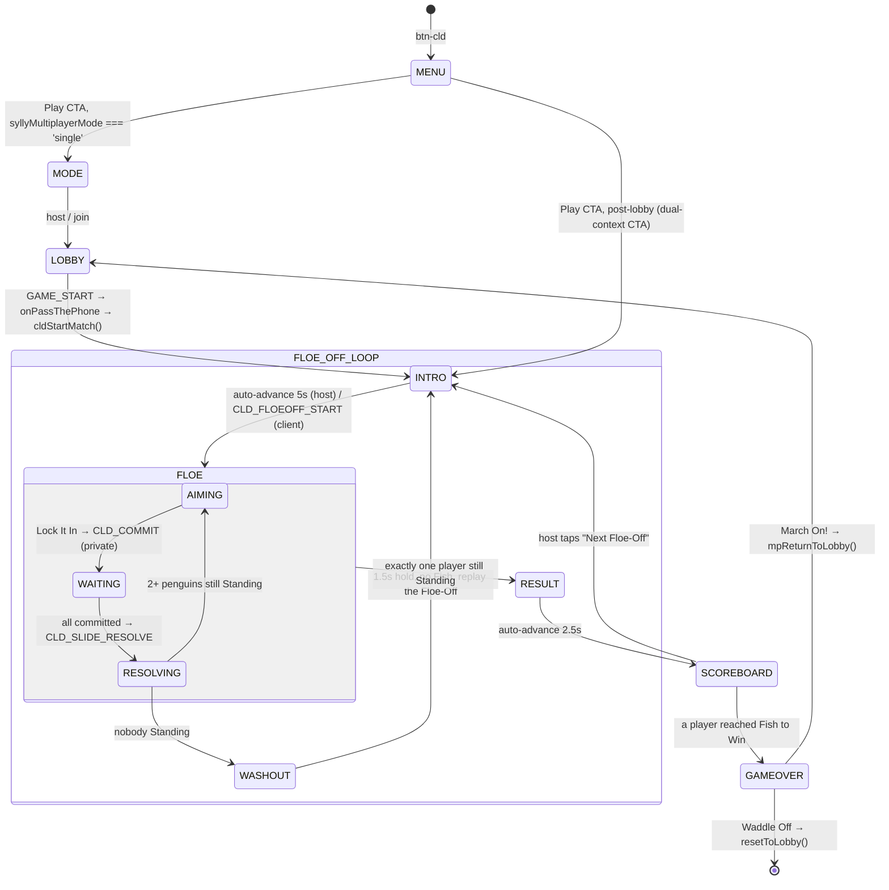

# New Game Technical Spec — COLD SHOULDER
**Document type:** Phase 2 — Technical Specification
**Game:** Cold Shoulder (`cld`) — game 19
**Source brief:** `docs/new-ideas/new-game-brief-cold-shoulder.md` (Revision 5, approved 2 Sep 2026)
**Written:** 2 Sep 2026
**Status:** DRAFT — awaiting owner confirmation before implementation begins

> Once confirmed, **this document is the implementation spec.** Reference it directly. Do not
> re-derive decisions from the Phase 1 brief — where the two differ, §17 records why and this
> document wins.

---

## Consistency Audit

Run against `docs/game-identities/*.md`, `js/engine.js`, `js/engine-multiplayer.js`, `css/styles.css`
and `docs/code-map.md` before any other section was filled.

| Check | Finding |
|-------|---------|
| Does any proposed terminology collide with existing terms across the 18 games? | **Four adjacencies, none blocking.** See the table below. |
| Does the proposed brand colour have an existing `pill-active-[colour]` class in `css/styles.css`? | **No.** `#8ECAE6` has no Tailwind utility, so it joins GTH/DYB/FRT/PKO/CJAR as a **custom-hex game**. Four new CSS rules required — see §1. |
| Does the proposed abbreviation conflict with any existing plugin prefix? | **No.** `grep -rn "\bcld[A-Z]\|'cld'\|screen-cld" js/` returns nothing. `cld` is clear of all 18 shipped prefixes (`li5`, `gm`, `ss`, `jec`, `ygi`, `lttp`, `nat`, `dsd`, `gth`, `dyb`, `bld`, `pass`, `nt`, `frt`, `shp`, `flw`, `pko`, `cjar`). |
| Does any proposed screen ID conflict with any existing screen in `allScreens[]`? | **No.** `allScreens[]` (`js/engine.js:24–94`) holds no `screen-cld-*`. All 6 new IDs are free. |
| Does the game need a new data file, or can it reuse `words.json` / `ygi-data.json`? | **Neither — no data file at all.** Two constant arrays live in `js/games/cld.js` (`CLD_INTRO_FLAVOUR`, `CLD_PLUNGE_BARKS`), exactly as `SHP_NIGHT_FLAVOUR` does. Nothing to precache, nothing to fetch. |
| Are there engine functions or shared library modules already built that this game can reuse? | **Substantial reuse, one genuinely new module.** See the reuse table below. |

### Terminology adjacencies (all four judged acceptable)

| Proposed term | Existing use | Verdict |
|---|---|---|
| **The Huddle** (settings overlay title) | NT's `screen-nt-allocation` is described as the "Pre-Planning huddle" in UI copy (`nt.md:253`); LI5 uses "huddle" as a plain verb (`li5.md:461`) | **Accept.** Neither is a capitalised proper noun in a terminology table, and the two surfaces never co-exist. |
| **Dive** (a Drowned penguin's move) | GTH's **Deep Dive** — a two-word setting name for typed diagnosis (`gth.md:116`) | **Accept.** Different word count, different game, no shared surface. |
| **Fish** (scoring currency) | PKO has a *Fish* in its animal chain (`pko.md:96`) | **Accept.** One is a currency, one is a card in another game's deck. Worth remembering only if a PKO skin ever renames things. |
| **Peck Off** (1v1 mode) | **Pecking Order** — game 17's full name | **Accept, but the closest of the four.** Both are bird-flavoured and both appear in the lobby's orbit. Mitigated by scope: "Peck Off" is a settings card *inside* one game, never a lobby-level name. Brief Decision 14 settled it after considering "Beak Off"; no reason to reopen. |

### Reuse — what already exists

| Need | Reuse | Notes |
|---|---|---|
| Private aim submission | `mpSendPrivate()` / `mpStartPrivateListener()` (`engine-multiplayer.js:809`, `:820`) | **Used in a new direction — see the finding below.** |
| Mid-game quit contract | `mpNotifyPlayerLeft()` (`:925`) | One line in the quit-confirm handler. Do **not** add a per-game `CLD_PLAYER_LEFT` packet. |
| Play-again in a lobby | `mpReturnToLobby()` | Standard. |
| Background music | `Music.playFor()` via `showScreen()` | Automatic. `data/music/cld.mp3` is a drop-in; brief §16 has the generation prompt. |
| Canvas harness | `js/arcade/asherplane.js` — `apResize()` (`:949`), `apToLogical()` (`:826`), `apLoop()` (`:195`) | **Copied into `cld.js`, not extracted.** Brief's explicit instruction; YAGNI on a shared renderer. |
| Timeline playback | NT's `ntPlaybackData = { timeline, latencyMs }` pattern (`nt.js:169`) | Shape reused, contents entirely different. |
| Firebase-erasure normalisers | `cjarWireArr` / `cjarWireList` / `cjarWireObj` (`cjar.js:178–192`) | Copy as `cldWire*`. Reference implementation for the `|| []` contract. |
| Loopback harness skeleton | `tools/verify-cjar-loopback.js` — `fbWrite`/`fbRead` wire + real mock DOM | Copy wholesale; only the game driver changes. |
| Art resolution | `assetFace` (`js/lib/art.js:72`) | **Kept for future skin readiness only — not exercised in v1.** No core art, no preload, no `data/art/cld/`. See §10 (superseded plan). |
| **Physics simulation** | **Nothing exists.** | **New shared module: `js/lib/physics.js`.** §4A. |

**Deliberately NOT used:** `showWhoFirst()` (not a team game), `bindCardHold` / `refHighlightRow`
(no How-to gallery — brief §15 leaves tap-hold idle under the documented exception),
`openArtViewer` / `artMakeZoomable` (no gallery to zoom from), `Cards` and `CanvasDraw` (wrong
primitives), `normaliseWord` (no text input anywhere in the game).

### Flags

1. **`mpSendPrivate` has only ever run host → client.** FLW and PKO both use it to *deal* private
   state downward (`flw.js:226`, `pko.js:719`). Cold Shoulder needs it **client → host**, which no
   shipped game does. **Verified reachable:** `mpPlayerSlots[0]` is the host (`engine-multiplayer.js:27`),
   every client receives the full slot array — uids included — in the `GAME_START` payload
   (`:2397`, applied at `:1141`), and `mpStartPrivateListener()` routes anything landing in a
   device's own queue straight through `mpHandleEnvelope`, where `type: 'ACTION'` + host-mode
   per-game routing already works identically to a public ACTION. So the direction is supported; it
   is simply untravelled. **Treat it as new infrastructure in the loopback harness.**

2. **`mpSendPrivate` does NOT go through `mpSendEnvelope`, so the sync lock's correctness layer does
   not protect it.** `mpLockSync()`'s duplicate-ACTION drop lives inside `mpSendEnvelope`
   (`logic-engine.md` § Sync Lock); `mpSendPrivate` pushes to Firebase directly. A double-tap on
   Lock It In therefore sends **two commits**, and only the visual `.btn-mp-action` grey-out stands
   in the way. This upgrades "reject a duplicate commit" from a flaky-connection safeguard to a
   plain double-tap safeguard. **Host-side rejection is the only trustworthy layer** — §11.

3. **`tools/verify-mp-configs.js` asserts bound purity** and will fail on `cldPeckOff` unless it is
   added to `ALLOWED_SETTINGS` (`verify-mp-configs.js:156`) with a reason, exactly as `frtPearOff`
   is. Concrete build item — §15.

4. **`#8ECAE6` + white ink measures ~1.79:1.** Settled by the owner (brief Decision 13), recorded
   here only for its one build consequence: flat brand surfaces need their own text-shadow, because
   the gel buttons' dark base gradient is what carries the label on the menu. §1.

---

## §1 — Identity

| Field | Value |
|-------|-------|
| Full name | Cold Shoulder |
| Short ID / abbreviation | `cld` |
| Plugin file | `js/games/cld.js` |
| Shared module | `js/lib/physics.js` (new — §4A) |
| Brand colour | **Glacier Blue `#8ECAE6`**, white ink on every surface |
| Brand CSS class | `cld-cta` (custom — no Tailwind utility for this hex) |
| Active pill class | `pill-active-cld` — **does not exist, must be added** |
| Toggle ON class | `game-toggle-on-cld` — **must be added** |
| Range class | `.cld-range` — **must be added** (gradient `#e4f4fa → #8ECAE6`) |
| Settings button tint | `bg-[#e4f4fa] hover:bg-[#cbe9f4] text-[#2a6b85]` |
| Decision-modal border | `border-[#b8dfec]` |
| Lobby button ID | `#btn-cld` |
| Lobby badge emoji | 🐧 |
| Play CTA label | **Hit the Ice** |
| Menu screen tagline | "Barge your mates into the drink — last penguin on the floe wins." |
| Settings overlay title | **The Huddle 🐧** |
| Sylly Mode name | **The Thaw** |

**Four CSS rules to add to `css/styles.css`** — copy the CJAR block (`:2085–2130`) and swap the
hex. `.cld-cta` **must declare `display:flex; align-items:center; justify-content:center;`**, not
just `background-color` — the custom-brand-class trap from the checklist (DYB/GTH/BLD/FRT/PKO all
hit it).

**The contrast consequence, concretely.** `.gel-btn`'s dark base gradient and the
`.lobby-btn-label` text-shadow carry white text on the menu. Nothing carries it on a **flat**
`#8ECAE6` fill. So every flat brand surface in Cold Shoulder — the gameover **March On!** CTA, the
quit-confirm button, the Lock It In CTA — takes `text-shadow: 0 1px 2px rgba(0,0,0,.35)`. Add it to
`.cld-cta` itself so it is impossible to forget at a call site.

**Lobby registration.** Add `'btn-cld'` to `LOBBY_COLOUR_ORDER` (`js/engine.js:906`) **between
`'btn-dsd'` and `'btn-dyb'`** — glacier blue (hue ~197°) sits on the hue walk right after DSD's
cyan-700 and before DYB's ocean `#1E4D8C`.

---

## §2 — State Flow



### Sub-states within screens

| Screen | Sub-states | State variable |
|--------|-----------|----------------|
| `screen-cld-floe` | `aiming` → `waiting` → `resolving` → (`washout`) | `cldPhase` |
| `screen-cld-floeoff-intro` | `intro` (auto-advancing) / `standby` (client, waits indefinitely) | `cldIntroMode` |

**`cldPhase` gates three things and is the single source for all of them:** whether the canvas
accepts pointer input, whether the `[?]` How-to button opens (brief §15 — **never mid-resolution**),
and whether the RAF loop is drawing a live aim or replaying a timeline.

**The standby distinction is load-bearing.** `screen-cld-floeoff-intro` doubles as the client's
waiting surface (the CJAR pattern — `cjarShowClientStandby`, `cjar.js:1507`, reuses
`screen-cjar-raid-intro` rather than adding a screen). In `standby` mode the 5-second auto-advance
timer is **not armed** — the client waits for `CLD_FLOEOFF_START`, however long that takes. Arming
it in both modes would march a client past the intro into an empty floe.

### Pass-the-phone gate points

| Transition | Gate required? | Gate screen ID |
|-----------|---------------|----------------|
| — | **None** | — |

Cold Shoulder is MDLM-only in v1. Every player has their own device and no private information is
ever shown by handing a phone over. Pass-the-Phone is designed in brief §12 and deferred; if it
ships later it needs the two gate screens described there and **no change to the resolution model**.

### `showWhoFirst()` usage

**Not used.** Free-for-all, no teams, no turn order to decide.

### Screen layout — the Stack

| Screen ID | Header | Stage | Controls |
|-----------|--------|-------|----------|
| `screen-cld-menu` | 🔊 (absolute top-4 right-4) | 🐧 + title + tagline | Hit the Ice / How to Play / Settings / ← Back to the Box |
| `screen-cld-floeoff-intro` | *(none — interstitial exemption)* | 🐧 + "Floe-Off N" + flavour line | *(none)* |
| **`screen-cld-floe`** | "Floe-Off N · Slide M" + `[?]` 🔊 ✕ | **the canvas** | power bar + tally + Lock It In |
| `screen-cld-result` | *(none — interstitial exemption)* | survivor + plunge list + Fish awarded | *(none)* |
| `screen-cld-scoreboard` | "The Standings" + 🔊 ✕ | Fish tally per player | Next Floe-Off (host) / waiting line (client) |
| `screen-cld-gameover` | 🔊 ✕ | podium + two stat lines | March On! / Waddle Off |

**Five of six screens are the Stack.** `screen-cld-floe` is the documented exception — see §3.

---

## §3 — Screen Registry

| Screen ID | Purpose | Notes |
|-----------|---------|-------|
| `screen-cld-menu` | Main hub | Four-button Universal Menu Standard, gel treatment |
| `screen-cld-floeoff-intro` | Floe-Off intro interstitial | **Also the client standby surface.** Round Intro Screen Standard |
| `screen-cld-floe` | The canvas stage — the game | **Legacy `h-screen` whitelist** — see below |
| `screen-cld-result` | Who survived, who went in, Fish awarded | Auto-advance 2.5 s, nothing interactive |
| `screen-cld-scoreboard` | Running Fish tally between Floe-Offs | Host-gated "Next Floe-Off" |
| `screen-cld-gameover` | The Final Floe | Podium + stat lines + March On! / Waddle Off |

**Total new screens: 6** — all six added to `allScreens[]` in `engine.js`, appended after the Cookie
Jar block and before the Arcade entry.

### `screen-cld-floe` joins the legacy `h-screen` whitelist

This is the **one** screen in the game that is not the Stack, and it is a deliberate, brief-sanctioned
exception (brief §13 layout note, §14's explicit flag). It uses the legacy sticky-footer pattern —
`h-screen overflow-hidden`, `flex-shrink-0` header, `flex-1 min-h-0` canvas stage, `flex-shrink-0`
controls — for exactly the reason `screen-gth-canvas` does: **the stage must not scroll while the
player is dragging on it**, and the power bar, tally and CTA must stay put beneath a canvas being
dragged.

**Add a row to `ui-style.md` § Legacy `h-screen` whitelist:**

| Screen(s) | Why it keeps the sticky footer |
|-----------|-------------------------------|
| `screen-cld-floe` | Drag-to-aim canvas — a page-scroll during a drag would hijack the aim. Power bar, commit tally and Lock It In must stay fixed beneath a stage the player is dragging on. |

This is a deviation from `new-game-checklist.md` item 35 ("no `h-screen` sticky-footer for new
games") and is recorded in §17.

---

## §4 — State Variables

```javascript
// ── Constants ──────────────────────────────────────────────────────────────
const CLD_W = 360, CLD_H = 360;        // logical canvas space; floe centred at (180,180)
const CLD_SIM_HZ          = 120;       // fixed physics substep — determinism depends on it
const CLD_SAMPLE_HZ       = 20;        // timeline sample rate (payload budget, §11)
const CLD_SIM_CAP_MS      = 5000;      // hard cap; still-moving bodies are forced to rest
const CLD_INTERSTITIAL_MS = 5000;      // Floe-Off intro (PKO/CJAR value)
const CLD_RESULT_MS       = 2500;      // Floe-Off result beat
const CLD_WASHOUT_MS      = 1500;      // brief Decision 21 — the joke needs the beat
const CLD_COLLISION_SFX_MS = 90;       // min gap between collision sounds (§9 throttle)
const CLD_PENGUIN_R       = 11;        // logical units — the collision circle IS the sprite

// ── Settings (persist between play-agains) ─────────────────────────────────
let cldIceConditions = 'slush';    // 'powder' | 'slush' | 'blackice'
let cldFloeSize      = 'standard'; // 'roomy' | 'standard' | 'cramped'
let cldFloeSizeTouched = false;    // false → auto-pre-select by player count at match start (§5)
let cldFishToWin     = 3;          // 1 | 3 | 5
let cldAimAssist     = true;
let cldIceBreaker    = 3;          // 0 (Off) | 1 | 3  — Berg hit capacity
let cldPeckOff       = false;      // 1v1, two penguins each — forces room bounds to exactly 2
let cldSyllyMode     = false;      // ✨ The Thaw — always last

// ── Roster (set from the lobby, persist across play-agains) ────────────────
let cldPlayerCount = 0;
let cldPlayerNames = [];

// ── Match state (reset each play-again) ────────────────────────────────────
let cldFish        = [];   // [playerIdx] = Fish caught
let cldFloeOffNo   = 0;
let cldMatchStats  = [];   // [playerIdx] = { slidesStood, plunges } — the two gameover stat lines

// ── Floe-Off state (reset on every Resurface) ──────────────────────────────
let cldSlideNo     = 0;
let cldFloeRadius  = 0;    // shrinks under The Thaw; floored per §4B
let cldPenguins    = [];   // [{ id, ownerIdx, x, y, drowned, berth }]  id = `${ownerIdx}-${n}`
let cldBergs       = [];   // [{ id, x, y, r, hits }] — hits survives Slides, resets on Resurface
let cldBerthCount  = 0;    // === cldPlayerCount, for the whole match. NEVER changes.

// ── Slide state (reset each Slide) ─────────────────────────────────────────
let cldCommits     = [];   // [playerIdx] = commit object | null. HOST-LOCAL. Never broadcast.
let cldTimeline    = null; // { samples, events, aftermath, durationMs } — the thing clients replay
let cldPlaybackT   = 0;    // ms into the current playback

// ── Turn / input state (this device only) ──────────────────────────────────
let cldMyAims      = [];   // [{ penguinId, dx, dy, power }] — armed, not committed
let cldMyDive      = 0;    // -1 | 0 | +1
let cldMySnowball  = null; // { x, y } | null
let cldCommitted   = false;// local double-tap guard (NOT the authority — see §11)
let cldPowerLock   = null; // locked power 0..1, or null. Persists across Slides, resets on Resurface

// ── UI / render state ──────────────────────────────────────────────────────
let cldPhase       = 'aiming';  // 'aiming' | 'waiting' | 'resolving' | 'washout'
let cldIntroMode   = 'intro';   // 'intro' | 'standby'
let cldCanvas = null, cldCtx = null;
let cldRafHandle   = null;      // TIMER — cancel in quit-confirm, resetToLobby(), every phase exit
let cldIntroTimer  = null;      // TIMER
let cldResultTimer = null;      // TIMER
let cldSkinArt     = {};        // assetId -> HTMLImageElement | null — ONLY populated if a future
                                 // skin ships raster art (§10); empty object for the whole of v1
let cldLastSfxT    = 0;         // collision sound throttle
```

**Derived at runtime, never stored:**
- `cldStanding()` — `cldPenguins.filter(p => !p.drowned)`
- `cldPlayersAlive()` — distinct `ownerIdx` among Standing penguins (**this, not penguin count, is
  the win test** — brief §5's Peck Off rule)
- `cldFullSlideDist()` — `v_max² / (2·a)` for the current Ice Conditions (§4B)
- `cldMinRadius()` — `CLD_MIN_RADIUS_MULT × cldFullSlideDist()`. **Never a hard-coded number.**

---

## §4A — `js/lib/physics.js` — the new shared module

**The single most important boundary in this build: no DOM, no canvas, no `window` reads, no
`Date.now()`, no bare `Math.random()`.** That is what makes it fully testable under Node before a
single pixel exists, and the brief is explicit that it must be verified before any UI.

**Load order:** after `js/lib/art.js`, before `js/games/cld.js`. Add to `sw.js` precache.

### API — one pure, total function

```javascript
Physics.simulate({
  world:   { cx, cy, radius },
  bodies:  [ { id, x, y, r, immovable, restitution } ],
  impulses:[ { bodyId, vx, vy } ],                              // all applied at t = 0
  events:  [ { t, type:'snowball', x, y, force, radius, from } ],// SCHEDULED, not instant
  params:  { decel, substepMs, capMs, sampleHz, restEps, bergRestitution, drownedRestitution },
  seed:    <uint32>
}) → {
  samples:    [ [x0,y0,x1,y1,…], … ],  // quantised ints, CLD_SAMPLE_HZ, body order = input order
  events:     [ { t, type, … } ],       // collision | plunge | rebound | landing | shatter
  final:      [ { id, x, y, plunged, exitVx, exitVy } ],
  durationMs
}
```

Same inputs → byte-identical output, on any device. Randomness enters only through `seed`, consumed
by an internal xorshift32.

### What the module owns

| Concern | Rule |
|---|---|
| **Integration** | Fixed substep at `CLD_SIM_HZ`. Never a variable dt — a variable step is non-deterministic and the whole model rests on determinism. |
| **Friction** | **Coulomb (constant deceleration), not viscous damping.** Chosen deliberately: constant deceleration stops in *finite* time (clean rest detection) and gives the closed form `d = v₀²/(2a)`, which is what makes the minimum-floe-radius invariant *computable* instead of empirical. Viscous damping is asymptotic and would leave bodies creeping forever. |
| **Collision** | Circle–circle, equal mass and radius for penguins. Positional de-overlap then impulse exchange, scaled by the pair's restitution. |
| **Restitution asymmetry** | `drownedRestitution > 1` (energetic — flung back harder), `bergRestitution ≤ 1` (cushioned). This inversion is the rim mechanic's entire arc and is asserted in the harness. |
| **Immovable bodies** | Drowned penguins and Bergs never move under physics. They take no impulse and are never displaced by de-overlap. |
| **Boundary** | A body whose centre passes `world.radius` emits a `plunge` event carrying its exit position **and exit velocity**, and is removed from the sim. Exit velocity is what the Berth shunt tie-break needs (§4C). |
| **Bergs** | A Berg absorbs a would-be plunge into a cushioned rebound and loses one hit. At 0 hits it emits `shatter` and is removed **mid-sim** — later contacts that Slide pass straight through to open edge. |
| **Snowballs** | Applied at their own `t`, in landing order, against the target's **live simulated position at that timestamp**. §4D. |
| **Rest detection** | Speed below `restEps` for K consecutive substeps → velocity clamped to exactly zero. |
| **Termination** | All bodies at rest, **or** `capMs` reached — at which point every still-moving body is forced to rest. The cap is what bounds the payload (§11) and is enforced *in the sim*, never by the caller. |

### What the module does NOT own

Berth geometry, Berth assignment, the multi-hop shunt, Dive legality, The Thaw's radius schedule,
Ice Conditions mapping, Berg *placement*, scoring, and every pixel. Those are game rules and live in
`cld.js`.

**The clean seam that makes this work:** a penguin that plunges is Drowned **from the next Slide
on** (brief §3 step 4) — it does *not* become a bumper during the Slide it fell in. So the sim only
ever *reports* a plunge, and `cld.js` resolves the Berth **between** Slides, then feeds the result
back as an immovable body next time. No rim logic needs to exist inside the physics module at all.

---

## §4B — Ice Conditions, floe geometry, and the minimum radius

The one place a wrong constant silently breaks an invariant, so the arithmetic is written out.

| Ice Conditions | Deceleration `a` | Full-power slide distance `D = v_max²/(2a)` | Min floe radius `0.5·D` |
|---|---|---|---|
| Powder (grippy) | high | `0.70 × R_std` ≈ 91 | ≈ 46 |
| **Slush (default)** | medium | `1.00 × R_std` ≈ 130 | **≈ 65** |
| Black Ice (slippery) | low | `1.40 × R_std` ≈ 182 | ≈ 91 |

| Floe Size | Starting radius (logical units) |
|---|---|
| Roomy | 150 |
| **Standard** | **130** (`R_std`) |
| Cramped | 110 |

`v_max` is a single constant; Ice Conditions changes **only `a`**. Slush is calibrated so a
full-power Slide crosses about one radius at Standard size — brief §7's dynamic value line, *"a full
pull carries you about half the floe"*.

**Three consequences that must be honoured, not worked around:**

1. **The floor moves with Ice Conditions.** Black Ice bottoms out at a *larger* floe than Powder
   (91 vs 46). That is correct, not a quirk — slipperier ice needs more room to stay playable.
   `cldMinRadius()` is computed, never a literal.
2. **The Thaw can roughly halve a Standard floe** (130 → 65) before it stops. That is the intended
   dramatic range.
3. **Nothing scales with player count.** Floe radius, restitution and collision behaviour read
   *only* the settings — never `cldPlayerCount`. Brief Decision 17 is explicit: do not tune 8
   players toward 6-player precision. The one count-dependent thing in the game is the *pre-selection*
   of the Floe Size pill (§5), which the host can freely override.

**The Thaw's schedule.** After each Slide resolves, `cldFloeRadius = Math.max(cldMinRadius(),
cldFloeRadius − CLD_THAW_STEP)`. Drowned penguins and surviving Bergs are re-projected to the new
radius, keeping their angle (so they ride the rim inward and are never stranded). Berth *count* never
changes — only each Berth's arc narrows.

**Standing penguins are NOT moved by the shrink.** Any Standing penguin left outside the new radius
plunges immediately, as a distinct `thaw-drop` beat in the aftermath script. This is inferred rather
than stated in the brief — see §16 Q1 for the reasoning and the alternative. Its two consequences:
a thaw-drop has **zero exit velocity**, so the shunt tie-break falls through to its documented
clockwise default; and a shrink that drops every remaining penguin at once **is a Washout**, so
Washout detection must run after the Thaw step, not only after a Slide.

---

## §4C — Berths, plunges, and the multi-hop shunt

**Berth geometry.** `cldBerthCount === cldPlayerCount`, fixed for the whole match. Berth `k` is the
arc `[k·2π/N, (k+1)·2π/N)`. Each Berth holds `CLD_BERTH_SLOTS` discrete positions (evenly spaced
within its arc); two Drowned penguins may share a Berth but never a position.

**Assignment on a plunge (never fails):**

```
1. b ← the Berth containing the exit angle
2. if b has a free position → pick one at random (seeded) and surface there. Done.
3. otherwise, step outward: for h = 1, 2, 3, …
     candidates ← (b − h) and (b + h)
     prefer the candidate with MORE free positions
     tie (including both full) → the side the penguin was travelling toward,
       from the sideways component of its exit velocity;
       a dead-straight or zero-velocity exit defaults CLOCKWISE
     if the chosen candidate has space → surface there. Done.
```

**Termination is guaranteed by the minimum-radius invariant, not by a fallback.** §4B's floor exists
precisely so total rim capacity always exceeds the maximum number of penguins that can be Drowned at
once (at most N−1 of N, since an all-in Slide is a Washout instead). Local clustering can force the
search several Berths out; the rim can never be full everywhere. **Therefore: write no "nowhere left
to put them" branch.** If one is ever needed, an invariant has been broken upstream and the correct
response is a loud failure, not a silent fallback.

**A Dive is different and is allowed to fail.** A Dive is voluntary: it targets a Berth one step
left or right, surfaces at a *new random position* inside it, and **stays put if that Berth is
full** — no shunt, no search. The aiming UI shows a full direction as unavailable rather than
letting it fail silently at resolution (brief §14).

**Harness requirement (brief-flagged, easy to under-test):** the loop harness needs a **seeded case
that forces at least three hops**, not just the trivial one-neighbour case — brief Round E's exact
scenario (8 players, The Thaw well advanced, Berths 3/4/5 and 2 all full, resolving to 6).

---

## §4D — Snowballs: scheduled events, never summed

**This is the single most likely thing in the build to be constructed backwards.** Brief Decision 19
rejects the intuitive implementation outright.

**Wrong (rejected):** sum every Snowball's vector and apply the total at Slide start.
**Right:** every throw is an independent event with its own arrival time, resolved in landing order
against wherever the target actually is at that timestamp.

```
arrivalMs = distance(source, target) / CLD_SNOWBALL_SPEED
force     = lerp(0.40, 0.20, distance / maxRange) × v_max      // a VELOCITY fraction
```

**Force is a fraction of full-power *velocity*, not of slide distance.** Distance goes as `v²`, so
a 2/5-velocity Snowball travels `0.16 × D`. At the tightest legal floe (`R = 0.5·D`) that is
`0.32 × R` — comfortably short of crossing open ice. This is what makes the per-throw invariant
hold: **a single Snowball, at any range, can never by itself push a *resting* penguin off the floe.**
The harness asserts it directly at every Ice Conditions setting and both radius extremes.

That invariant is *not* violated by a penguin already skidding from a collision, or one resting hard
against the rim, being tipped in by a badly-timed nudge. That is the timeline working. The invariant
is about a Snowball's own reach across open ice, and it is the only Snowball guarantee that survives.

**The race, concretely.** Two throws at the same spot from different distances are not additive.
The near one lands first at full force; if it moves the target at all, the far one arrives at empty
ice and **misses entirely**. There is nothing to cap because nothing is ever combined.

**The number that proves it reads as intended is the balance instrument's *Snowball race-miss
rate*** (§15) — how often a second throw whiffs because an earlier one moved the target. Too low and
the mechanic is invisible; too high and it reads as Snowballs randomly failing.

**Snowball × Berg:** a Snowball landing on a Berg costs it **one hit, regardless of range** — the
deliberate second use of the throw. **Snowball × Drowned penguin:** nothing at all.

---

## §5 — Settings

**Title block:** heading **The Huddle 🐧**; subtitle *"Set the ice, then get shoving."*

| Setting (display) | Options | Default | Variable | Internal values |
|---|---|---|---|---|
| Ice Conditions | Powder / Slush / Black Ice | Slush | `cldIceConditions` | `'powder'` / `'slush'` / `'blackice'` |
| Floe Size | Roomy / Standard / Cramped | Standard | `cldFloeSize` | `'roomy'` / `'standard'` / `'cramped'` |
| Fish to Win | 1 / 3 / 5 | 3 | `cldFishToWin` | `1` / `3` / `5` |
| Aim Assist | OFF / ON | ON | `cldAimAssist` | `bool` |
| Ice Breaker | Off / 1 hit / 3 hits | 3 hits | `cldIceBreaker` | `0` / `1` / `3` |
| Peck Off | OFF / ON | OFF | `cldPeckOff` | `bool` |
| ✨ Sylly Mode (The Thaw) | OFF / ON | OFF | `cldSyllyMode` | `bool` |

**Difficulty-setting exemption.** Cold Shoulder draws nothing from `words.json`, so the
`new-game-checklist.md` difficulty-tier item does not apply (the documented non-word-bank exemption
— PASS, DYB, GTH). **Ice Conditions is the velocity dial** and sits first, in the difficulty slot.
Noted here so the Phase-Gate audit does not flag the absence.

### Plain-English card descriptions

| Setting | Description |
|---|---|
| Ice Conditions | How slippery the floe is. Grippier ice is easier to control and more forgiving. |
| Floe Size | How much room you've got. Smaller means crammed together, faster and more brutal. |
| Fish to Win | How many Floe-Offs it takes to win the whole thing. |
| Aim Assist | Draws a dotted line showing where your first bounce lands while you aim. |
| Ice Breaker | Puts chunks of ice near the edge that bounce you back instead of dumping you in — until they shatter. |
| Peck Off | A two-player duel with two penguins each. Turning this on makes the room a 2-player game. |
| ✨ Sylly Mode — The Thaw | The floe is melting. It shrinks a little after every Slide until there's nowhere left to stand. |

### Dynamic value lines — required

Both Ice Conditions and Floe Size encode a concrete value their thematic labels deliberately don't
carry, so both take the live descriptor line beneath the pill row (§ Settings Layout Standard).
Repaint from **both** `cldSyncSettingsUI()` and the pill click handler.

| Element | Content |
|---|---|
| `#cld-val-ice` | *"Slush — a full pull carries you about half the floe."* |
| `#cld-val-floe` | *"Standard — 6 Berths, comfortable for 6."* (Berth count reads the live player count once known; falls back to the pre-selection band before the lobby fills.) |

### Peck Off — always visible, enforced by the room bounds

The brief says the card is "hidden above 2 players rather than shown disabled". **That cannot work
as written in MDLM:** the host opens Settings on the game menu *before creating the room*, so no
player count exists yet.

**Spec instead:** the card is **always visible**, its description says turning it on makes the room a
2-player game, and `getMinPlayers`/`getMaxPlayers` both return `2` when `cldPeckOff` is true. The
host turning it on is declaring "this is a duel" before opening the room, and the lobby then
physically cannot fill past two. Mechanically airtight, and it needs no hidden state.

This is the `frtPearOff` precedent exactly — a pre-lobby settings-overlay toggle, already fixed
before the room is created, which is the one legitimate non-constant input to a player-count bound.
**Add `cldPeckOff` to `ALLOWED_SETTINGS` in `tools/verify-mp-configs.js`** or the harness fails.
Recorded as a deviation in §17.

### Floe Size pre-selection

The brief's count-scaled pre-selection (Roomy 3–4, Standard 5–6, Cramped 7–8) has the same
pre-lobby problem. **Spec:** track `cldFloeSizeTouched`. If the host never tapped a Floe Size pill,
apply the count-scaled pre-selection at `cldStartMatch()`, once `cldPlayerCount` is known; if they
did, their choice stands untouched. Achieves the brief's intent — a sensible default that never
takes the choice away.

### Settings in Lobby Mode

Nothing is forced or disabled. All seven are host-owned and pushed once via `SETTINGS_SYNC` at
`GAME_START`. **Add a `case 'cld':` to `mpSerialiseSettings()`** returning all seven variables.

Peck Off and The Thaw are **composable, not exclusive** — noted explicitly because the FRT naming
parallel (Pear-Off *is* exclusive with its Sylly Mode) invites the opposite assumption. No
`ntSetCardDisabled`-style gating in this game.

---

## §6 — Scoring Logic

| Outcome | Who scores | Points | Floe-Off ends? |
|---|---|---|---|
| Last **player** with a penguin Standing | that player | **+1 Fish** | Yes |
| Knocked into the Drink | nobody | 0 | No — that penguin plays from the rim |
| Rebounding a rival off you into the Drink | nobody | 0 | No — deliberately unrewarded |
| Snowballing a rival into the Drink | nobody | 0 | No |
| **Washout** — no penguin left after a Slide (or after a Thaw step) | nobody | 0 | Floe-Off voided, Resurface, replay |

**The win test is on players, not penguins** — `cldPlayersAlive() === 1`. In Peck Off a player with
one penguin down is fully in it; the Floe-Off goes to the last *player* with at least one penguin
Standing. Getting this wrong ends Peck Off matches a Slide early and is invisible in the 1-penguin
case, so the loop harness asserts it explicitly in Peck Off configuration.

**Tie-break:** none needed. A Floe-Off awards exactly one Fish to exactly one player, so the match
cannot end tied. The only degenerate case is the Washout, which awards nothing and replays.

**Scoring function:** `cldResolveFloeOff()` — called by the host from `cldResolveSlide()` when
`cldPlayersAlive() <= 1`, after the aftermath script (surfacings and any Thaw step) has been built.
Order matters: the Thaw step can itself change the survivor count.

**Zero-sum check:** self-balancing within a Floe-Off — the floe empties (more room) while the rim
arms itself (more energetic bumpers), and the two pull against each other. Across a match, blind
simultaneous commit stops a strong aimer running away with it. The **leader-punishment rate** in the
balance instrument is the number that confirms this rather than assuming it.

**Gameover stat lines** (brief §17): "Longest stand" = `max(cldMatchStats[i].slidesStood)`, "Most
plunges" = `max(cldMatchStats[i].plunges)`. **Both hidden when `cldFishToWin === 1`**, where a single
Floe-Off makes them meaningless. The podium always shows.

**Podium:** 🥇🥈🥉 in a fixed-width leading slot present on **every** row, blank past 3rd
(`.cld-medal-slot`, `width:1.4rem; text-align:center; flex-shrink:0`). Fish render as 🐟 icons up to
5, then as a numeral.

---

## §7 — Validation Rules

| Input | Block condition | Feedback | Animation |
|---|---|---|---|
| Slide drag | power below `CLD_MIN_POWER` | `"Too soft"` under the bar; Lock It In stays disabled | none — a disabled CTA is the signal |
| Lock It In | no valid aim armed | button disabled (never tappable) | — |
| Lock It In | `cldCommitted === true` | button already replaced by `"Locked in — waiting on N"` | — |
| Dive direction | target Berth has no free position | that direction rendered unavailable **while aiming**, not failed at resolution | — |
| Snowball target | tap outside the floe disc | tap ignored; no aim set | — |
| Peck Off penguin | left un-armed at commit | **not blocked** — defaults to a zero-power hold | — |

**The zero-power distinction.** "Too soft" blocks an *accidental* drag from registering as a
committed Slide. A Peck Off **hold** is a deliberate, explicit action (park one penguin, act with
the other) and is a different code path — never routed through the too-soft check.

**Stemmer / fuzzy match:** none. Cold Shoulder has no text input anywhere; `normaliseWord()` is not
used.

---

## §8 — Overlay Registry

| Overlay ID | Pattern | z-index | Trigger | Notes |
|---|---|---|---|---|
| `cld-settings-overlay` | Data slide-up | z-[80] | `#btn-cld-menu-settings` | The Huddle 🐧 |
| `cld-how-to-overlay` | Data slide-up | z-[90] | `#btn-cld-menu-how-to`, `#btn-cld-how-to` | **No tab bar** — see below |
| `cld-quit-overlay` | Decision modal | z-[80] | `.btn-cld-quit-open` | |
| `cld-new-game-overlay` | Decision modal | z-[90] | `#btn-cld-go-new` on gameover | Required — never restarts directly |

**No `cld-tip-overlay`.** Brief §15 is explicit: the header `[?]` opening How to Play is the only
reference surface, no second one. Fewer than three contextual tip points, so the shared tip overlay
is not triggered.

**No How-to gallery tab.** Cold Shoulder has one visual primitive in six *states*, which is a
poster, not a reference set. Steps → Winning and Scoring → ✨ Sylly Mode, and nothing else. **Tap-hold
on a penguin is therefore deliberately left idle**, under the documented exception in § Tap-Hold
Reference. Do not wire `bindCardHold`.

> **Post-ship (SW v221, 4 Sep 2026):** superseded by owner request — the overlay now has a 2-tab
> bar, **The Rules** (unchanged, above) and **The Floe**: a live practice sim (real
> `Physics.simulate()`, Shove/Resurface) plus **The Cast**, the six poses rendered through
> `cldRenderPenguin`. Still no *card* gallery and no tap-hold on penguins — the poster-not-a-set
> reasoning holds for those. Detail: `cld-implementation-notes` DD-12.

**Two conditional How-to cards**, inserted only when the mode is on (brief §18): a **Peck Off** card
and an **Ice Breaker** card. Toggle by `display`, from `cldSyncSettingsUI()`.

**`[?]` is gated by `cldPhase`.** During `resolving` and `washout` the header `[?]` does not open —
a slide-up panel over a playing Slide hides the one thing the player needs to watch (brief §15).
Grey it rather than removing it, so it doesn't appear to vanish.

**Quit overlay copy:**
- Emoji: 🐧
- Heading: **Waddle Off?**
- Subtext: *"The Floe-Off ends for everyone and the Fish go back in the sea."*
- Confirm: **Yeah, waddle off.**
- Cancel: **Not yet!**

**Play-again overlay copy:**
- Emoji: 🐟
- Heading: **March On?**
- Subtext: *"Fresh ice, everyone back on, Fish tally back to nothing."*
- Confirm: **March On!**
- Cancel: **Stay here**

Confirm label swaps dynamically per the Play-Again Return Pattern — host `'Restart in Lobby 🔄'`,
client `'Leave Session'`, single-device `'March On!'`.

**Decision-modal inner, verbatim** (custom hex — no `border-[brand]-300` utility exists):

```html
<div class="overlay-modal-inner bg-stone-50 w-full max-w-sm rounded-3xl px-6 pt-6 pb-8 flex flex-col gap-4 text-center border border-[#b8dfec]">
```

---

## §9 — Audio Map

One map, `CLD_SOUND` in `js/games/cld.js`, following the `PKO_EVENT_SOUND` / `CJAR_SOUND` pattern —
a *moment* name pointing at a `play*()`. Two games already run on pure reuse maps; this is the third,
with exactly one bespoke addition.

```javascript
const CLD_SOUND = {
  commit:      'playLaunch',      // Lock It In — the point of no return
  powerLock:   'playPillClick',   // the dial seating
  collide:     'playBoing',       // penguin-on-penguin. VELOCITY-GATED + THROTTLED
  rebound:     'playBoing',       // off a Drowned penguin — same tone, raised gain
  snowball:    'playWhoosh',      // a soft dry whump; small and slightly pathetic
  dive:        'playSonarPing',   // quiet, two blips bracketing the move
  plunge:      'playSplash',      // NEW — the signature moment
  fish:        'playSuccess',     // Floe-Off won
  thaw:        'playAbyssThud',   // the floe cracks and shrinks
  washout:     'playBoing',       // descending, under the WASHOUT! flash
  matchEnd:    'playClashWin',    // The Final Floe
};
```

### `playSplash` — **[NEW AUDIO NEEDED]**, approved (brief Decision 10)

The one bespoke sound, and it earns it: the plunge is the game's entire payoff, it fires many times a
match, and `playHullThud` reads *structural*, not *wet*. Build in `engine.js` beside the other
`play*()` functions, guarded `if (isMuted || !sfxEnabled) return;` like every other effect:

- a short bright **water-slap transient** — filtered noise burst, ~40 ms, highpassed
- over a **low sub thump** — sine ~55 Hz with a fast decay
- into a **short bubble tail** — two or three tiny descending blips, ~250 ms total

Comic weight, not horror. Add to the `logic-engine.md` § Audio Function Catalogue table.

### Throttling is a requirement, not polish

A six-penguin Slide can produce a dozen collisions in two seconds. Without gating, the resolution is
noise rather than comedy. **Two gates, both mandatory:**

1. **Velocity gate** — a collision below `CLD_SFX_MIN_V` is silent. Gentle bumps make no sound.
2. **Interval throttle** — at most one collision sound per `CLD_COLLISION_SFX_MS` (90 ms). Track
   `cldLastSfxT` against playback time, not wall-clock, so the throttle behaves identically on a
   replayed timeline as it did in the sim.

`plunge`, `fish`, `thaw`, `washout` and `matchEnd` are **never throttled** — they are the beats the
throttle exists to protect.

---

## §10 — Data and the canvas render seam

**Source:** no data file. Two constant arrays in `js/games/cld.js`:

```javascript
const CLD_INTRO_FLAVOUR = [ /* 4–6 rotating Floe-Off intro lines */ ];
const CLD_PLUNGE_BARKS  = [ /* 6–8 short lines: "Into the Drink!", "See you at the bottom." */ ];
```

**`CLD_INTRO_FLAVOUR` is host-picked and synced**, riding in `CLD_FLOEOFF_START` as an index. Picked
independently per device, players sitting together would read different text for the same moment
(§ Round/Night Intro Screen Standard).

**Secret Mode:** `cldApplyExpansionOverrides()` — plugin-prefixed, never bare — wired at the
settings-apply point for consistency, but Cold Shoulder has no word pool to substitute. It exists so
a future skin pack's settings block has somewhere to land.

### Custom assets — fully procedural, everywhere, decided at owner review 2 Sep 2026

**Superseded during spec review.** The brief's §11 plan (PNG masters, tinted at draw time, precached
as a 9-file core art pack) is **not built**. A working proof — six states, true in-game scale
(24 px), and a live floe running the real physics model — was rendered live and reviewed against
the brief's mockup before this call was made. Two things decided it: at 24 px on a phone screen
(the collision radius is 11 logical units in a 360-unit canvas, ≈6% of screen width) none of a
painted sprite's shading or line detail survives, and a bézier-silhouette-plus-clipped-gradient
draw reached ~85% of the mockup's visual quality **in-engine**, for zero bytes. Paying ~360 KB and a
precache bump for detail nobody can see at the size it's actually shown was the wrong trade — and
the owner confirmed the in-engine result was good enough to ship as-is, everywhere, chrome included.
This is a deviation from brief §11 — recorded in §17.

| Field | Value |
|---|---|
| Visual primitive | **The penguin** — one draw function, six states, tinted per player |
| Render seam | **`cldRenderPenguin(ctx, state, tint, t)`** — draws to a canvas 2D context, returns nothing |
| Id key | The state string: `'idle'` \| `'lean'` \| `'squash'` \| `'plunge'` \| `'bob'` \| `'throw'` |
| Asset `kind` | `'cld'` (kept live for future skin readiness — see below; nothing resolves against it in v1) |
| v1 look, everywhere | **Procedural canvas** — bézier body/belly silhouettes, a gradient shade clipped to the body path, no raster art at all |

**One function draws every penguin in the game, in-play and in chrome alike.** There is no split
between a gameplay sprite and separate "key art" for the menu, How to Play, the Floe-Off result or
the gameover podium — all four call the same `cldRenderPenguin()` at a larger `r`, at the `idle` or
`plunge` state. This is a stronger version of the checklist's seam rule (§10, "never build that
primitive's DOM anywhere outside the seam") — there is no DOM version to diverge from at all.

**The seam contract, updated for canvas:**

```javascript
function cldRenderPenguin(ctx, state, tint, t) {
  const skinUrl = (typeof assetFace === 'function') && assetFace('cld', state);
  if (skinUrl && cldSkinArt[state]) {
    ctx.drawImage(cldSkinArt[state], 0, 0, 256, 256);   // a future skin's raster art, if one ever ships
    return;
  }
  cldPaintProcedural(ctx, state, tint, t);              // the v1 default — always reached
}
```

`cldSkinArt` stays an empty object for the whole of v1 — there is no core art pack to populate it,
and `cldPreloadArt()` is **not built** in this phase. The check exists only so a future skin CAN
override a state with raster art via the existing `assetFace`/`Image`-preload pattern, without a
render-seam rewrite when that day comes. This is deliberately lighter than the brief's plan: no
`data/art/cld/` core art pack, no `PRECACHE_URLS` entries, no `CACHE_NAME` bump, no per-asset
fallback bookkeeping — because there is no raster default to fall back *from*.

**Tinting is colour arithmetic, not an offscreen-canvas cache.** `cldPaintProcedural` fills the body
gradient with `lighten(tint, .16)` / `darken(tint, .10)`, computed inline per draw call. There is no
`cldTintCache`, no pre-tint pass at match start, and no 8×6 sprite matrix to manage — the PKO
48-sprite mistake (~1.9 MB) has no equivalent to make here at all, because there is nothing to
multiply. The programmatic ring under each penguin (drawn by the caller, not the seam) stays the
primary "which one is me" signal, exactly as the brief specifies.

**In Peck Off**, both of a player's penguins share the player's `tint` argument and are distinguished
by the ring's light/dark variant — never a second hue, which would read as two more players.

**Animation is the pose table, not frames.** `pose(state, t)` returns a small set of transform
parameters (rotation, scale-x/y, flipper angles, an anchor point) per state; `lean`'s wind-up,
`squash`'s impact flatten, and `plunge`'s spin-and-fade are `ctx.rotate`/`ctx.scale` around that
anchor, not separate drawn frames. `bob`'s half-submerged look is the same paint call clipped twice
at a waterline, with the lower half at reduced alpha — one function, no sixth-and-a-half state.

**Art is no longer a parallel track — it IS the build.** There is no separate "when art arrives"
milestone for v1. If a genuinely illustrated skin is ever produced, it ships as a normal skin pack
under `data/packs/<id>/` (device-local, ids-only over the wire, exactly as any other skin) and
resolves through the `assetFace` check above — it does not require touching `cldRenderPenguin`'s
call sites, only populating `cldSkinArt`.

**Skin selectability:** add `{ id: 'cld', label: 'COLD SHOULDER', screen: 'screen-cld-menu' }` to
`SM_GAMES` in `js/secret-mode.js` so the terminal can launch a skin under `GAME SKINS`, if one is
ever built. Not required for v1 to function — there is no default core art for a skin to override.

---

## §11 — Multiplayer Configuration

| Field | Value |
|---|---|
| Multiplayer mode | **MDLM only** — individual devices |
| `supportedModes` | `['mdlm']` |
| `recommendedMode` | `'mdlm'` |
| `multiplayerOnly` | `true` (informational; `supportedModes` is the enforcement) |
| `rosterConfig` | `{ type: 'none' }` — automatic seating, no Assign Spots |
| New MP screens | None — uses the shared `screen-mp-mode` / `-lobby-host` / `-lobby-join` |

### `MP_GAME_CONFIGS` entry

```javascript
cld: {
  gameName:       'Cold Shoulder',
  emoji:          '\u{1F427}',
  brandBtnClass:  'cld-cta',
  // No ctaTextClass: brief Decision 13 — white ink on #8ECAE6 on every surface.
  ptpLabel:       'Hit the Ice',
  lobbyCtaLabel:  'Hit the Ice',
  menuScreen:     'screen-cld-menu',
  onPassThePhone: () => {
    cldPlayerCount = mpPlayerSlots.length;
    cldPlayerNames = mpPlayerSlots.map(p => p.nickname);   // {uid, nickname} — never .name
    if (window.syllyMultiplayerMode === 'host') cldStartMatch();
    else cldShowClientStandby();
  },
  recommendedMode: 'mdlm',
  supportedModes:  ['mdlm'],
  multiplayerOnly: true,
  rosterConfig:    { type: 'none' },
  getMaxPlayers:   () => cldPeckOff ? 2 : 8,
  getMinPlayers:   () => cldPeckOff ? 2 : 3,
},
```

Both bounds read **only** `cldPeckOff` — a pre-lobby settings-overlay toggle, the documented
`frtPearOff` exception. Add it to `ALLOWED_SETTINGS` in `tools/verify-mp-configs.js`.

### Resolution model — host-authoritative timeline playback

**The host runs the one true simulation and broadcasts sampled keyframes plus a discrete event list.
Clients replay. No client ever simulates.** Desync becomes structurally impossible rather than
merely unlikely. Reuses NT's shipped shape (`nt.js:169`); lockstep determinism was rejected outright
(brief Decision 4).

**The host replays its own broadcast samples too, rather than rendering the live sim.** This is a
deliberate departure from NT (whose host never round-trips its own timelines) and it buys two things:
host and clients see pixel-identical playback, and a sampling or quantisation bug is visible on the
host instead of only on devices nobody is holding.

### Per-phase intercepts

| Game phase | Single-device behaviour | Multiplayer intercept |
|---|---|---|
| Match start | `cldStartMatch()` | Host runs it; clients sit on `screen-cld-floeoff-intro` in `standby` |
| Floe-Off start | seed positions, Bergs, radius | Host → **SYNC `CLD_FLOEOFF_START`** |
| Aiming | local arm | none — nothing leaves the device until commit |
| Commit | mark own slot | Client → **private ACTION `CLD_COMMIT`**; host marks its own slot **directly** |
| Tally update | — | Host → **SYNC `CLD_SLIDE_TALLY`** — a count only, never a name |
| Slide resolution | run sim, animate | Host → **SYNC `CLD_SLIDE_RESOLVE`** carrying the whole timeline + aftermath |
| Floe-Off end | award Fish | Host → **SYNC `CLD_FLOEOFF_END`** |
| Scoreboard → next | host taps | Host → **SYNC `CLD_FLOEOFF_START`** (the same packet) |
| Game over | podium | Host → **SYNC `CLD_GAME_OVER`** |
| Any device quits | — | `mpNotifyPlayerLeft()` + `resetToLobby()` — generic engine path |

### Private information routing

| Information | Sent to | Method |
|---|---|---|
| A player's committed aim (direction + power / Dive + Snowball target) | **the host only** | `mpSendPrivate(mpPlayerSlots[0].uid, { type:'ACTION', payload:{ action:'CLD_COMMIT', … } })` |

**This is non-negotiable and there is nothing on screen that would reveal getting it wrong.** Every
device in a room can read the public `/events` feed. A client writing its aim as a normal ACTION has
published it to every rival before resolution, and in a game whose entire tension is blind commit, a
player who inspects Firebase wins every Slide silently. This is exactly what `mpSendPrivate` was
built for in Phase 36.

**Two consequences:**
- `mpStartPrivateListener()` must be active on every device. The engine already starts it in both
  `mpHostCreateRoom()` and `mpClientJoinRoom()` — **verify, don't assume**, and assert it in the
  loopback harness.
- **The host must never echo an aim in any SYNC.** The resolved timeline is the reveal, and it
  carries *motion*, not intentions. `cldCommits` is host-local and is never broadcast, at all.

### The ACTION packet table — missing-handler audit

Walked every phase asking "can a non-host device submit something here?":

| Phase | Client submits? | Handler |
|---|---|---|
| Menu / settings | No — host-owned, pushed at `SETTINGS_SYNC` | — |
| Floe-Off intro | No — auto-advance / standby | — |
| The Floe · aiming | **Yes** | **`CLD_COMMIT` (private)** |
| The Floe · waiting | No | — |
| The Floe · resolving | No — playback | — |
| Washout beat | No | — |
| Floe-Off result | No — auto-advance | — |
| Scoreboard | No — host-gated CTA | — |
| Gameover | Only via the generic quit / play-again engine paths | `MP_PLAYER_LEFT` (engine) |

**Exactly one client → host packet exists, and it is private.** That is an unusually small surface
and it is worth protecting: any future phase that adds a client submission needs a deliberate
decision about which channel it uses.

### SYNC packet table

| Packet | Payload |
|---|---|
| `CLD_FLOEOFF_START` | `floeOffNo`, `radius`, `berthCount`, `penguins[]`, `bergs[]`, `flavourIdx`, `fish[]`, **and every accumulator at its reset value** |
| `CLD_SLIDE_TALLY` | `{ locked, total }` — **a count only** |
| `CLD_SLIDE_RESOLVE` | `slideNo`, `samples[]`, `events[]`, `aftermath[]`, `final[]`, `washout`, `floeOffOver`, `winnerIdx` |
| `CLD_FLOEOFF_END` | `winnerIdx`, `fish[]`, `stats[]` |
| `CLD_GAME_OVER` | `fish[]`, `stats[]`, `winnerIdx` |

**`aftermath[]` is an ordered playback script**, not a state blob — `[{type:'surface', penguinId,
berth, x, y}, {type:'thaw', newRadius}, {type:'surface', …}]`. Keeping the Slide, the surfacings,
the Thaw step and any thaw-drops in **one packet** means the whole post-Slide sequence has a single
authoritative order and no cross-packet race.

### readyCheck

- Variable: `cldCommits = []` — one slot per player, `null` until that player commits.
- Host marks **its own slot directly** in its local submit function. Never a self-sent ACTION — the
  dedup guard drops `originId === syllyDeviceUid` and the Slide would hang forever.
- Gate: **`cldCommits.every(c => c !== null)`** — plain, not a departed-seat form. Cold Shoulder has
  no departed seats (a quit dissolves the session), and CJAR BUG-05 is the reminder that a
  departed-seat gate is *vacuously true* in a mode with no departures. Assert the gate **per mode**.

### Duplicate-commit rejection — three layers, one authority

Because `mpSendPrivate` bypasses `mpSendEnvelope`, the sync lock's correctness layer does **not**
cover this packet (Audit flag 2). A double-tap really does send two commits.

1. **Local** — `cldCommitted = true` and the CTA is replaced the instant Lock It In fires.
2. **Visual** — `.btn-mp-action` on the CTA plus `mpLockSync()` for the standard grey-out.
3. **Host-side — the only authority:**
   ```javascript
   if (cldCommits[playerIdx] !== null) return;   // a commit is FINAL (brief Decision 9)
   ```
   **Reject, never overwrite.** Overwriting turns a duplicate packet from a flaky connection into an
   accidental take-back, which is precisely the finality the brief traded the re-open path for.

The loopback harness sends a deliberate duplicate and asserts the second is ignored.

### Firebase erasure — every collection field at risk

Firebase RTDB stores no `null`, no `{}` and no `[]`; a key holding any of them is **deleted** and
the reader gets `undefined`. Cold Shoulder broadcasts reset values on purpose, which walks it
straight into this. **Every one of these is at risk:**

| Field | Empty when | Rebuild |
|---|---|---|
| `events[]` | a Slide with no collisions, no plunges | `cldWireList(p.events)` |
| `samples[]` | never legitimately empty, but a 1-frame Slide is sparse | `cldWireList(p.samples)` |
| `aftermath[]` | a Slide with no surfacings and no Thaw | `cldWireList(p.aftermath)` |
| `bergs[]` | Ice Breaker Off, or all shattered | `cldWireList(p.bergs)` |
| `fish[]` | **Floe-Off 1 — every entry is `0`** | `cldWireArr(p.fish, n, 0)` |
| `stats[]` | match start — all zeroes | `cldWireArr(p.stats, n, {slidesStood:0, plunges:0})` |
| `penguins[].berth` | `null` while Standing | `cldWireArr` with an explicit fill |

`0` and `false` are legitimate stored values and survive — **only emptiness is erased.** But an
array whose entries are *all* `0` is not empty and does survive; an array of all-`null` vanishes
whole, and a half-dense one returns as an **object keyed by index**. Hence `cldWireList` (which
handles the object-keyed case) rather than a bare `|| []` on the sparse ones.

**Every accumulator resets IN the `CLD_FLOEOFF_START` payload**, not just locally. The host resets
when it builds the Floe-Off; clients never do, and carry the previous Floe-Off's values forward
until a payload field overwrites them.

---

## §12 — Sylly Mode: The Thaw

**Internal variable:** `cldSyllyMode = false`

**What changes (code-level):**
- After each Slide resolves, `cldFloeRadius = Math.max(cldMinRadius(), cldFloeRadius − CLD_THAW_STEP)`.
- Drowned penguins and surviving Bergs are re-projected onto the new radius at their existing angle.
- Standing penguins are **not** moved; any now outside the radius plunge as a `thaw-drop` beat.
- Berth **count** is untouched; each Berth's arc narrows because the circumference shrank.
- `playAbyssThud` fires on the shrink.

**New screens:** none. Same loop, contracting geometry.

**Modified functions:** `cldResolveSlide()` (appends the Thaw step to `aftermath[]`),
`cldProjectToRim()`, `cldCheckWashout()` (must now also run after a Thaw step).

**Edge cases:**
- **The floor is computed, never literal.** `cldMinRadius()` reads Ice Conditions every time. A
  hard-coded number silently breaks Black Ice.
- **A Thaw step can end the Floe-Off** — by dropping all but one penguin (that player wins) or by
  dropping every remaining penguin (**Washout**). Both paths are asserted in the loop harness.
- **A Thaw step can drop a penguin with zero exit velocity**, so the shunt tie-break falls through to
  its clockwise default. Assert this specific case — it is the only zero-velocity plunge in the game.
- **The Thaw makes shunts more common as a match goes on**, and that is intended. It is also why the
  multi-hop search exists rather than a one-hop rule (brief Decision 20).
- **No rule's behaviour changes.** The Thaw is a geometry rule, not a rules rule — which is exactly
  why it is safe as a Sylly Mode, and why it composes cleanly with Peck Off and Ice Breaker.

**Recorded intent (not blocking):** the owner intends to demote The Thaw to a normal setting later
and find Cold Shoulder a Sylly Mode that changes what the game *is* rather than how fast it runs.
Ships as-is for v1.

---

## §13 — `resetToLobby()` Additions

```javascript
// COLD SHOULDER teardown
['cld-settings-overlay','cld-how-to-overlay','cld-quit-overlay','cld-new-game-overlay']
  .forEach(id => { const el = document.getElementById(id); if (el) el.style.display = 'none'; });

// TIMERS — all four. RAF is a timer (logic-engine.md § Timer Lifecycle).
if (cldRafHandle)   { cancelAnimationFrame(cldRafHandle); cldRafHandle = null; }
if (cldIntroTimer)  { clearTimeout(cldIntroTimer);  cldIntroTimer  = null; }
if (cldResultTimer) { clearTimeout(cldResultTimer); cldResultTimer = null; }

// Match / Floe-Off / Slide state
cldPenguins = []; cldBergs = []; cldCommits = []; cldTimeline = null;
cldFish = []; cldMatchStats = []; cldFloeOffNo = 0; cldSlideNo = 0;
cldMyAims = []; cldMySnowball = null; cldMyDive = 0;
cldCommitted = false; cldPowerLock = null;
cldPhase = 'aiming'; cldIntroMode = 'intro';
```

**The RAF handle must be cancelled in three places, not one** (§ Timer Lifecycle): the quit-confirm
handler, `resetToLobby()`, and **every early phase transition** — leaving the aiming phase, entering
the result screen, the Washout beat. A live RAF loop repaints against the next screen's state.

`cldSkinArt` is deliberately **not** cleared — it is a decoded-asset cache (empty for the whole of
v1, since there is no core art), not game state, and re-decoding it on every lobby return would be
pure waste if a skin ever populates it.

---

## §14 — `index.html` Section Header

```html
<!-- ════ COLD SHOULDER ════
     Screens : screen-cld-menu, screen-cld-floeoff-intro, screen-cld-floe,
               screen-cld-result, screen-cld-scoreboard, screen-cld-gameover
     Overlays: cld-settings-overlay, cld-how-to-overlay, cld-quit-overlay,
               cld-new-game-overlay
     Canvas  : #cld-canvas inside #cld-stage — logical 360x360, letterboxed (apResize pattern)
  ════════════════════════════════════════════════════════════════ -->
```

Place after the Cookie Jar section, **before** the `<script>` block.

**Script order** — `js/lib/physics.js` after `art.js`, `js/games/cld.js` after `cjar.js`:

```html
<script src="js/games/cjar.js"></script>
<script src="js/games/cld.js"></script>
<script src="js/secret-mode.js"></script>
```

**Sound button re-wiring is mandatory.** Cold Shoulder's HTML sits *after* the `<script>` block, so
`engine.js`'s parse-time `querySelectorAll` will never reach it. In `cld.js`'s `DOMContentLoaded`:

```javascript
document.querySelectorAll('[id^="screen-cld-"] .btn-open-sound')
  .forEach(btn => btn.addEventListener('click', openSoundOverlay));
```

NT, FRT, SHP and FLW all needed this fix; skipping it is a silent dead speaker icon on every screen.

---

## §15 — Implementation Checklist

### Build order — this sequence is load-bearing

**Stages 1–3 produce no UI at all.** If the sim is wrong, nothing above it can be right, and a
physics bug found through a canvas is a physics bug found the expensive way.

- [ ] **Stage 1 — `js/lib/physics.js` + `tools/verify-cld-physics.js`.** No `cld.js` yet.
- [ ] **Stage 2 — rules layer in `cld.js`** (Berths, shunt, Thaw, scoring) + `tools/verify-cld-loop.js`. Still no UI.
- [x] **Stage 3 — `tools/simulate-cld-balance.js`**; resolve the three open tuning values. *(done — five constants carried the marker by Stage 2; two moved, three confirmed. `cld-implementation-notes` DD-13.)*
- [ ] **Stage 4 — canvas harness, render seam, UI, settings, overlays.**
- [ ] **Stage 5 — MP layer + `tools/verify-cld-loopback.js`.**
- [ ] **Stage 6 — documentation closure.**

### Foundation
- [ ] `js/lib/physics.js` created — no DOM, no canvas, no clock, no bare `Math.random()`
- [ ] `js/games/cld.js` created with dependency comment at top
- [ ] Both `<script>` tags added in the order above
- [ ] 6 screen IDs added to `allScreens[]` in `engine.js`
- [ ] Teardown added to `resetToLobby()` (§13) — **all four timers**
- [ ] Section header comment added to `index.html` (§14)
- [ ] `pill-active-cld`, `game-toggle-on-cld`, `.cld-range`, `.cld-cta` added to `css/styles.css`
- [ ] `.cld-cta` declares `display:flex; align-items:center; justify-content:center;` **and** the text-shadow (§1)
- [ ] `'cld': 'cld-range'` added to `updateSliderTheme()` map in `engine.js`
- [ ] `'cld': 'game-toggle-on-cld'` added to `getMuteToggleOnClass()` map in `engine.js`
- [ ] Lobby button `#btn-cld` → `playLaunch(); activeGameId = 'cld'; showScreen('screen-cld-menu');`
- [ ] `'btn-cld'` added to `LOBBY_COLOUR_ORDER` between `'btn-dsd'` and `'btn-dyb'`
- [ ] Lobby button badge markup: `gel-btn lobby-btn` + `.lobby-btn-label` span + `.lobby-btn-badge` 🐧
- [ ] **Sound button re-wiring in `DOMContentLoaded`** (§14) — non-optional for a post-script game

### Game Menu
- [ ] Four buttons in order: Hit the Ice / How to Play / Settings / ← Back to the Box
- [ ] Play CTA + How to Play get `gel-btn`; Settings + ← Back get `gel-btn gel-btn-light`
- [ ] No `active:scale-95` / `transition-all` on the four — `.gel-btn:active` owns the press
- [ ] Play CTA branches on `syllyMultiplayerMode` (dual context — §2)
- [ ] `playLaunch()` on the Play CTA

### Settings Overlay
- [ ] Ice Conditions first (the difficulty slot — exemption noted in §5), ✨ Sylly Mode last
- [ ] Every setting in a white card; only Sylly Mode's label carries an emoji
- [ ] Thematic title block (**The Huddle 🐧**) as first child of `overlay-data-inner`
- [ ] `.overlay-data-inner` `scrollTop = 0` on open — **never** `.overflow-y-auto`
- [ ] Dynamic value lines `#cld-val-ice`, `#cld-val-floe`, repainted from **both** sync and click paths
- [ ] All toggles carry `shrink-0` in **both** class strings
- [ ] Peck Off card always visible; description states it makes the room 2-player
- [ ] `cldApplyExpansionOverrides()` hook wired (plugin-prefixed)

### How-to Overlay
- [ ] Thematic title block + `scrollTop = 0` on open
- [ ] Cards: 6 Steps → Winning and Scoring → ✨ Sylly Mode (The Thaw); no tab bar
- [ ] Conditional Peck Off and Ice Breaker cards shown only when those modes are on
- [ ] Step-6 copy carries **both** "easy to miss" lines: the Drowned rebound shoves *harder*, and a Dive picks a **Berth**, not a spot
- [ ] `[?]` gated by `cldPhase` — does not open during `resolving` / `washout`

### Screens
- [ ] `.btn-open-sound` + ✕ on menu, floe, scoreboard, gameover (intro + result are exempt interstitials)
- [ ] `#btn-cld-how-to` in the floe header — always visible, no `hidden` class
- [ ] Five screens are the Stack; `screen-cld-floe` is the sole `h-screen` exception (§3)
- [ ] `ui-style.md` legacy `h-screen` whitelist gains its row
- [ ] Mid-game ✕ → quit overlay → **`resetToLobby()` in a lobby session**, game menu single-device
- [ ] Post-game ✕ → `playExit(); resetToLobby()`
- [ ] Floe-Off intro wired in at the **same point** on host and client (host deal path *and* the `CLD_FLOEOFF_START` applier)
- [ ] Intro auto-advance timer armed in `intro` mode only, **never** in `standby`
- [ ] Any button revealed by `display:flex` carries `flex items-center justify-center`

### Canvas & render seam
- [ ] `apResize()` / `apToLogical()` / `apLoop()` patterns copied into `cld.js` — DPR-aware backing store
- [ ] `window.resize` listener guarded on `screen-cld-floe` visibility
- [ ] RAF loop clamps `dt` and freezes while `#sound-overlay` is open (the asherplane pattern)
- [ ] **All** penguin drawing goes through `cldRenderPenguin()` — no bypass anywhere, in-play or in chrome
- [ ] Body/belly silhouettes are bézier paths, not stacked primitives (§10 — this is what separates it from stiff programmer art)
- [ ] Shading gradient is clipped to the body path, never drawn past the silhouette
- [ ] Tinting is inline `lighten()`/`darken()` color math on the fill — no offscreen tint cache, no pre-tint pass
- [ ] `pose(state, t)` table drives every transform — no per-state drawn frames
- [ ] Transient animations (splash, ripple, snowball trail) float on an absolute layer — never in the flow
- [ ] `cldSkinArt` check present in the seam (future skin readiness) but left unpopulated — no `cldPreloadArt()` call in v1
- [ ] `cld` added to `SM_GAMES` in `secret-mode.js` (optional for v1 — no default art to override)

### Physics & rules
- [ ] `Physics.simulate()` pure and total; seeded xorshift32, fixed substep
- [ ] Coulomb friction; `cldMinRadius()` computed from `v_max²/(2a)`, **never hard-coded**
- [ ] `drownedRestitution > 1` and `bergRestitution ≤ 1` — the asymmetry asserted
- [ ] Snowballs scheduled by arrival time and resolved **in landing order** against live positions
- [ ] 5 s cap enforced **inside** the sim, still-moving bodies forced to rest
- [ ] Multi-hop Berth shunt with exit-direction tie-break, clockwise default; **no "nowhere to put them" branch**
- [ ] Win test is `cldPlayersAlive() === 1`, not penguin count
- [ ] Washout detected after a Slide **and** after a Thaw step
- [ ] Nothing scales with `cldPlayerCount` except the Floe Size *pre-selection*

### Audio
- [ ] `playSplash()` added to `engine.js` with the standard `isMuted || !sfxEnabled` guard
- [ ] Added to `logic-engine.md` § Audio Function Catalogue
- [ ] `CLD_SOUND` map in `cld.js` — no other new synthesised functions
- [ ] Velocity gate **and** 90 ms interval throttle on collision sound; beats never throttled
- [ ] Throttle keyed on playback time, not wall-clock

### Multiplayer
- [ ] `MP_GAME_CONFIGS.cld` entry complete (§11) — no field left undefined
- [ ] `case 'cld':` added to `mpSerialiseSettings()` returning all seven settings
- [ ] **`cldPeckOff` added to `ALLOWED_SETTINGS` in `tools/verify-mp-configs.js`** with its reason
- [ ] `CLD_COMMIT` sent via `mpSendPrivate(mpPlayerSlots[0].uid, …)` — **never** a public ACTION
- [ ] `mpStartPrivateListener()` confirmed active on host and clients
- [ ] Host marks its own commit slot **directly**, never via a self-sent ACTION
- [ ] Gate is plain `cldCommits.every(c => c !== null)` — asserted per mode
- [ ] **Host rejects a second commit from the same player** — reject, never overwrite
- [ ] The host never echoes an aim in any SYNC; `cldCommits` is never broadcast
- [ ] Tally packet carries a count only — never a name
- [ ] Every collection field rebuilt through `cldWireArr` / `cldWireList`
- [ ] Every accumulator reset **in the `CLD_FLOEOFF_START` payload**
- [ ] `mpNotifyPlayerLeft()` in the quit-confirm handler — **no** per-game `CLD_PLAYER_LEFT` packet
- [ ] `mpReturnToLobby()` in the March On! confirm handler
- [ ] `btn-mp-action` on Lock It In

### Verification
- [ ] `node tools/verify-cld-physics.js` passes
- [ ] `node tools/verify-cld-loop.js` passes
- [ ] `node tools/verify-cld-loopback.js` passes
- [ ] `node tools/verify-mp-configs.js` passes (19 games)
- [ ] `node tools/verify-identity-docs.js` passes
- [x] `node tools/simulate-cld-balance.js` run; tuning values resolved
- [ ] `visual-check` skill run on `screen-cld-floe` at 3, 6 and 8 players

### Service Worker
- [ ] `js/lib/physics.js` and `js/games/cld.js` added to `PRECACHE_URLS`
- [ ] `CACHE_NAME` bumped to `sylly-games-v219`
- [ ] `data/music/cld.mp3` — manifest line only, **no** precache entry, **no** bump
- [ ] **No art precache entries** — v1 ships zero images for Cold Shoulder. If a skin is ever built later, that skin's own pack files (not a core art pack) are what would need a precache line, per the normal cartridge-pack rule (skins are runtime-cached, never precached).

### Documentation
- [ ] `docs/code-map.md` — screens, overlays, key functions, state vars, packet table
- [ ] `docs/game-identities/cld.md` written (T1–T10)
- [ ] `docs/implementation-notes/cld-implementation-notes.md` created
- [ ] `CLAUDE.md` — Quick Index row, SW entry, harness table rows; outgoing v218 entry moved **verbatim** to `docs/sw-changelog.md`
- [ ] `ui-style.md` — `h-screen` whitelist row; `logic-engine.md` — `playSplash` + `js/lib/physics.js` in Shared Library Modules
- [ ] `docs/rules/per-game-classes.md` — three new rows (Tables A, B, C)
- [ ] `docs/decision-log.md` — one entry (first physics game, first shared sim module, first client→host private channel)
- [ ] `docs/content-prompts/new-game-brief-prompt.md` synced — roster, taken abbreviations, Sylly Mode names
- [ ] Phase snapshot written

### Verification harnesses — what each must assert

**`tools/verify-cld-physics.js`** — pure sim, no game rules:
determinism (identical output across repeated runs and across seeds); rest detection terminates;
**no tunnelling at maximum power** through a penguin, a Berg or the rim; the Snowball distance-force
curve; **the per-throw invariant** (a single Snowball never moves a resting penguin off the floe) at
every Ice Conditions setting and both radius extremes; **sequential landing order**, including the
race case where an earlier landing makes a later one miss; restitution asymmetry (drowned > 1, Berg
≤ 1); Berg shatter mid-sim opens the edge for the rest of that Slide; the 5 s cap forces rest.

**`tools/verify-cld-loop.js`** — game rules, `'single'` mode, all N seats in one process:
Berth assignment legality (no two penguins share a position); **the multi-hop shunt with a seeded
case forcing ≥3 hops** (brief Round E); the exit-direction tie-break and the clockwise default for a
zero-velocity exit; Dive legality and the allowed-to-fail case; The Thaw's radius schedule and its
floor **at each Ice Conditions setting**; Washout detection from a Slide **and** from a Thaw step;
Peck Off's last-*player* win condition; Fish scoring and the Fish-to-Win terminator.

**`tools/verify-cld-loopback.js`** — host ↔ **2 clients** over a Firebase-shaped wire, real mock DOM:
copy `fbWrite`/`fbRead` from `verify-cjar-loopback.js` and **assert the wire's own behaviour first**;
accept `CLD_SRC=` so a deliberately-broken copy proves the test fails before the fix makes it pass;
the private commit path end to end; **a duplicate commit is rejected, not applied**; the tally never
carries a name; a zero-collision Slide's empty `events[]` survives the round trip; Floe-Off 1's
all-zero `fish[]` survives; host and client timelines replay identically; the mid-game quit contract.

**`tools/simulate-cld-balance.js`** — instrument, asserts nothing, always exits 0:
Slides per Floe-Off, plunges per Slide, leader-punishment rate, **Snowball race-miss rate**, and
Slides-to-first-Berg-shatter — across 3–8 players, all three Ice Conditions, both Thaw states.
Accepts `CLD_SEED=` for reproducibility.

---

## §16 — Clarifications Required Before Implementation

| # | Question | Section | Default assumption if unanswered |
|---|---|---|---|
| **1** | **Does a Thaw shrink push Standing penguins inward, or drop the ones left outside?** The brief says Drowned penguins and Bergs "move inward with the rim" and is silent on Standing ones — but §8's *"shrinking until there's nowhere left to stand"* and *"the ice runs out from under someone"* both read as the shrink being able to eliminate. | §4B, §12 | **Standing penguins are NOT moved; those outside the new radius plunge as a `thaw-drop` beat.** The alternative (pushing them inward) makes The Thaw purely compressive and unable to eliminate anyone directly, which removes its teeth and most of its strategic content. The drop is highly readable — the ice visibly calves out from under you — and players can see the rim closing and choose to move in. Two consequences already specced: zero exit velocity → clockwise shunt default, and an all-drop is a Washout. |
| **2** | **Is the commit gate allowed to hang if a device silently drops?** A player who never taps and never quits leaves `cldCommits` incomplete forever. | §11 | **No commit timer in v1.** The brief deliberately has no clock, and a countdown would rush the social read that is the entire game. The liveness gap is identical to every other MDLM game's, and the quit contract covers a deliberate leave. **If playtest shows it biting**, the escape hatch is a generous (~60 s) failsafe auto-committing a zero-power hold with the tally showing it — but do not build it pre-emptively. |
| **3** | **Peck Off: card always visible + bounds-forced, rather than hidden above 2 players?** | §5, §11 | **Yes — always visible.** The brief's phrasing assumes a known player count, which does not exist pre-lobby in MDLM. Forcing `getMin/MaxPlayers` to 2 is mechanically airtight and matches the `frtPearOff` precedent. |
| **4** | **Snowball force is a fraction of full-power *velocity*, not of slide distance?** 2/5 velocity = 0.16× the distance of a full Slide. | §4D | **Velocity.** It is what makes the per-throw invariant hold with margin at the tightest legal floe (0.32 × R), and it is the reading that matches "2/5 of a full-power Slide" as an impulse. |
| **5** | **Should the host replay its own broadcast samples rather than the live sim?** NT's host never round-trips its own timelines. | §11 | **Yes, replay the samples.** Host and clients then see pixel-identical playback, and any sampling or quantisation bug shows up on the host instead of only on devices nobody is watching. Costs one extra frame of latency on the host and nothing else. |

**No blockers.** Every item above has a specced default that is safe to build against; answers can
refine rather than unblock.

**The three open tuning values are deliberately NOT clarifications** — brief §19 assigns all three to
the balance instrument: Snowball travel-speed constant and impact radius; the minimum-floe-radius
multiplier (0.5); Berg count and placement radius. Ship the shape, measure, adjust.

---

## §17 — Deviations from the Phase 1 Brief

| # | Brief said | Spec does instead | Reason |
|---|---|---|---|
| **1** | Peck Off's card is "hidden above 2 players rather than shown disabled" (§7) | Card **always visible**; `getMin/MaxPlayers` return 2 when it is on, so the room physically cannot fill past two | In MDLM the host opens Settings *before* creating the room, so no player count exists to hide against. Bounds-forcing achieves the same outcome with no hidden state, using the documented `frtPearOff` precedent. |
| **2** | Floe Size "pre-selected scales with the lobby's player count" (§7) | Applied at `cldStartMatch()` via `cldFloeSizeTouched`, only if the host never tapped a Floe Size pill | Same pre-lobby problem. Preserves the brief's intent exactly — a sensible default that never removes the choice. |
| **3** | Brief §11: the render seam is `cldRenderPenguin(state, colourIdx, opts)`, and the checklist requires `[abbr]RenderX(id, opts) → DOM node` | `cldRenderPenguin(ctx, state, colourIdx, x, y, r, opts)` — **draws to a canvas context, returns nothing** | A canvas game has no DOM node to return. The *rule* the seam exists to serve — every pixel of the primitive produced in exactly one place, skin → core art → default — is unchanged and binding. First canvas render seam in the suite; worth a `logic-engine.md` note. |
| **4** | `new-game-checklist.md` item 35: "no `h-screen` sticky-footer for new games" | `screen-cld-floe` uses the legacy sticky-footer pattern | Brief-sanctioned (§13, §14): the stage must not scroll during a drag, and the controls must stay fixed beneath it. Same justification as `screen-gth-canvas`. The other five screens are the Stack. Whitelist row added to `ui-style.md`. |
| **5** | Brief §13 lists 8 screens | 6 own screens | Two of the brief's eight are not new screens: "mode / lobby" is engine-owned and shared, and "The Huddle" is an overlay, not a screen. No content dropped. |
| **6** | Brief §3: implies a plunging penguin becomes a rim bumper | Explicitly: Drowned **from the next Slide on**, never within the Slide it fell in | Not a change — the brief's step 4 says exactly this ("from the next Slide on it plays from the rim"). Called out because it is what lets *all* Berth logic live outside `physics.js`, which is the cleanest boundary in the build. |
| **7** | Brief is silent on Standing penguins under a Thaw shrink | Not moved; those outside plunge as a `thaw-drop` | §16 Q1. Recorded as a deviation because it is an inferred rule with elimination consequences, not a stated one. |
| **8** | Brief §11: a 9-file PNG core art pack (greyscale masters, tinted per player at draw time, precached at build time), art running as a parallel track alongside the build | **Fully procedural canvas drawing, everywhere — in-play and in chrome — with no art files at all** | Decided at spec review, 2 Sep 2026, after a working proof was rendered and compared against the brief's own mockup at true in-game scale (24 px). At that size a painted sprite's shading and line work don't survive; a bézier-silhouette-and-clipped-gradient draw reached ~85% of the mockup's quality in-engine, for 0 bytes against the brief's ~360 KB. Owner confirmed the result was good enough to ship as the permanent look, not a placeholder — including the menu, How to Play, result and gameover screens, which the brief's plan didn't cover either way. Detail in §10. |

---

## Confluence Snapshot

**Decision.** Cold Shoulder ships as the suite's first physics game, built on a new game-agnostic
`js/lib/physics.js` verified under Node before any UI exists, with host-authoritative timeline
playback over a **client → host private channel** — a direction `mpSendPrivate` has never travelled
— and its penguin drawn entirely in procedural canvas code rather than as PNG art.

**Rationale.** Four constraints drive nearly every choice here. The simulation must be pure and
testable, because a physics bug found through a canvas is found the expensive way. The aims must be
private at the *network* level, because a game whose entire tension is blind commit is silently
broken by a rival reading Firebase. The resolution must be replayed rather than re-simulated,
because lockstep desync shows players different outcomes with no way to detect it — the worst
failure available to a game whose payoff is everyone reacting to the same chaos. And the art has to
earn its bytes at the size it's actually seen: at the game's true ~24 px on-screen scale, a painted
sprite's detail doesn't survive, so a zero-byte procedural draw was proven — not assumed — to look
as good in-engine, and the brief's 9-file core art plan was dropped in favour of it.

**Technical impact.** New: `js/lib/physics.js`, `js/games/cld.js`, 6 screens, 4 overlays, 4 CSS
classes, `playSplash()`, three verification harnesses and one balance instrument. Modified:
`engine.js` (`allScreens`, `resetToLobby`, two theme maps, `LOBBY_COLOUR_ORDER`, `playSplash`),
`engine-multiplayer.js` (`MP_GAME_CONFIGS`, `mpSerialiseSettings`), `secret-mode.js` (`SM_GAMES`),
`index.html`, `css/styles.css`, `sw.js` (v219), and `tools/verify-mp-configs.js`
(`ALLOWED_SETTINGS`). No new data file, no new external dependency, no build step.
