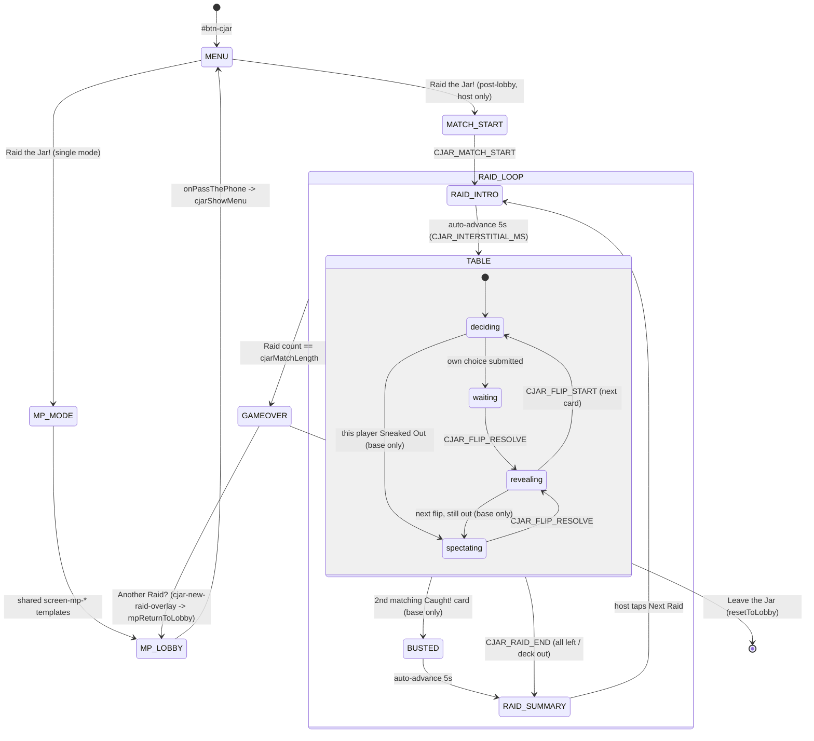

# New Game Technical Spec — Cookie Jar (`cjar`)
**Document type:** Phase 2 — Technical Specification
**Written by:** Claude Code, 2 Aug 2026
**Sources:** `docs/new-ideas/new-game-brief-cookie-jar.md` v5 · `docs/new-ideas/cookie-jar-sylly-mode-draft.md` v3 · `logic-engine.md` · `ui-style.md` · `definitions.md` · `docs/rules/game-identities.md` · `docs/rules/new-game-checklist.md` · `docs/code-map.md` · `CLAUDE.md`
**Status:** DRAFT — awaiting project-owner confirmation before implementation begins

> **Scope decision (owner, 2 Aug 2026):** this spec covers **both** the base game **and** Sylly Mode (Dibber Dobber), built in **one phase**. The PKO precedent of a separate Sylly spec (`new-game-tech-pecking-order-fon.md`) was offered and declined. Consequence accepted and recorded in §17 D-11: the Dibber Dobber balance numbers were simulated at a 16-card deck and are being written into code at ~11 cards without a re-run. §15 carries `tools/simulate-cjar-dd.js` as the mitigation.

---

## Consistency Audit

Run against `docs/rules/game-identities.md` (all 17 games), `js/engine.js` (`allScreens[]`), `js/engine-multiplayer.js` (`MP_GAME_CONFIGS`) and `css/styles.css`.

| Check | Finding |
|-------|---------|
| Does any proposed terminology collide with existing terms across the 17 games? | **Four hits. Two resolved by rename, two accepted with a copy rule** — see the terminology table below. |
| Does the proposed brand colour have an existing `pill-active-[colour]` class in `css/styles.css`? | **No.** `cjar` appears in **zero** source files. All brand classes are new: `pill-active-cjar`, `game-toggle-on-cjar`, `cjar-range`, `cjar-cta`, `cjar-label`. |
| Does the proposed abbreviation conflict with any existing plugin prefix? | **No.** Checked against all 17 live prefixes (`li5, gm, ss, jec, ygi, lttp, nat, dsd, gth, dyb, bld, pass, nt, frt, shp, flw, pko`). `cjar` is free. |
| Does any proposed screen ID conflict with any existing screen in `allScreens[]`? | **No.** No `screen-cjar-*` ID exists. All 6 are new. |
| Does the game need a new data file, or can it reuse `words.json` / `ygi-data.json`? | **New file** — `data/cjar-data.json`. Neither existing schema carries card values, per-archetype flavour pools, or a Treat schedule. |
| Are there engine functions or shared library modules already built that this game can reuse? | **`showWhoFirst`** — no (not a team game). **`normaliseWord`** — no (no text input anywhere). **Pass-gate pattern** — no (MDLM, no phone passing). **`Cards` module** — no (cjar's cards are not a 52-card deck; they need their own seam). **Reused:** `mpLockSync`/`mpUnlockSync`, `mpSendPrivate`/`mpStartPrivateListener`, `mpReturnToLobby`, `updateSliderTheme`, `getMuteToggleOnClass`, the full `play*()` audio catalogue, and the host-gate `endTimestamp` pattern from `GTH_PHASE2_BEGIN`. |

### Terminology collisions and their resolution

| Proposed term | Collides with | Resolution |
|---|---|---|
| **Kitchen Rules** (setting) | **JEC** owns the kitchen metaphor suite-wide: Sylly Mode *Kitchen Nightmares*, quit confirm *"Yeah, close the kitchen."*, *Crowded Kitchen Tax*, *Too Many Cooks!* | **RENAMED → House Rules.** Owner-confirmed 2 Aug 2026. The end-screen exit button also moves off "Leave the Kitchen" → **"Leave the Jar"**. cjar owns the *jar*; JEC keeps the *kitchen*. Incidental prose use of "kitchen" in cjar flavour lines is fine — the collision was on a **named** setting. |
| **Cookie Trail** (flip log) | **PKO** — *The Trail* is PKO's match log, same concept, immediately preceding game (`pko-trail-overlay`, inside *The Watering Hole 💧*). | **RENAMED → Crumb Trail.** Owner-confirmed 2 Aug 2026. **Copy rule:** the scoring currency stays **Cookie Crumbs** (counter label: *Crumbs*); the overlay must read unambiguously as a log — title **"Crumb Trail 🔍"** with subtitle *"Every flip this Raid."* Never label the overlay just "Crumbs". |
| **Cookie Stash** (private banked total) | **FRT** — *The Stash* = a player's hidden hand of fruit cards. **FLW** — *The Stash* = a player's hidden hand of Showpiece gems. | **ACCEPTED with a copy rule.** Different meaning (a score, not a hand) and always prefixed. **Never use the bare word "Stash" in any cjar user-facing copy** — it is always "Cookie Stash". Variables are prefixed (`cjarStashes`) so there is no code collision. |
| **Take** (action) | **YGI** — *The Take* = a player's Number + Metric response; settings *Split Take / Solo Take*. | **ACCEPTED, no change.** Different part of speech (cjar's is a verb on a button, YGI's is a noun), different game, never co-visible. Logged so a future audit does not re-flag it. |
| **BUSTED!** (bust moment) | **SHP** uses "bust" descriptively ("busted gamble", "Bust → Deep Sleep"). | **ACCEPTED, no change.** SHP's is lowercase prose, not a named label. cjar's `BUSTED!` is a named screen state. |

### Brand-colour audit — measured, not eyeballed

Brand hex **`#D4A017`** (owner-locked, 2 Aug 2026).

| Measurement | Result | Consequence |
|---|---|---|
| `#D4A017` vs **white** | **2.38:1** | **FAILS** the 3:1 large-text floor — the *same* failure class the v156 recolour phase just fixed in BLD (1.92:1) and FRT (1.57:1). White ink is prohibited on this fill. |
| `#D4A017` vs **stone-800 `#292524`** | **6.39:1** | **PASSES.** cjar takes **dark ink**, matching the treatment FRT adopted at v156. |
| Settings light tint `#F7E9C4` / text `#7A5C0A` | 5.18:1 | Passes. Deliberately not PKO's `#F5E6C8`/`#854D0E` pairing. |
| ΔE (CIE-Lab) vs nearest shipped brand — **JEC amber-500 `#F59E0B`** | **16.6** | **Acceptable.** The suite already ships GM↔SHP at **ΔE 14.0**; 16.6 is a wider gap than an existing shipped pair, so this is inside established tolerance. ΔE to PKO `#854D0E` = 41.3, to FRT `#FFE500` = 34.4 — both comfortable. |

**Flags:**
1. Dark ink is **not optional** — it is the finding that justified the entire v156 recolour phase, and shipping white-on-`#D4A017` would reintroduce the bug that phase existed to remove. This propagates to `ctaTextClass` (§11), every brand CSS class (§1), and the how-to close button (§8).
2. `cjar` becomes the **second** consumer of the `ctaTextClass` field in `MP_GAME_CONFIGS`, introduced for FRT at v156.

---

## §1 — Identity

| Field | Value |
|-------|-------|
| Full name | **Cookie Jar** |
| Short ID / abbreviation | `cjar` |
| Plugin file | `js/games/cjar.js` |
| Brand colour | **`#D4A017`** honey-gold (custom — no Tailwind utility). **Dark ink (`stone-800`), never white.** |
| Active pill class | `pill-active-cjar` — **does not exist, must be added** to `css/styles.css` |
| Toggle ON class | `game-toggle-on-cjar` — **new**; add to the `map` in `getMuteToggleOnClass()` (`engine.js`) |
| Range class | `cjar-range` — **new**; gradient `#F7E9C4 → #D4A017`; add to the `map` in `updateSliderTheme()` (`engine.js`) |
| CTA class | `cjar-cta` — **new**; `background:#D4A017; color:#292524;` hover `#B8860B` |
| Label class | `cjar-label` — **new**; `color:#7A5C0A` (the darkened brand, for step labels on stone-50 cards — the raw `#D4A017` on `bg-stone-50` measures under 3:1) |
| Settings button (light tint) | `bg-[#F7E9C4] hover:bg-[#EFDCA8] text-[#7A5C0A]` |
| Modal border | `border-[#E5C97A]` |
| Lobby button ID | `#btn-cjar` |
| Play CTA label | **Raid the Jar!** |
| Menu screen tagline | *Who took the cookies from the cookie jar?* |
| Emoji | 🍪 |
| How-to emoji | 🍪 |
| Sylly Mode name | **Dibber Dobber** |
| Player range | **4–8** (`getMinPlayers: () => 4`) |

---

## §2 — State Flow



**Sub-states within screens:**

| Screen | Sub-states | State variable |
|--------|-----------|----------------|
| `screen-cjar-table` | `'deciding'` / `'waiting'` / `'revealing'` / `'spectating'` | `cjarTablePhase` |
| `screen-cjar-raid-summary` | host (CTA live) / client (waiting copy) | derived from `window.syllyMultiplayerMode` |

**Pass-the-phone gate points:** **None.** MDLM-only — every player is on their own device and no screen transition hands the phone to a different person. The Pass-the-Phone Safety Gate rule in `logic-engine.md` does not apply.

**`showWhoFirst()` usage:** **Not used.** Not a team game; there is no turn order at all — every choice is simultaneous.

**Screen layout — every screen is the Stack.**

| Screen ID | Header | Stage | Controls |
|-----------|--------|-------|----------|
| `screen-cjar-menu` | 🔊 (`absolute top-4 right-4`; section is **content-height — no `min-h-screen`**) | 🍪 emoji + title + tagline | Raid the Jar! / How to Play / Settings / ← Back to the Box |
| `screen-cjar-raid-intro` | *(interstitial — exempt, see below)* | "Raid 2 of 5" + fresh-table line + (Sylly) this player's Favourite/Watcher | *(none — auto-advances)* |
| `screen-cjar-table` | "Raid 2 of 5" left; `[?]` 🔊 ✕ right; family warning strip on a second row **inside the Header zone** | Hero card ~240×330 + deck badge ~56×76 + horizontal trail strip ~48×66 | Timer bar → action buttons (2 base / 3 Sylly) → reveal rows → private strip (Crumbs, own Cookie Stash, own Raid total, Sylly affinities, Crumb Debt chip) |
| `screen-cjar-busted` | *(interstitial — exempt)* | BUSTED! + the family member + their bust flavour line | *(none — auto-advances)* |
| `screen-cjar-raid-summary` | "Raid 2 of 5 complete" + `[?]` 🔊 ✕ | Per-player banked-this-Raid rows + running Cookie Stash column (Open-Book gated) | **Host:** "Next Raid" CTA. **Client:** "Waiting for the host…" (no button) |
| `screen-cjar-gameover` | "Who took the cookies from the cookie jar?" + 🔊 ✕ | Podium (🍪 Top Cookie Thief / ranks / **Red-Handed** last place) + Raid-history grid, **players as rows, Raids as columns** | Another Raid? / Leave the Jar |

Every section: `<section class="flex items-center justify-center w-full min-h-screen px-5 py-8 overflow-y-auto">` wrapping ONE `flex flex-col w-full max-w-sm gap-4` column. **No `h-screen` sticky-footer anywhere.**

**Interstitial chrome exemption** — `screen-cjar-raid-intro` and `screen-cjar-busted` carry no `[?]`/🔊/✕. Both conditions from `ui-style.md` § Global UI Protocol rule 5 are met: they auto-advance **and** have no interactive element. Dwell is `CJAR_INTERSTITIAL_MS` = **5000 ms**, the value PKO tuned to at playtest round 4. This is at the documented practical ceiling — do not raise it.

---

## §3 — Screen Registry

| Screen ID | Purpose | Notes |
|-----------|---------|-------|
| `screen-cjar-menu` | Main hub | Play CTA has **dual context** — branches on `syllyMultiplayerMode` (§11) |
| `screen-cjar-raid-intro` | "Raid N of M" + Sylly affinity reveal | Auto-advancing interstitial, 5 s |
| `screen-cjar-table` | **The** persistent gameplay screen, 4 sub-states | Every flip of every Raid happens here |
| `screen-cjar-busted` | BUSTED! moment | **Base game only** — Sylly Mode has no bust |
| `screen-cjar-raid-summary` | End-of-Raid banked totals | Host-gated CTA |
| `screen-cjar-gameover` | Final standings + Raid-history grid | |

**Total new screens: 6** — all six added to `allScreens[]` in `engine.js`.

**No `screen-cjar-setup` and no `screen-cjar-players`.** MDLM-only: `mpPlayerSlots[i].nickname` is already populated when `onPassThePhone` fires, so the name-entry screen is redundant. BLD/PKO are the reference implementations. Read **`.nickname`**, never `.name` (returns `undefined` silently). This is deviation **D-01**.

**No `screen-cjar-mode` / `-lobby-host` / `-lobby-join` / `-roster`.** Reuses the shared `screen-mp-*` templates.

---

## §4 — State Variables

```javascript
// ── Constants ──────────────────────────────────────────────────────────────
const CJAR_DECISION_MS      = 15000; // per-flip decision window (host-authoritative)
const CJAR_TIMEOUT_GRACE_MS = 1500;  // host waits this long past endTimestamp for in-flight ACTIONs
const CJAR_REVEAL_MS        = 3000;  // reveal dwell before the next flip starts
const CJAR_INTERSTITIAL_MS  = 5000;  // raid-intro + BUSTED! auto-advance
const CJAR_DD_CUT           = 10;    // Sylly: cards cut from the 30-card pool, before the Treat
const CJAR_DD_START_STASH   = 5;     // Sylly: granted ONCE per match, not per Raid
const CJAR_DD_DOB_STEAL     = 2;     // per Dobber, capped at card value
const CJAR_DD_DOB_BACKFIRE  = 2;     // flat
const CJAR_DD_TAKE_LOSS     = { favourite: 0, neutral: 2, watcher: 4 };
const CJAR_DD_DEBT_CAP      = 6;

// ── Settings (persist between play-agains) ─────────────────────────────────
let cjarSnackFriendly = 'safe';  // 'off' | 'safe' | 'warmup'
let cjarHouseRules    = 'burn';  // 'burn' | 'on-guard' | 'high-alert'
let cjarMatchLength   = 5;       // 3 | 5
let cjarOpenBook      = true;    // bool
let cjarSyllyMode     = false;   // always last

// ── Roster (from the lobby, persists across play-agains) ───────────────────
let cjarPlayerCount = 0;
let cjarPlayerNames = [];

// ── Match state (reset each play-again) ────────────────────────────────────
let cjarRaidNo        = 0;    // 1-based
let cjarStashes       = [];   // int per player — banked score (Sylly: THE running total)
let cjarTreatsWon     = [];   // int per player — first tie-break
let cjarRaidHistory   = [];   // cjarRaidHistory[raidIdx][playerIdx] = banked that Raid
let cjarFamilyCopies  = {};   // { mum:3, dad:3, big:3, little:3, pet:3 } — House Rules mutates
let cjarTreatsLive    = [];   // treat ids not yet permanently discarded
let cjarTreatsCarried = [];   // revealed-never / unrevealed treats carrying into the next Raid

// ── Raid state (reset each Raid) ───────────────────────────────────────────
let cjarDeck         = [];    // array of card objects, index 0 = next to flip
let cjarSeen         = {};    // { mum:0|1, ... } — appearances THIS Raid
let cjarCrumbs       = 0;
let cjarRaidTotals   = [];    // base game only — in-progress, unbanked
let cjarActive       = [];    // base game only — bool per player, still in this Raid
let cjarCounterTreat = null;  // revealed Treat sitting on the counter, unclaimed
let cjarTrail        = [];    // Crumb Trail entries for this Raid
let cjarHighAlertId  = null;  // family id escalated to 4 copies (House Rules: high-alert)
let cjarFavourite    = [];    // Sylly — host-side full array, family id per player
let cjarWatcher      = [];    // Sylly — host-side full array
let cjarCrumbDebt    = [];    // Sylly — int per player, capped, cleared at Raid end

// ── Flip state (reset each flip) ───────────────────────────────────────────
let cjarCard         = null;  // the card just revealed
let cjarChoices      = [];    // 'take'|'sneak'|'innocent'|'dob'|null per player
let cjarReadyCheck   = [];    // bool per player
let cjarEndTimestamp = 0;     // absolute ms — every device counts down against this
let cjarDeltas       = [];    // int per player — this flip's change, for the reveal
let cjarLines        = [];    // string per player — flavour line, for Open Book Off

// ── UI / device-local state ────────────────────────────────────────────────
let cjarTablePhase        = 'deciding'; // 'deciding'|'waiting'|'revealing'|'spectating'
let cjarMyFavourite       = null;       // Sylly — THIS device only, via mpSendPrivate
let cjarMyWatcher         = null;       // Sylly — THIS device only, via mpSendPrivate
let cjarTimerHandle       = null;       // setInterval — the countdown bar
let cjarRevealHandle      = null;       // setTimeout — reveal dwell (host only)
let cjarHostTimeoutHandle = null;       // setTimeout — decision-timer auto-resolve (host only)
let cjarInterstitialHandle = null;      // setTimeout — raid-intro / BUSTED! advance
```

**Derived at runtime, never stored:**
- `cjarIsSylly()` → `cjarSyllyMode === true` (used to branch resolution, deck build and button set)
- `cjarStashVisible(idx)` → `cjarOpenBook || idx === mpMyPlayerIdx` — the **single** Open Book predicate (§10)
- `cjarCookieTier(value)` → `'handful' | 'batch' | 'mountain'` from the value bands 1–5 / 6–12 / 13–17
- `cjarActiveCount()` → `cjarActive.filter(Boolean).length` (base game)
- `cjarAllIn()` → `cjarActive.every((a,i) => !a || cjarReadyCheck[i])` — **only active seats gate the flip**

---

## §5 — Settings

**Settings overlay title block:**
- Heading: `Cookie Playbook 🍪`
- Subtitle: `How the raid runs — and how much trouble you're in.`

| Setting name (display) | Options (display) | Default | Internal variable | Internal values |
|---|---|---|---|---|
| Snack Friendly | Off / Safe First Grab / Warm-Up | **Safe First Grab** | `cjarSnackFriendly` | `'off'` / `'safe'` / `'warmup'` |
| House Rules | Standard Burn / On Guard / High Alert | **Standard Burn** | `cjarHouseRules` | `'burn'` / `'on-guard'` / `'high-alert'` |
| Match Length | Quick Snack (3) / Full Feast (5) | **Full Feast** | `cjarMatchLength` | `3` / `5` |
| Open Book | OFF / ON | **ON** | `cjarOpenBook` | `bool` |
| ✨ Sylly Mode (Dibber Dobber) | OFF / ON | OFF | `cjarSyllyMode` | `bool` |

> **Note on the template's "difficulty first" rule:** cjar has no difficulty setting — Snack Friendly and House Rules together occupy that role (one softens the opening, one governs the consequence). Snack Friendly is first because it is the one a nervous table reaches for.

**Plain-English card descriptions:**

| Setting | Description text |
|---|---|
| Snack Friendly | Guarantees the first card or two of every Raid is cookies, so nobody gets busted before they've grabbed anything. |
| House Rules | What happens to a family member after they catch you. Standard Burn makes them a little less likely next time; High Alert makes someone *more* likely. |
| Match Length | How many Cookie Raids before the biggest Cookie Stash wins. |
| Open Book | Shows everyone's cookies to everyone. Turn it off and you'll only see your own numbers — you'll hear what happened to the others, just not how much. |
| ✨ Sylly Mode | *(subtitle)* **Dibber Dobber** — *(body)* Three moves instead of two. Take grabs cookies, Play Innocent keeps you safe and sweeps the crumbs, and Dob points the finger at whoever's taking. Nobody leaves, nobody busts, and nobody ever loses everything. |

**Settings hidden/disabled when Sylly Mode is ON:** **Snack Friendly** and **House Rules** — both cards get `style.display = 'none'` while `cjarSyllyMode === true`, restored on toggle off. Every option in both settings governs bust behaviour, and Dibber Dobber has no bust. **Match Length and Open Book stay visible and functional in both modes.**

**Settings overrides in Lobby Mode:** none forced. All five settings are **host-owned** — clients' settings overlays are read-only in MDLM (the host's values travel in `CJAR_MATCH_START`). Clients may still *open* the overlay to read the rules.

**Scroll reset on open:** `el.querySelector('.overlay-data-inner').scrollTop = 0` before `style.display='flex'`. Never `.overflow-y-auto` (returns `null`).

---

## §6 — Scoring Logic

### 6.1 Shared primitives

Every uneven split in this game — in either mode, for every card type and every action — sends its remainder to Crumbs. There is no other destination.

```javascript
// The ONLY split helper. Returns the per-head amount; pushes the remainder to Crumbs.
function cjarSplit(total, headCount) {
  if (headCount <= 0) { cjarCrumbs += total; return 0; }
  const per = Math.floor(total / headCount);
  cjarCrumbs += total - (per * headCount);
  return per;
}
```

### 6.2 Base game

| Outcome | Who scores | Points | Formula | Raid end? |
|---|---|---|---|---|
| Cookie Card revealed | every **active** player | card value ÷ active count, floored | `per = cjarSplit(card.value, cjarActiveCount()); active.forEach(i => cjarRaidTotals[i] += per)` | No |
| Caught! card, 1st of its type this Raid | nobody | 0 | `cjarSeen[id] = 1` — flavour line only | No |
| Caught! card, 2nd of its type this Raid | nobody | 0 | **BUSTED!** — see below | **Yes** |
| Treat card revealed | nobody yet | 0 | `cjarCounterTreat = card` — sits on the counter | No |
| **Exactly one** player Sneaks Out | that player | `raidTotal + all Crumbs + Treat on counter` | see `cjarResolveSneak()` | Only if they were the last active player |
| **2+** players Sneak Out together | each leaver | `raidTotal + floor(Crumbs / leaverCount)` | remainder stays as Crumbs; **Treat is NOT claimed** and stays on the counter | Only if they were the last active players |
| BUSTED! | nobody | 0 | every still-active player loses their **Raid total only**; `cjarStashes` untouched | **Yes** |

```javascript
function cjarResolveSneak(leavers) {          // leavers = array of playerIdx
  if (leavers.length === 1) {
    const i = leavers[0];
    cjarStashes[i] += cjarRaidTotals[i] + cjarCrumbs;
    cjarCrumbs = 0;
    if (cjarCounterTreat) {                    // a solo leaver is the ONLY way to claim a Treat
      cjarStashes[i] += cjarCounterTreat.points;
      cjarTreatsWon[i] += 1;
      cjarCounterTreat = null;
    }
  } else {
    const pool = cjarCrumbs;                   // drain the pool BEFORE splitting it
    cjarCrumbs = 0;                            // so cjarSplit's remainder lands in an empty pool
    const per = cjarSplit(pool, leavers.length);
    leavers.forEach(i => { cjarStashes[i] += cjarRaidTotals[i] + per; });
  }                                            // 2+ leavers never claim the Treat — it stays
  leavers.forEach(i => { cjarRaidTotals[i] = 0; cjarActive[i] = false; });
}
```

> **Ordering hazard — the harness asserts against this.** `cjarSplit` pushes its remainder **into** `cjarCrumbs`. Any site that splits the Crumb pool itself must therefore drain the pool to zero *before* the call, as above. Splitting `cjarCrumbs` in place double-counts it. The same drain-then-split shape appears in the Sylly scare-off block (§6.3) — both are the only two places the pool splits into itself.

**Bust resolution:**
```javascript
function cjarResolveBust(familyId) {
  cjarActive.forEach((live, i) => { if (live) { cjarRaidTotals[i] = 0; cjarActive[i] = false; } });
  if (cjarHouseRules !== 'on-guard') cjarFamilyCopies[familyId] -= 1;   // burn + high-alert
  if (cjarHouseRules === 'high-alert') {
    const pool = Object.keys(cjarFamilyCopies).filter(id => cjarFamilyCopies[id] > 0);
    cjarHighAlertId = pool[Math.floor(Math.random() * pool.length)];
    cjarFamilyCopies[cjarHighAlertId] += 1;                             // a 4th copy next Raid
  }
  if (cjarCounterTreat) {                                               // revealed Treat is lost
    cjarTreatsLive = cjarTreatsLive.filter(t => t !== cjarCounterTreat.id);
    cjarCounterTreat = null;
  }
}
```

**Raid end conditions (base game), in check order:**
1. **BUSTED!** — 2nd matching Caught! card
2. **All out** — `cjarActiveCount() === 0` after resolving choices
3. **Deck exhausted with players still in** — see D-04. Treated as *everyone Sneaks Out simultaneously*: run `cjarResolveSneak(allActive)` (so 2+ leavers, Crumbs split, remainder discarded), then discard any Treat on the counter. Needs no new copy — it is the existing "everyone left together" rule.

### 6.3 Sylly Mode (Dibber Dobber)

**Structural difference:** Sylly Mode has **no `cjarRaidTotals` and no `cjarActive`.** There is one running `cjarStashes[i]` per player for the whole match, seeded once with `CJAR_DD_START_STASH` (5) at `CJAR_MATCH_START`. Nobody leaves, nobody busts, cookies never go below zero.

```javascript
// The two ledger primitives. EVERY Sylly gain/loss goes through these — never touch
// cjarStashes directly, or Crumb Debt silently stops working.
function cjarDDGain(i, amt) {
  if (cjarCrumbDebt[i] > 0) {
    const pay = Math.min(cjarCrumbDebt[i], amt);
    cjarCrumbDebt[i] -= pay; cjarCrumbs += pay; amt -= pay;   // repayments go to Crumbs
  }
  cjarStashes[i] += amt;
}
function cjarDDPay(i, amt) {
  const paid = Math.min(cjarStashes[i], amt);
  cjarStashes[i] -= paid; cjarCrumbs += paid;
  const short = amt - paid;
  if (short > 0) cjarCrumbDebt[i] = Math.min(CJAR_DD_DEBT_CAP, cjarCrumbDebt[i] + short);
}
```

**Cookie card — full resolution, in this order:**
```javascript
const takers    = cjarSeatsChoosing('take');
const dobbers   = cjarSeatsChoosing('dob');
const innocents = cjarSeatsChoosing('innocent');
const V = card.value;

if (takers.length && dobbers.length) {
  const steal = Math.min(CJAR_DD_DOB_STEAL * dobbers.length, V);
  const dPer  = cjarSplit(steal, dobbers.length);       dobbers.forEach(i => cjarDDGain(i, dPer));
  const tPer  = cjarSplit(V - steal, takers.length);    takers.forEach(i  => cjarDDGain(i, tPer));
} else if (takers.length) {
  const tPer = cjarSplit(V, takers.length);             takers.forEach(i  => cjarDDGain(i, tPer));
} else if (dobbers.length) {
  dobbers.forEach(i => cjarDDPay(i, CJAR_DD_DOB_BACKFIRE));   // backfire — nobody took
  cjarCrumbs += V;                                            // card value unclaimed
} else {
  cjarCrumbs += V;                                            // everyone played innocent
}
// SCARE-OFF — runs LAST so an all-innocent flip absorbs its own contribution immediately
if (innocents.length && dobbers.length === 0) {
  const pool = cjarCrumbs; cjarCrumbs = 0;
  const iPer = cjarSplit(pool, innocents.length);
  innocents.forEach(i => cjarDDGain(i, iPer));
}
```

**Caught! (Family) card — no bust. Each player's own choice decides their fate:**
```javascript
takers.forEach(i => {
  const loss = cjarFavourite[i] === card.id ? CJAR_DD_TAKE_LOSS.favourite
             : cjarWatcher[i]   === card.id ? CJAR_DD_TAKE_LOSS.watcher
             : CJAR_DD_TAKE_LOSS.neutral;
  if (loss) cjarDDPay(i, loss);
});
dobbers.forEach(i => cjarDDPay(i, CJAR_DD_DOB_BACKFIRE));      // ALWAYS backfires
// same scare-off block as above, verbatim — Innocents split Crumbs unless a Dobber is present
```

**Treat card — never split. Priority `Take > Dob > Play Innocent`, evaluated in order:**
```javascript
function cjarDDResolveTreat() {                 // called at the END of EVERY flip while a Treat sits
  if (!cjarCounterTreat) return;
  const solo = list => list.length === 1 ? list[0] : -1;
  let w = solo(takers); if (w < 0) w = solo(dobbers); if (w < 0) w = solo(innocents);
  if (w < 0) return;                            // nobody uniquely solo — re-contests next flip
  cjarDDGain(w, cjarCounterTreat.points);
  cjarTreatsWon[w] += 1;
  cjarCounterTreat = null;
}
```
"Solo" is evaluated **in priority order, not independently** — a player is a candidate only if they are the sole chooser of their action *and* no higher-priority action had a sole chooser. Two players can each be "the only one who chose X" for different X; the higher-priority one wins and the other gets nothing.

**Raid end (Sylly):** the ~11-card deck runs out. That is the only condition. Any Treat still on the counter is **permanently discarded** (does not carry forward). `cjarCrumbs` and `cjarCrumbDebt` both reset to zero.

### 6.4 Match end and tie-break

Winner: highest `cjarStashes[i]`.
1. Tied on total → **most `cjarTreatsWon[i]`** wins
2. Still tied → **shared rank.** Tied players display the same rank number (PKO precedent). `cjarRank(i)` returns the shared ordinal; the end screen prints "2nd" twice and skips "3rd".
3. Last place (single or shared) carries the **Red-Handed** label.

**Scoring function:** `cjarResolveFlip(choices)` — the single entry point, called host-side only, once per flip, after the card has been revealed and the decision window has closed. It branches on `cjarIsSylly()` and returns `{ deltas[], lines[], raidEnded, bustFamilyId }`.

**Zero-sum check.** Base game: the 15 Cookie Cards total **124 cookies** per Raid, of which an unknowable fraction is destroyed by busts and by unclaimed Treats/Crumbs at Raid end. Across 5 Raids a 4-player match distributes roughly 200–350 cookies, so Treat bonuses (5/10) are meaningful but not dominant — correct, since Treats are the reward for a rare solo exit. Sylly Mode is close to zero-sum by construction: Crumbs is a conserved pool, every loss feeds it and every gain drains it, and the only net injections are the 5-cookie start grant and the Treat bonuses.

---

## §7 — Validation Rules

Cookie Jar has **no text input anywhere** — every interaction is a button tap. The validation surface is therefore about *state legality*, not input parsing.

| Input | Block condition | Error message | Animation |
|---|---|---|---|
| Take / Sneak Out / Play Innocent / Dob | `cjarTablePhase !== 'deciding'` | *(silent — buttons are not in the DOM outside `'deciding'`)* | none |
| Any action button | double-tap after submit | *(silent — `mpLockSync()` drops the duplicate ACTION at the send choke point)* | none |
| Any action button | this player is `'spectating'` (base game, already Sneaked Out) | *(silent — Controls zone renders the spectator strip instead)* | none |
| "Next Raid" on `screen-cjar-raid-summary` | `syllyMultiplayerMode !== 'host'` | *(button not rendered for clients — replaced by "Waiting for the host…")* | none |
| Lobby start | `mpPlayerSlots.length < 4` | Handled by the engine via `getMinPlayers: () => 4` | engine-owned |

**Stemmer / fuzzy match usage:** **None.** `normaliseWord()` is not needed — no word input exists in this game. Do not add a normaliser.

**The one real guard:** `cjarResolveFlip()` must be **idempotent per flip**. Tag each flip with an incrementing `cjarFlipSeq` carried in `CJAR_FLIP_START`; the host drops any `CJAR_CHOICE` ACTION whose `flipSeq` does not match the current one. This is the PKO BUG-01 class — an in-flight packet from a flip that has already resolved must not resolve it a second time.

---

## §8 — Overlay Registry

| Overlay ID | Pattern | z-index | Trigger | Notes |
|---|---|---|---|---|
| `cjar-settings-overlay` | Data (slide-up) | z-[80] | `#btn-cjar-menu-settings` | Cookie Playbook 🍪 |
| `cjar-how-to-overlay` | Data (slide-up) | z-[90] | `#btn-cjar-menu-how-to`, `#btn-cjar-how-to` (table header `[?]`) | |
| `cjar-trail-overlay` | Data (slide-up) | z-[90] | tapping the hero card or any trail thumbnail | **Crumb Trail 🔍** — the flip log **plus** the per-match copies-remaining row per family member |
| `cjar-quit-overlay` | Decision modal | z-[80] | `.btn-cjar-quit-open` | |
| `cjar-new-raid-overlay` | Decision modal | z-[90] | `#btn-cjar-go-new` on gameover | Required — never restarts directly |
| `cjar-tip-overlay` | Decision modal | z-[90] | 3 inline `[?]` buttons — warning strip, Crumbs counter, Sylly affinities | Shared; content injected by `cjarShowTip(emoji, heading, lines[])` |

**Quit overlay copy:**
- Emoji: 🍪
- Heading: **"Giving up on the jar?"**
- Subtext: **"Your Cookie Stash will be lost."**
- Confirm: **"Yeah, sneak off."**
- Cancel: **"Keep raiding!"**

**Play-again overlay copy (`cjar-new-raid-overlay`):**
- Emoji: 🍪
- Heading: **"Another Raid?"**
- Subtext: "Everyone's Cookie Stash goes back to zero."
- Confirm: **host** `'Restart in Lobby 🔄'` · **client** `'Leave Session'` · *(single-device path unreachable — MDLM-only)*
- Cancel: "Stay here"

**Contextual tip content (3 tips, ≤3 bullets each):**

| Trigger | Emoji / heading | Bullets |
|---|---|---|
| Warning strip `[?]` | 👪 "The Family" | Dim = haven't seen them this Raid. · Lit = they've caught you once — a scare, nothing more. · Red = one more of them and it's BUSTED! |
| Crumbs counter `[?]` | 🍪 "Cookie Crumbs" | Leftovers that wouldn't split evenly. · Sneak Out alone and you take the lot. · *(Sylly)* A Dobber about the place and nobody's touching them this flip. |
| Affinity lines `[?]` *(Sylly only)* | ⭐ "Favourite & Watcher" | Your Favourite looks the other way — taking costs you nothing. · Your Watcher's onto you — getting caught costs double. · Both are reshuffled every Raid, and only you can see them. |

**Exact inner div class strings — verbatim:**

Pattern 1 (data slide-up):
```html
<div class="overlay-data-inner settings-slide-up bg-stone-50 w-full max-w-sm rounded-t-3xl flex flex-col">
```
Pattern 2 (decision modal) — **cjar's brand has no Tailwind `-300` shade, so the border is an arbitrary value:**
```html
<div class="overlay-modal-inner bg-stone-50 w-full max-w-sm rounded-3xl px-6 pt-6 pb-8 flex flex-col gap-4 text-center border border-[#E5C97A]">
```

**How-to overlay** — canonical structure from `ui-style.md`. Step labels use `cjar-label`; the close button uses `cjar-cta` (which carries `color:#292524` — **dark ink, not white**). Card order: Steps 1–7 (§18 of the brief) → **Winning and Scoring** → **✨ Sylly Mode / Dibber Dobber** → close.

---

## §9 — Audio Map

**Zero new synthesised functions.** Held in one place — `CJAR_SOUND` in `js/games/cjar.js`, beside the card/event registry, following the `PKO_EVENT_SOUND` precedent so a moment's identity and its voice cannot drift apart.

| Game moment | Audio function | Notes |
|---|---|---|
| Lobby entry / Raid the Jar! | `playLaunch()` | Mandatory on the lobby button — omitting it silently removes the entry sound |
| Cookie Card revealed | `playWhoosh()` | A flip, not an event |
| Caught! card, 1st of its type | `playHullThud()` | The "uh oh" scare |
| Caught! card, 2nd — **BUSTED!** | `playAbyssThud()` | Escalated version of the same hit |
| Choices reveal | `playDone()` | Choices settling into their resolved state |
| Lone player Sneaks Out (jackpot) | `playUnchallenged()` | The sole survivor scoops the pot |
| Treat collected (Special, 5 pts) | `playSuccess()` | |
| Treat collected (Super Special, 10 pts) | `playClashWin()` | Purpose-built "bigger version of a success" |
| Raid busts, cookies lost | `playBoing()` | Comedic loss, not harsh |
| High Alert triggers | `playAlarm()` | Already means escalation |
| Decision timer, final 3 s | `playTick()` | One per second |
| Dob backfires *(Sylly)* | `playPoacher()` | Deliberately out-of-ecosystem — the accusation boomerangs |
| End of match | `playClashWin()` | Warm celebratory close |
| Settings pill toggle | `playPillClick()` | |
| Sylly Mode toggle | `playSyllyOn()` / `playSyllyOff()` | |
| Overlay close / confirm | `playDone()` | |
| Quit confirm | `playExit()` | |

---

## §10 — Word Bank & Data

**Source:** new file — `data/cjar-data.json`. Neither `words.json` nor `ygi-data.json` carries card values, per-archetype flavour pools, or a Treat schedule.

**Entry schema:**
```json
{
  "cookieValues": [1, 2, 3, 4, 5, 5, 7, 7, 9, 11, 11, 13, 14, 15, 17],
  "cookieTiers": {
    "handful":  { "label": "Handful of Cookies",  "min": 1,  "max": 5  },
    "batch":    { "label": "Batch of Cookies",    "min": 6,  "max": 12 },
    "mountain": { "label": "Mountain of Cookies", "min": 13, "max": 17 }
  },
  "family": [
    {
      "id": "mum",
      "name": "Mum",
      "copies": 3,
      "warn": ["Told you, no cookies before dinner!", "..."],
      "bust": ["Hand out of the jar. NOW!", "..."]
    }
  ],
  "treats": [
    { "id": "shortbread", "name": "Strawberry Shortbread Cookies", "tier": "special", "points": 5 },
    { "id": "redvelvet",  "name": "Red Velvet Cookies",            "tier": "special", "points": 5 },
    { "id": "macadamia",  "name": "White Chocolate Macadamia Nut Cookies", "tier": "special", "points": 5 },
    { "id": "macarons",   "name": "French Macarons",               "tier": "super",   "points": 10 },
    { "id": "brownies",   "name": "Chocolate Truffle Brownies",    "tier": "super",   "points": 10 }
  ],
  "treatSchedule": {
    "3": ["shortbread", "redvelvet", "brownies"],
    "5": ["shortbread", "redvelvet", "macadamia", "macarons", "brownies"]
  }
}
```

Five family ids: `mum`, `dad`, `big`, `little`, `pet`. Each needs **≥4 `warn` lines and ≥4 `bust` lines** so a 5-Raid match does not repeat the same line every time — drawn without replacement within a Raid.

**Content guide:** `docs/cjar-content-guide.md`, modelled on `docs/ygi-content-guide.md`. Covers the flavour-pool voice (playful, before-dinner, never genuinely scary), the Australian-English rule, and the per-archetype personality brief from §22 of the Phase 1 brief.

**Add `data/cjar-data.json` to `PRECACHE_URLS` in `sw.js`** and bump `CACHE_NAME`.

**Secret Mode / expansion pack:** `cjarApplyExpansionOverrides()` hook, called at the top of `cjarStartMatch()`. Cookie Jar's content is a fixed deck, not a word pool, so the practical override surface is the **flavour-line pools and treat names only** (a themed pack could re-voice the family without touching any number). No pool-refill path exists.

### Deck construction

```javascript
function cjarBuildDeck() {
  const deck = [];
  if (cjarIsSylly()) {
    // Full 15+15 pool every Raid — House Rules is hidden in Sylly, so nothing ever burns.
    CJAR_DATA.family.forEach(f => { for (let n = 0; n < 3; n++) deck.push(cjarFamilyCard(f.id)); });
    CJAR_DATA.cookieValues.forEach(v => deck.push(cjarCookieCard(v)));
    cjarShuffle(deck);
    deck.length = CJAR_DD_CUT;                                  // genuine random cut to 10
    deck.push(cjarTreatCard(cjarScheduledTreat()));                 // Treat added AFTER the cut
    cjarShuffle(deck);                                          // → ~11 cards
    return deck;
  }
  // Base game: live family copies (House Rules mutates these across the match)
  Object.entries(cjarFamilyCopies).forEach(([id, n]) => { for (let k = 0; k < n; k++) deck.push(cjarFamilyCard(id)); });
  CJAR_DATA.cookieValues.forEach(v => deck.push(cjarCookieCard(v)));   // never depletes — full 15 every Raid
  cjarTreatsCarried.forEach(id => deck.push(cjarTreatCard(id)));       // unrevealed Treats carry forward
  deck.push(cjarTreatCard(cjarScheduledTreat()));
  cjarShuffle(deck);
  cjarFloatCookies(deck, cjarSnackFriendly === 'warmup' ? 2 : cjarSnackFriendly === 'safe' ? 1 : 0);
  return deck;
}

// Snack Friendly: FLOAT an existing Cookie Card to the top — never PREPEND a new one.
// Prepending adds a 16th cookie and silently changes the odds for every other flip.
function cjarFloatCookies(deck, n) {
  for (let slot = 0; slot < n; slot++) {
    const idx = deck.findIndex((c, i) => i >= slot && c.type === 'cookie');
    if (idx === -1) break;
    deck.splice(slot, 0, deck.splice(idx, 1)[0]);
  }
}
```

**Supporting helpers referenced above:**

```javascript
cjarShuffle(arr)         // in-place Fisher–Yates
cjarCookieCard(v)            // → { type:'cookie', value:v }
cjarFamilyCard(id)           // → { type:'family', id }
cjarTreatCard(id)            // → { type:'treat', id, points, tier } — hydrated from CJAR_DATA.treats
cjarSeatsChoosing(action)    // → array of playerIdx whose cjarChoices[i] === action
cjarScheduledTreat()     // → CJAR_DATA.treatSchedule[String(cjarMatchLength)][cjarRaidNo - 1]
```

`cjarScheduledTreat()` is what makes the Super Special always land on the **final** Raid at either
match length — the two schedules in the data file already encode it, so no length-branching logic
is needed anywhere in the plugin.

**`cjarTreatsCarried` is recomputed at Raid end, never incrementally maintained:**

```javascript
// At Raid end (base game only). Self-correcting: whatever is still in the deck was never
// revealed, and everything else was either claimed or discarded by the rules below.
cjarTreatsCarried = cjarDeck.filter(c => c.type === 'treat').map(c => c.id);
```

Deriving it from the deck rather than tracking it by hand removes a whole class of bookkeeping
bug — a Treat cannot be both carried forward and discarded, because the deck is the single source.
`cjarTreatsLive` is **base-game only** (Sylly Mode never carries a Treat forward, so it never reads it).

**Treat lifecycle (base game):**

| Situation at Raid end | Outcome |
|---|---|
| Never revealed (still in `cjarDeck`) | **Carries forward** — pushed to `cjarTreatsCarried`, same identity, same value |
| Revealed on the counter, Raid ended in a **BUST** | **Permanently discarded** — removed from `cjarTreatsLive`, never returns |
| Revealed on the counter, Raid ended because **everyone left** (no solo leaver) | **Permanently discarded** |
| Claimed by a solo leaver | Scored, removed from `cjarTreatsLive` |

Sylly Mode: a Treat never carries forward — unclaimed at Raid end means gone.

### Custom assets — the render seam

| Field | Value |
|---|---|
| Visual primitive | **Cards** — three types (Cookie / Caught! / Treat) plus one back |
| Render-seam function | **`cjarRenderCard(card, opts)`** → DOM node. `opts.faceDown` → back. `opts.size` → `'hero'` \| `'thumb'` \| `'counter'` |
| Id key (stable, packet-safe) | Packets carry **card identity**: `{type:'cookie', value:9}` / `{type:'family', id:'mum'}` / `{type:'treat', id:'macarons'}` |
| **Art key** (derived inside the seam, never in a packet) | `cookie-handful` \| `cookie-batch` \| `cookie-mountain` \| `family-mum`…`family-pet` \| `treat-shortbread`…`treat-brownies` — **14 keys** |
| Asset `kind` string | `cjar` |
| Default look if art is missing | Emoji + CSS card face (🍪 / per-archetype emoji / 🍰) with the value or name as a text overlay — the three-tier fallback in `js/lib/art.js` guarantees the game is playable before any image loads |

**Deriving the art key from card identity is what collapses 15 cookie values onto 3 assets.** The numeric value is rendered as a text overlay on the tier art, never as its own asset.

```javascript
function cjarArtKey(card) {
  if (card.type === 'cookie') return 'cookie-' + cjarCookieTier(card.value);
  return card.type + '-' + card.id;                      // family-mum, treat-macarons
}
```

**Seam contract** — at the top of `cjarRenderCard`:
```javascript
const url = (typeof assetFace === 'function') && assetFace('cjar', cjarArtKey(card));
```
→ if `url`, return an image node (`background-image`, `.cjar-card-asset` CSS: cover/centre, transparent border); else build the emoji/CSS face. Face-down via `assetBack('cjar')`. **No cjar card DOM is built anywhere outside this seam** — a bypass is unskinnable (DYB's old cup-die bypass is the cautionary case).

### Core art pack — precached tier

Owner decision, 2 Aug 2026: **core art from day one**, matching `pko`/`flw`/`frt`/`shp`.

- `data/art/cjar/pack.json` + `data/art/cjar/img/` — same manifest format as a skin pack (`{ id, label, core: true, games:['cjar'], assets:{ kind:'cjar', basePath:'img/', faces:{…14…}, back:'back.jpg' } }`)
- Add `"cjar"` to `data/art/registry.json`
- **Precached** — the manifest **and every image** go into `PRECACHE_URLS` in `sw.js`, and `CACHE_NAME` is bumped. This is the whole difference from a skin pack; missing it means the art is simply absent on a cold offline install.
- Never listed in `data/packs/registry.json`; never appears in the Terminal.
- **Per-file ceiling: 40 KB.** 14 faces + 1 back ≈ **600 KB** total. Set at spec time per the PWA Guardian rule — PKO's art arrived at 26 MB and needed converting to 360 px JPEGs before it was installable on mobile data.
- Format **JPEG** at ~360 px width. cjar's cards have opaque grounds; no alpha is needed (unlike DYB's dice, which do).
- Converter: `tools/convert-core-art.ps1`. **Check the masters' real dimensions before setting the target width** — the FLW/FRT/SHP runs all found masters already near the card aspect, and upscaling only costs bytes.
- The card back is already generated (Phase 1 brief §22).

---

## §11 — Multiplayer Configuration

| Field | Value |
|---|---|
| Multiplayer mode | **MDLM only** — `supportedModes: ['mdlm']`, `multiplayerOnly: true` |
| New screens required | **None** — reuses `screen-mp-mode`, `screen-mp-lobby-host`, `screen-mp-lobby-join` |
| Authority | **Host-authoritative, host-as-participant.** The host plays and resolves. |
| Privacy model | **Couch security** (public SYNC, private-by-not-rendering) for everything except Sylly affinities |

### `MP_GAME_CONFIGS` entry

```javascript
cjar: {
  gameName:       'Cookie Jar',
  emoji:          '\u{1F36A}',
  brandBtnClass:  'cjar-cta',
  ctaTextClass:   'text-stone-800',   // REQUIRED — #D4A017 fails contrast with white ink
  ptpLabel:       'Raid the Jar!',
  lobbyCtaLabel:  'Raid the Jar!',
  menuScreen:     'screen-cjar-menu',
  onPassThePhone: () => {
    // Names come straight from the lobby — cjar has no setup screen (§17 D-01).
    cjarPlayerCount = mpPlayerSlots.length;
    cjarPlayerNames = mpPlayerSlots.map(p => p.nickname);   // {uid, nickname} — never .name
    if (window.syllyMultiplayerMode === 'host') cjarShowMenu();
    else cjarShowClientStandby();                            // waits for CJAR_MATCH_START
  },
  recommendedMode: 'mdlm',
  supportedModes:  ['mdlm'],
  multiplayerOnly: true,
  rosterConfig:    { type: 'none' },   // random/automatic seating — 'individual' corrupts the slot array
  getMaxPlayers:   () => 8,
  getMinPlayers:   () => 4,            // §5 research: 3 players is meaningfully weaker (BLD precedent)
},
```

**Menu Play CTA — dual context** (required; GTH is the reference):
```javascript
document.getElementById('btn-cjar-menu-play').addEventListener('click', () => {
  playLaunch();
  if (window.syllyMultiplayerMode !== 'single') cjarStartMatch();  // post-lobby
  else mpShowModeScreen('cjar');                                   // pre-lobby
});
```

### Packet registry

| Packet | Type | Direction | Payload |
|---|---|---|---|
| `CJAR_MATCH_START` | SYNC | host → all | all 5 settings, `playerNames[]`, `stashes[]` (zeroed, or `5` each in Sylly), `treatsWon[]` (zeroed), `familyCopies{}`, `matchLength` |
| `CJAR_AFFINITY` | **PRIVATE** | host → one | `{ favourite, watcher }` — Sylly only, once per Raid at Raid start |
| `CJAR_RAID_START` | SYNC | host → all | `raidNo`, `deckCount`, `seen{}` (zeroed), `crumbs: 0`, `raidTotals[]` (zeroed), `active[]` (all true), `counterTreat: null`, `trail: []`, `crumbDebt[]` (**zeroed**), `highAlertId`, `familyCopies{}` |
| `CJAR_FLIP_START` | SYNC | host → all | `flipSeq`, `card`, `deckCount`, `crumbs`, `seen{}`, `stashes[]`, `raidTotals[]`, `active[]`, `counterTreat`, `endTimestamp`, **`choices: []`**, **`readyCheck: [false×N]`** |
| `CJAR_CHOICE` | ACTION | **client → host only** | `{ flipSeq, choice }` — host never sends this (dedup guard) |
| `CJAR_FLIP_RESOLVE` | SYNC | host → all | `flipSeq`, `choices[]`, `deltas[]`, `lines[]`, `stashes[]`, `raidTotals[]`, `active[]`, `crumbs`, `crumbDebt[]`, `counterTreat`, `trailEntry`, `revealedAffinities{}`, `raidEnded`, `bustFamilyId` |
| `CJAR_RAID_END` | SYNC | host → all | `raidNo`, `banked[]` (this Raid), `stashes[]`, `treatsWon[]`, `raidHistory`, `familyCopies{}`, `highAlertId`, `bustFamilyId\|null` |
| `CJAR_MATCH_END` | SYNC | host → all | `stashes[]`, `treatsWon[]`, `raidHistory`, `ranks[]` |
| `CJAR_PLAYER_LEFT` | ACTION | client → host | `{}` — host calls `resetToLobby()` on receipt |

### Per-phase intercept points

| Game phase | Behaviour | Multiplayer intercept |
|---|---|---|
| Match start | Host seeds stashes, builds Raid 1 | Host broadcasts `CJAR_MATCH_START`; all devices apply settings + names |
| Raid start | Host builds the deck, (Sylly) assigns affinities | `CJAR_RAID_START` to all; **`CJAR_AFFINITY` via `mpSendPrivate` to each player individually** |
| Card flip | Host pops `cjarDeck[0]`, sets `endTimestamp` | `CJAR_FLIP_START`; every device renders the card and counts down against the absolute timestamp |
| Choice | **Client:** `mpLockSync()` → `CJAR_CHOICE` ACTION. **Host:** sets `cjarChoices[mpMyPlayerIdx]` and `cjarReadyCheck[mpMyPlayerIdx] = true` **directly** | The dedup guard drops any envelope where `originId === syllyDeviceUid` — a host that self-sends never marks its own seat and the flip hangs forever. This bug has recurred in JEC, YGI and NT. |
| Resolve | Host resolves when `cjarAllIn()` **or** at `endTimestamp + CJAR_TIMEOUT_GRACE_MS` | Only the host resolves. Clients display the countdown but never self-resolve, so clock skew stays cosmetic. `CJAR_FLIP_RESOLVE` to all. |
| Reveal dwell | Host waits `CJAR_REVEAL_MS`, then sends the next `CJAR_FLIP_START` | Host-driven so the dwell can't drift between devices |
| Raid end | Host banks, clears Raid state | `CJAR_RAID_END`; host-gated "Next Raid" CTA |
| Match end | Host ranks | `CJAR_MATCH_END` |
| Play again | — | `mpReturnToLobby()` — host broadcasts `LOBBY_RESET`, client calls `resetToLobby()` |
| Quit mid-game | **Host:** `resetToLobby()` (broadcasts `HOST_END_GAME`). **Client:** sends `CJAR_PLAYER_LEFT`, *then* `resetToLobby()` | Host's handler calls `resetToLobby()`, which broadcasts `HOST_END_GAME` and dissolves the match via the existing `mp-host-disconnected-overlay`. Matches the resolved GTH/DYB/BLD contract. **Without this the table waits forever on a seat that will never submit** — and with a flip every ~9–15 s, that stall surfaces immediately. |

### The two traps this game walks into, and their resolutions

**1. Accumulator reset must be in the SYNC payload, not just host-local.**
`cjarChoices[]`, `cjarReadyCheck[]`, `cjarCrumbDebt[]`, `cjarSeen{}`, `cjarTrail[]` are all accumulators. The host resets them when it builds the new flip/Raid; **clients never do**. Every one is listed at its reset value in the `CJAR_FLIP_START` / `CJAR_RAID_START` payloads above. A client that misses a `readyCheck` reset instantly false-fires `.every(Boolean)` on the next flip. This is FLW BUG-01, and cjar fires the pattern up to ~55 times a match — more than any shipped game.

**2. The 15 s decision timer collides with the engine's 8 s sync-lock auto-release.**
`mpLockSync()` self-releases after 8 s to prevent a permanent lock on a dropped packet. That is *shorter* than the decision window, so a player who submits early would watch their own buttons un-grey while the table still waits on someone slower.

**Resolution:** cjar **still calls `mpLockSync()`** — its correctness layer (dropping the duplicate ACTION at the send choke point) is exactly what stops a double-tap sending two choices. What cjar does **not** do is let `mp-sync-locked` express the Waiting state. On submit, `cjarTablePhase` flips to `'waiting'` and the Controls zone **re-renders**: the action buttons are removed from the DOM and replaced by player name chips. When the class self-clears at 8 s there is nothing left to un-grey. `btn-mp-action` is still applied to the action buttons (suite standard, harmless), but it is not the mechanism.

### Private information routing

| Information | Sent to | Method |
|---|---|---|
| Sylly Favourite / Watcher | each player, their own only | **`mpSendPrivate(uid, {type:'SYNC', payload:{action:'CJAR_AFFINITY', favourite, watcher}})`** — once per Raid at Raid start |
| Everything else | all devices | Public `/events` channel (couch security) |

**No repair packet is needed for affinities** — the value never mutates mid-Raid, which is precisely why this is the one safe use of the private channel here. It is *not* the `mpSendPrivate` hand-repair pattern (`logic-engine.md` § Private hands need a private REPAIR packet), and must not be extended into one. **Cookie Stashes deliberately do NOT use the private channel** — the split is `floor(value ÷ active count)` from two public numbers, so every total is derivable by arithmetic whether or not it is rendered. Open Book is a **render-layer courtesy, not a security property**, and must never be documented as one.

`mpStartPrivateListener()` is already called by the engine in both `mpHostCreateRoom()` and `mpClientJoinRoom()`. Confirm it is live before relying on `CJAR_AFFINITY`.

### readyCheck matrix

- Variable: `cjarReadyCheck = []`
- Set `true` when the player at index `i` submits (host sets its own directly)
- **Host advances on `cjarAllIn()` — `cjarActive.every((a,i) => !a || cjarReadyCheck[i])` — not `.every(Boolean)`.** A player who has Sneaked Out is no longer active and **must not** hold the Raid open. Using the plain `.every(Boolean)` form freezes every base-game Raid the moment anyone leaves.

---

## §12 — Sylly Mode Technical Spec

**Internal variable:** `cjarSyllyMode = false`
**Thematic name:** **Dibber Dobber**

**What changes from standard play:**
1. **Three actions instead of two** — Take / **Play Innocent** / **Dob**. `Sneak Out` does not exist in this mode, and the word "Sneak" must not appear in any Sylly copy: in the base game it means *bank and leave*, here nobody leaves, and reusing it teaches the wrong rule on a player's second session.
2. **No bust, no leaving, no elimination.** `cjarActive` and `cjarRaidTotals` are unused. One running `cjarStashes[i]` per player for the whole match.
3. **Starting stash `CJAR_DD_START_STASH` = 5, granted ONCE at match start** — not per Raid. A per-Raid grant would hand out 25 free cookies over a Full Feast.
4. **Deck:** the full 30-card pool cut randomly to `CJAR_DD_CUT` = 10, **then** the scheduled Treat added and reshuffled — ~11 cards. The Treat is added *after* the cut so it is always in play.
5. **Affinities** — one **Favourite** (loss 0) and one **Watcher** (loss doubled) per player per Raid, reassigned at random each Raid, delivered by `mpSendPrivate`, visible to that player only until it resolves.
6. **Scare-off rule** — a Dobber's presence denies Innocents the Crumb pile on **both** Cookie and Caught! cards, and the pile is left untouched for a future flip.
7. **Crumb Debt** — unpayable losses become debt (cap 6), repaid out of subsequent gains into Crumbs, cleared at Raid end. Closes the free-Dob-at-zero exploit.
8. **Treat priority** `Take > Dob > Play Innocent`, evaluated in order, never split, re-contested each flip while unclaimed, lost at Raid end.
9. **Settings hidden:** Snack Friendly **and** House Rules. Match Length and Open Book stay.
10. **Timer auto-resolves to Play Innocent** (the safe action) instead of Sneak Out.

**New screens added:** **None.** `screen-cjar-busted` is simply never reached.

**Modified functions (branch on `cjarIsSylly()`):** `cjarBuildDeck`, `cjarResolveFlip`, `cjarRenderControls`, `cjarRenderPrivateStrip`, `cjarStartRaid`, `cjarEndRaid`, `cjarFlavourLine`.

**Edge cases:**
- **Every player Plays Innocent on a Cookie card** — the card's full value goes to Crumbs, then step 5 runs, so the Innocents immediately absorb their own contribution. Intended; the ordering is load-bearing.
- **Only Dobbers, no Takers** — each Dobber loses 2 to Crumbs **and** the card's full value also goes to Crumbs unclaimed.
- **A player at 0 cookies** stays in, keeps choosing, and can still win Crumb splits. Their displayed count never goes negative; the shortfall shows as an `owes N 🍪` chip.
- **Crumb Debt at the cap** — further shortfall is simply absorbed (not tracked beyond 6), so a young player can always dig out.
- **A Treat revealed on the last card of the Raid** — resolved on that same flip's choices; if nobody is uniquely solo it is lost, since there is no next flip.
- **Affinity collision** — a player's Favourite and Watcher must be **different** family members. Assign Watcher from the remaining four.

---

## §13 — `resetToLobby()` Additions

```javascript
// Cookie Jar teardown
['cjar-settings-overlay','cjar-how-to-overlay','cjar-trail-overlay',
 'cjar-quit-overlay','cjar-new-raid-overlay','cjar-tip-overlay'].forEach(id => {
  const el = document.getElementById(id);
  if (el) el.style.display = 'none';
});
if (cjarTimerHandle)        { clearInterval(cjarTimerHandle);       cjarTimerHandle = null; }
if (cjarRevealHandle)       { clearTimeout(cjarRevealHandle);       cjarRevealHandle = null; }
if (cjarHostTimeoutHandle)  { clearTimeout(cjarHostTimeoutHandle);  cjarHostTimeoutHandle = null; }
if (cjarInterstitialHandle) { clearTimeout(cjarInterstitialHandle); cjarInterstitialHandle = null; }
cjarRaidNo = 0; cjarStashes = []; cjarTreatsWon = []; cjarRaidHistory = [];
cjarDeck = []; cjarCrumbs = 0; cjarCounterTreat = null; cjarTrail = [];
cjarChoices = []; cjarReadyCheck = []; cjarEndTimestamp = 0;
cjarMyFavourite = null; cjarMyWatcher = null; cjarCrumbDebt = [];
cjarTablePhase = 'deciding';
```

**All four timer handles must also be cleared in the quit-confirm handler and on any early phase transition** — a handle left running fires its callback against the next screen's state. Four handles is more than any shipped game carries; the harness (§15) asserts that each is nulled on teardown.

---

## §14 — `index.html` Section Header

```html
<!-- ════ COOKIE JAR ════
     Screens : screen-cjar-menu, screen-cjar-raid-intro, screen-cjar-table,
               screen-cjar-busted, screen-cjar-raid-summary, screen-cjar-gameover
     Overlays: cjar-settings-overlay, cjar-how-to-overlay, cjar-trail-overlay,
               cjar-quit-overlay, cjar-new-raid-overlay, cjar-tip-overlay
  ════════════════════════════════════════════════════════════════ -->
```

Placed after the Pecking Order section, before the `<script>` tags.

> **Encoding rule — binding.** `index.html` is ~515 KB. Any systematic or multi-occurrence edit to it goes through a **scoped Node script**, never the Edit tool — the Edit tool has produced UTF-8 mojibake corruption on this file before. Adding cjar's markup is a single contiguous insertion, which is safe; later sweeps across it are not.

---

## §15 — Implementation Checklist

### Foundation
- [ ] `js/games/cjar.js` created with the `// Depends on:` dependency comment
- [ ] `<script src="js/games/cjar.js">` added to `index.html` after `pko.js`, before `secret-mode.js`
- [ ] All **6** screen IDs added to `allScreens[]` in `engine.js`
- [ ] `resetToLobby()` teardown added (§13)
- [ ] Section header comment added to `index.html` (§14)
- [ ] `pill-active-cjar`, `game-toggle-on-cjar`, `cjar-range`, `cjar-cta`, `cjar-label`, `.cjar-card-asset` added to `css/styles.css` — **all with dark ink**
- [ ] `'cjar': 'cjar-range'` added to `updateSliderTheme()`; `'cjar': 'game-toggle-on-cjar'` added to `getMuteToggleOnClass()`
- [ ] Lobby button: `playLaunch(); activeGameId = 'cjar'; showScreen('screen-cjar-menu');`

### Game Menu
- [ ] Four buttons in order: **Raid the Jar!** / How to Play / Settings / ← Back to the Box
- [ ] Section is **content-height** — no `min-h-screen` (or the 🔊 detaches to the viewport top)
- [ ] Play CTA branches on `syllyMultiplayerMode` (§11)

### Settings & How-to
- [ ] Cookie Playbook 🍪 title block; ✨ Sylly Mode last
- [ ] Snack Friendly + House Rules hide when Sylly Mode is ON, restore on OFF
- [ ] `.overlay-data-inner` `scrollTop = 0` on open (both overlays)
- [ ] Every toggle carries `shrink-0` in both class strings
- [ ] How-to card order: Steps → **Winning and Scoring** → **✨ Sylly Mode** → close
- [ ] `cjarApplyExpansionOverrides()` wired in

### Screens
- [ ] Every screen is the Stack — one `max-w-sm` column, no `h-screen`
- [ ] `[?]` + 🔊 + ✕ on `screen-cjar-table`, `-raid-summary`, `-gameover`; **exempt** on the two interstitials
- [ ] Mid-game ✕ → `cjar-quit-overlay` → `resetToLobby()` (MDLM contract, **not** the game menu)
- [ ] Post-game ✕ → `playExit(); resetToLobby()`
- [ ] Warning strip: 5 slots, dim / lit / danger, plus the High Alert outline
- [ ] Trail thumbnails horizontally scroll, newest right, auto-scrolled to the end
- [ ] **Cookie delta animation lives in an `absolute inset-0 pointer-events-none` layer over a `relative` anchor** — in-flow would re-centre the whole Stack on every flip (the SHP sheep-parade bug), and this fires ~55 times a match
- [ ] Motion: `transform`/`opacity` only, reveal sequence under ~400 ms, 30–80 ms stagger between player rows

### Scoring & Logic
- [ ] `cjarSplit()` is the **only** split helper — every remainder reaches Crumbs through it
- [ ] `cjarDDGain()` / `cjarDDPay()` are the **only** Sylly ledger mutations — never touch `cjarStashes` directly
- [ ] `cjarFloatCookies()` floats, never prepends
- [ ] `cjarResolveFlip()` is idempotent per `flipSeq`
- [ ] Tie-break: total → Treats → shared rank; Red-Handed on last
- [ ] Deck-exhaustion-with-players-in resolves as a group Sneak Out (D-04)

### Data & Art
- [ ] `data/cjar-data.json` authored (≥4 warn + ≥4 bust lines per archetype)
- [ ] `docs/cjar-content-guide.md` written
- [ ] **ALL** card DOM built inside `cjarRenderCard` — no bypass anywhere
- [ ] Seam reads `assetFace('cjar', cjarArtKey(card))` / `assetBack('cjar')`, falls back to emoji+CSS
- [ ] `data/art/cjar/pack.json` + 15 images; `"cjar"` added to `data/art/registry.json`
- [ ] **Every image ≤ 40 KB**, total ≈ 600 KB, JPEG ~360 px

### Service Worker
- [ ] `data/cjar-data.json`, `data/art/cjar/pack.json` **and every image** added to `PRECACHE_URLS`
- [ ] `js/games/cjar.js` added to `PRECACHE_URLS`
- [ ] `CACHE_NAME` bumped

### Multiplayer
- [ ] `MP_GAME_CONFIGS.cjar` entry complete — **including `ctaTextClass`**, `getMinPlayers: () => 4`
- [ ] Host processes its own choice **directly**, never via a self-sent ACTION
- [ ] `cjarAllIn()` gates on **active** seats only
- [ ] Every accumulator reset appears **in the SYNC payload** (§11 trap 1)
- [ ] Waiting state driven by `cjarTablePhase`, **not** `mp-sync-locked` (§11 trap 2)
- [ ] `CJAR_PLAYER_LEFT` handler implemented on the host
- [ ] `btn-mp-action` on all four action buttons
- [ ] Play-again → `mpReturnToLobby()`

### Verification harnesses — **mandatory** (MDLM-only game)
- [ ] `tools/verify-cjar-deck.js` — composition, Snack Friendly float (asserts 15 cookies remain 15), Treat schedule for both match lengths, all three carry/discard rules, House Rules burn / on-guard / high-alert across a full match
- [ ] `tools/verify-cjar-loop.js` — base resolution: splits and remainders, solo-leaver jackpot, multi-leaver Crumb split, Treat claim rules, bust, spectators, `cjarAllIn()` with a departed seat, deck exhaustion
- [ ] `tools/verify-cjar-dd.js` — Dibber Dobber: all three card types × every action combination, scare-off on both Cookie and Family, Treat priority in order, Crumb Debt accrual/repayment/cap/clear, affinity 0/2/4 losses, "never negative"
- [ ] `tools/simulate-cjar-dd.js` — balance simulation at the **real ~11-card deck** (§17 D-11 mitigation): N thousand matches, reporting action-lean vs the 33% baseline and the win-rate spread across Take/Innocent/Dob-leaning archetypes
- [ ] **Architectural precondition:** every host applier takes an explicit `playerIdx` and skips all broadcasts in `'single'` mode. Sandbox rules: stub `getElementById` → `null`; **capture `setTimeout`, never fire it**; make `mpSendEnvelope`/`mpSendPrivate` **throw**, not no-op.

### Documentation (Documentation Integrity Protocol — all six, in order)
- [ ] `docs/code-map.md` — screens, overlays, key functions, state vars, the render seam, the 4 verification tools
- [ ] `docs/rules/game-identities.md` — new `## Game 18: Cookie Jar (CJAR)` section
- [ ] `CLAUDE.md` — Per-Game Quick Index row 18, load order, SW version, current focus
- [ ] `ui-style.md` Tables A/B/C + `logic-engine.md` (any new universal rule)
- [ ] `docs/implementation-notes/cjar-implementation-notes.md` — created with all four sections
- [ ] `docs/decision-log.md` — one-line entry
- [ ] `docs/content-prompts/new-game-brief-prompt.md` — roster, taken-abbreviations line, Sylly-Mode list
- [ ] `docs/phase[N]-snapshot.md`

---

## §16 — Clarifications Required Before Implementation

All Phase 1 open questions were resolved during the Stage 2 brainstorming pass (2 Aug 2026). Four residual items, each with a working default so none of them blocks a start:

| # | Question | Section | Default if unanswered |
|---|---|---|---|
| 1 | `CJAR_DECISION_MS` = 15 s and `CJAR_REVEAL_MS` = 3 s are both SOFT. They are **separate** constants on purpose (a *deciding* budget and a *reading* budget do different jobs), unlike PKO's two deliberately-equal 5 s dials. | §4 | Ship 15 s / 3 s, tune at playtest round 1. If the table feels slow, cut the **reveal** first — it is dead time, whereas the decision timer is a ceiling that resolves early the moment everyone is in. |
| 2 | "Dibber Dobber" / "Dob" is Australian slang that will not parse for international players on first read. | §12 | **Keep.** Brief recommendation, and a Sylly Mode is the right place for regional charm. `Tattle` / `Tattletale` is a clean one-for-one find-replace if it is ever wanted. |
| 3 | Cookie Assortment (deck scaling by player count) is deferred, not dropped. | §10 | Ship the fixed 15+15+5 deck. Watch for a "starved" feel in 6–8 player playtests before deciding whether a fix is needed. |
| 4 | `CJAR_DD_DEBT_CAP` = 6 and `CJAR_DD_START_STASH` = 5 are both untested at the current deck size. | §4, §12 | Ship as specced; `tools/simulate-cjar-dd.js` is the instrument that answers both. |

---

## §17 — Deviations from Phase 1 Brief

| # | Brief said | Spec does instead | Reason |
|---|---|---|---|
| **D-01** | §13 lists a "Setup / player names" screen | **No setup screen.** Names read from `mpPlayerSlots[i].nickname` in `onPassThePhone` | MDLM-only — the lobby has already collected them. BLD/PKO precedent; the screen would be a redundant tap for every player. |
| **D-02** | §7 "Kitchen Rules" | **"House Rules"**, and the end-screen exit becomes **"Leave the Jar"** | JEC owns the kitchen metaphor suite-wide (Kitchen Nightmares, "close the kitchen", Crowded Kitchen Tax). Owner-confirmed rename. |
| **D-03** | §9/§14 "Cookie Trail" | **"Crumb Trail"** | PKO's *The Trail* is the same concept (a flip log) in the immediately preceding game. Owner-confirmed rename. |
| **D-04** | Silent on the base-game deck running out with players still in | Resolved as **everyone Sneaks Out simultaneously** — group Crumb split, remainder and any counter Treat discarded | Reachable (no bust guarantee), and it needs no new rule or copy — it is the existing "everyone left together" case. |
| **D-05** | §1 brand chrome, exact hex TBD | **`#D4A017` with stone-800 ink**, never white | Owner-locked hex; white measures **2.38:1**, below the 3:1 floor — the same failure the v156 recolour phase existed to remove. |
| **D-06** | §14 timer "15 s" with no reveal budget named | Two separate constants: `CJAR_DECISION_MS` 15 s and `CJAR_REVEAL_MS` 3 s | A reveal with no dwell is unreadable; a reveal sharing the decision dial cannot be tuned independently. |
| **D-07** | §14 "must be driven by `cjarReadyCheck[]`, not `mp-sync-locked`" | Keeps `mpLockSync()` for its **correctness** layer; expresses Waiting by **re-rendering the Controls zone** (buttons leave the DOM) | Dropping `mpLockSync()` entirely would lose double-tap protection at the send choke point. Removing the buttons is strictly stronger than greying them, and survives the 8 s auto-release. |
| **D-08** | §11 "skinnable later — maybe"; §22 emoji/CSS-first "still open" | **Core art pack from day one**, precached, 40 KB/file ceiling | Owner decision, 2 Aug 2026. Matches the pko/flw/frt/shp tier. Ceiling set at spec time per the PWA Guardian rule. |
| **D-09** | §11 implies per-card art | **14 art keys**, with 15 cookie values collapsing onto 3 tier assets via `cjarArtKey()` | The brief already reduced cookie art to 3 tiers; this spec makes the derivation explicit and keeps packets carrying identity, not art keys. |
| **D-10** | §13 lists 7 screens | **6 screens** | D-01 removes setup; screens 4–6 collapse as the brief's own §13 note proposed. |
| **D-11** | Sylly balance simulated at a 16-card deck; brief §19 flags a re-run as required | Rules shipped as designed at ~11 cards, **plus `tools/simulate-cjar-dd.js`** as a spec deliverable | Owner chose a single build phase over PKO-style staging. The simulator is the mitigation: it makes the Crumb Debt cap, the reversed Treat priority and the deck cut measurable before playtest rather than after. |

---

## Stage 2 Gate

- [x] Consistency Audit complete — 4 terminology hits, 2 renamed, 2 accepted with copy rules; no unresolved collision
- [x] §16 Clarifications — 4 residual items, each with a working default; none blocking
- [x] §17 Deviations — 11 listed, awaiting confirmation
- [x] All screen IDs enumerated and counted (6)
- [x] All state variables listed with types, defaults and lifecycle groupings
- [x] Scoring formulas are code-ready
- [x] Validation rules complete
- [x] Multiplayer configuration specified
- [x] `resetToLobby()` additions listed
- [ ] **Project owner has explicitly confirmed the spec**

**No game code may be written until the final box is ticked.**
