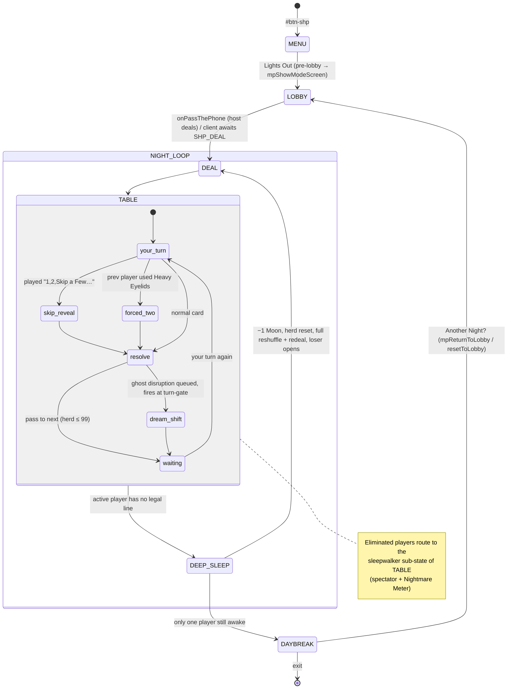

# New Game Technical Spec — Counting Sheep
**Document type:** Phase 2 — Technical Specification
**Status:** DRAFT — awaiting project-owner confirmation before implementation begins
**Source brief:** `docs/new-ideas/new-game-brief-counting-sheep.md` (Stage 1 gate cleared)
**Reference implementation throughout:** Fruit Salad (`frt`) — MDLM-only, host-as-participant, fixed-deck render seam, 2D-array Firebase guard. PASS (`pass`) for hidden-hand card-game patterns.

> **Update (2026-06-23):** Sylly Mode (Night Terrors) is now **in scope for v1** at the project owner's direction, and the Sleepwalker ghost system has been reworked — **Pasture-triggered meter** (not per-turn) + a **facedown Nightmare Lottery** (3-of-5, flip one blind). Design steer: fun + slight chaos over tactical depth. See §6 (ghost rules), §10 (`SHP_NIGHTMARES`), §11 (MP flow), §12 (Night Terrors).

---

## Consistency Audit (complete before filling any other section)

| Check | Finding |
|-------|---------|
| Terminology collisions vs the 14 games | **Clear.** "The Herd / The Flock / Your Pen / The Pasture / The Pillows / The Alarms / The Traps / Deep Sleep / Sleepwalker / Moons / Night / Daybreak" — none collide with any existing game's vocabulary in `game-identities.md`. ("Wolf" appears only as a card name, not a role/screen.) |
| Brand colour `pill-active-*` exists? | **No `pill-active-shp`.** But the brand is **indigo**, a *native Tailwind palette* — unlike GTH sage / FRT banana / DYB ocean-blue (all non-Tailwind hexes needing inline styles). CTAs/toggles can use Tailwind `bg-indigo-600 hover:bg-indigo-700` directly. Only the three standard custom classes must be added to `css/styles.css`: `pill-active-indigo`, `game-toggle-on-indigo`, `shp-range`. Less custom work than the last three games, not more. |
| Abbreviation conflict? | **Clear.** `shp` not in the 14-prefix list (li5, gm, ss, jec, ygi, lttp, nat, dsd, gth, dyb, bld, pass, nt, frt). |
| Screen ID conflict in `allScreens[]`? | **Clear.** No `screen-shp-*` exists. |
| New data file needed, or reuse `words.json`/`ygi-data.json`? | **Neither.** No words. Fixed in-plugin constant `SHP_CARDS` (the FRT_FRUITS pattern). No `data/shp-data.json`. |
| Reusable engine fns / shared library modules? | `shuffle()` ✅ (deck build/reshuffle). `cards.js` ❌ — it builds **poker rank/suit** faces; Counting Sheep is a custom suit-less deck → build a `shpRenderCard(cardId, opts)` seam instead (FRT `frtRenderCard`). `showWhoFirst()` ❌ — not a two-team game; the opener is the Deep-Sleep loser (or random at game start). `normaliseWord()` ❌ — no text input. `CanvasDraw` ❌. Pass-gate pattern ❌ — MDLM, each player owns a device. |

**Flags:** None blocking. One cosmetic confirm (exact indigo shade — §16 Q1).

---

## §1 — Identity

| Field | Value |
|-------|-------|
| Full name | Counting Sheep |
| Short ID / abbreviation | `shp` |
| Plugin file | `js/games/shp.js` |
| Brand colour | **Moonlit indigo** — `indigo-600` primary, `indigo-900` (midnight) for depth, `stone-50`/cream accents. Native Tailwind, no inline hex required for CTAs. |
| Active pill class | `pill-active-indigo` — **add to `css/styles.css`** (does not exist) |
| Toggle ON class | `game-toggle-on-indigo` — **add to `css/styles.css`**; map `'shp' → 'game-toggle-on-indigo'` in `getMuteToggleOnClass()` |
| Slider range class | `shp-range` (gradient `indigo-200 → indigo-700`) — **add to `css/styles.css`**; map `'shp' → 'shp-range'` in `updateSliderTheme()` |
| Lobby button ID | `#btn-shp` |
| Play CTA label | **"Lights Out"** *(game-voiced; alternatives: "Start Counting", "Tuck In" — but "Tuck In?" is the quit heading, avoid collision)* |
| Menu tagline | "Stay awake. Pass the herd." |

---

## §2 — State Flow



*Night Terrors (§12) adds an oscillating **Climb ⇄ Plunge** mode toggled within `screen-shp-table` — no new screen; the Plunge is a crimson re-skin + inverted card faces.*

**Sub-states within `screen-shp-table`** (one screen carries all of these — FRT precedent of a single play screen):

| Sub-state | Driven by | What the device shows |
|-----------|-----------|----------------------|
| `your-turn` | `shpActivePlayer === mpMyPlayerIdx` & alive | Herd + fence, your Pen tappable, legal cards highlighted |
| `forced-two` | active & `shpForcedCards === 2` | Same, but must select **two** cards (Heavy Eyelids) |
| `skip-reveal` | inline after a "1,2,Skip a Few…" play | Card flips to reveal the rolled value, herd ticks |
| `waiting` | alive, not active | Spectator board (Herd, direction, whose turn, Moon counts) — Pen shown face-up to self, non-interactive |
| `deep-sleep` | a player just crashed | Inline crash banner ("😴 [name] drifts off — −1 Moon"), herd visibly resets, tap-to-continue |
| `sleepwalker` | `shpEliminated[mpMyPlayerIdx]` | Spectator board + shared Nightmare Meter; when the rotation hands *this* device the spend-right, the **Nightmare Lottery** (3 face-down cards — flip one) appears |
| `dream-shift` | inline when a ghost disruption resolves at a turn-gate | Lightweight "the dream shifts 🌙" banner naming the effect |
| `plunge` (Night Terrors) | `shpPhase === 'plunge'` | Crimson re-skin of any of the above; inverted card faces; falling-ceiling readout beside the Herd |

**Pass-the-phone gate points:** **None.** MDLM, each player on their own device; hands never change hands. No `screen-shp-pass-gate`.

**`showWhoFirst()` usage:** None (not a two-team game).

**Screen layout pattern decision:**

| Screen ID | Layout pattern | Reason |
|-----------|---------------|--------|
| `screen-shp-menu` | `min-h`-content centred (NO `min-h-screen`) | Standard menu; `absolute top-4 right-4` sound button |
| `screen-shp-table` | **`h-screen` sticky-footer** | The Pen (hand) lives in a persistent bottom action zone that must stay visible regardless of the central animation height. Header (Herd label + speaker/✕/[?]) / body (Herd number + fence animation, scrolls if needed) / footer (the Pen + play controls). |
| `screen-shp-gameover` | `min-h-screen` centred (NAT pattern) | Final standings flow naturally; button below content |

---

## §3 — Screen Registry

| Screen ID | Purpose | Notes |
|-----------|---------|-------|
| `screen-shp-menu` | Main hub — Lights Out, How to Play, Settings, ← Back to the Box | |
| `screen-shp-table` | All play sub-states (see §2 table) incl. sleepwalker spectator | Single play screen, FRT pattern |
| `screen-shp-gameover` | Daybreak ☀️ — winner, reverse-elimination standings, Another Night? | |

**Total new screens:** **3** — add all three to `allScreens[]` in `engine.js`.
**No setup screen** — MDLM, names come from `mpPlayerSlots` (FRT precedent). **No deal interstitial screen** in v1 — the deal is an inline transition into `screen-shp-table` (an animated deal screen is a deferred polish item, matching FRT's static `screen-frt-deal` placeholder choice).
**Shared MP screens reused:** `screen-mp-mode`, `screen-mp-lobby-host`, `screen-mp-lobby-join`.

---

## §4 — State Variables

All `shp` prefix.

```javascript
// ── Settings (persist between play-agains) ─────────────────────────────────
let shpHandSize     = 4;      // 3 | 4 | 5  (per-player Pen cap, before any Wolf shrink)
let shpMoons        = 3;      // 3 | 5 | 7  (starting lives)
let shpDreamAccel   = true;   // bool — number cards double while Herd < 50
let shpSleepwalkers = true;   // bool — ghost-disruption system on/off
let shpSyllyMode    = false;  // Night Terrors — oscillating Climb ⇄ Plunge (§12); SHIPS in v1

// ── Roster (set at deal from lobby, persists across play-agains) ────────────
let shpPlayerCount  = 0;
let shpPlayerNames  = [];

// ── Match state (reset each Night / each play-again as noted) ───────────────
let shpHerd         = 0;      // running count
let shpCeiling      = 99;     // legal bust boundary. ALWAYS 99 in v1 — never changes. Night Terrors
                              // (§12) descends it. Forward-compat seam #1: every bust/legal-line check
                              // MUST compare against shpCeiling, never a literal 99.
let shpDirection    = 1;      // 1 = forward, -1 = reversed (Toss & Turn / Cold Feet)
let shpLives        = [];     // Moons per player (match-life; play-again resets)
let shpEliminated   = [];     // bool per player (Sleepwalker once true)
let shpElimOrder    = [];     // player indices in order of permanent Deep Sleep
let shpActivePlayer = 0;      // whose turn
let shpOpenerIdx    = 0;      // who opens the current Night (Deep-Sleep loser, or random at start)

// ── Deck (host-authoritative; clients hold masked views) ───────────────────
let shpFlock        = [];     // draw pile — array of card-type ids
let shpDiscard      = [];     // played-card pile (reshuffled into Flock on exhaustion)
let shpHands        = [];     // 2D — card-type ids per player (own hand real; others masked count)
let shpHandCap      = [];     // per-player Pen cap (drops 4→3 while a Wolf is active)
let shpWolfActive   = [];     // bool per player — true while a Big Bad Wolf slot is shut

// ── Turn state (reset each turn) ───────────────────────────────────────────
let shpForcedCards  = 1;      // 1, or 2 for the player hit by Heavy Eyelids OR the Sleep Paralysis nightmare
let shpPendingSkip  = null;   // revealed "1,2,Skip a Few…" value awaiting commit-animation
// (No fog state — the Fog nightmare swaps a Fogged Dream card, id 13, straight into the target's hand array.)

// ── Ghost / Nightmare Meter (v1 core, behind shpSleepwalkers) ──────────────
let shpMeter        = 0;      // charge (notches). Charges +1 per PASTURE card resolved — NOT per turn.
                              // (per-turn fill repeatedly hammers the same seat at low player counts — notes fix).
                              // Only charges once shpElimOrder.length >= 1 (no Sleepwalkers → no nightmares).
let shpMeterFill    = 3;      // notches to fill — PLAYTEST DIAL (band 3–4)
let shpGhostTurnIdx = 0;      // rotation pointer into shpElimOrder for the next spend-right
let shpSpendHolder  = -1;     // Sleepwalker idx currently holding the spend-right (-1 = none)
let shpGhostOptions = [];     // the 3 face-down nightmare ids offered to the spend-holder (Nightmare Lottery)
let shpPendingDisrupt = null; // { nightmareId, byIdx } buffered to fire at the next turn-gate
let shpEcho         = 0;      // Global Echo modifier: 0 or 2 (extra sheep per Pasture; sign follows phase).
                              // Set by the Global Echo nightmare; cleared when the NEXT disruption fires.

// ── Night Terrors / Plunge (v1 — SHIPPED, behind shpSyllyMode) ─────────────
let shpPhase        = 'climb';// 'climb' | 'plunge'
let shpPlungeGrace  = 0;      // grace turns remaining at Plunge open (1 full cycle = shpPlayerCount)
let shpDrop         = 7;      // ceiling fall per turn in the Plunge — PLAYTEST DIAL (band 6–8)
// shpCeiling (declared in Match state) is the single bust boundary. Climb: 99. Plunge: descends by shpDrop
// from the OVERFLOW total — on entering the Plunge, shpCeiling = shpHerd (the exact total, not a hard 99).

// ── UI / animation ─────────────────────────────────────────────────────────
let shpAnimTimer    = null;   // setTimeout handle for inline reveal/crash animations
```

**Derived at runtime (never stored):**
- `shpAliveCount()` = players where `!shpEliminated[i]`
- `shpLeaderIdx()` = alive player with the most `shpLives` (Wide Awake target; tie → next in `shpDirection`)
- `shpLegalCards(playerIdx)` = hand cards (or 2-card combos when `shpForcedCards === 2`) that keep `shpHerd ≤ shpCeiling` (compare the variable, not a literal 99 — seam #1, §12)
- card behaviour fields — read from the `SHP_CARDS` constant, never copied into state

---

## §5 — Settings

**Settings overlay title block:**
- Heading: **"Bedtime Routine 🌙"**
- Subtitle: "Set the scene before lights out."

| Setting (display) | Options | Default | Internal variable | Internal values |
|-------------------|---------|---------|------------------|-----------------|
| **Hand Size** *(challenge/depth dial — sits first; this game's velocity dial in place of a word-difficulty tier)* | 3 / 4 / 5 | **4** | `shpHandSize` | int |
| **Moons** | 3 / 5 / 7 | **3** | `shpMoons` | int |
| **Dream Acceleration** | OFF / ON | **ON** | `shpDreamAccel` | bool |
| **Sleepwalkers** | OFF / ON | **ON** | `shpSleepwalkers` | bool |
| ✨ **Sylly Mode (Night Terrors)** | OFF / ON | OFF | `shpSyllyMode` | bool — **shipped in v1** (oscillating Climb ⇄ Plunge; see §12) |

**Card descriptions (under each name):**

| Setting | Description text |
|---------|-----------------|
| Hand Size | "How many cards you hold. More cards, more options — and fewer forced crashes." |
| Moons | "Lives. Lose one each time you fall into Deep Sleep. More Moons = a longer, gentler night." |
| Dream Acceleration | "Below 50, every number card counts double. Skips the slow climb and gets to the danger zone fast." |
| Sleepwalkers | "When you're knocked out, you linger as a Sleepwalker and can nudge the dream. Off for a clean elimination." |
| ✨ Sylly Mode | "Night Terrors — reach 99 and the dream inverts: the count plunges, every number flips its sign, and the ceiling falls each turn. Last one awake survives." |

**Difficulty-setting exemption:** Counting Sheep draws no `words.json` pool, so it is exempt from the mandatory word-difficulty tier (logic-engine § *Adding a New Game*, non-word-bank carve-out — same as PASS/DYB/FRT). **Hand Size is the declared velocity/challenge dial** in its place. Note this in the Phase-Gate audit so the absence isn't flagged.

**MDLM setting overrides:** **None.** All five settings (Hand Size, Moons, Dream Acceleration, Sleepwalkers, Sylly Mode/Night Terrors) are valid in MDLM. (No Fast Start exists — it was cut in the brief.)

---

## §6 — Scoring / Win Logic

**No points currency.** Survival is the score; lives are 🌙 Moons.

| Outcome | Who | Effect | Turn end? |
|---------|-----|--------|-----------|
| Active player has **no legal line** (no single card — or no 2-card combo under Heavy Eyelids — keeps Herd ≤ `shpCeiling`) | active player | **Deep Sleep**: −1 Moon; Herd → 0; full reshuffle + fresh redeal; this player opens the next Night | Night ends |
| Player's Moons hit **0** | that player | Becomes a **Sleepwalker** (appended to `shpElimOrder`); routes to the sleepwalker sub-state | — |
| One player remains awake | that player | **Wins** (Daybreak) | game ends |

**Card effects on the Herd** (the scoring math lives in the card resolver `shpApplyCard`):

| Card | Effect on Herd | Dream Acceleration (Herd < 50)? |
|------|---------------|--------------------------------|
| +1 / +2 / +5 / +10 (Pasture) | add value | **doubled** (Pasture only) |
| 1,2,Skip a Few… (Alarm) | add random **+2…+12**, revealed after commit | **not** doubled |
| The Black Sheep (Alarm) | set Herd = 99 | n/a (set, not add) |
| Wide Awake (Alarm) | Herd unchanged; **next turn forced onto the leader** (`shpLeaderIdx()`; tie → next in direction) | n/a |
| Heavy Eyelids (Alarm) | Herd unchanged; next player's `shpForcedCards = 2` | n/a |
| Doze (Pillow) | Herd unchanged; turn ends | n/a |
| Toss & Turn (Pillow) | Herd unchanged; `shpDirection *= -1` | n/a |
| Counting Backwards (Pillow) | Herd − 10, **floored at 0** | **not** doubled |
| Lullaby (Pillow, 1-of) | Herd → 20 | n/a |
| The Big Bad Wolf (Trap) | **never played** — consumed on draw; drawer's `shpHandCap → 3`, `shpWolfActive = true`; slot restored on that player's next Deep Sleep | n/a |

**Tie-break:** No simultaneous elimination is possible (one card resolves at a time), so final standings = **reverse `shpElimOrder`** (last eliminated = runner-up). Winner is the sole survivor.

**Zero-sum check:** Pure survival; balanced by design. The only "free" plays (Pillows: Doze/reverse/subtract/reset) mean a player holding any non-adder can essentially never be forced to crash — so Deep Sleep happens to **all-adder hands at a high Herd**, which is the intended O'NO-99 tension. Bust frequency is tuned by Hand Size and deck ratios (§10).

**Resolver entry points:** `shpApplyCard(playerIdx, handIdx)` (single), `shpApplyTwoCard(playerIdx, idxA, idxB)` (Heavy Eyelids), `shpCheckDeepSleep(playerIdx)` (called before accepting input — if `shpLegalCards()` is empty, route to Deep Sleep instead of awaiting a tap).

**Night Terrors note:** the bust semantics above are the **base game** (Sylly OFF — standard O'NO-99: exceeding `shpCeiling` = Deep Sleep). When `shpSyllyMode` is ON the Climb does NOT bust (reaching ≥99 triggers the Plunge); the only bust lives in the Plunge (can't stay under the falling ceiling). See §12.

### Sleepwalker / Nightmare Meter — ghost system (v1 core, behind `shpSleepwalkers`)
Eliminated players (0 Moons) become **Sleepwalkers** and gain agency over the dream — the afterlife mechanic that keeps knocked-out players at the table.

**Meter charge — Pasture-triggered (notes fix, not per-turn):** the Nightmare Meter gains +1 each time any player resolves a **Pasture** card, and only once at least one Sleepwalker exists (`shpElimOrder.length >= 1`). Per-turn fill was rejected — at 3 players a fill-every-3 clock repeatedly hammers the same seat. Pasture-triggered fill is a variable, player-driven interval that lands on a random seat on average, and it injects a defensive choice: playing your `+10` near a full meter deliberately hands the active Sleepwalker a free disruption.

**Nightmare Lottery — facedown random (notes fix, not a menu):** when the meter hits `shpMeterFill`, the next Sleepwalker in rotation (`shpGhostTurnIdx` over `shpElimOrder`) is dealt **three face-down** cards drawn at random from `SHP_NIGHTMARES` (§10). They flip **one** blind; it resolves at the next turn-gate. No menu = no analysis paralysis, instant tactile excitement, blame offloaded from the ghost player onto the draw. Meter → 0; rotation advances.

**The five nightmares** (see `SHP_NIGHTMARES`, §10):
| Nightmare | Effect | Reuses |
|-----------|--------|--------|
| Cold Feet 🥶 | +1..+4 sheep to the Herd (−1..−4 during the Plunge) | `shpHerd` adjust |
| Restless Leg 🦵 | reverse direction **or** skip the next player (host coin-flip) | `shpDirection` / skip |
| Fog 🌫️ **(rare)** | swaps one of a random living player's **Pasture** cards for a face-down **Fogged Dream** (id 13 — a hidden random +2..+12). Persists in their hand until they play it or a Deep Sleep redeal clears it; they choose *when* to gamble it, but lost a controllable card to the swap | `SHP_CARDS[13]`, cursed render |
| Sleep Paralysis 😶 | the next active player is forced to play a **two-card** line (can't → Deep Sleep) | `shpForcedCards = 2` (Heavy Eyelids) |
| Global Echo 🔊 | every Pasture card played by anyone gains **+2** (−2 in the Plunge) until the **next** disruption fires | `shpEcho` |

- **Weighted draw** (`weight` field on `SHP_NIGHTMARES`): Cold Feet / Restless Leg common (3), Sleep Paralysis / Global Echo medium (2), **Fog rare (1)** — so the cursed-card swap surfaces least often. The 3 offered cards are sampled distinct by weight.
- **Pre-elimination:** the meter does not charge until the first Sleepwalker exists — no Sleepwalkers, no nightmares (avoids an ownerless disruption).
- **Design intent (owner steer):** fun + slight chaos over tactical depth. The blind lottery, the random nudge range, and the persistent Echo all bias toward surprise over calculation.
- **Card-lock removed:** the old `shpLockedCard` "Sleep Paralysis lock" is dropped — the cursed-card-swap Fog replaces it as the interference nightmare. No per-turn fog state: the Fogged Dream lives in the hand array (id 13).

---

## §7 — Validation Rules

| Input | Block condition | Behaviour | Animation |
|-------|----------------|-----------|-----------|
| Tap a Pasture/adder card | the resulting Herd would exceed `shpCeiling` (99 in v1) **and** the player holds at least one legal alternative | reject tap; card stays | shake the tapped card: `el.classList.remove('shp-shake'); void el.offsetWidth; el.classList.add('shp-shake');` |
| Tap a **Fogged Dream** (id 13, from the Fog nightmare) | none — its value is a hidden random-add, so it bypasses the bust pre-check | host rolls +2..+12 on commit and resolves at that value; if it busts → Deep Sleep (the gamble). Other cards keep normal bust protection. | flip the cursed card to reveal the rolled value, then resolve |
| Forced two-card (Heavy Eyelids) | fewer than 2 selectable cards, or no 2-combo keeps Herd ≤ 99 | **auto Deep Sleep** (no manual bust) | crash banner |
| No legal line at all | `shpLegalCards()` empty on turn entry | **auto Deep Sleep** — never awaits a tap | crash banner |

**Forced-play rule:** a player who *has* a legal line **must** play one (can't choose to crash) — enforced by only ever offering legal cards as tappable; illegal cards are visibly dimmed but the player still chooses *which* legal card.

**Heavy Eyelids edge cases (locked decisions for the resolver):**
- (a) Next player holds only one card → they play that one card only; the "two-card" requirement degrades to "play all you can" (cannot conjure a second card).
- (b) A non-adder (Doze/reverse/subtract/reset) **counts as one of the two**. A two-card line of e.g. Doze + Counting Backwards is legal and safe.
- (c) Heavy Eyelids played *as one of the forced two* **does not chain** — the count is consumed this turn; it does not stack a third card onto the following player. (Confirm in §16 if owner wants chaining.)

**Big Bad Wolf draw timing:** the Wolf is detected in the **draw-back-up** step (`shpDrawUp`), not as a hand card. On draw: consume it (push to discard, never to hand), set `shpHandCap[idx] = 3` + `shpWolfActive[idx] = true`, render the sleeping-wolf slot, and **stop drawing** — because it replaced a normal draw, the player simply ends at 3 cards (no forced discard). Restore (`shpHandCap → shpHandSize`, `shpWolfActive = false`) on that player's next Deep Sleep redeal.

**No `normaliseWord()` / no fuzzy matcher** — no text input anywhere.

---

## §8 — Overlay Registry

| Overlay ID | Pattern | z-index | Trigger | Copy |
|------------|---------|---------|---------|------|
| `shp-settings-overlay` | Data slide-up | z-[80] | `#btn-shp-menu-settings` | "Bedtime Routine 🌙" |
| `shp-how-to-overlay` | Data slide-up | z-[90] | `#btn-shp-menu-how-to` | "How to Play 🐑" |
| `shp-quit-overlay` | Decision modal | z-[80] | `.btn-shp-quit-open` | see below |
| `shp-new-night-overlay` | Decision modal | z-[90] | `#btn-shp-go-again` (Daybreak) | see below |
| `shp-tip-overlay` | Decision modal | z-[90] | inline `[?]` buttons → `shpShowTip(emoji, heading, lines[])` | shared — ≥3 tip points (Dream Acceleration, the 99 rule, Heavy Eyelids, the Wolf, the Nightmare Meter) |

**Quit overlay copy** ("Tuck In?"):
- Emoji 🛏️ · Heading **"Tuck In?"** · Subtext "Give in to sleep now and you're out for the night." · Confirm **"Yeah, lights out."** · Cancel **"Stay awake!"**

**Play-again copy** ("Another Night?"):
- Emoji 🌙 · Heading **"Another Night?"** · Subtext "Fresh Flock, full Moons, everyone wakes up." · Confirm (single) **"Count Again 🐑"** · dynamic MP labels (host "Restart in Lobby 🔄" / client "Leave Session") · Cancel "Stay here"

**Exact inner div strings (verbatim):**
- Data slide-up: `<div class="overlay-data-inner settings-slide-up bg-stone-50 w-full max-w-sm rounded-t-3xl flex flex-col">`
- Decision modal: `<div class="overlay-modal-inner bg-stone-50 w-full max-w-sm rounded-3xl px-6 pt-6 pb-8 flex flex-col gap-4 text-center border border-indigo-300">`

All five overlays hidden in `resetToLobby()` (§13).

---

## §9 — Audio Map

| Moment | Function |
|--------|----------|
| Lights Out / play-card big CTA | `playLaunch()` |
| Each Herd climb tick (sheep clears the fence) | `playTick()` |
| Skip / reverse (Doze / Toss & Turn) | `playWhoosh()` |
| Counting Backwards / Lullaby (relief drop) | `playResume()` |
| Survive a tight spot / Black Sheep slam | `playSuccess()` |
| **Deep Sleep** (crash) | `playBoing()` *(cartoon descending — reads as "drifting off"; acceptable without new audio)* |
| Nightmare Meter fills / ghost disruption resolves | `playPillClick()` *(soft notch)* — confirm in play; candidate for a dedicated tone later |
| Settings pill / toggle | `playPillClick()` / `playSyllyOn()`+`playSyllyOff()` (Sylly toggle — live) |
| Enter the Plunge (Night Terrors) | `playBoing()` then `playAlarm()` *(crash-into-inversion sting; existing catalogue, no new audio)* |
| Close/confirm overlay | `playDone()` |
| Quit / end-game destructive confirm | `playExit()` |

**No `[NEW AUDIO NEEDED]`** for v1 — existing catalogue covers every moment. (A bespoke "Deep Sleep" lullaby tone is a nice-to-have, deferred.)

---

## §10 — Data & Render Seam

**Source:** no `words.json`, no new data file. A fixed in-plugin constant `SHP_CARDS` (the `FRT_FRUITS` pattern), plus a deck-count map.

**`SHP_CARDS` schema** (stable integer ids — packets and logic deal only in ids):
```javascript
// id, family, label, emoji, kind, value
const SHP_CARDS = [
  { id:0, family:'pasture', label:'+1',  emoji:'🐑', kind:'add',        value:1  },
  { id:1, family:'pasture', label:'+2',  emoji:'🐑', kind:'add',        value:2  },
  { id:2, family:'pasture', label:'+5',  emoji:'🐑', kind:'add',        value:5  },
  { id:3, family:'pasture', label:'+10', emoji:'🐑', kind:'add',        value:10 },
  { id:4, family:'pillow',  label:'Doze',              emoji:'😴', kind:'skip'    },
  { id:5, family:'pillow',  label:'Toss & Turn',       emoji:'🔄', kind:'reverse' },
  { id:6, family:'pillow',  label:'Counting Backwards',emoji:'⏪', kind:'subtract', value:10 },
  { id:7, family:'pillow',  label:'Lullaby',           emoji:'🎵', kind:'reset',    value:20 },
  { id:8, family:'alarm',   label:'1, 2, Skip a Few…', emoji:'💤', kind:'random-add', min:2, max:12 },
  { id:9, family:'alarm',   label:'The Black Sheep',   emoji:'🐏', kind:'set',     value:99 },
  { id:10,family:'alarm',   label:'Wide Awake',        emoji:'⏰', kind:'wake-leader' },
  { id:11,family:'alarm',   label:'Heavy Eyelids',     emoji:'🥱', kind:'two-card' },
  { id:12,family:'trap',    label:'The Big Bad Wolf',  emoji:'🐺', kind:'trap-shrink' },
  { id:13,family:'phantom', label:'Fogged Dream',      emoji:'🌫️', kind:'random-add', min:2, max:12 },
  // ↑ NOT in the starting deck — conjured only by the Fog nightmare (swaps in for a target's Pasture card).
  //   Renders a face-down CURSED face to everyone incl. its owner (value hidden until played).
  //   Dissolves when played or on any redeal — never reshuffled into the Flock (deck integrity).
];
```

**Deck build — `SHP_DECK_COUNTS`** (locked v1 starting blueprint, brief §9, ~60 cards, ~67% numbers; tunable):
```javascript
const SHP_DECK_COUNTS = {
  0:10, 1:10, 2:10, 3:10,   // Pasture +1/+2/+5/+10
  4:4,  5:4,  6:3,  7:1,     // Doze / Toss & Turn / Counting Backwards / Lullaby (legendary 1-of)
  8:3,  9:2,  10:2, 11:1,    // Skip a Few / Black Sheep / Wide Awake / Heavy Eyelids
  12:2,                      // Big Bad Wolf trap
};
// shpBuildFlock() expands counts → flat id array → shuffle()  (FRT frtBuildDeck pattern)
```

**Reshuffle (locked, brief §9):**
- Flock empties mid-Night → `shpReshuffleDiscard()`: shuffle `shpDiscard` into `shpFlock`, clear discard.
- Deep Sleep → `shpRedeal()`: gather all hands + discard + Flock into one pile, `shuffle()`, deal fresh `shpHandSize` to each *living* player; Wolf-shrunk caps restored.

**Nightmare deck — `SHP_NIGHTMARES`** (the facedown Lottery pool; ghost system, §6/§11). Five outcomes; on each meter-fill the host draws **3 distinct at random**, the spend-holder flips **one** blind:
```javascript
const SHP_NIGHTMARES = [
  { id:0, label:'Cold Feet',      emoji:'🥶', kind:'nudge', weight:3 }, // +1..+4 Herd (−1..−4 during the Plunge)
  { id:1, label:'Restless Leg',   emoji:'🦵', kind:'shift', weight:3 }, // reverse direction OR skip the next player (host coin-flip)
  { id:2, label:'Fog',            emoji:'🌫️', kind:'fog',   weight:1 }, // RARE — swap a target's Pasture for a face-down Fogged Dream (id 13)
  { id:3, label:'Sleep Paralysis',emoji:'😶', kind:'heavy', weight:2 }, // next active player → forced two-card (reuses Heavy Eyelids)
  { id:4, label:'Global Echo',    emoji:'🔊', kind:'echo',  weight:2 }, // shpEcho = 2 until the next disruption fires
];
// shpDrawNightmares() → weighted-sample 3 DISTINCT ids (weights above; Fog rarest). Blind pick: the other two discarded unseen.
```

**Render seam — `shpRenderCard(cardId, opts)`** (the `frtRenderCard` asset-pack seam; honours the Asset-Pack memory):
- Returns a card-face DOM node from `SHP_CARDS[cardId]`. `opts.faceDown` → moonlit card-back. `opts.wolf` → the sleeping-wolf blocked slot. `opts.inverted` → flipped (sign-reversed) value for the Plunge (§12). The **Fogged Dream** (id 13) renders its own cursed face-down face *by card id* — no opt needed.
- All card DOM in the game flows through this one function. The v1 "skin" is emoji + label; a future image pack changes only this function's body — zero packet/logic churn.

**Sheep-and-fence animation:** a single inline SVG sheep translated over a central fence via a **CSS keyframe** (cubic-bezier), fired on each card play. No RAF, no sprite sheet, no library (brief §12, PWA-confirmed). Because it's CSS-only there is **no RAF lifecycle** to tear down (contrast NT's `ntRafHandle`); only `shpAnimTimer` (the reveal/crash `setTimeout`) needs clearing.

**Secret Mode / expansion:** N/A — no word pool. The asset-pack render seam is the forward path, not a `secretWords` substitution. No `shpApplyExpansionOverrides()` needed (note the exemption in the impl notes so the Phase-Gate audit doesn't flag the absence).

---

## §11 — Multiplayer Configuration

| Field | Value |
|-------|-------|
| Mode | **MDLM only** — `multiplayerOnly: true`, `supportedModes: ['mdlm']`, `recommendedMode: 'mdlm'` (FRT/PASS profile) |
| Min / Max players | **3 / 8** (`getMinPlayers → 3`, `getMaxPlayers → 8`) |
| `rosterConfig` | `{ type: 'none' }` — automatic seat assignment (join order) |
| New screens for MP | none — uses shared `screen-mp-mode` / `-lobby-host` / `-lobby-join` |
| Post-lobby routing | `onPassThePhone` (host) → populate `shpPlayerNames` from `mpPlayerSlots.map(p => p.nickname)`, set `shpPlayerCount`, call `shpStartSession()`; (client) → wait for `SHP_DEAL` |
| Menu Play CTA | dual-context branch (logic-engine § Multiplayer-only routing): `syllyMultiplayerMode !== 'single' ? shpStartSession() : mpShowModeScreen('shp')` |

**`MP_GAME_CONFIGS` entry (`shp`):** `gameName:'Counting Sheep'`, `emoji:'🐑'`, `brandBtnClass:'bg-indigo-600 hover:bg-indigo-700 text-white'`, `ptpLabel`/`lobbyCtaLabel:'Lights Out'`, `menuScreen:'screen-shp-menu'`, `onPassThePhone` (above), `recommendedMode:'mdlm'`, `supportedModes:['mdlm']`, `multiplayerOnly:true`, `rosterConfig:{type:'none'}`, `getMaxPlayers:()=>8`, `getMinPlayers:()=>3`.

**Card privacy — couch-masking model** (FRT/NAT/SS/BLD precedent): `shpHands` is broadcast in `SHP_DEAL`/redeal, but each device renders only `shpHands[mpMyPlayerIdx]`; opponents are face-down counts. True per-device privacy (targeted `/players/{uid}/privateData` writes — PASS's stricter approach) is the deferred upgrade; couch masking is sufficient for a same-room game and consistent with the suite. *(Confirm — §16 Q3.)*

**Host-as-participant:** the host is also a player. Host-originated plays/disruptions run `shpHostProcess*` **directly** — never via a self-sent ACTION (the `originId === syllyDeviceUid` dedup guard drops them). Reference: FRT `frtHostProcessServe` / `frtStartSession`'s `if (client) return;` guard.

**Firebase 2D guard:** `shpHands` is a 2D array → run a `shpNorm2D(raw, n)` (verbatim FRT pattern) over every received `hands` payload (Firebase strips empty/holey sub-arrays). `SHP_DEAL` can omit the (always-empty) discard and reconstruct it client-side.

**No turn timer** in v1 (none in §5) → no wall-clock `endTimestamp` plumbing, no timer lifecycle. (A "Think Before You Sleep" timer is a clean future setting if wanted.)

**Per-phase intercepts:**

| Phase | Single-device | MDLM intercept |
|-------|---------------|----------------|
| Deal / new Night | host builds Flock, deals, sets opener | host broadcasts `SHP_DEAL` (hands, herd 0, activePlayer, lives, direction, handCaps, night/round meta) |
| Play a card | resolve locally | client → `ACTION SHP_PLAY {handIdx}` or `{idxA, idxB}`; host validates, resolves, draws-up, broadcasts `SHP_TURN_RESULT` (herd, played card, direction, nextActive, the player's new hand, meter notch, cleared locks, any Wolf shrink) |
| Skip-a-Few reveal | inline | rolled value travels inside `SHP_TURN_RESULT` (host rolls — no client RNG divergence) |
| Deep Sleep | local | host detects no-legal-line, broadcasts `SHP_DEEP_SLEEP` (crasher, new lives, herd 0, fresh hands, opener, any new Sleepwalker + `shpElimOrder`) |
| Meter charges | local | host adds +1 when a **Pasture** card resolves (only once ≥1 Sleepwalker exists); rides in `SHP_TURN_RESULT.meter`. NOT per-turn. |
| Meter fills (Nightmare Lottery) | local | on fill, host assigns `shpSpendHolder` via `shpGhostTurnIdx` over `shpElimOrder`, draws 3 random ids from `SHP_NIGHTMARES`, broadcasts `SHP_GHOST_READY {holderIdx, optionIds:[3]}` |
| Ghost disruption | local | only the `shpSpendHolder` device may submit `ACTION SHP_DISRUPT {choice:0|1|2}`; host resolves the flipped nightmare, buffers it, fires at the next turn-gate, broadcasts `SHP_DISRUPT_RESOLVED {nightmareId, targetIdx, detail}`; meter → 0; rotation advances; any prior `shpEcho` clears as this fires |
| Enter / exit Plunge (Night Terrors) | local | host detects Herd ≥ 99 in Climb → `shpCeiling = shpHerd` (overflow runway), `shpPhase='plunge'`; or first bust in Plunge → revert. Broadcasts `SHP_PHASE_CHANGE {phase, ceiling, drop, grace}`; per-turn ceiling descent rides in each `SHP_TURN_RESULT` |
| Game over | local | host broadcasts `SHP_GAMEOVER {winnerIdx, standings}` |
| Mid-game quit | n/a | **PASS contract:** host quit → `resetToLobby()` (`HOST_END_GAME`); client quit → `ACTION SHP_PLAYER_LEFT` then `resetToLobby()`; host broadcasts `SHP_MATCH_DISSOLVED` → all `resetToLobby()` |

**Key ACTION packets:** `SHP_PLAY`, `SHP_DISRUPT`, `SHP_PLAYER_LEFT`.
**Key SYNC packets:** `SHP_DEAL`, `SHP_TURN_RESULT`, `SHP_DEEP_SLEEP`, `SHP_GHOST_READY`, `SHP_DISRUPT_RESOLVED`, `SHP_PHASE_CHANGE`, `SHP_GAMEOVER`, `SHP_MATCH_DISSOLVED`.

**Missing-handler audit (secondary phases — logic-engine requirement):** the phases beyond the core play loop are **Deep Sleep**, **ghost disruption**, **Plunge enter/exit**, and **gameover**. Only the ghost-disruption phase accepts a non-host submission (`SHP_DISRUPT {choice}`, from exactly one device, the spend-holder) → one handler, host-gated. Deep Sleep, Plunge transitions, and gameover are all host-detected/host-broadcast, no client ACTION (the Plunge descent is entirely host-side — players still only play cards). No simultaneous-submit `readyCheck` matrix exists anywhere (turns are sequential; the ghost rotation is single-submitter) — so there is no abandoned-readyCheck trap.

**`SETTINGS_SYNC`:** `mpSerialiseSettings` entry must carry `shpHandSize`, `shpMoons`, `shpDreamAccel`, `shpSleepwalkers`, and `shpSyllyMode` (all five live in v1).

---

## §12 — Sylly Mode Technical Spec — Night Terrors (SHIPS IN v1)

**Status (updated 2026-06-23):** **Night Terrors now ships in v1** at the project owner's direction. The architecture below is unchanged from the deferred blueprint — the three forward-compatibility seams are now **hard build requirements**, not future-proofing — with one mechanical addition: the **Plunge overflow runway** (the triggering card anchors the ceiling, see below). The arithmetic inversion + two-phase legal-line branch is the single riskiest part of the game: **build the base Climb loop first (Protocol B), verify it, THEN layer the Plunge** (§15 sequences it last). `shpDrop`, grace length, and the overflow-runway feel are **playtest dials** — they ship on the defaults below and get tuned in play, not before.

**Internal variable:** `shpSyllyMode = false` (settings; later read by the phase engine).

### The governing equation (why the descent is tuned the way it is)
Let `margin = shpCeiling − shpHerd`. Each Plunge turn the ceiling drops by `shpDrop` (**D**) and the player subtracts **S**. **margin changes by (S − D).** Survival needs a card with `S ≥ D − margin`. Therefore:
- `D ≤ 5` → players outrun the ceiling → stall (boring stroll).
- `D ≥ 10` (= the peak card) → "hold a −10 or die" draw-luck guillotine, *and* a −10-fed table treads water to 0 with no eliminations (stall returns).
- **`D ≈ 6–8`** → big cards buy 2–3 turns, then **deck attrition** (the deck has only ten 10s / ten 5s) leaves a player on small cards unable to keep up → swallowed. **The drop is an anti-stall floor; the depleting deck is the executioner.**

### Phase model — oscillating Climb ⇄ Plunge (Model A)

| | Climb | Plunge |
|---|---|---|
| `shpPhase` | `'climb'` | `'plunge'` |
| Boundary | `shpCeiling` = 99 (but the triggering card may overflow above it) | `shpCeiling` descends `shpDrop` per turn from the **overflow total** |
| Card arithmetic | normal | sign-flipped (arithmetic cards only — see below) |
| Eliminates? | no (tug-of-war; the adder-majority deck forces the Herd up) | yes (attrition under the falling ceiling) |
| Ends when | Herd reaches **≥99** → enter Plunge (`shpCeiling = shpHerd`, the overflow runway) | **first bust** → revert to Climb (**Herd-0 = mercy backstop**, no Moon lost) |

### State (now declared in §4 core — listed here for the phase model)
```javascript
let shpPhase       = 'climb';  // 'climb' | 'plunge'
let shpPlungeGrace = 0;        // grace turns left at Plunge open (1 cycle = shpPlayerCount turns)
let shpDrop        = 7;        // ceiling fall per turn in the Plunge — PLAYTEST DIAL (band 6–8)
// shpCeiling already exists in the v1 core state (§4) — Night Terrors only moves it (and anchors it to the overflow total on entry).
```

### Card sign-flip (the inversion)
During `shpPhase === 'plunge'`, `shpApplyCard` multiplies the effect by **−1 only for** `kind ∈ {'add','subtract','random-add'}` (Pasture, Counting Backwards, Skip-a-Few). `kind ∈ {'set','skip','reverse','wake-leader','two-card','trap-shrink'}` are **unchanged** — Black Sheep still sets 99 (now an aggressive slam into the falling ceiling), Lullaby still sets 20. One-line multiplier, because behaviour lives as data in `SHP_CARDS` (`kind`+`value`).

### Trigger + flow
1. Climb: a card pushes the Herd to **≥ 99** → `shpEnterPlunge()`: **overflow runway** — `shpCeiling = shpHerd` (the exact total the card landed on: a +10 from 94 opens at 104; a +1 snare from 98 opens at exactly 99, margin 0; Black Sheep sets 99 → opens at 99), `shpPhase='plunge'`, `shpPlungeGrace = shpPlayerCount` (one full cycle), crimson UI state, "💤 THE PLUNGE BEGINS" interstitial, re-render all hands inverted. **In Climb, reaching ≥99 is therefore NOT a bust — it is the phase trigger;** the only bust lives in the Plunge.
2. Each Plunge turn entry: if `shpPlungeGrace > 0` → decrement and **hold** the ceiling; else `shpCeiling -= shpDrop`.
3. Legal-line check uses `shpCeiling` (not 99): legal if a play keeps `shpHerd ≤ shpCeiling`. No legal line → **base-game Deep Sleep handler** (−1 Moon, reset, redeal, buster opens) → `shpExitPlunge()` (`shpPhase='climb'`, `shpCeiling=99`, un-invert).
4. **Mercy backstop:** if `shpHerd` reaches 0 during the Plunge with no bust → `shpExitPlunge()` with **no** Moon lost.

**Overflow runway — the tactical dichotomy (why it earns its place):** anchoring the ceiling to the exact overflow total turns the binary "hit 99" transition into a risk-reward choice on the triggering card.
- **The Selfish Snare (+1 from 98):** opens the Plunge at `shpCeiling = shpHerd = 99`, margin 0. The grace cycle passes, then the next player faces a full `shpDrop` (~−7) on a zero-margin floor — a precision strike to choke whoever is next in line.
- **The Co-op Runway (+10 from 94):** opens at 104. Because the Plunge naturally ends only when the Herd is driven all the way down (or someone busts), the higher anchor lengthens the descent — a shared buffer that keeps the table alive longer but forces a grinding war of attrition that tests everyone's hand depth.
- Black Sheep (sets 99) is the cheapest snare; a heavy Pasture card is the runway lever.

### Forward-compatibility seams the v1 CORE BUILD MUST honour
These cost nothing in v1 and make Night Terrors a drop-in, not a refactor:
1. **`shpCeiling` variable, never a literal `99`.** Every bust/legal-line check in the core (`shpLegalCards`, `shpCheckDeepSleep`) compares against `shpCeiling` (initialised 99). Then the Plunge just moves the variable. *(Added to §4 + §7.)*
2. **`opts.inverted` on `shpRenderCard`.** The render seam (§10) accepts it from day one (no-op in v1) so the Plunge flips card faces with zero churn — a "+10" face literally reads "−10".
3. **Card behaviour stays data in `SHP_CARDS`** (`kind`+`value`, already specced) so the inversion is a single sign multiplier, not per-card special-casing.

### UI
Crimson global re-skin while `shpPhase==='plunge'` (toggle a `shp-plunge` class — indigo → crimson); `shpCeiling` shown as a falling readout beside the central Herd; cards re-rendered via `shpRenderCard(cardId, {inverted:true})`. One full-screen "💤 THE PLUNGE BEGINS" flash on entry. (The crimson state is the critical clarity affordance — arithmetic inversion is the most misplay-prone change possible; the colour shift **plus** literal flipped card faces are both required, not optional.)

### Multiplayer
`shpPhase`, `shpCeiling`, `shpDrop` are host-authoritative and ride in `SHP_TURN_RESULT` plus a dedicated `SHP_PHASE_CHANGE` SYNC (enter/exit Plunge); clients render the crimson state + inverted faces from the broadcast. **No new ACTION packets** — players still only play cards; the descent is entirely host-side. `mpSerialiseSettings.shp` adds `shpSyllyMode`.

### Modified functions
`shpApplyCard`/`shpApplyTwoCard` (sign multiplier), `shpLegalCards`/`shpCheckDeepSleep` (use `shpCeiling`), turn-entry (ceiling drop + grace decrement), `shpRenderCard` (inverted faces), plus new `shpEnterPlunge`/`shpExitPlunge`. **No new screens** — The Plunge is a sub-state of `screen-shp-table`.

### Edge cases
- Black Sheep in the Plunge sets 99 = slams the Herd into the falling ceiling (intended aggressive play).
- Flipped Counting Backwards (+10) as a player's only card can self-bust them into the ceiling (intended — the weapon can backfire).
- Heavy Eyelids two-card combos evaluate under inverted signs + `shpCeiling`.
- Wolf trap and the Sleepwalker/Nightmare-Meter system are **phase-independent** (the descent is deliberately *not* coupled to the ghost meter — separate systems).

### Tuning dials (playtest findings, not paper values)
`shpDrop` (~7, band 6–8), grace length (1 cycle), per-turn vs per-cycle cadence, amplitude (v1 resets ceiling to 99 each cycle; tightening amplitude is a later option).

### Set aside / future
Pillow-tax, auto-disruption chaos, mode-only cards — all rejected for v1 (reuse the deck). **Model 2** (Plunge runs to Herd 0; busters lose a Moon and sit out the rest of that descent; multi-kill descents with clean-night variance) is the documented upgrade if one-kill-per-oscillation feels metronomic.

---

## §13 — `resetToLobby()` Additions

```javascript
// Counting Sheep teardown
['shp-settings-overlay','shp-how-to-overlay','shp-quit-overlay',
 'shp-new-night-overlay','shp-tip-overlay'].forEach(id => {
  const el = document.getElementById(id); if (el) el.style.display = 'none';
});
if (shpAnimTimer) { clearTimeout(shpAnimTimer); shpAnimTimer = null; }
shpResetState();   // zeroes herd, hands, flock, discard, meter, lives, elimination, locks
```
(No interval/RAF handles — the sheep animation is CSS-only; only the `setTimeout` reveal/crash handle needs clearing.)

---

## §14 — `index.html` Section Header

```html
<!-- ════ COUNTING SHEEP (shp) ════
     Screens : screen-shp-menu, screen-shp-table, screen-shp-gameover
     Overlays: shp-settings-overlay, shp-how-to-overlay, shp-quit-overlay,
               shp-new-night-overlay, shp-tip-overlay
     Render  : shpRenderCard(cardId, opts) — asset-pack seam (no cards.js reuse)
  ════════════════════════════════════════════════════════════════ -->
```
Place after the FRT section, before the `<script>` tags.

---

## §15 — Implementation Checklist

### Foundation
- [ ] `js/games/shp.js` created with dependency comment header
- [ ] `<script>` added to `index.html` after `frt.js`, before `secret-mode.js`
- [ ] 3 screen IDs added to `allScreens[]`
- [ ] `resetToLobby()` teardown added (§13)
- [ ] `index.html` section header (§14)
- [ ] `pill-active-indigo`, `game-toggle-on-indigo`, `shp-range` added to `css/styles.css`; maps added in `updateSliderTheme()` + `getMuteToggleOnClass()`
- [ ] Lobby button `#btn-shp` → `playLaunch(); activeGameId='shp'; showScreen('screen-shp-menu');`

### Menu + Settings + How-to
- [ ] Menu: Lights Out / How to Play / Settings / ← Back to the Box; Play CTA dual-context branch
- [ ] Settings: Hand Size → Moons → Dream Acceleration → Sleepwalkers → ✨ Sylly Mode (Night Terrors, LIVE); white cards; title block; `scrollTop=0` on open; toggles `shrink-0`
- [ ] How-to: Steps → Winning and Scoring → ✨ Sylly Mode card (Night Terrors — Climb ⇄ Plunge) → close; `indigo` step labels + close button

### Deck + render
- [ ] `SHP_CARDS`, `SHP_DECK_COUNTS`, `shpBuildFlock()`, `shpReshuffleDiscard()`, `shpRedeal()`
- [ ] `shpRenderCard(cardId, opts)` seam (face / faceDown / locked / wolf)
- [ ] `shpNorm2D(raw, n)` for received hands

### Core loop (one screen-state at a time)
- [ ] `shpStartSession()` (host-only guard) → `shpDealNight()`
- [ ] `shpApplyCard` / `shpApplyTwoCard` / `shpApplyDreamAccel` (Pasture-only) / `shpLegalCards`
- [ ] Wide Awake auto-target via `shpLeaderIdx()`; Heavy Eyelids `shpForcedCards`; Wolf draw-trap in `shpDrawUp`
- [ ] `shpCheckDeepSleep` → crash banner → `shpRedeal` → opener
- [ ] Sleep-Paralysis lock render + tap block; shake animation (`shp-shake`)
- [ ] Sheep-and-fence CSS keyframe fired per play
- [ ] Daybreak standings (reverse `shpElimOrder`)

### Ghost system (v1 core, behind `shpSleepwalkers`)
- [ ] Meter charges +1 per **Pasture** resolve, only once `shpElimOrder.length >= 1` (NOT per-turn); rides in `SHP_TURN_RESULT.meter`
- [ ] On fill: rotation `shpGhostTurnIdx` → `shpSpendHolder`; `shpDrawNightmares()` (3 of 5); `SHP_GHOST_READY {holderIdx, optionIds[3]}`
- [ ] Nightmare Lottery UI: 3 face-down cards on the spend-holder's device; flip one → `SHP_DISRUPT {choice}`
- [ ] Resolve all five (Cold Feet / Restless Leg / Fog / Sleep Paralysis / Global Echo); buffer + turn-gate fire; `shpEcho` clears on next fire; dream-shift banner
- [ ] Fog (rare) conjures a Fogged Dream (id 13), swapping a target's Pasture; cursed face-down render; host rolls on play; can bust; dissolves on play/redeal (never reshuffled); old card-lock removed
- [ ] Sleepwalker spectator sub-state

### Night Terrors / Plunge (v1, behind `shpSyllyMode`) — build LAST, after base loop verified
- [ ] `shpEnterPlunge()` (overflow runway: `shpCeiling = shpHerd`) / `shpExitPlunge()`; "💤 THE PLUNGE BEGINS" interstitial
- [ ] Sign-flip in `shpApplyCard`/`shpApplyTwoCard` for `kind ∈ {add,subtract,random-add}` only
- [ ] Per-turn ceiling descent (`shpDrop`) + grace decrement; legal-line / Deep-Sleep use `shpCeiling` (Climb ≥99 = trigger, not bust)
- [ ] Mercy backstop (Herd 0 in Plunge → exit, no Moon lost)
- [ ] `shpRenderCard({inverted})` flipped faces; crimson `shp-plunge` re-skin; falling-ceiling readout
- [ ] `SHP_PHASE_CHANGE` SYNC; phase/ceiling/drop ride in `SHP_TURN_RESULT`

### Multiplayer
- [ ] `MP_GAME_CONFIGS.shp` entry (all display fields + getMin/getMax)
- [ ] `shpHandleEnvelope` ACTION/SYNC branches (§11 packet tables); host-as-participant direct calls
- [ ] `mpSerialiseSettings.shp`
- [ ] PASS-contract mid-game quit (`SHP_PLAYER_LEFT` / `SHP_MATCH_DISSOLVED`)
- [ ] `btn-mp-action` on submittable buttons; play-again → `mpReturnToLobby()`/`resetToLobby()`

### Service worker + docs
- [ ] `sw.js` precache `js/games/shp.js`; bump SW version
- [ ] `docs/code-map.md`, `game-identities.md`, `CLAUDE.md`, `logic-engine.md` updated
- [ ] `docs/implementation-notes/shp-implementation-notes.md` created
- [ ] `docs/content-prompts/new-game-brief-prompt.md` roster/abbr/Sylly-name lists synced
- [ ] Phase snapshot

---

## §16 — Clarifications — RESOLVED (project owner, 2026-06-23)

| # | Question | Resolution |
|---|----------|-----------|
| 1 | Brand shade | **Tailwind `indigo-600/900` + cream.** No custom hex. Add only `pill-active-indigo`, `game-toggle-on-indigo`, `shp-range`. |
| 2 | Ghost effect set + meter fill | **Reworked per the design notes.** Meter is **Pasture-triggered** (not per-turn) and charges only once ≥1 Sleepwalker exists. Disruptions are a **facedown Nightmare Lottery**: 3 of 5 random, flip one blind. The five: Cold Feet / Restless Leg / Fog / Sleep Paralysis / Global Echo (§6, §10). `shpMeterFill = 3` (playtest dial). |
| 3 | Hand privacy | **Couch-masking** (suite-standard; strict per-device writes deferred). |
| 4 | Forced Deep Sleep | **Tap-to-continue** on the crash banner (host-gated in MDLM). |
| 5 | Heavy Eyelids chaining | **No chain** — Heavy Eyelids played as one of the forced two does not stack onto the next player. |

**New decisions folded in this revision (2026-06-23):**
- **Night Terrors ships in v1** (was deferred) — §12 is now a live build section, sequenced last in §15.
- **Plunge overflow runway** — entering the Plunge anchors `shpCeiling = shpHerd` (the exact overflow total) instead of a hard 99 (§12).
- **Fog reworked (2026-06-23)** — not a blind slot (you don't forget your own hand). Fog now **swaps a target's Pasture for a face-down Fogged Dream** (`SHP_CARDS[13]`, hidden random +2..+12) that persists until played/reset, and is **rare** (weighted lowest, 1 vs 2/3). The old `shpLockedCard` card-lock is dropped; no per-turn fog state — the cursed card lives in the hand array.

**Remaining open items are playtest-only (no blockers):** `shpMeterFill` (~3), `shpDrop` (~7, band 6–8), Plunge grace length (1 cycle), overflow-runway feel, and the nightmare weights (Fog 1 / medium 2 / common 3). All ship on defaults and are tuned in play.

---

## §17 — Deviations from Phase 1 Brief

| # | Brief said | Spec does | Reason |
|---|-----------|----------|--------|
| 1 | "Sleepwalker view" listed as a separate screen (§11.6) | Folded into a sub-state of `screen-shp-table` | FRT single-play-screen precedent; keeps the registry to 3 screens |
| 2 | "Targeting overlay" screen (§11.4) | Removed entirely | Wide Awake auto-targets the leader; Wolf is a self-inflicted draw trap — no targeting UI exists |
| 3 | Custom `pill-active-shp` "same path as GTH/FRT" | Uses Tailwind-native **indigo** for CTAs/toggles; only the 3 standard custom classes added | Indigo is a real Tailwind palette — no inline-hex chrome needed, unlike sage/banana/ocean-blue |
| 4 | Card hand "private to them" | Couch-masking privacy (broadcast + client-side mask) | Suite-standard for same-room games; strict per-device writes deferred (§16 Q3) |
| 5 | Sheep animation feasibility noted | Locked to CSS keyframe on inline SVG; **no RAF** | Confirms the cheap path and removes a RAF teardown obligation |
| 6 | Play CTA unspecified | "Lights Out" | "Tuck In" reserved for the quit heading — avoid collision |
| 7 | Sylly Mode "design later" (brief §7) | **Night Terrors built in v1** | Project-owner direction (2026-06-23); architecture was already fully specced + drop-in on the seams |
| 8 | Ghost meter "every N turns" (brief intent) | **Pasture-card-triggered**, charges only after ≥1 Sleepwalker | Per-turn fill hammers the same seat at 3 players (notes catch); Pasture trigger randomises the target + adds a defensive choice |
| 9 | Ghost ability menu (brief intent) | **Facedown Nightmare Lottery** (3-of-5, flip one blind) | Kills analysis paralysis, adds tactile excitement, offloads blame onto the draw (owner steer: fun + chaos over tactics) |
| 10 | Plunge hard-caps at 99 (prior §12) | **Overflow runway** — anchors `shpCeiling = shpHerd` on entry | Creates the selfish-snare vs co-op-runway dichotomy and a richer descent length |

---

**End of draft (rev. 2026-06-23 — Sleepwalker rework + Night Terrors into v1).** All §16 clarifications are resolved; remaining items are playtest-only and ship on defaults. No game code will be written until the project owner gives the Stage-3 go-ahead (Stage 2 gate). On go-ahead, build order is Protocol B skeleton → base Climb loop → ghost system → **Night Terrors (Plunge) last**.
