# New Game Technical Spec — Fruit Salad
**Document type:** Phase 2 — Technical Specification
**Abbreviation:** `frt` · **Plugin:** `js/games/frt.js`
**Status:** DRAFT — awaiting project-owner confirmation before any code is written
**Source brief:** `docs/new-ideas/new-game-fruit-salad.md` (Phase-1, reviewed + §16 resolutions confirmed)

> Stage-2 protocol: this spec is the implementation source of truth once confirmed. Code may not be written until the owner confirms. Clarifications in §16; deviations from the brief in §17.

---

## Consistency Audit

| Check | Finding |
|-------|---------|
| Terminology collision across the 13 games? | **None.** "The Fruit Bowl / Stash / Serving / Fruit-Off / Fruit Tokens / Fruit Looped" are all unique. "Spectator" overlaps DSD's `screen-dsd-spectator` conceptually but no ID/term clash (Fruit Salad uses a table *sub-state*, not a named screen). |
| Brand colour `pill-active-[colour]` exists? | **No — must be added.** Banana yellow is a custom hex `#FFD93B` (Tailwind `yellow` family is owned by BLD). New bespoke classes required: `pill-active-frt`, `game-toggle-on-frt`, `frt-range` — GTH-sage precedent (custom CSS, inline `style` on CTAs). |
| Abbreviation `frt` conflicts with an existing prefix? | **No.** Grep of `*.{js,html,css}` for `frt`/`screen-frt`/`pill-active-frt` → 0 matches. Not in the active-prefix list (`li5, gm, ss, jec, ygi, lttp, nat, dsd, gth, dyb, bld, pass, nt`). |
| Screen ID conflict in `allScreens[]`? | **No.** `screen-frt-menu/deal/table/gameover` are all unused. |
| New data file or reuse? | **Neither — inline constant.** 8 fruit definitions live as `FRT_FRUITS` in `js/games/frt.js` (no fetch, no `data/` file, no SW data entry). |
| Reusable engine functions / shared modules? | **`Cards` module is NOT reusable** — `js/lib/cards.js` is hard-locked to playing-card rank/suit (`renderSvgCard` draws suit pips, `pass-card*` CSS). Fruit Salad cards are fruit-emoji cards → bespoke `frt-card` rendering. `showWhoFirst()` **not needed** (not a 2-team game). `normaliseWord()` **not needed** (no free-text matching — declarations are picked from a fixed fruit grid). `shuffle()` (engine) **is** reused for the deck + burn pile. |

**Flags:** (1) `pill-active-frt` / `game-toggle-on-frt` / `frt-range` must be added to `css/styles.css`. (2) Couch-security model accepted (§16A) — true card identities ride in the public room node; documented limitation, not a defect.

---

## §1 — Identity

| Field | Value |
|-------|-------|
| Full name | Fruit Salad |
| Short ID | `frt` |
| Plugin file | `js/games/frt.js` |
| Brand colour | Banana yellow `#FFD93B` (custom hex — inline `style`/arbitrary class, like GTH sage) |
| Active pill class | `pill-active-frt` (bg `#FFD93B`, text `#022c22`) — **add to `css/styles.css`** |
| Toggle ON class | `game-toggle-on-frt` — **add to `css/styles.css`** |
| Slider range class | `frt-range` — **add to `css/styles.css`** + map entry in `updateSliderTheme()` + `getMuteToggleOnClass()` |
| Lobby button ID | `#btn-frt` |
| Play CTA label | "Start Serving" (no emoji — Settings Card Standard) |
| Menu screen tagline | "This is definitely a banana. Trust me." 🍌 |

### Colour palette — "banana + leaf" (owner-confirmed June 2026)

A bright-yellow brand can't be a single value — `#FFD93B` is illegible both as white-on-banana (CTAs) and as banana-on-white (text accents). Three coherent values solve every context:

| Token | Hex | Where |
|-------|-----|-------|
| **Banana fill** | `#FFD93B` | All fills — primary CTA backgrounds, `pill-active-frt` bg, `game-toggle-on-frt` bg, `frt-range` slider, lobby card, how-to close button bg |
| **Dark ink** (on banana) | `#022c22` (emerald-950) | Text/icons sitting **on** a banana fill — CTA labels, active-pill text, how-to close-button text. **NOT white** (a11y + distinct from Bailed's white-on-gold) |
| **Leaf accent** (on white) | `#047857` (emerald-700) | `text-[brand]` contexts on white cards — how-to "Step N" labels, eyebrows, tip headings, any accent text. (Banana-on-white is invisible; this is the legible "leaf-green" stand-in.) |

- **Settings button (game menu):** light banana tint — `bg-[#FFF4CC] hover:bg-[#FFE9A6] text-[#854d0e]` (light fill + dark amber text), mirroring the per-game light-tint convention.
- **Decision-modal border:** `#FFE9A6` (banana-300, see §8).
- This is an intentional, documented exception to "primary CTA = `text-white`" and "one `text-[brand]` value" — log it in `ui-style.md` + `game-identities.md` during Stage 3 (like GTH's custom-sage notes).

---

## §2 — State Flow

MDLM-only (couch game; hidden hands require individual devices). 2-player "Pear of Fruits" duel auto-engages at exactly 2 devices.

```mermaid
stateDiagram-v2
    [*] --> MENU : btn-frt
    MENU --> MODE : Start Serving (mpShowModeScreen)
    MODE --> LOBBY : host/join
    LOBBY --> DEAL : onPassThePhone (host deals)
    DEAL --> TABLE : FRT_DEAL broadcast

    state TABLE {
        [*] --> SERVING : active player picks card + target + declaration
        SERVING --> AWAIT_RESPONSE : FRT_SERVED (face-down to receiver)
        AWAIT_RESPONSE --> AWAIT_RESPONSE : Peek & Pass (FRT_PEEK_PASS → new receiver)
        AWAIT_RESPONSE --> REVEAL : Call True / False (FRT_CALL)
        REVEAL --> SERVING : next serve (loser/exempt serves)
        note right of SERVING : non-active devices = Spectator standby sub-state
        note right of REVEAL : Sylly triggers resolve here (single-pass, §12)
    }

    TABLE --> ROUND_END : elimination trigger (4th same-fruit / 5th in duel / 0-stash)
    ROUND_END --> DEAL : more Fruit-Offs remain (fresh deck; Looped player serves first)
    ROUND_END --> GAMEOVER : final Fruit-Off complete
    GAMEOVER --> LOBBY : More Fruit? (mpReturnToLobby / resetToLobby)
    GAMEOVER --> [*] : exit
```



**Sub-states within `screen-frt-table`:**

| Sub-state | State variable | Notes |
|-----------|---------------|-------|
| `serving` | `frtTablePhase = 'serving'` | Active server picks card → target → declaration |
| `await-response` | `frtTablePhase = 'await'` | Receiver: True / False / Peek & Pass |
| `challenge-reveal` | `frtTablePhase = 'reveal'` | Animated flip + Sylly resolution (FRT_REVEAL) |
| `spectator` | derived: device ≠ active server/receiver | Read-only tracking view (bowls + flight indicator) |

**Pass-the-phone gate points:** **None.** MDLM, own devices — no role-reveal handover. (Couch security per §16A.)

**`showWhoFirst()` usage:** Not used (no two-team order decision).

**Screen layout pattern decision:**

| Screen ID | Layout pattern | Reason |
|-----------|---------------|--------|
| `screen-frt-menu` | `min-h-screen` centred (default) | Standard menu |
| `screen-frt-deal` | `min-h-screen` centred | Brief dealing animation, no sticky CTA |
| `screen-frt-table` | `h-screen overflow-hidden` sticky-footer | Drop zone + response buttons (True/False/Peek) + stash drawer must stay visible regardless of bowl content height |
| `screen-frt-gameover` | `min-h-screen` centred | Standings + tokens |

---

## §3 — Screen Registry

| Screen ID | Purpose | Notes |
|-----------|---------|-------|
| `screen-frt-menu` | Main hub — Start Serving, How to Play, Settings, ← Back to the Box | Centred |
| `screen-frt-deal` | Dealing interstitial — empty bowls + cards sliding into each stash | Centred; brief animation |
| `screen-frt-table` | Main play — Top Grid (opponents' bowls) / Middle Drop Zone / Bottom Stash drawer; 4 sub-states | Sticky-footer |
| `screen-frt-gameover` | "Orange You Glad It's Over? 🍊" — final tokens, Fruit Looped art, Silver Lining badge | Centred |

**Shared MDLM screens (not new):** `screen-mp-mode`, `screen-mp-lobby-host`, `screen-mp-lobby-join`.

**Total NEW screens:** 4 — add all to `allScreens[]` in `engine.js`.

**No `screen-frt-setup`** — `rosterConfig.type: 'none'`; names come from the lobby roster (`mpPlayerSlots[i].nickname`). **No pass-gate.** Challenge Reveal + Spectator Mode are `screen-frt-table` sub-states, not screens.

---

## §4 — State Variables

```javascript
// ── Settings (persist between Fruit-Offs and play-agains) ───────────────────
let frtFruitStock = 'standard'; // 'standard'(8×8=64) | 'swift'(6×?) | 'mega'(10×8=80) — see §16 Q1
let frtRounds     = 3;          // Fruit-Offs: 1 | 3 | 5
let frtTurnTimer  = 30;         // Think Before You Fruit: 0(off) | 15 | 30 | 60 (seconds)
let frtSyllyMode  = false;      // Fruity Personalities — always last; forced OFF at 2 players

// ── Roster (from lobby; persist across play-agains) ────────────────────────
let frtPlayerCount = 0;
let frtPlayerNames = [];

// ── Match / session state (reset each play-again) ──────────────────────────
let frtScores     = [];   // Fruit Tokens — session total per player
let frtBluffWins  = [];   // correct True/False resolutions per player (Silver Lining)
let frtRoundNum   = 0;    // 1..frtRounds

// ── Round (Fruit-Off) state (reset each round) ─────────────────────────────
let frtStashes      = [];  // frtStashes[p] = [fruitId, ...]  (hidden hand)
let frtBowls        = [];  // frtBowls[p]   = [fruitId, ...]  (face-up penalty pile)
let frtActivePlayer = 0;   // whose serve
let frtAppleLockTarget = -1; // Sylly: Angry Apple vendetta — forced next-serve target (-1 none)

// ── Serve-in-flight state (reset each serve) ───────────────────────────────
let frtPassFruit       = -1; // TRUE fruit id of the card in flight (couch security — masked client-side)
let frtPassDeclaration = -1; // claimed fruit id
let frtPassFromIdx     = -1;
let frtPassToIdx       = -1;
let frtPassHandledBy   = []; // player indices who have handled THIS card this serve (Peek & Pass legality)

// ── UI / phase state ───────────────────────────────────────────────────────
let frtTablePhase       = 'serving'; // 'serving' | 'await' | 'reveal'
let frtSelectedStashIdx = -1;        // active server's chosen card
let frtTurnTimerHandle  = null;      // setInterval handle — Timer Lifecycle (clear in 3 places)
```

**Derived at runtime (never stored):**
- `frtIsDuel` = `frtPlayerCount === 2`
- `frtElimThreshold` = `frtIsDuel ? 5 : 4` (same-fruit count that triggers a Fruit Loop)
- `frtActiveFruits` = the subset of `FRT_FRUITS` in play (depends on `frtFruitStock` — see §16 Q1)

---

## §5 — Settings

**Title block:** Heading "Fruit Selection 🍌" · Subtitle "Stock the salad before the first serve."

| Setting (display) | Options | Default | Internal variable | Internal values |
|-------------------|---------|---------|-------------------|-----------------|
| Fruit Stock | Standard (8 each) / Swift (6 each) / Mega Salad (10 each) | Standard | `frtFruitStock` | `'standard'`(8×8=64) / `'swift'`(6×8=48) / `'mega'`(10×8=80) |
| Fruit-Offs | 1 / 3 / 5 | 3 | `frtRounds` | `1` / `3` / `5` |
| Think Before You Fruit | Off / 15s / 30s / 60s | 30s | `frtTurnTimer` | `0` / `15` / `30` / `60` |
| ✨ Sylly Mode (Fruity Personalities) | OFF / ON | OFF | `frtSyllyMode` | bool |

**Card descriptions:**

| Setting | Description text |
|---------|-----------------|
| Fruit Stock | "Bigger salad, longer game. Mega needs 5+ chefs at the table." |
| Fruit-Offs | "How many rounds before the overall winner is crowned." |
| Think Before You Fruit | "A turn timer to force snap decisions. Off for relaxed bluffing." |
| ✨ Sylly Mode | "Fruity Personalities — every fruit gets a rule-breaking quirk. Needs 3+ players." |

**No difficulty setting** — Fruit Salad uses a fixed fruit deck, not `words.json`. Exempt per the non-word-bank carve-out now in `logic-engine.md` (Protocol C, June 2026). Fruit Stock is the velocity dial.

**Locked / forced in lobby:**

| Setting | Override | Reason |
|---------|---------|--------|
| Mega Salad option | Disabled (greyed) when lobby < 5 players | Brief §6 — prevents drag-out rounds |
| ✨ Sylly Mode | Disabled (greyed, subtext "Fruity Personalities require 3+ players") when lobby = 2 | §16C mutual-exclusion guardrail |
| "Pear of Fruits" duel rules | **Auto-engaged** at exactly 2 players (not a manual setting — §17 deviation) | MDLM player count is lobby-driven |

---

## §6 — Scoring Logic

`frtResolveRoundEnd()` runs when a Fruit Loop triggers. Tokens are **session-cumulative** (`frtScores`).

| Outcome | Who | Tokens | Rule |
|---------|-----|--------|------|
| Triggered the Loss ("Fruit Looped") | The eliminated player(s) | **0** | Multiple players can Loop in the same serving (Sylly cascade) — all score 0 |
| Pristine Clean Escape | Survivors with **0** bowl cards | **+10** | Mutually exclusive with Survived |
| Survived the Salad | All other survivors (≥1 bowl card) | **+5** | — |
| The Silver Lining (session bonus, applied at GAMEOVER only) | Player(s) with the most correct True/False resolutions across the whole session (`frtBluffWins`) | **+2** | All tied for the lead get +2; "Fruit Master" badge |

**Per-round award function `frtAwardRoundTokens(eliminatedSet)`** (host-authoritative, runs in `FRT_ROUND_END`):
```
for each player p:
  if p in eliminatedSet:           award 0
  else if frtBowls[p].length === 0: award +10   // Pristine
  else:                            award +5      // Survived
```
**Silver Lining** is computed once at GAMEOVER from `frtBluffWins` (max value; all holders +2).

**Win:** highest `frtScores` after the final Fruit-Off. **Tie:** shared podium (brief §4 — no tiebreak; all tied players share 1st).

**`frtBluffWins[caller]++`** whenever a caller's True/False resolves correct (in `frtResolveChallenge`).

---

## §7 — Validation Rules

| Input | Block condition | Error / behaviour | Animation |
|-------|----------------|-------------------|-----------|
| Serve target | `toIdx === activePlayer` (self) | Target tile not selectable | — |
| Serve | No card selected OR no target OR no declaration | "Serve" CTA disabled | — |
| Serve when stash empty | `frtStashes[active].length === 0` at serve-start | **Not an error** — it's the 0-stash Fruit Loop loss; resolve immediately | — |
| Peek & Pass target | `newToIdx` is in `frtPassHandledBy`, or `=== self` | That player tile disabled in the pass picker | — |
| Peek & Pass availability | No legal targets remain (all others have handled this card) | **Peek button disabled** → receiver must call True/False (brief §12 dead-end) | — |
| Peek & Pass (Sylly Apple lock) | Receiver is the Apple-locked target | Peek button disabled — forced to call (Angry Apple) | — |
| Declaration | (any active fruit is valid) | — | — |

**Stemmer / fuzzy match:** None. Declarations are chosen from the fixed fruit grid — no text normalisation.

**Turn timer (`frtTurnTimer > 0`, host-authoritative):** the host runs the countdown for the active server/receiver. On expiry it plays `playAlarm()` then auto-resolves so the game never stalls: an idle **server** auto-serves a random stash card to a random legal target with a **truthful** declaration; an idle **receiver** auto-calls **"True"**. Spectator devices show the same countdown read-only. Handle stored in `frtTurnTimerHandle` — cleared per Timer Lifecycle (quit / `resetToLobby` / phase-end).

---

## §8 — Overlay Registry

| Overlay ID | Pattern | z-index | Trigger | Copy |
|------------|---------|---------|---------|------|
| `frt-settings-overlay` | Data (slide-up) | z-[80] | `#btn-frt-menu-settings` | "Fruit Selection 🍌" |
| `frt-how-to-overlay` | Data (slide-up) | z-[90] | `#btn-frt-menu-how-to` | "How to Play 🍌" |
| `frt-quit-overlay` | Decision modal | z-[80] | `.btn-frt-quit-open` | 🥦 "Vegetables Instead?" / "Your salad will be tossed." / confirm "Yeah, I'm out." / cancel "Keep bluffing!" |
| `frt-new-game-overlay` | Decision modal | z-[90] | `#btn-frt-go-again` (gameover) | 🍓 "More Fruit?" / dynamic MP labels (Restart in Lobby / Leave Session) |
| `frt-tip-overlay` | Decision modal | z-[90] | inline `[?]` (`btn-frt-[context]-tip`) | Shared — `frtShowTip(emoji, heading, lines[])`; used for the 8 Fruity Personalities + Peek/Call mechanics |

**Decision-modal inner string (verbatim, `frt` border):**
```html
<div class="overlay-modal-inner bg-stone-50 w-full max-w-sm rounded-3xl px-6 pt-6 pb-8 flex flex-col gap-4 text-center" style="border:1px solid #FFE9A6">
```
*(Custom hex border — GTH-sage inline-style precedent, since there is no `frt-300` Tailwind class. `#FFE9A6` ≈ banana-300.)*

**Data slide-up inner string (verbatim):**
```html
<div class="overlay-data-inner settings-slide-up bg-stone-50 w-full max-w-sm rounded-t-3xl flex flex-col">
```

All five added to `resetToLobby()` teardown (§13).

---

## §9 — Audio Map

| Moment | Function | Notes |
|--------|---------|-------|
| Lobby entry / big CTA | `playLaunch()` | Mandatory on `#btn-frt` |
| The Serving (card slides face-down) | `playWhoosh()` | The slide |
| Challenge correct call (caller right) | `playSuccess()` | — |
| Caught in a lie / wrong call (penalty into bowl) | `playBoing()` | The "flip" outcome |
| Panicked Strawberry auto-reveal (Sylly) | `playBoing()` | Self-penalty flip |
| Settings pill / toggle | `playPillClick()` / `playSyllyOn()` / `playSyllyOff()` | — |
| Overlay close / confirm | `playDone()` | — |
| Quit confirm | `playExit()` | — |
| Turn timer tick (Think Before You Fruit) | `playTick()` | Final seconds |
| Turn timer expiry | `playAlarm()` | Then host auto-resolves: idle server → random truthful serve; idle receiver → auto-call "True" |

**No new audio.** The brief's "custom flip tone" is satisfied by `playWhoosh()` + the outcome sound.

---

## §10 — Word Bank & Data

**Source:** Inline constant `FRT_FRUITS` in `js/games/frt.js` — no data file, no fetch, no SW data entry.

```javascript
// id: stable int 0–7 · category: 'A' resolution-trigger | 'B' passive | 'C' interaction
const FRT_FRUITS = [
  { id:0, name:'Smug Banana',       emoji:'🍌', cat:'A', persona:'Retain initiative on a wrong challenge.' },
  { id:1, name:'Sour Lemon',        emoji:'🍋', cat:'A', persona:'Lose with a Lemon → challenger flips a random own card.' },
  { id:2, name:'Charming Peach',    emoji:'🍑', cat:'A', persona:'Peach in a bowl → challenger flips an own Peach (if held).' },
  { id:3, name:'Dramatic Grape',    emoji:'🍇', cat:'A', persona:'Grape flips → top Grape-holder flips one (ties: all).' },
  { id:4, name:'Chill Watermelon',  emoji:'🍉', cat:'B', persona:'Public counter of hidden Watermelons per player.' },
  { id:5, name:'Sus Pear',          emoji:'🍐', cat:'C', persona:'Peek reveals a Pear → pocket it + swap a stash card.' },
  { id:6, name:'Panicked Strawberry',emoji:'🍓',cat:'C', persona:'25% host roll on serve → auto-reveals into sender bowl.' },
  { id:7, name:'Angry Apple',       emoji:'🍎', cat:'C', persona:'Apple flips → loser must serve the winner next; that target cannot Peek.' },
];
```

**Deck build (`frtBuildDeck()`):** all 8 fruit types always present; `copies` = 8 / 6 / 10 by `frtFruitStock` → deck of 64 / 48 / 80. `shuffle()`, then deal evenly into `frtStashes`; **burn any remainder face-down** so all stashes are equal (e.g. 64 ÷ 3 → 21 each, 1 burned). **Duel mode** (2 players): burn 10 from the 64-card deck first → 54 → 27 each. Personalities are inert when `frtSyllyMode` is OFF (the type set never changes).

**Secret Mode / expansion:** **Not applicable** — Fruit Salad has no word bank and no expansion hook. (`frtApplyExpansionOverrides()` not needed; if a no-op is ever added it must be `frt`-prefixed per the cross-plugin collision rule.)

**Asset-swap readiness (future-proofing — v1 stays emoji/CSS):** Per brief §12, custom card art is explicitly **out of scope for v1**. To keep a future asset-pack swap cheap, v1 observes one discipline: **all card rendering goes through a single `frtRenderCard(fruitId, { faceDown })` function**; game logic *and packets* deal only in `fruitId` (0–7) + flags — never inline markup or embedded emoji. `FRT_FRUITS` is the stable data contract (the `emoji` field is the v1 "skin"). A future pack supplies image URLs keyed by `fruitId`, changing only `frtRenderCard`'s internals — zero game-logic/packet churn (the exact model `js/lib/cards.js` already documents). **Deferred to a future phase, NOT v1:** the pack loader itself (manifest/Secret-Mode-routed selection, SW precache or Fredoka-style load-if-available fallback). A static PWA cannot scan a folder at runtime, so "detection" must be manifest- or Secret-Mode-driven, and any bundled pack must be SW-precached to stay offline-first. Build `frtRenderCard` inside `frt.js`; promote to a shared `js/lib/` skin registry only when a second game needs packs (YAGNI).

---

## §11 — Multiplayer Configuration

| Field | Value |
|-------|-------|
| Mode | **MDLM only** (individual devices; hidden hands) — like GTH/DYB/BLD/PASS |
| `MP_GAME_CONFIGS` entry | `gameName:'Fruit Salad'`, `emoji:'🍌'`, `brandBtnClass` (custom — inline style or a `bg-[#FFD93B]` arbitrary class), `ptpLabel`/`lobbyCtaLabel:'Start Serving'`, `menuScreen:'screen-frt-menu'`, `recommendedMode:'mdlm'`, `supportedModes:['mdlm']`, `multiplayerOnly:true`, `rosterConfig:{ type:'none' }`, `getMaxPlayers:()=>8`, `getMinPlayers:()=>(frtSyllyMode?3:2)`, `onPassThePhone` |
| New MP screens | None — uses shared `screen-mp-*` |
| Security model | **Couch security (§16A)** — true card identities broadcast in `FRT_DEAL`/`FRT_SERVED`; each device masks what it should not see. Documented limitation, same as NAT/SS/BLD. |

**Sequential, host-authoritative — NOT a readyCheck game.** One active server/receiver at a time; the host gates every transition and resolves every challenge. Non-active devices render the Spectator sub-state.

**Host-as-participant rule (logic-engine.md § MDLM Patterns, generalised June 2026):** the host is also a player. When the host is the active server/receiver/caller, it must run its action **directly** (mutate state + broadcast SYNC) — never via a self-sent ACTION (the dedup guard drops `originId === syllyDeviceUid`).

**Per-phase intercepts:**

| Phase | Single-device | MDLM intercept |
|-------|--------------|----------------|
| Deal | — (no PTP) | Host builds deck + stashes → `SYNC FRT_DEAL` (all stashes + empty bowls + activePlayer + roundNum) |
| Serve | — | Active client → `ACTION FRT_SERVE`; host validates → `SYNC FRT_SERVED` (true fruit [masked client-side] + declaration + from/to + handledBy) |
| Peek & Pass | — | Receiver client → `ACTION FRT_PEEK_PASS` (newTo + newDeclaration + optional Sus-Pear swap idx); host validates legality (handledBy, Apple lock) → `SYNC FRT_SERVED` |
| Call True/False | — | Caller client → `ACTION FRT_CALL`; host resolves challenge + Sylly single-pass (§12) + elimination check → `SYNC FRT_REVEAL` (full post-resolution snapshot: all bowls, secondary flips, loserIdx, eliminatedSet) |
| Round end | — | Host computes token awards → `SYNC FRT_ROUND_END` (tokens, eliminated, nextServer = Looped player) |
| Gameover | — | Host → `SYNC FRT_GAMEOVER` (final scores, Silver Lining) |

**ACTION packets (client → host):** `FRT_SERVE`, `FRT_PEEK_PASS`, `FRT_CALL`, `FRT_PLAYER_LEFT` (mid-game quit — PASS contract).
**SYNC packets (host → all):** `FRT_DEAL`, `FRT_SERVED`, `FRT_REVEAL`, `FRT_ROUND_END`, `FRT_GAMEOVER`, `FRT_MATCH_DISSOLVED`.

**Missing-handler audit (logic-engine.md):** every interactive phase — serve, peek-pass, call — has an ACTION handler. **Secondary phases checked:** there is no separate vote/tie-break/endgame interaction (round-end + gameover are host-computed, no client input), so no orphaned pass-the-phone phase exists. ✓

**`mpSerialiseSettings('frt')`:** must cover `frtFruitStock`, `frtRounds`, `frtTurnTimer`, `frtSyllyMode` (all 4 — a missing field means clients play different rules).

**Mid-game quit (PASS contract):** host quit → `resetToLobby()` (broadcasts `HOST_END_GAME`); client quit → `ACTION FRT_PLAYER_LEFT` → host `SYNC FRT_MATCH_DISSOLVED` → all `resetToLobby()`. One leaver dissolves the match.

**SYNC renders, never re-resolves:** `FRT_REVEAL` carries the complete post-resolution snapshot; clients apply + render, never re-run the Sylly resolution or re-push a bowl entry.

---

## §12 — Sylly Mode Technical Spec — Fruity Personalities

**Internal:** `frtSyllyMode = false`. Forced OFF (and toggle greyed) when `frtPlayerCount === 2`.

**Deterministic single-pass resolution order (host-authoritative; runs once per serving — §16B):**
1. **PRIMARY FLIP:** the revealed/penalised card lands in the owning bowl. Apply that card's Category-A trigger (Banana / Lemon / Peach / Grape) **exactly once**.
2. **SECONDARY FLIPS:** any card forced into a bowl by a trigger (Lemon's random card, Peach's charmed peach, Grape's forced grape, Strawberry auto-reveal) is **inert** — collected silently, fires no trigger. This is the loop guard; cascades are impossible.
3. **ELIMINATION CHECK** runs once, after all triggers settle. Multiple simultaneous Loops → all those players are Fruit Looped (0 tokens); round ends.

**Per-fruit implementation:**

| Fruit | Cat | Branch / function | Implementation |
|-------|-----|------------------|----------------|
| Smug Banana | A | `frtResolveChallenge` | Wrong challenge on a Banana → challenger takes card, but `frtActivePlayer` stays the server (override "loser serves next") |
| Sour Lemon | A | trigger step 1 | Server loses with a Lemon → pick `shuffle(challengerStash)[0]`, move to challenger bowl as a **secondary** flip |
| Charming Peach | A | trigger step 1 | Peach lands in a bowl → if challenger holds a Peach, move one to their bowl (**secondary**) |
| Dramatic Grape | A | trigger step 1 | Grape flips → find max `frtStashes[p].count(Grape)`; that player (ties: all) flips one Grape (**secondary**) |
| Chill Watermelon | B | render | Public per-player counter `frtStashes[p].count(Watermelon)` shown by every avatar (host computes, rides in every snapshot) |
| Sus Pear | C | `FRT_PEEK_PASS` | If the peeked card is a Pear, server may swap it into stash for any held card before re-serving (one extra field on the ACTION) |
| Panicked Strawberry | C | `FRT_SERVE` | On serving a Strawberry, host rolls `Math.random() < 0.25` → auto-reveal into sender's bowl as a **primary** flip (Cat-C, fires no trigger); receiver gets no choice |
| Angry Apple | C | `frtResolveChallenge` | Apple flips → set `frtAppleLockTarget`: loser must serve the winner next; that target's Peek is disabled (cleared after that one duel serve resolves) |

**Conflict rulings (locked):** Apple lock removes Peek entirely, so Sus-Pear peek-swap can never fire on an Apple-locked turn (Apple wins by construction). Watermelon counter + Grape "highest holder" both read hidden-stash counts host-side and ride in the broadcast snapshot (couch security).

**No new screens.** All effects render on `screen-frt-table`.

**Edge case:** a secondary flip that *would* create a 4th/5th same-fruit still counts toward the single post-resolution elimination check (step 3) — it just doesn't fire its own trigger.

---

## §13 — `resetToLobby()` Additions

```javascript
// FRUIT SALAD teardown
['frt-settings-overlay','frt-how-to-overlay','frt-quit-overlay',
 'frt-new-game-overlay','frt-tip-overlay'].forEach(id => {
  const el = document.getElementById(id); if (el) el.style.display = 'none';
});
if (frtTurnTimerHandle) { clearInterval(frtTurnTimerHandle); frtTurnTimerHandle = null; }
frtStashes = []; frtBowls = []; frtScores = []; frtBluffWins = [];
frtPassFruit = -1; frtPassDeclaration = -1; frtPassFromIdx = -1; frtPassToIdx = -1;
frtPassHandledBy = []; frtAppleLockTarget = -1; frtTablePhase = 'serving';
frtSelectedStashIdx = -1; frtActivePlayer = 0; frtRoundNum = 0;
```

---

## §14 — `index.html` Section Header

```html
<!-- ════ FRUIT SALAD ════
     Screens : screen-frt-menu, screen-frt-deal, screen-frt-table, screen-frt-gameover
     Overlays: frt-settings-overlay, frt-how-to-overlay, frt-quit-overlay,
               frt-new-game-overlay, frt-tip-overlay
     MDLM-only · couch security · 2-player "Pear of Fruits" duel auto-engages
  ════════════════════════════════════════════════════════════════ -->
```

---

## §15 — Implementation Checklist

### Foundation
- [ ] `js/games/frt.js` with dependency comment header
- [ ] `<script>` tag in `index.html` (after `nt.js`, before `secret-mode.js`)
- [ ] 4 screen IDs added to `allScreens[]`
- [ ] Teardown added to `resetToLobby()` (§13)
- [ ] Section header comment (§14)
- [ ] `pill-active-frt`, `game-toggle-on-frt`, `frt-range` added to `css/styles.css`; `frt` mapped in `updateSliderTheme()` + `getMuteToggleOnClass()`
- [ ] `#btn-frt` lobby button → `playLaunch(); activeGameId = 'frt'; showScreen('screen-frt-menu');`

### Game Menu
- [ ] Start Serving (no emoji) / How to Play / Settings / ← Back to the Box
- [ ] Play CTA dual-context branch (`syllyMultiplayerMode !== 'single' ? frtStartSession() : mpShowModeScreen('frt')`)

### Settings + How-to
- [ ] Fruit Stock / Fruit-Offs / Think Before You Fruit / ✨ Sylly Mode (last) — all white cards
- [ ] Mega Salad greyed < 5 players; Sylly greyed at 2 players
- [ ] Title block first child of `overlay-data-inner`; `.overlay-data-inner` `scrollTop = 0` on open
- [ ] All toggles `shrink-0`
- [ ] How-to: "How to Play 🍌", Step cards → Winning and Scoring → ✨ Sylly Mode card → close

### Screens
- [ ] `.btn-open-sound` + `[?]` (`btn-frt-how-to`) + ✕ on `screen-frt-table` header
- [ ] Layout per §2 (table = `h-screen` sticky-footer; others centred)
- [ ] Spectator sub-state render for non-active devices
- [ ] Mid-game ✕ → quit overlay → (PASS contract teardown, not game-menu nav)
- [ ] Post-game ✕ → `resetToLobby()`

### Cards + Table
- [ ] Bespoke `frt-card` rendering (emoji + name; face-down "boxed" back) — NOT the `Cards` module
- [ ] Top Grid (opponents' bowls + Watermelon counters in Sylly), Middle Drop Zone, Bottom Stash drawer
- [ ] Declaration fruit grid picker

### Logic + Scoring
- [ ] `frtBuildDeck()` (stock profiles + duel burn pile — pending §16 Q1/Q4)
- [ ] Serve / Peek-Pass / Call flows + validation (§7)
- [ ] `frtResolveChallenge()` + Sylly single-pass resolver (§12)
- [ ] Elimination check (4th / 5th-duel / 0-stash)
- [ ] `frtAwardRoundTokens()` + Silver Lining at gameover (§6)
- [ ] Turn timer lifecycle (clear in quit / `resetToLobby` / phase-end)

### Multiplayer
- [ ] `MP_GAME_CONFIGS` entry (§11) — verify no "undefined" on mode screen; `getMinPlayers` dynamic
- [ ] All ACTION/SYNC handlers in `frtHandleEnvelope`
- [ ] `mpSerialiseSettings('frt')` covers all 4 settings
- [ ] Host-as-participant direct-update (no self-sent ACTION)
- [ ] Couch-security masking (each device renders only its own stash / unrevealed pass)
- [ ] Play-again → `mpReturnToLobby()` (host) / `resetToLobby()` (client)
- [ ] Mid-game quit → PASS contract (`FRT_PLAYER_LEFT` / `FRT_MATCH_DISSOLVED`)

### Service Worker + Docs
- [ ] `js/games/frt.js` added to `sw.js` precache; SW bump (batch with the pending v105)
- [ ] `docs/code-map.md`, `game-identities.md`, `CLAUDE.md` structure map, `logic-engine.md` updated
- [ ] `docs/implementation-notes/frt-implementation-notes.md` created
- [ ] `docs/content-prompts/new-game-brief-prompt.md` roster synced
- [ ] Phase snapshot written

---

## §16 — Clarifications — ALL RESOLVED (owner-confirmed, June 2026)

| # | Question | Resolution |
|---|----------|-----------|
| 1 | Fruit Stock composition | **`A×B = copies × types`, all 8 fruit types always present.** Standard = 8 copies × 8 = **64**; Swift = 6 copies × 8 = **48**; Mega = 10 copies × 8 = **80**. Every personality stays in play at all stocks. |
| 2 | Turn-timer expiry behaviour | **Auto-resolve.** A server who hasn't served → host auto-serves a random stash card to a random legal target with a **truthful** declaration. A receiver who hasn't responded → host auto-calls **"True"**. (Host-authoritative; fires `playAlarm()` then resolves.) |
| 3 | Uneven standard deal | **Burn the remainder.** Deal evenly, burn the leftover cards face-down out of play so every stash is identical — same mechanic as the duel burn pile. |
| 4 | Deck vs personalities in non-Sylly play | **All 8 fruit types are always in the deck.** Personalities simply don't fire when Sylly is OFF. |

**§16 is closed — Stage-2 gate satisfied.**

---

## §17 — Deviations from Phase-1 Brief

| # | Brief said | Spec does instead | Reason |
|---|-----------|------------------|--------|
| 1 | "Pear of Fruits" is an Off/On **setting** (§6) | Duel rules **auto-engage** at exactly 2 lobby players; no manual toggle | MDLM player count is lobby-driven, not a settings pill (§16C reconciliation) |
| 2 | "Lobby Setup Screen (frt_lobby)" (§11) | Uses shared `screen-mp-mode` / `-lobby-host` / `-lobby-join` | Standard MDLM lobby — no game-specific lobby screen |
| 3 | "Challenge Reveal Screen" + "Spectator Mode" as screens (§11) | Sub-states of `screen-frt-table` (not registered screens) | Same pattern as NAT/DSD standby; the reveal is a SYNC-driven animation |
| 4 | Screen IDs `frt_menu` etc. (underscores) | `screen-frt-menu` etc. (hyphens, `screen-` prefix) | Project convention / `allScreens[]` |
| 5 | "true card values live in the public room node… obfuscate the DOM" (§12) | Couch security with honest client-side masking; **no** obfuscation-as-security claim | §16A — DOM obfuscation is not a real anti-cheat measure |
| 6 | Brand "Banana Yellow" (implies Tailwind `yellow`) | Custom hex `#FFD93B` + bespoke classes | BLD owns the `yellow` family |
```

