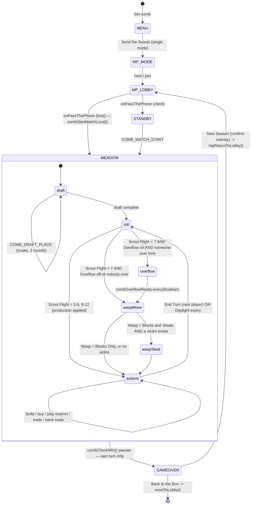

# New Game Technical Spec — HONEYCOMB HILLS
**Document type:** Phase 2 — Technical Specification
**Game:** Honeycomb Hills · `comb` · game 20 · phase 41
**Source brief:** `docs/new-ideas/new-game-brief-honeycomb-hills.md` (Revision 2, 5 Sep 2026)
**Status:** **CONFIRMED — Stage 2 closed, 6 Sep 2026.** All seven §16 clarifications are answered
(four by the owner, three carried on their stated defaults) and §17 is accepted. **Stage 3
implementation is open.**
**Written:** 6 Sep 2026 · against SW v221, 19 shipped games · **§16 answers folded in 6 Sep 2026**

> **Reading order for implementation.** Once confirmed, *this* document is the source of truth — not
> the brief. Where the two disagree, this wins (`new-game-process.md` § Stage 3). Every decision that
> differs from the brief is listed in §17; nothing has been changed silently.

---

## Consistency Audit

Run first, before any other section, per `new-game-process.md` § The Naming Collision Check. Every
row below was executed against the live repo, not inferred.

| Check | Finding |
|-------|---------|
| **Terminology collision across the 19 games** | **One hard collision, already resolved in the brief; six soft, four of them NEW.** See the register below. |
| **Brand colour — does `pill-active-comb` exist?** | **No.** `grep -c comb css/styles.css` → 3 hits, all prose in comments (`combo`, `combination`). **Six new CSS rules needed** (§1). |
| **Abbreviation collision** | **None in `js/`** — `grep -rn "\bcomb[A-Z]" js/` → **0 hits** (re-verified 6 Sep 2026, at the start of Stage 3). The only near-misses are `comboLabel` / `comboLine` / `COMBO` / `COMBINATOR`, all lowercase-`o` after `comb`, so no `comb*` symbol can shadow them. `comb` is free in the app namespace. **One hit in `tools/`, recorded below and not blocking.** |
| **Screen ID collision** | **None.** `grep -n "screen-comb" js/engine.js index.html` → 0 hits. |
| **New data file needed?** | **No.** All content is ~70 lines of constants (hex distribution, Bloom Markers, Instinct deck, costs, the Tended layout). Lives in `js/games/comb.js` the way `PKO_EVENT_SOUND` and `BLD_ROLE_TABLE` do. **No `sw.js` data precache addition** (§10). |
| **Reusable engine / shared-library functions** | **Six real reuses found**, listed below. `showWhoFirst()` is **not** applicable — no teams. `normaliseWord()` is **not** applicable — no text input anywhere in this game. |

### Reuse found — do not re-implement

| Existing thing | Where | Used for |
|---|---|---|
| `Physics.rng(seed)` | `js/lib/physics.js:45` (`window.Physics.rng`) | The seeded xorshift32 stream for the board deal **and** the Scout Flight. Gives a reproducible match under `COMB_SEED=` in the harness. Re-implementing xorshift32 in a second file is what § Shared Library Modules exists to prevent. Load order is safe — `physics.js` parses before every game plugin. **Flagged in §17-8**, because the name reads oddly outside CLD. |
| `bindCardHold(el, onHold, ms)` | `js/engine.js:577` | Tap-hold on a hex or an Instinct card → deep-links into the How-to gallery tab. |
| `refHighlightRow(box, attr, id, pingClass, ms)` | `js/engine.js:592` | The scroll-and-ring half of that deep link. |
| `assetFace(kind,id)` / `assetBack(kind)` / `assetExtra(kind,key)` | `js/lib/art.js:72/84/97` | The four render seams (§10). |
| `mpNotifyPlayerLeft()` | `js/engine-multiplayer.js:970` | The Mid-Game Quit Contract. **Use the engine helper — do not add a 20th per-game `COMB_PLAYER_LEFT` packet.** |
| `mpSendPrivate` / `mpStartPrivateListener` | `js/engine-multiplayer.js:846/857` | The private hand channel (§11). |
| `touch-action: none` on the canvas + `h-screen overflow-hidden` on the section | `css/styles.css:2580`, `index.html:10018` (`#screen-cld-floe`) | **The pinch/pan surface — which after the Q19-b answer is `comb-map-overlay`, not the inline board.** The `h-screen overflow-hidden` half still applies to `screen-comb-meadow`; the `touch-action: none` half applies to both canvases, for different reasons. See §2. |

### Terminology collision register

**Hard — resolved in the brief, no action:**

| Term | Collides with | Resolution |
|---|---|---|
| **Swarm** ×3 | **PKO** — a defined move (*"answering a single Mark with two of that Mark's own species"*), 10 hits in `pko.md`, present in its How to Play and match log | Renamed at Revision 1 to **Hive Points** · **Fiercest Guard** · **Comb Rush**. Verified: the string "Swarm" appears nowhere in this spec. |

**Soft — recorded, not blocking. Four were NOT in the brief's own sweep:**

| Term | Collides with | Verdict |
|---|---|---|
| *Smoke Zone* | FLW setting **Smoke & Mirrors** | Recorded in brief. Different word, different game, no shared surface. **Keep.** |
| *Guard Bee* / *Fiercest Guard* | CJAR House Rule **On Guard** | Recorded in brief. **Keep.** |
| **`The Season`** ⚠️ NEW | **PKO's `The Dry Season`** — a defined Force-of-Nature event, in `PKO_EVENTS`, its interstitial copy, and `code-map.md` | The distinctive word is *Dry*. The bare string "The Season" appears in PKO only inside a blurb already logged as wrong (`pko.md:477`). **Keep** — but the brief's claim that *Season* was "verified free" was not accurate, and that is worth knowing. |
| **`Fiercest Guard`** ⚠️ NEW | **GM setting `Memory Guard`** (`gm.md:112`) | Different string, different surface. **Keep.** |
| **`Roomy`** (a `The Overflow` pill) ⚠️ NEW | **CLD's `Floe Size` pill, literally labelled `Roomy`** (`cld.md:147`) | **The strongest of the soft ones** — the same *kind* of surface (a settings pill) in a shipped game. Both mean "more space", so the usage is consistent rather than contradictory. **Recommend keep**; raised as **§16 Q-C** because it is the one word a player can meet twice on the same kind of screen. |
| **`Endless`** (a `The Meadow's Bounty` pill) ⚠️ NEW | **PASS's `Match Length` pill, labelled `Endless`** (`pass.md:129`) | Same note, weaker — different setting, same word, consistent meaning. **Keep.** |
| *instinct* | PASS prose only (`pass.md:25`) | Not a defined term. **No collision.** |
| **`combBoard` / `--comb`** ⚠️ NEW, found 6 Sep 2026 | **`tools/nt-path-probe.js`** — a `combBoard(w, h)` function, a `--comb` CLI flag and a `"COMB (per-turn probe)"` report label | **Not a collision, and not fixable by renaming either side.** It is *"comb"* as in the **physical shape** — a serpentine maze of alternating 2×2 blocks, which is what the probe generates. It lives in a **standalone Node instrument** that asserts nothing, exits 0, runs in its own process and is never loaded by the browser, so it shares no namespace with `js/games/comb.js` and cannot shadow anything. **Keep both.** Recorded because the Stage 2 audit grepped only `js/` and therefore read 0 — a later audit grepping the repo will find it, and should see it already known. The one practical consequence: **`comb` in `tools/` now means two unrelated things**, so name this game's harnesses `tools/verify-comb-*.js` / `tools/simulate-comb-*.js` exactly as §15 does and never bare `comb-*.js`. |

Also swept and **clear** across all 19 identity docs: Hive · Comb · Nectar · Wasp · Bloom · Pollen ·
Queen · Drone · Waggle · Forage · Jelly · Resin · Wax · Meadow · Blossom · Scout · Colony ·
Honeycomb · Compass · Bloom Marker · Trade Blossom · Largest Comb · Golden Nectar · Comb Wall ·
Drone Cell · Queen Dome · Instinct Card · Spring Bloom · Comb Rush · Pheromone Dominance ·
Hive Points · Scout Flight · Short Summer · Full Season · The Hive · New Season · Wild · Tended ·
Snug · Limited.

**Flags:** none blocking. **Five** soft collisions the brief's sweep missed are recorded — four
terminology, plus the `tools/` `combBoard` hit found at the start of Stage 3. `Roomy` was raised in
§16 as Q-C and is **keep**, carried on the stated default.

---

## §1 — Identity

| Field | Value |
|-------|-------|
| Full name | **Honeycomb Hills** |
| Short ID / abbreviation | **`comb`** |
| Plugin file | `js/games/comb.js` |
| Brand colour | **Bright honey gold `#F0A500`** — no Tailwind utility, so it needs custom CSS |
| Ink on brand | **Dark** — `ctaTextClass: 'text-stone-800'`, matching the FRT `#FFE500` and CJAR `#D4A017` precedent |
| Active pill class | `pill-active-comb` — **does not exist, must be added** |
| Lobby button ID | `#btn-comb` |
| Play CTA label | **"Send the Scouts"** |
| Menu screen tagline | *"Build your comb, trade your nectar, grow the strongest hive in the meadow."* |
| How-to emoji | 🐝 |
| Sylly Mode | **None** — see §12 and §17-1 |

### CSS additions required (`css/styles.css`)

| Rule | Value |
|---|---|
| `.comb-cta` | `background:#F0A500; color:#292524;` + hover `#D18F00` + **`display:flex; align-items:center; justify-content:center;`** — the flex trio is mandatory, not decorative (see the checklist item on script-revealed buttons; this is what PKO's Retreat/Stampede shipped without) |
| `.pill-active-comb` | `background:#F0A500; color:#292524;` — background and colour only; all structure stays in `.pill` |
| `.game-toggle-on-comb` | `background:#F0A500; color:#292524;` |
| `.comb-range` | gradient `#FDF0D0 → #F0A500`, plus `::-webkit-slider-thumb` and `::-moz-range-thumb` |
| `.comb-label` | `color:#B87A00` — the step-label / eyebrow tone. `#F0A500` on `bg-stone-50` measures ≈2.0:1 and **fails** small-text contrast; the darkened partner is what the labels use. FRT and CJAR each solved this same problem. |
| `.comb-hex-asset` / `.comb-card-asset` | cover/centre image rules for the render seams (§10) |

Modal border: `border-[#F5C55C]` (the `-300` equivalent for a custom hex, following DYB's
`border-[#9db8d9]` precedent). Settings-button light tint: `bg-[#FDF0D0] hover:bg-[#FAE3AB]
text-[#B87A00]`.

### Engine map additions

| Map | Entry |
|---|---|
| `updateSliderTheme()` — `js/engine.js:602` | `'comb': 'comb-range'` |
| `getMuteToggleOnClass()` — `js/engine.js:620` | `'comb': 'game-toggle-on-comb'` |
| `LOBBY_COLOUR_ORDER` — `js/engine.js:967` | **Insert `'btn-comb'` between `'btn-jec'` and `'btn-cjar'`.** Hue walk: JEC amber-500 `#f59e0b` = 37.7° → **COMB `#F0A500` = 41.3°** → CJAR `#D4A017` = 43.5° → FRT `#FFE500` = 53.9°. That is the correct slot on the hand-picked walk. |
| `tools/verify-mp-configs.js` | `PLUGIN` map (line 85) gains `comb: 'comb.js'`, **and** the hardcoded `check('19 games registered', IDS.length, 19)` at line 99 becomes **20**. Both, or the harness fails the moment the config entry lands. |

---

## §2 — State Flow

**The headline structural finding: this game has four screens.** It is by a wide margin the largest
game in the suite by rules, state and packet count, and simultaneously has fewer screens than
Cookie Jar. That is not a contradiction — it is the direct consequence of the board persisting for
the whole match. Every phase that another game would give a screen to is either a **mode layered on
the one board** (build placement, Wasp placement, the Scout Flight) or an **overlay** (the Overflow
picker, the trade builder, the Instinct deck). Nothing in the match navigates away from the board
once it starts.



**A Guard Bee played from `actions` re-enters `waspMove` and returns to `actions`** — the same two
sub-states, reached without a 7 and without an Overflow. That is brief §4d's core finding
(the steal is a consequence of the *move*, not of the roll) expressed as a state edge, and it is why
`waspMove`/`waspSteal` are sub-states rather than inline code in the roll handler.

### Sub-states within screens

| Screen | Sub-states | State variable |
|--------|-----------|----------------|
| `screen-comb-meadow` | `draft` · `roll` · `overflow` · `waspMove` · `waspSteal` · `actions` · `gameover-pending` | `combPhase` |
| `screen-comb-meadow` (layered mode, orthogonal to `combPhase`) | `null` · `wall` · `cell` · `dome` · `wasp` | `combPlacementMode` |

`combPlacementMode` is deliberately a **second, independent** variable rather than more values on
`combPhase`. Placement is reachable from both `actions` (a build) and `waspMove` (parking the Wasp),
and folding it into the phase would multiply the phase enum and make the harness assert a cross
product instead of two small enums.

### Pass-the-phone gate points

| Transition | Gate required? | Gate screen ID |
|-----------|---------------|----------------|
| *(none)* | **No** | — |

**This game has no pass-the-phone gates at all, and that is a real property rather than an
omission.** It is MDLM-only (§11), and every player's private information lives permanently on their
own device — the phone never changes hands, so there is no moment at which private information is
revealed to a *new* holder. The § Pass-the-Phone Safety Gate has nothing to protect here. The
privacy requirement is *stronger* than the games that use gates, not weaker; it is discharged by the
private channel (§11), not by a screen.

### `showWhoFirst()` usage

**Not used.** Not a team game. Turn order is the lobby's seat order, and the opening snake draft
(§6) hands the last seat the compensation Catan gives it.

### Screen layout — the Stack, and the one documented exception

| Screen ID | Header | Stage | Controls |
|-----------|--------|-------|----------|
| `screen-comb-menu` | 🔊 (`absolute top-4 right-4`) | 🐝 emoji + title + tagline | Send the Scouts · How to Play · Settings · ← Back to the Box (all four `gel-btn`) |
| `screen-comb-standby` | 🔊 + ✕ | 🐝 + "Waiting for the hive…" + roster list | *(none — client waits)* |
| **`screen-comb-meadow`** | Turn label + active player + point strip · `[?]` 🔊 ✕ | **The board canvas** (fit-to-view, tap-to-place) + the 🔍 magnifier + your hand row + the Sun Compass layer | Action bar: Build · Buy Instinct · Waggle Dance · End Turn |
| `screen-comb-gameover` | 🏆 + "The Hive is Thriving" | Podium + Golden Nectar reveal + stats block | New Season · Back to the Box |

`screen-comb-menu`, `screen-comb-standby` and `screen-comb-gameover` are **the Stack**, verbatim:
`<section class="flex items-center justify-center w-full min-h-screen px-5 py-8 overflow-y-auto">`
wrapping one `flex flex-col w-full max-w-sm gap-4` column, Header/Stage/Controls as siblings.

**`screen-comb-meadow` is the exception, and it joins the legacy `h-screen` whitelist in
`ui-style.md`** — though **not for the reason the draft gave.** The draft justified it as a pinch/pan
drag surface, CLD-style. The owner's answer to **Q19-b** moved all zooming into an overlay (below), so
the inline board no longer drags at all. The whitelist entry survives on its *other* half, which was
always the stronger one: **the hand row and the action bar must not move while the player reads and
taps the board**, and the board must never scroll a legal target off screen. It is implemented as
`class="h-screen w-full flex flex-col overflow-hidden px-4 pb-4"`, following `#screen-cld-floe`
(`index.html:10018`). `touch-action: none` still goes on the inline canvas — not to own a drag, but to
stop the browser's own double-tap-zoom and gesture handling from eating a placement tap.

**Whitelist row to add to `ui-style.md`:** `screen-comb-meadow` — *"Fit-to-view board the player taps
to place on. The hand row and action bar must stay put while the board is read, and no page-scroll may
carry a legal target off screen. Zoom lives in `comb-map-overlay`, not here."*

```html
<section id="screen-comb-meadow" style="display:none"
  class="h-screen w-full flex flex-col overflow-hidden px-4 pb-4">
  <!-- Header: flex-shrink-0 -->
  <!-- Stage:  flex-1 min-h-0 — the board canvas, touch-action:none -->
  <!-- Controls: flex-shrink-0 — hand row + action bar -->
</section>
```

### The magnifier — how the board is read at phone scale (Q19-b, answered 6 Sep 2026)

**This changes the design from the draft's own default, and for the better.** The draft proposed
pinch-zoom *in place* on the board canvas. The owner's call splits reading from playing:

> *"maybe have a magnifier glass button on the corner of the map, click it and it pops out an overlay
> which we can then use for pinch-zooming"*

**So the inline board neither pans nor zooms.** It is always fit-to-view — the whole 19-hex meadow, on
screen, always. A 🔍 button in the board's top-right corner opens **`comb-map-overlay`**, a full-bleed
canvas with real pinch-zoom and two-finger pan.

| | Pinch-in-place *(draft default)* | Magnifier overlay *(owner's call)* |
|---|---|---|
| A one-finger drag on the board | ambiguous — a pan, or the start of a placement? | unambiguous — always a placement tap |
| Can a legal target scroll off screen? | **yes**, and it is then unreachable without panning back | **never** — fit-to-view is invariant |
| Where `touch-action: none` earns its keep | the board | the map canvas |
| Gesture surfaces | one, overloaded | two, each with one job |

Row 1 is the real win. A board that both pans *and* places must separate a drag from a tap by a
distance-and-time threshold, and that threshold is wrong for somebody. CLD gets away with one
overloaded canvas only because it has a single continuous gesture (aim) and **no discrete targets at
all**; this board has 145 of them.

#### Three rules that stop the two surfaces becoming two sources of truth

1. **One draw function, two canvases.** `combDrawBoard(canvasEl, viewport)` is pure: it takes its
   target canvas and a `{ zoom, panX, panY }` viewport and draws current state into it. The inline
   board passes the fit-to-view viewport; the map passes its live gesture viewport. **There is no
   second board renderer**, so the map cannot draw a board the meadow disagrees with. This does not
   weaken §3's single-renderer rule — that rule governs *screen elements* (status lines, labels), which
   is what SHP's stale status line was. A pure function drawing into a canvas handed to it by the
   caller is the opposite shape.
2. **One placement function.** The map is **interactive**: a tap on a legal target inside it routes
   through the identical `combAttemptPlace(kind, targetIdx)` the inline board uses, and the map closes
   on success. A read-only magnifier would be worse than none — a player who can finally *see* the
   target they want, and is not allowed to tap it, must memorise it, close the overlay and tap blind.
   That is precisely the problem the magnifier was opened to solve.
3. **Nearest-legal-target snapping, on both surfaces.** At fit-to-view on a 390 px phone the board
   spans ≈8.66 hex units across ≈360 usable px, so one unit ≈ 41 px and adjacent nodes sit **≈41 px
   apart — under the suite's own 44 px touch minimum**. Fixed hitboxes would therefore overlap. A tap
   does not hit-test a box: it takes the **nearest legal target within a radius**, and in placement
   mode previews it (`combPendingTarget`) before commit. **This is required whether or not the
   magnifier exists** — it is what makes the inline board playable without zoom.

#### Shape, z-index and lifecycle

**Pattern 2a's shape, not a third pattern.** `ui-style.md` § Pattern 2a establishes that a full-screen
dark-backdrop viewer with one interactive element is *"Pattern 2's geometry with an image where the
card would be"*. This is the same thing with a canvas where the image would be.

| Property | Value | Why |
|---|---|---|
| ID | `comb-map-overlay` | |
| Pattern | 2a shape — `bg-black/80` backdrop, ✕ close, canvas full-bleed `inset-0` | Takes the lit surface away from the UI and gives it to the board |
| **z-index** | **z-[75]** — *below every other `comb-*` overlay* | The map is a surface the player **chose** to open; the Overflow (z-[85]) and an arriving trade offer (z-[90]) are **pushed at them** and must land on top. This is the one overlay in the game that has to lose a z-fight |
| Canvas | `touch-action: none` | The CLD precedent, relocated here — this is now the game's only pinch/pan surface |
| Close button | `btn-comb-map-close` | Matches the engine's cancel/close/done/ok/dismiss backdrop-dismiss convention. Safe **only because the canvas is full-bleed**: with no backdrop dead space a pinch cannot land on the backdrop and dismiss mid-gesture — the exact risk `ui-style.md` § Pattern 2a names |
| RAF | **none — draws on gesture only** | No fourth timer handle. It repaints on pinch/pan, and on any SYNC that changes the board while it is open |
| Auto-close | **when this device gains the initiative**: its own `COMB_TURN_BEGIN`, or a `COMB_OVERFLOW_BEGIN` in which it owes a discard | Two explicit sites, no more. Reading the board during somebody *else's* turn is what it is for |

**`combZoom` / `combPanX` / `combPanY` now belong to the map overlay alone** (§4). The inline board
holds no viewport state at all — that simplification is what the owner's answer buys, and it is why
this closes Q19-b more cleanly than the draft did. Logged as **§17-11**.

### The turn intro screen — a deliberate, documented omission

`ui-style.md` § Round/Night Intro Screen says every game where a phase repeats several times a match
should open each repetition with a short auto-advancing intro. **This game does not, and must not.**
A turn repeats **60–80 times** in a Full Season; a five-second intro on each would be **5–7 minutes
of a match spent on interstitials**, which is the same arithmetic Appendix B3 uses to cap the Sun
Compass at ~1 s. The Scout Flight animation *is* the turn's opening beat, and it is budgeted at
800 ms–1.2 s with a tap-to-skip. Logged as **§17-2**.

---

## §3 — Screen Registry

| Screen ID | Purpose | Notes |
|-----------|---------|-------|
| `screen-comb-menu` | Main hub | Four `gel-btn` buttons, suite standard |
| `screen-comb-standby` | Client waiting for the host to start | MDLM-only game, so there is no setup screen — names come from `mpPlayerSlots` |
| `screen-comb-meadow` | **The board.** Draft, roll, production, Wasp, build, trade, end turn | Multi-phase (§2). `h-screen` whitelist exception |
| `screen-comb-gameover` | Final standings + Golden Nectar reveal + stats | The Hive |

**Total new screens: 4** — all four added to `allScreens[]` in `js/engine.js`.

**No team setup screens** — not a team game.
**No `screen-comb-setup` / `screen-comb-players`** — MDLM-only; `onPassThePhone` populates
`combPlayerNames` from `mpPlayerSlots.map(p => p.nickname)` and starts the match directly, following
CLD (`engine-multiplayer.js:480`), GTH, FRT, SHP, FLW, PKO and CJAR.

### The single-renderer rule for `screen-comb-meadow`

`ui-style.md` § The Stack rule 4 says a screen repainted by more than one render function must have
each of them own every element it cares about — SHP shipped a stale status line exactly this way.
**This screen has seven phases and would be the worst possible place to learn that lesson again.**

**Therefore: exactly one render function, `combRenderMeadow()`, owns the whole screen.** Every phase
sets `combPhase` (and optionally `combPlacementMode`) and calls it; the function sets *every* element
on the screen every time, including the ones the current phase does not use (to `''` or
`display:none`). No phase gets a private renderer that touches a subset. Phase-specific work goes in
pure helpers that *return* content to `combRenderMeadow()`, never in functions that write to the DOM
themselves.

**The one deliberate non-member: `combDrawBoard(canvasEl, viewport)`.** It is a pure draw function
taking its target canvas as an argument — called by `combRenderMeadow()` for the inline board, and by
`comb-map-overlay` for its own canvas (§2). Sharing it is what stops the magnifier becoming a second
source of board truth. It is **not** an exception to the rule above: that rule governs *screen
elements* the renderer might forget to repaint, which is what SHP's stale status line was. A function
that draws only into a canvas its caller hands it cannot leave a stale element behind.

---

## §4 — State Variables

Grouped by lifecycle. **The `Match` group is exactly the set `combSerialiseState()` writes** — that
identity is the point of the grouping, not a coincidence, and it is what makes Appendix A5's
serialiser cheap to write now and expensive to retrofit.

```javascript
// ── Settings (persist between play-agains; locked at match start) ───────────
let combSeason    = 'short';    // 'short' | 'full'          — The Season
let combLayout    = 'wild';     // 'wild'  | 'tended'        — The Meadow
let combWasp      = 'blocks';   // 'blocks'| 'steals'        — The Wasp
let combOverflow  = 'off';      // 'off'   | 'snug' | 'roomy'— The Overflow (—/7/9)
let combWaggle    = 'outloud';  // 'outloud' | 'full'        — The Waggle Dance
let combDaylight  = 'allday';   // 'allday'| 'longday' | 'shortday' (—/90/60 s)
let combBounty    = 'endless';  // 'endless' | 'limited'     — The Meadow's Bounty
// NO combSyllyMode — see §12 and §17-1.

// ── Roster (from the lobby; persists across play-agains) ────────────────────
let combPlayerCount = 0;
let combPlayerNames = [];       // from mpPlayerSlots[i].nickname — never .name

// ── MATCH state — authoritative. This group IS combSerialiseState(). ────────
let combHexes       = [];       // 19 × { kind, marker }  kind: 'grove'|'blossom'|'clover'|'rock'|'nursery'|'smoke'
let combNodes       = [];       // 54 × { owner, level }  owner: playerIdx | -1 ; level: 0 none | 1 Drone Cell | 2 Queen Dome
let combEdges       = [];       // 72 × owner (playerIdx | -1)
let combWaspHex     = -1;       // hex index; starts on the Smoke Zone
let combHands       = [];       // N × [resin, wax, pollen, nectar, jelly]  — PRIVATE, counts only
let combInstinct    = [];       // N × [{ kind, boughtTurn, played }]       — PRIVATE until played/gameover
let combDeck        = [];       // remaining Instinct kinds, shuffled       — host-authoritative
let combSupply      = [];       // 5 counts; only consulted when combBounty === 'limited'
let combTurn        = 0;        // active playerIdx
let combTurnNo      = 0;        // increments forever; the Season Log key
let combPhase       = 'draft';  // see §2
let combRoll        = null;     // 2..12, or null before the first cast
let combGuardsPlayed= [];       // N × int — Guard Bees played
let combLargestHolder  = -1;    // playerIdx | -1  ── AUTHORITATIVE, see below
let combFiercestHolder = -1;    // playerIdx | -1  ── AUTHORITATIVE, see below
let combDraftOrder  = [];       // the snake sequence of playerIdx
let combDraftStep   = 0;        // index into combDraftOrder
let combInstinctPlayedThisTurn = false;
let combLog         = [];       // Season Log — privacy-bounded (§11)
let combStats       = { scoutFlights: 0, waspLandings: 0 };
let combBoardSeed   = 0;        // the host's deal seed; in the payload so a client deals identically

// ── Round state (one Scout Flight) ─────────────────────────────────────────
let combOverflowOwed  = [];     // N × int — how many each player must discard this 7
let combOverflowReady = [];     // N × bool — the readyCheck matrix (§11)

// ── Turn state (one player's turn) ─────────────────────────────────────────
let combOffer       = null;     // { from, to, give[5], want[5], responses[], expiresAt } | null
let combOfferTimer  = null;     // setTimeout handle — the 10 s auto-decline
let combTurnEndTs   = 0;        // Daylight endTimestamp, 0 when All Day
let combTurnTimer   = null;     // setInterval handle

// ── UI state (never serialised, never in a packet) ─────────────────────────
let combPlacementMode = null;   // null | 'wall' | 'cell' | 'dome' | 'wasp'
let combLegalTargets  = [];     // recomputed on entering placement mode
let combPendingTarget = null;   // nearest-snap preview awaiting commit (§2)
let combMapOpen       = false;  // is comb-map-overlay up?
let combZoom = 1, combPanX = 0, combPanY = 0;   // MAP OVERLAY ONLY. The inline board
                                // is always fit-to-view and holds NO viewport state (§2)
let combRafHandle     = null;   // the Sun Compass / board animation loop
let combHowtoTab      = 'rules';
let combChainLen      = [];     // DERIVED cache — recomputed, never trusted
```

### Variables derived at runtime, never stored

| Derived value | How |
|---|---|
| `combPublicPoints(p)` | cells×1 + domes×2 + (`combLargestHolder===p` ? 2 : 0) + (`combFiercestHolder===p` ? 2 : 0). **Excludes Golden Nectar.** This is what every scoreboard shows. |
| `combTruePoints(p)` | `combPublicPoints(p)` + that player's unrevealed Golden Nectar count. **Only ever computed on the owning device and on the host.** The win check uses this. |
| `combHandCount(p)` | `combHands[p].reduce(sum)` — public; the contents are not |
| `combChainLen[p]` | Longest-path DFS over that player's walls (§6). Cached, recomputed after every wall and every opposing cell placement |
| `combTarget()` | `combSeason === 'full' ? 10 : 7` |
| `combCarryLimit()` | `{off: Infinity, snug: 7, roomy: 9}[combOverflow]` |
| `combDaylightMs()` | `{allday: 0, longday: 90000, shortday: 60000}[combDaylight]` |
| `combIsMyTurn()` | `combTurn === mpMyPlayerIdx` |

### ⚠️ The two achievement holders are authoritative state, not derived

Appendix A5 of the brief gives *"Largest Comb's holder is computed from the walls, not stored"* as
its example of what a serialiser must exclude. **That is wrong, and it matters.** Brief §19 Q18
settles the rule as Catan's, verbatim: **ties never transfer — the incumbent keeps it.** So who holds
Largest Comb depends on the *order* in which chains grew, not on the board's current shape:

> A builds a 5-chain and takes it. B later also reaches 5. B does **not** take it. The board now shows
> two 5-chains and cannot tell you who holds the card. Recompute from the board and it becomes a coin
> flip — worth 4 points.

Identical reasoning for Fiercest Guard (*"transfers on being beaten outright, never on a tie"*).

**So: `combLargestHolder` and `combFiercestHolder` are stored, serialised and broadcast.
`combChainLen[]` is the derived thing, and it is a cache only.** Logged as **§17-3**.

---

## §5 — Settings

**Settings overlay title block:**
- Heading: `Honeycomb Hills 🐝`
- Subtitle: `How long the summer runs, and how mean the meadow gets.`

**Seven settings, no Sylly Mode** (§12). Every one carries a **Dynamic Value Line** below its pill
row (`ui-style.md` § Dynamic value line) — six of the seven encode a concrete number, which is
precisely the case that rule exists for.

| # | Setting (display) | Options (pill labels) | Default | Internal variable | Internal values |
|---|---|---|---|---|---|
| 1 | **The Season** | Short Summer · Full Season | Short Summer | `combSeason` | `'short'` / `'full'` |
| 2 | **The Meadow** | Wild · Tended | Wild | `combLayout` | `'wild'` / `'tended'` |
| 3 | **The Wasp** | Blocks Only · Blocks and Steals | *follows The Season* | `combWasp` | `'blocks'` / `'steals'` |
| 4 | **The Overflow** | Off · Snug · Roomy | *follows The Season* | `combOverflow` | `'off'` / `'snug'` / `'roomy'` |
| 5 | **The Waggle Dance** | Out Loud · Full Dance | Out Loud | `combWaggle` | `'outloud'` / `'full'` |
| 6 | **Daylight** | All Day · Long Day · Short Day | All Day | `combDaylight` | `'allday'` / `'longday'` / `'shortday'` |
| 7 | **The Meadow's Bounty** | Endless · Limited | Endless | `combBounty` | `'endless'` / `'limited'` |

**No difficulty setting.** This game draws nothing from `words.json`, so it takes the
`new-game-checklist.md` exemption for non-word-bank games (PASS, DYB, GTH). Its velocity dial is
**The Season**, and it is setting #1. Noted here so the Phase-Gate audit does not flag the absence.

### Plain-English card descriptions (static, above the pills)

| Setting | Description text |
|---|---|
| The Season | How many Hive Points win the match — and how long the afternoon runs. |
| The Meadow | Whether the hexes and Bloom Markers are shuffled fresh, or laid out to a known-fair pattern. |
| The Wasp | What happens when the Wasp lands on a hex — whether it also robs somebody. |
| The Overflow | How much you can carry before a 7 spills half of it. |
| The Waggle Dance | Whether you sort trades out loud at the table, or negotiate them in the app. |
| Daylight | Whether a turn has a time limit, so one long thinker cannot stall the meadow. |
| The Meadow's Bounty | Whether the meadow can actually run dry. |

### Dynamic value lines (live, below the pills — `text-stone-400 text-xs`)

| Setting | Value line per option |
|---|---|
| The Season | Short → *"First to 7 Hive Points — about 25 minutes."* · Full → *"First to 10 Hive Points — about 50 minutes."* |
| The Meadow | Wild → *"Hexes and Bloom Markers shuffled fresh every match."* · Tended → *"The same fair meadow every time — good for a first game."* |
| The Wasp | Blocks → *"The Wasp shuts a hex down, but takes nothing from your comb."* · Steals → *"The Wasp shuts a hex down and takes one resource from someone touching it."* |
| The Overflow | Off → *"Hold as much as you like."* · Snug → *"Hold more than 7 and a 7 costs you half."* · Roomy → *"Hold more than 9 and a 7 costs you half."* |
| The Waggle Dance | Out Loud → *"Sort the deal out loud, then tap it in."* · Full Dance → *"Post an offer; everyone answers in the app. You pick who deals."* |
| Daylight | All Day → *"No time limit."* · Long Day → *"90 seconds a turn."* · Short Day → *"60 seconds a turn."* |
| The Meadow's Bounty | Endless → *"The meadow never runs out."* · Limited → *"19 of each resource — the meadow can run dry."* |

### The Season presets two other settings — the exact wiring

Brief §7 calls this the "gentle superseded" pattern. It is **neither** of `ui-style.md`'s two named
patterns and should not be described as either: nothing becomes unreachable, no card dims, **no amber
reason line is used**. It is a plain preset.

```
Tapping a The Season pill:
  combSeason = value
  combWasp     = (value === 'full') ? 'steals' : 'blocks'
  combOverflow = (value === 'full') ? 'snug'   : 'off'
  combSyncSettingsUI()          // repaints ALL THREE cards, not just the one tapped
Tapping a The Wasp or The Overflow pill:
  set that variable only. The Season is NOT changed and NOT un-set.
```

**The trap, and it is the one brief §19 flags:** the repaint must happen in **both**
`combSyncSettingsUI()` **and** the pill click handler. A handler that mutates the two variables but
only repaints its own card leaves two settings cards showing stale pills — visibly wrong, and
invisible to every harness because no rule changed. Assert it in the harness by calling the handler
and reading all three variables.

> **⚠️ Do not add a "Wasp: Off" option.** Brief §4d: 14 of 25 Instinct cards are Guard Bees whose
> entire function is to move the Wasp, and Fiercest Guard becomes unwinnable. Off blanks 56% of the
> deck. `Blocks Only` is the gentle option.

### Locked / overridden settings in Lobby Mode

| Setting | Override | Reason |
|---|---|---|
| **All seven** | **Host-owned; frozen the moment `COMB_MATCH_START` is sent** | The board is dealt from The Season and The Meadow at match start and can never be re-dealt. Clients receive all seven via `SETTINGS_SYNC` before the room starts. |
| None affect player count | — | The range is a flat 3–4 under every setting. **This game has zero exposure to the lobby-bounds bug** that capped five games' rooms at their setup default, and `getMaxPlayers`/`getMinPlayers` are bare constants needing no `ALLOWED_SETTINGS` entry in `tools/verify-mp-configs.js`. Keep it that way. |

`mpSerialiseSettings('comb')` returns all seven:
`{ combSeason, combLayout, combWasp, combOverflow, combWaggle, combDaylight, combBounty }`.
All seven are host-owned and rule-bearing; a client out of step with any one of them is playing a
different game. Add the `case 'comb':` to `js/engine-multiplayer.js:871`.

---

## §6 — Scoring Logic

### Build costs

| Purchase | Cost | Limit per player |
|---|---|---|
| **Comb Wall** | 1 Resin + 1 Wax | 15 |
| **Drone Cell** | 1 Resin + 1 Wax + 1 Pollen + 1 Nectar | 5 |
| **Queen Dome** | 3 Royal Jelly + 2 Nectar | 4 |
| **Instinct Card** | 1 Pollen + 1 Nectar + 1 Royal Jelly | limited by the 25-card deck |

Costs live in one constant, `COMB_COSTS`, indexed `[resin, wax, pollen, nectar, jelly]`, and are read
by affordability highlighting (§14b of the brief), the build applier and the How-to Comb tab — **one
source, three readers**, per the single-source arithmetic rule.

### Point events

| Outcome | Who scores | Points | Formula | Turn end? |
|---------|-----------|--------|---------|-----------|
| Built a Drone Cell | Builder | **+1** | flat | No |
| Upgraded to a Queen Dome | Builder | **+1 net** | level 1→2, so 2 replaces 1 | No |
| Chain reaches ≥5 and **strictly exceeds** the holder's | Builder | **+2**, previous holder **−2** | `combChainLen[p] >= 5 && combChainLen[p] > combChainLen[holder]` | No |
| A wall chain cut by an opponent's new Drone Cell | Cut player | **−2** *if they were the holder and now no longer strictly lead* | recompute all chains, then re-run the transfer test | No |
| Played a Guard Bee, count **strictly exceeds** the holder's | Player | **+2**, previous holder **−2** | `combGuardsPlayed[p] >= 3 && > combGuardsPlayed[holder]` | No |
| Drew a Golden Nectar | Drawer | **+1, hidden** | counts in `combTruePoints` only | No |
| A hex produced | Nobody | **0** | resources are not points | No |

**Both transfers use `>` and never `>=`.** That is the whole of Q18's tie rule and it is why the two
holders are stored (§4).

### `combRecomputeAchievements()` — the single resolution point

Called after **every** wall placement, **every** Drone Cell placement (own *or* opposing — §4c) and
**every** Guard Bee play. Never called from three separate sites with three copies of the comparison.

```
1. for each p: combChainLen[p] = combLongestChain(p)
2. best = max(combChainLen), leaders = all p with combChainLen[p] === best
3. if best < 5                      -> combLargestHolder = -1   (nobody qualifies)
   else if combLargestHolder === -1 -> if leaders.length === 1 -> that player, else -1
   else if combChainLen[combLargestHolder] === best -> UNCHANGED (incumbent keeps a tie)
   else if leaders.length === 1     -> transfer to that player
   else                             -> UNCHANGED (an incumbent who has been beaten by two players
                                        at once keeps it: no single challenger beat them outright)
4. identical shape for Fiercest Guard on combGuardsPlayed[], minimum 3
```

Step 3's last branch is the only genuinely ambiguous case in Catan's own rules and is settled here
deliberately: **the incumbent keeps it.** It follows from "never on a tie" and is the reading that
never leaves the card in limbo. Assert it in the harness.

### `combLongestChain(p)` — the traversal

Catan's rule, unmodified (Q18): the longest **simple path** through the player's wall graph, where a
node occupied by *another* player's Drone Cell or Queen Dome is **not traversable**.

- Build an adjacency list over that player's edges, keyed by node.
- **Prune first:** delete any node whose `combNodes[n].owner` is another player and whose `level > 0`.
  That deletion is exactly the "cut" of §4c, and doing it as a graph prune rather than a special case
  is what makes the cut fall out for free.
- **DFS from every endpoint**, tracking visited *edges* (not nodes — a chain may legally revisit a
  node in a branching network), returning the maximum edge count.
- Exponential in theory; **bounded by 15 walls per player** in practice. Worst case is a few thousand
  steps, well under a millisecond. Brief Q18 reached the same conclusion; this restates the bound so
  nobody optimises it prematurely.

### Tie-break rule

1. **None needed.** The match halts the instant one player is checked at or above the target, on
   their own turn, so exactly one player can win.
2. `combLargestHolder === -1` / `combFiercestHolder === -1` is a **legitimate, displayable state**,
   not an error: it means "nobody has qualified yet". The UI shows the achievement row greyed with
   *"Unclaimed"* — never a blank, never a `-1`.

### The win check

```
combCheckWin():   // called ONLY at the end of an action taken on the active player's own turn
  if (combTruePoints(combTurn) >= combTarget()) -> COMB_GAMEOVER
```

Called after every build, every Instinct play and every achievement transfer **that occurs during
`combTurn`'s own turn** — never on another player's turn. Losing Largest Comb on someone else's turn
can drop you below the target; gaining it there does **not** win you the match. That is brief §5's
*"he's on 9, someone break his road"* moment and it is load-bearing.

### Zero-sum check

Not zero-sum, and correctly so. Total points available: 5 cells + 4 domes = 13 per player from
building, plus 2+2 achievements and 5 Golden Nectar shared across the table. Short Summer's flagged
risk stands: **at a 7-point target the two achievements are 4 of 7 (57%)** against Catan's 40%, and
the failure mode is a win on 3 Drone Cells plus both achievements. Brief §6 recommends shipping as-is
and treating it as the first tuning dial; this spec agrees and adds one thing — **`COMB_ACHIEVEMENT_PTS`
and the two minimums (`5` walls, `3` Guard Bees) are named constants keyed by Season**, so both of the
brief's fallbacks are a one-line edit rather than a hunt:

```javascript
const COMB_ACHIEVEMENT = {
  short: { points: 2, minChain: 5, minGuards: 3 },   // fallback 1: points -> 1
  full:  { points: 2, minChain: 5, minGuards: 3 },   // fallback 2: minChain -> 6, minGuards -> 4
};
```

---

## §7 — Validation Rules

| Input | Block condition | Error message | Feedback |
|-------|----------------|---------------|----------|
| Tap a **build option** | Cannot afford it | *(no message — the option is dimmed, and the cost line shows what is short)* | Dimmed, not tappable |
| Tap a **build option** | Piece limit reached (15/5/4) | *"Your colony has no more to give."* | Dimmed + tip on tap |
| Tap an **edge** (Wall) | Already occupied | — | Never lights up |
| Tap an **edge** (Wall) | Not touching own network | *"Nothing of yours reaches here yet."* | Tap a dimmed edge → tip overlay |
| Tap a **node** (Drone Cell) | Occupied | — | Never lights up |
| Tap a **node** (Drone Cell) | A neighbouring node holds any structure — **the Distance Rule** | *"Too close to the comb next door."* | Tap a dimmed node → tip overlay |
| Tap a **node** (Drone Cell) | Not connected to own network (outside the two draft placements) | *"Nothing of yours reaches here yet."* | Tap a dimmed node → tip overlay |
| Tap a **node** (Queen Dome) | Not your own Drone Cell | — | Only your own cells light up |
| Tap a **hex** (Wasp) | It is the hex the Wasp is already on | *"The Wasp is already there."* | Dimmed |
| **Overflow** confirm | Selected ≠ `combOverflowOwed[me]` | *"Pick exactly N to let go."* | Confirm disabled + count line |
| **Trade** post | Give or want is empty | *"A dance needs both sides."* | Post disabled |
| **Trade** post | Poster cannot afford the give | *"You have not got that to give."* | Post disabled |
| **Trade** execute | Either side can no longer afford it | *"That deal's gone stale."* | `playBoing()` + toast, offer cleared |
| **Bank trade** | Fewer than the rate's cost of that resource | — | Rate row dimmed |
| **Play Instinct** | Already played one this turn | *"One instinct a turn."* | Card dimmed |
| **Play Instinct** | `boughtTurn === combTurnNo` | *"That one's still settling in."* | Card dimmed |
| **Play Instinct** | Golden Nectar | *(never playable — it has no play affordance at all)* | Rendered as a score card, not an action |
| **End Turn** | An offer is still open | *"Finish the dance first."* | Confirm-or-cancel prompt |

**Shake animation** is used on the Overflow confirm and the trade post only (the two places a tap is
rejected rather than prevented):
`el.classList.remove('shake'); void el.offsetWidth; el.classList.add('shake');`

**Rejection philosophy, per brief §14b:** an illegal target is *prevented* (never lights up), not
*rejected*. But a dimmed node or edge remains **tappable for its reason** — silent non-response is
the wrong behaviour, because the Distance Rule is the single most-missed rule in the game and a
player learns it from being told. Those reasons route through the shared `comb-tip-overlay` (§8).

**Stemmer / fuzzy match:** **none.** There is no free-text input anywhere in this game. Do not wire
`normaliseWord()`.

---

## §8 — Overlay Registry

| Overlay ID | Pattern | z-index | Trigger | Notes |
|------------|---------|---------|---------|-------|
| `comb-settings-overlay` | Data (slide-up) | z-[80] | `#btn-comb-menu-settings` | Seven cards, no Sylly Mode |
| `comb-how-to-overlay` | Data (slide-up) | z-[90] | `#btn-comb-menu-how-to`, `#btn-comb-how-to` | **3 tabs** — see below |
| `comb-quit-overlay` | Decision modal | z-[80] | `.btn-comb-quit-open` | |
| `comb-new-season-overlay` | Decision modal | z-[90] | `#btn-comb-go-new` | Required — never a direct restart |
| `comb-overflow-overlay` | Data (slide-up) | z-[85] | `COMB_OVERFLOW_BEGIN`, on over-limit devices only | Real content + input → slide-up |
| `comb-trade-overlay` | Data (slide-up) | z-[85] | Waggle Dance action | The offer builder + the Meadow rate rows |
| `comb-trade-offer-overlay` | Decision modal | z-[90] | `COMB_TRADE_POSTED`, on targeted devices | Accept / Decline. **10 s auto-decline** in Full Dance |
| `comb-steal-overlay` | Decision modal | z-[90] | `combPhase === 'waspSteal'`, active player only | Pick a victim from the hex's touchers |
| `comb-instinct-overlay` | Data (slide-up) | z-[85] | Instinct deck button on the hand row | Your own cards; play one |
| `comb-instinct-reveal-overlay` | Decision modal | z-[90] | after `COMB_INSTINCT_BOUGHT` | **Buyer's device only.** Shows the drawn card |
| `comb-log-overlay` | Data (slide-up) | z-[90] | Season Log button in the header | Plain chronological list |
| `comb-tip-overlay` | Decision modal | z-[90] | any inline `[?]`, and any dimmed-target tap | Shared — `combShowTip(emoji, heading, lines[])` |
| `comb-pheromone-overlay` | Decision modal | z-[90] | playing Pheromone Dominance | Pick a resource |
| `comb-bloom-overlay` | Decision modal | z-[90] | playing Spring Bloom | Pick two resources |
| `comb-map-overlay` | **Pattern 2a shape** | **z-[75]** | 🔍 on the board's top-right corner | The pinch-zoom map (§2). Full-bleed canvas, `touch-action: none`, **interactive** — a tap places through `combAttemptPlace`. Deliberately the *lowest* z of the fifteen |

**Fifteen overlays and four screens.** The ratio is the whole architecture of this game and is worth
stating plainly: the board never goes away, so everything else is a layer over it.

All fifteen are added to `resetToLobby()` teardown (§13). **No third pattern is introduced** — thirteen
are Pattern 1 (data slide-up) or Pattern 2 (decision modal) per brief §14c, and `comb-map-overlay` is
Pattern **2a**'s shape, which `ui-style.md` states explicitly is *"not a third pattern"* but Pattern 2's
geometry with a different thing in the middle (§2).

**Decision-modal inner class string, verbatim, with the custom border:**
```html
<div class="overlay-modal-inner bg-stone-50 w-full max-w-sm rounded-3xl px-6 pt-6 pb-8 flex flex-col gap-4 text-center border border-[#F5C55C]">
```

**Data slide-up inner class string, verbatim:**
```html
<div class="overlay-data-inner settings-slide-up bg-stone-50 w-full max-w-sm rounded-t-3xl flex flex-col">
```

### How to Play — three tabs

`The Rules` · `The Comb` · `The Instinct Deck`, matching PKO's three-tab precedent.

| Tab | Content | Renders through |
|---|---|---|
| **The Rules** | The 11 step cards from brief §18 — **always the first tab**, canonical structure unchanged | — |
| **The Comb** | All five resources (icon + colour + name) and all four build costs | **`combRenderResource(kind)`** — the real seam, never hand-built markup |
| **The Instinct Deck** | All five Instinct card types, counts and effects | **`combRenderInstinct(kind)`** — the real seam |

`combOpenHowTo(tab, highlightId)` — forces `tab` whenever `highlightId` is set, then calls
`refHighlightRow(box, 'data-comb-ref-id', highlightId, 'comb-ref-row-ping')`. Entry points:

- Header `[?]` → opens on `The Rules`
- Inline `[?]` beside the hand's resource row → `combOpenHowTo('comb')` — **one existing function
  call, not a new overlay** (brief §15 surface 3)
- Tap-hold a resource chip in the hand → `combOpenHowTo('comb', kind)` via `bindCardHold`
- Tap-hold an Instinct card → `combOpenHowTo('instinct', kind)` via `bindCardHold`

**Gallery tiles are `artMakeZoomable` only where `assetFace` resolves a URL.** With v1 shipping on
the owner's own art via a core art pack, they will — and the tab then doubles as the offline install
check (`docs/art-authoring-guide.md` § 7). If a kind falls back to emoji/CSS, the tile correctly gets
neither the zoom cursor nor a handler (`ui-style.md` § Pattern 2a).

**No live running state in any tab.** CLD's "The Floe" practice sim is a knowing, logged exception
and is explicitly *not* being generalised here — this game's tabs are static reference.

### Overlay copy

**Quit** (`comb-quit-overlay`):
- Emoji: 🐝 · Heading: **"Abandon the hive?"**
- Subtext: *"The comb comes apart and the season ends — for everyone at the table."*
- Confirm: **"Yeah, buzz off."** (`bg-red-500 hover:bg-red-600` — irreversible, and in a lobby it
  dissolves everyone's session, so the destructive-red exception applies)
- Cancel: **"Not yet!"** (`bg-stone-200 hover:bg-stone-300 text-stone-700`)
- Both buttons: `min-h-14 w-full rounded-2xl … font-semibold text-lg active:scale-95 transition-all duration-150`

**Play again** (`comb-new-season-overlay`):
- Emoji: 🌻 · Heading: **"New Season?"**
- Subtext: *"A fresh meadow, a fresh comb. This one's done."*
- Confirm label is **dynamic**: host → `"Restart in Lobby 🔄"`, client → `"Leave Session"`, single → `"New Season"`
- Cancel: **"Stay here"**

**Shared tip overlay** (`comb-tip-overlay`): required — this game has well over three contextual
`[?]` points (Distance Rule, connection, Largest Comb, Fiercest Guard, the Wasp, Trade Blossom rates,
the carry limit). One overlay, `combShowTip(emoji, heading, lines[])`, **3 bullets maximum per tip**.
Close button is deliberately `min-h-11 … text-sm` — a tip is an acknowledgement, not a decision.

---

## §9 — Audio Map

Following the PKO / CJAR pattern: **one map, `COMB_SOUND`, in `js/games/comb.js`**, naming a *moment*
and pointing it at a `play*()`. Keeping the map beside the events means a moment's identity and its
voice cannot drift apart.

| Game moment | Audio function | Why this one |
|-------------|---------------|--------------|
| Menu Play CTA | `playLaunch()` | Suite standard |
| Scout Flight — the cast/spin | `playWhoosh()` | Brief §16 asks for a light whirring build. Short; fires 60–80× a match, so nothing heavier is safe |
| **Your** hexes bloom | `playUnchallenged()` | Rising three-note sting — brief's *"brief bright shimmer, distinguishable from someone else's production"* |
| Nobody's hexes bloom for you | *(silence)* | Deliberate. Absence is the information |
| **A 7 — the Wasp** | `playBoing()` | Catalogue: *"cartoon descending sweep 280→120 Hz, square wave"* — already the angry buzz dropping in pitch that §16 asks for |
| The Wasp lands on a hex | `playHullThud()` | Catalogue: *"white noise + resonant lowpass + triangle sub, 0.4 s"* — the dull settling thud, exactly |
| The Wasp steals from **you** | `playPoacher()` | Catalogue: *"deliberately out-of-ecosystem"*. A theft is |
| Overflow discard confirmed | `playWhoosh()` | Throwing away |
| **Comb Wall** placed | `playPillClick()` | Small, tactile, fires most often of the three |
| **Drone Cell** placed | `playSuccess()` | C5–E5–G5 |
| **Queen Dome** placed | `playClashWin()` | Catalogue: *"deepened, slower `playSuccess()` (C4–E4–G4) over a sine sub"* — **literally the same gesture an octave down**, which is precisely what §16 asks for ("the same gesture, deeper and fuller — clearly the bigger version, not a different sound"). The catalogue already contains this pair; nothing new is needed |
| Trade offer arrives on your device | `playSonarPing()` | A signal arriving |
| **A trade is accepted** | **`playAccord()`** — **[NEW AUDIO NEEDED]** | See below |
| Trade declined / gone stale | `playBoing()` | |
| Largest Comb or Fiercest Guard changes hands | `playStampede()` | Sub-bass swell — audible on every device, which §16 says is required because losing it is information you need |
| Instinct card bought and revealed | `playDone()` | |
| Guard Bee played | *(none of its own)* | It resolves through the Wasp chain — `playHullThud()` then possibly `playPoacher()`. Giving it a fourth sound would double-announce one event |
| Daylight — last 10 s | `playTick()` | |
| Daylight expiry | `playAlarm()` | |
| Winning | `playClashWin()` | Warm and full, not a fanfare. Reused from Queen Dome deliberately: it is the same feeling at the scale of a match, and it fires once |
| Settings pill | `playPillClick()` | |
| Overlay close / confirm | `playDone()` | |
| Quit confirm | `playExit()` | |
| **Magnifier open / close** | ***(none — deliberate)*** | Utility chrome, like `[?]` and 🔊, neither of which is voiced either. It carries no information and a player checking the board repeatedly would hear it dozens of times a match |

### The one new function — `playAccord()`

**[NEW AUDIO NEEDED]** — and it is the only one. Brief §3 names the trade as *"the whole point of the
game"* and §16 asks for *"bright, mutual, satisfying — two notes resolving together"*. The catalogue
has ascending chimes, descending sweeps, thuds, stings and pings, but **nothing mutual** — no
two-voice resolution. Every candidate reuse says "you succeeded", not "we agreed".

- **Shape:** two sine voices a fifth apart (G4 + D5) starting slightly detuned and converging to
  clean unison-plus-fifth over ~250 ms, short triangle attack, ~400 ms total.
- **Precedent:** CLD added exactly one function (`playSplash()`) for its signature beat; PKO and CJAR
  added none. One function for this game's signature beat is in line with that, and it is the only
  addition requested.
- Add to `logic-engine.md` § Audio Function Catalogue when built.

**Music:** inherits the lobby fallback automatically — `showScreen()` calls `Music.playFor('comb')`
and the two-tier fallback covers it. **No music work is needed for this game to ship.** A dedicated
`data/music/comb.mp3` is worth writing eventually (a 25-minute match earns one more than a 10-minute
game does) and needs no code change, no `sw.js` edit and no version bump when it lands.

---

## §10 — Content & Data

**Source: none of the above.** No `words.json`, no `ygi-data.json`, no new `data/` file. All content
is constants in `js/games/comb.js`, following `PKO_EVENT_SOUND` and `BLD_ROLE_TABLE`. **Nothing is
added to `PRECACHE_URLS` for data** — art is the only precache change (below).

### The topology — generated, not hand-typed

54 nodes and 72 edges are far too many to type by hand without an error nobody would find. They are
**derived once at load** by `combBuildTopology()`, a pure function the harness can call directly.

```
COMB_AXIAL = the 19 (q,r) pairs, row-major:
  r=-2: q = 0..2        -> hexes 0,1,2
  r=-1: q = -1..2       -> hexes 3,4,5,6
  r= 0: q = -2..2       -> hexes 7,8,9,10,11
  r= 1: q = -2..1       -> hexes 12,13,14,15
  r= 2: q = -2..0       -> hexes 16,17,18

combBuildTopology():
  1. For each hex, compute its 6 corner positions (pointy-top, unit circumradius):
       cx = sqrt(3) * (q + r/2)      cy = 1.5 * r
       corner k at angle (60k - 30) degrees, radius 1
  2. Dedupe corners by an INTEGER key -> the node set:
       key = Math.round(x * 1000) + '|' + Math.round(y * 1000)
     ⚠️ NOT x.toFixed(3) — see the negative-zero note below. This is not a style
        preference; toFixed produces a board with the wrong number of nodes.
  3. Sort nodes by (y, then x) and assign indices 0..53.
     ^ The sort is what makes node ids STABLE and identical on every device.
       They travel in packets; an unsorted insertion order would differ between
       builds and silently mis-address a Drone Cell.
  4. Each hex's 6 consecutive corner pairs -> edges; dedupe by sorted (nodeA,nodeB).
     Sort edges by (min node, max node) and assign indices 0..71.
  5. Emit: nodesOfHex[19][6], hexesOfNode[54][1..3],
           edgesOfNode[54][2..3], nodesOfEdge[72][2], neighboursOfNode[54][2..3]
```

> ### ⚠️ The negative-zero trap — found while writing this spec, before any code exists
>
> The obvious dedupe key, `x.toFixed(3) + '|' + y.toFixed(3)`, **is wrong and produces a silently
> broken board.** Three corners on this layout land on a coordinate that is negative zero to within
> floating-point noise, and `(-1e-16).toFixed(3)` returns the string `"-0.000"` while
> `(1e-16).toFixed(3)` returns `"0.000"`. Those three corners therefore fail to dedupe against their
> own duplicates.
>
> Measured, both ways, on this exact layout:
>
> | Key | V | E | Euler `V − E + F` (F = 20) |
> |---|---|---|---|
> | `x.toFixed(3)` | **56** ❌ | **76** ❌ | **0** ❌ |
> | `Math.round(x * 1000)` | **54** ✅ | **72** ✅ | **2** ✅ |
> | Offending keys under `toFixed` | `-0.000\|-1.000`, `-0.000\|-4.000`, `-0.000\|2.000` | | |
>
> `Math.round` returns `-0` for those inputs too, but `-0` coerces to the string `"0"` where
> `(-0).toFixed(3)` does not — which is the whole of the difference.
>
> **Why this would have been expensive to find later:** the board would still render, still be
> playable, and still look right. Two extra nodes and four extra edges means two intersections that
> should be one — so the Distance Rule would permit an illegal adjacent Drone Cell in exactly one
> place on the map, and a wall chain would fail to connect across a seam. That surfaces as
> "sometimes the game won't let me build there", weeks in, on a 45-minute match.

**Harness assertions (`tools/verify-comb-board.js`):** `nodes.length === 54`, `edges.length === 72`,
Euler `V − E + F = 2` with `F = 20`, every node touches 1–3 hexes, every node has 2–3 neighbours,
every edge has exactly 2 nodes, **no node key contains a `-0`**, and the topology is
**byte-identical across two separate builds** (the stability guarantee packets depend on).

### Hex distribution — 19 hexes

| Hex kind | Yields | Colour (§9 of the brief) | Count |
|---|---|---|---|
| Sapling Grove | **Resin** | Deep green | 4 |
| Blossom Meadow | **Pollen** | Hot pink / magenta | 4 |
| Clover Patch | **Nectar** | Sky blue | 4 |
| Sunlit Rock | **Wax** | Golden yellow | 3 |
| Nursery Cell | **Royal Jelly** | Pearl white / cream | 3 |
| The Smoke Zone | — | Muted grey-brown | 1 |
| | | | **19** |

**Every resource carries a distinct icon shape as well as its colour, on every surface** (hand, hex,
cost line, trade offer, discard picker). Not optional — brief §9 makes it a rule, because green and
yellow converge under the most common form of colour blindness. The icon shape is a required argument
of the resource seam, not a property of the art.

### Bloom Markers — 18

One each of **2** and **12**; two each of **3, 4, 5, 6, 8, 9, 10, 11**. No 7. The Smoke Zone gets none.
**6 and 8 may never sit on adjacent hexes** — enforced by the deal, asserted by the harness.

### The Meadow — Tended layout (a Stage 2 deliverable, brief §10a)

The fixed, balanced arrangement. Smoke Zone in the **centre**; markers laid in Catan's standard
spiral sequence, which is what guarantees the 6/8 separation.

```
COMB_SPIRAL = [0,1,2,6,11,15,18,17,16,12,7,3, 4,5,10,14,13,8, 9]
              └──── outer ring (12) ────────┘ └─ inner (6) ─┘ └centre┘

Markers, in spiral order over the 18 producing hexes (centre skipped):
  5, 2, 6, 3, 8, 10, 9, 12, 11, 4, 8, 10, 9, 4, 5, 6, 3, 11
```

| Hex | 0 | 1 | 2 | 3 | 4 | 5 | 6 | 7 | 8 | 9 | 10 | 11 | 12 | 13 | 14 | 15 | 16 | 17 | 18 |
|---|---|---|---|---|---|---|---|---|---|---|---|---|---|---|---|---|---|---|---|
| **Marker** | 5 | 2 | 6 | 10 | 9 | 4 | 3 | 8 | 11 | — | 5 | 8 | 4 | 3 | 6 | 10 | 11 | 12 | 9 |
| **Kind** | Rock | Grove | Clover | Grove | Blossom | Blossom | Nursery | Blossom | Clover | **Smoke** | Grove | Rock | Nursery | Rock | Grove | Clover | Clover | Blossom | Nursery |

**Verified properties of this layout** (all four re-checkable by the harness):

| Property | Result |
|---|---|
| Counts | Grove 4 · Blossom 4 · Clover 4 · Rock 3 · Nursery 3 · Smoke 1 = **19** ✓ |
| Marker multiset | 2×1, 3×2, 4×2, 5×2, 6×2, 8×2, 9×2, 10×2, 11×2, 12×1 = **18** ✓ |
| **No 6 adjacent to an 8** | 6s on hexes 2 and 14; 8s on 7 and 11. Neighbours of 2 = {1,5,6} (markers 2,4,3); of 14 = {9,10,13,15,17,18} (—,5,3,10,12,9); of 7 = {3,8,12} (10,11,4); of 11 = {6,10,15} (3,5,10). **No contact** ✓ |
| No two 6s or two 8s adjacent | 2↔14 not adjacent; 7↔11 not adjacent ✓ |
| No same-kind triple | Clover, Rock and Nursery are **fully non-adjacent**. Grove has one adjacent pair (10–14), Blossom one (4–5). No connected triple of any kind ✓ |
| Pip balance (pips = 6 − \|7 − marker\|) | Grove 13 · Blossom 13 · Clover 12 · Rock 11 · Nursery 9. Total **58**, which equals the marker set's own total ✓. Wax and Royal Jelly are the scarcer pair by both hex count and pips — the asymmetry brief §10 calls load-bearing |

### The Meadow — Wild layout (the default)

Shuffle kinds over the 19 hexes and markers over the 18 producing hexes using
`Physics.rng(combBoardSeed)`; **reject and reshuffle** if any two of {6, 8} are adjacent. Bounded at
**200 attempts**, then fall back to Tended (which is guaranteed legal). The host picks
`combBoardSeed` and puts it in `COMB_MATCH_START`, so **every device deals the identical board from
the seed** rather than the host broadcasting 19 hexes — and the harness reproduces any match under
`COMB_SEED=`.

### Trade Blossoms — 9 ports

Four generic **3:1** and five specific **2:1**, one per resource, on fixed coastal node pairs.
Baseline rate with no port is **4:1**. The port set is part of `COMB_TOPOLOGY` (fixed node pairs on
the rim) and does not shuffle in either layout — a shuffling port set would need its own balance pass
and is out of scope.

### The Instinct Deck — 25 cards

| Card | Count | Effect |
|---|---|---|
| **Guard Bee** | 14 | Move the Wasp to a different hex; if The Wasp is *Blocks and Steals*, steal one resource from a player touching it. Counts toward Fiercest Guard |
| **Golden Nectar** | 5 | +1 Hive Point, hidden until the win. **Never played** — no play affordance exists |
| **Comb Rush** | 2 | Build two Comb Walls free, immediately |
| **Spring Bloom** | 2 | Take any two resources from the Meadow |
| **Pheromone Dominance** | 2 | Name a resource; every other player hands you all of theirs |
| | **25** | |

Shuffled from `combBoardSeed` at match start. **One Instinct card per turn**, never on the turn it
was bought (`boughtTurn === combTurnNo` blocks it), Golden Nectar excepted because it is never played.

### Custom assets — the four render seams

| Field | Value |
|---|---|
| **Visual primitives** | **Four** — more than any game in the suite |
| Hex tile | `combRenderHex(kind, opts)` → DOM/canvas node. Ids: `'grove'`/`'blossom'`/`'clover'`/`'rock'`/`'nursery'`/`'smoke'` |
| Resource token | `combRenderResource(kind, opts)` → node. Ids: `'resin'`/`'wax'`/`'pollen'`/`'nectar'`/`'jelly'`. **Four surfaces** — hand, cost line, trade offer, discard picker — so this is the seam most likely to drift if any one is built inline |
| Instinct card | `combRenderInstinct(kind, opts)` + `opts.faceDown` back. Ids: `'guard'`/`'golden'`/`'rush'`/`'bloom'`/`'pheromone'` |
| Structure | `combRenderPiece(kind, playerIdx)`. Ids: `'wall'`/`'cell'`/`'dome'` × 4 player colours |
| Asset `kind` strings | `'comb-hex'`, `'comb-res'`, `'comb-instinct'`, `'comb-piece'` |
| Default v1 look | **Owner's mockups**, shipped as a **core art pack** in `data/art/` |

**Seam contract, all four, at the top of each function:**
```javascript
const url = (typeof assetFace === 'function') && assetFace('comb-hex', id);
if (url) return /* image node, .comb-hex-asset */;
// else build the default face
```

**Never build any of these four primitives outside its seam.** DYB's old cup-die bypass is the
cautionary case: a bypass is unskinnable *and* invisible to the gallery.

**The one hard requirement regardless of art (brief §11):** ids are **stable and fixed across all
skins**. A skin changes what a Sapling Grove looks like; it never changes that the tile is a Sapling
Grove or that it yields Resin.

**Skins are not a goal (Q21) but the seams ship anyway** — standing suite rule, they cost nothing now
and are expensive to retrofit. **Do not add `comb` to `SM_GAMES`** in `js/secret-mode.js` in v1:
`SM_GAMES` is what makes a game selectable for skin packs in the Terminal, and with no skin planned
it would surface an empty picker. One line to add later.

### Structure rendering at board scale — the constraint that shapes the art

Brief §11: a Comb Wall is a line segment on a hex edge and **there can be 60 on screen at once**. The
only thing that must read at that size is **whose it is** (player colour) and, for nodes, **which of
the two** (Cell vs Dome). Everything else is decoration. The four player colours must therefore be
separable from each other *and* from all five resource colours and the six hex fills — a nine-way
separation problem, and the one place the resource colour system (§9 of the brief) and the player
palette have to be designed together rather than in sequence.

### `sw.js`

- **Precache:** the core art manifest `data/art/comb-*/manifest.json` and **every** image it lists.
  Core art is part of the app version; a conversion is not done until both the manifest and every
  image are in `PRECACHE_URLS` and `CACHE_NAME` is bumped.
- **Per-file ceiling — set now, not after the art exists.** Hexes render at roughly 90–110 CSS px
  across on a phone board; Instinct cards at ~`10rem`. Ceilings: **hex 25 KB**, **resource icon 8 KB**,
  **Instinct card 40 KB**, **structure 6 KB**. Total ≈ 6×25 + 5×8 + 5×40 + 12×6 = **462 KB**. That is
  in CJAR/PKO territory and installable on mobile data. **Check master aspect against render aspect
  before generating** — square masters against a portrait card discard ~27% of every byte (CJAR TG-02b).
- **No data-file entry** — content is constants in the plugin.
- **`js/games/comb.js` is added to `PRECACHE_URLS`** and to the `index.html` load order.

**Load order:** `… → cjar.js → cld.js → comb.js → secret-mode.js → app.js`.

**No `combApplyExpansionOverrides()` hook needed** — this game has no word pool and no Secret Mode
surface. Noted so the Phase-Gate audit does not flag the absence. If a skin pack ever ships, the hook
becomes relevant; a word pack never will.

---

## §11 — Multiplayer Configuration

| Field | Value |
|---|---|
| Multiplayer mode | **Individual Devices (MDLM) — only.** `supportedModes: ['mdlm']` |
| Player range | **3–4**, flat, under every setting |
| New MP screens | **None** — uses the shared `screen-mp-mode` / `-lobby-host` / `-lobby-join` |
| Roster | `rosterConfig: { type: 'none' }` — seating is the lobby's slot order |

**Why MDLM-only is structural, not a preference** (brief §12): a 4-player Full Season is 60–80 turns,
so pass-the-phone would be 60–80 handovers each behind a "don't look" gate, because every player has
a *permanent* private hand. And the two simultaneous moments (the Overflow, answering a trade) have
no sensible single-device expression at all.

### `MP_GAME_CONFIGS` entry

```javascript
comb: {
  gameName:       'Honeycomb Hills',
  emoji:          '\u{1F41D}',                 // 🐝
  brandBtnClass:  'comb-cta',
  ctaTextClass:   'text-stone-800',            // #F0A500 is a light fill — dark ink, as FRT and CJAR
  ptpLabel:       'Send the Scouts',
  lobbyCtaLabel:  'Send the Scouts',
  menuScreen:     'screen-comb-menu',
  onPassThePhone: () => {
    // Slot objects are { uid, nickname } — .name returns undefined silently.
    combPlayerCount = mpPlayerSlots.length;
    combPlayerNames = mpPlayerSlots.map(p => p.nickname);
    // Straight to the board, NOT back to the game menu: all seven settings were
    // locked before the room was created. CLD, CJAR, PKO, FLW, SHP, FRT, GTH.
    if (window.syllyMultiplayerMode === 'host') combStartMatchLocal();
    else combShowClientStandby();
  },
  recommendedMode: 'mdlm',
  supportedModes:  ['mdlm'],
  multiplayerOnly: true,
  rosterConfig:    { type: 'none' },
  // Bare constants: no setting anywhere changes the player range, so neither bound
  // reads any game state. No ALLOWED_SETTINGS entry is needed in verify-mp-configs.
  getMaxPlayers:   () => 4,
  getMinPlayers:   () => 3,
},
```

### Per-phase intercept points

| Phase | Single-device behaviour | Multiplayer intercept |
|---|---|---|
| **Match start** | n/a (MDLM-only) | Host deals from `combBoardSeed` → `SYNC COMB_MATCH_START` (settings, seed, roster, draft order). Every device deals the identical board from the seed |
| **Opening draft** | n/a | Current placer (host or client) → `ACTION COMB_DRAFT_PLACE` → host validates, applies, `SYNC COMB_DRAFT_STATE`. Host's own placement mutates directly and broadcasts — never a self-sent ACTION |
| **Scout Flight** | n/a | **Host rolls for whoever is active.** Active client → `ACTION COMB_ROLL`; host resolves the face, applies production to all hands, → `SYNC COMB_ROLL_RESULT` + a **private** `COMB_HAND_SYNC` to each player whose hand changed |
| **The Overflow** | n/a | Host computes `combOverflowOwed[]` → `SYNC COMB_OVERFLOW_BEGIN`. Each over-limit device → `ACTION COMB_OVERFLOW_SUBMIT`. Host marks its **own** slot directly. When `combOverflowReady` passes the gate → `SYNC COMB_OVERFLOW_DONE` + private hand repairs |
| **Wasp move** | n/a | Active player → `ACTION COMB_WASP_MOVE` → `SYNC COMB_WASP_PLACED` |
| **Wasp steal** | n/a | Active player → `ACTION COMB_WASP_STEAL { victimIdx }` → host picks the resource, `SYNC COMB_WASP_PLACED { thief, victim }` — **the resource is never in the SYNC** — plus two private hand repairs |
| **Trade (Out Loud)** | n/a | Poster → `ACTION COMB_TRADE_POST { to, give, want }` → host validates → `SYNC COMB_TRADE_POSTED` to the one target. Target → `ACTION COMB_TRADE_RESPOND` → host **re-validates affordability** → `SYNC COMB_TRADE_RESOLVED` + two private repairs |
| **Trade (Full Dance)** | n/a | As above but `to: -1`, all non-active devices may respond, host runs the **10 s auto-decline timer**, `SYNC COMB_TRADE_RESPONSES` as they arrive, then poster → `ACTION COMB_TRADE_SELECT { playerIdx }` |
| **Bank trade** | n/a | → `ACTION COMB_BANK_TRADE` → host applies at the best rate that player's ports allow → private repair + `SYNC COMB_BOARD_UPDATE` (counts only) |
| **Build** | n/a | → `ACTION COMB_BUILD { kind, targetIdx }` → host validates legality **and** affordability → `SYNC COMB_BOARD_UPDATE` + private repair. Achievements recomputed before the SYNC is built |
| **Buy Instinct** | n/a | → `ACTION COMB_BUY_INSTINCT` → host draws → `SYNC COMB_INSTINCT_BOUGHT { playerIdx, deckLeft }` (**not the card**) + **private** `COMB_INSTINCT_SYNC` to the buyer only |
| **Play Instinct** | n/a | → `ACTION COMB_PLAY_INSTINCT { cardIdx, params }` → host resolves → `SYNC COMB_INSTINCT_PLAYED { playerIdx, kind, effect }` — the kind **is** public once played |
| **End turn** | n/a | → `ACTION COMB_END_TURN` → host advances → `SYNC COMB_TURN_BEGIN { turnIdx, playerIdx, endTimestamp }` |
| **Daylight expiry** | n/a | **Host-owned.** The host computes `endTimestamp` when it sends `COMB_TURN_BEGIN` and is the only device that acts on expiry — clients only render the countdown. GTH's `GTH_PHASE2_BEGIN` is the reference |
| **Win** | n/a | Host → `SYNC COMB_GAMEOVER` carrying **every** player's Golden Nectar count — the one and only moment hidden information becomes public |
| **Quit** | n/a | `mpNotifyPlayerLeft(); resetToLobby();` — the engine helper, no per-game packet |

### Packet table

**ACTION (client → host):**

| Packet | Payload |
|---|---|
| `COMB_DRAFT_PLACE` | `{ playerIdx, kind, targetIdx }` |
| `COMB_ROLL` | `{ playerIdx }` |
| `COMB_OVERFLOW_SUBMIT` | `{ playerIdx, discard: [5] }` |
| `COMB_WASP_MOVE` | `{ playerIdx, hexIdx }` |
| `COMB_WASP_STEAL` | `{ playerIdx, victimIdx }` |
| `COMB_TRADE_POST` | `{ playerIdx, to, give: [5], want: [5] }` |
| `COMB_TRADE_RESPOND` | `{ playerIdx, accept }` |
| `COMB_TRADE_SELECT` | `{ playerIdx, partnerIdx }` |
| `COMB_TRADE_CANCEL` | `{ playerIdx }` |
| `COMB_BANK_TRADE` | `{ playerIdx, give, want }` |
| `COMB_BUILD` | `{ playerIdx, kind, targetIdx }` |
| `COMB_BUY_INSTINCT` | `{ playerIdx }` |
| `COMB_PLAY_INSTINCT` | `{ playerIdx, cardIdx, params }` |
| `COMB_END_TURN` | `{ playerIdx }` |
| `MP_PLAYER_LEFT` | engine-generic, handled before per-game routing |

**SYNC (host → all) — public only. Every one carries counts, never contents:**

| Packet | Payload |
|---|---|
| `COMB_MATCH_START` | `{ settings{7}, boardSeed, names[], draftOrder[], turn, phase }` |
| `COMB_DRAFT_STATE` | `{ nodes[], edges[], draftStep, turn, phase }` |
| `COMB_ROLL_RESULT` | `{ roll, phase, handCounts[], produced[][] (public: who got how many of what — production is public in Catan), waspBlockedHex }` |
| `COMB_OVERFLOW_BEGIN` | `{ owed[], ready[] }` — **`ready[]` at its all-false reset value, explicitly** |
| `COMB_OVERFLOW_DONE` | `{ handCounts[], phase }` |
| `COMB_WASP_PLACED` | `{ hexIdx, thief, victim, handCounts[] }` — **never the resource** |
| `COMB_BOARD_UPDATE` | `{ nodes[], edges[], handCounts[], chainLen[], largestHolder, fiercestHolder, points[], supply[] }` |
| `COMB_TRADE_POSTED` | `{ from, to, give[5], want[5], expiresAt, responses[] }` — **`responses[]` at its reset value** |
| `COMB_TRADE_RESPONSES` | `{ responses[] }` |
| `COMB_TRADE_RESOLVED` | `{ a, b, ok, reason, handCounts[] }` |
| `COMB_INSTINCT_BOUGHT` | `{ playerIdx, deckLeft, instinctCounts[], handCounts[] }` — **not the card** |
| `COMB_INSTINCT_PLAYED` | `{ playerIdx, kind, effect, … }` |
| `COMB_TURN_BEGIN` | `{ turnNo, playerIdx, endTimestamp, phase, instinctPlayedThisTurn: false }` |
| `COMB_LOG_APPEND` | `{ line }` — privacy-bounded, see below |
| `COMB_GAMEOVER` | `{ standings[], goldenNectar[], stats, largestHolder, fiercestHolder }` |

**PRIVATE (`mpSendPrivate`, host → one device):**

| Packet | Payload | Sent when |
|---|---|---|
| `COMB_HAND_SYNC` | `{ hand: [5] }` — **the whole hand, never a delta** | Every mutation, all seven paths |
| `COMB_INSTINCT_SYNC` | `{ cards: [{kind, boughtTurn, played}] }` — the whole collection | Buy, play, or any change |
| `COMB_FULL_STATE` | `combSerialiseState()` + that device's private state | Late join into the draft; the reconnect path when it is built |

### ⚠️ The private-hand rule — seven mutation paths, one send site

This is **the highest-volume private-channel usage in the suite by a large margin** and the single
biggest correctness risk in the build. The hand mutates on **seven** distinct paths: production,
trade in, trade out, build, buy an Instinct card, the Wasp's steal, the Overflow.

**The rule (from `logic-engine.md`, PKO's `PKO_HAND_SYNC` is the reference):**

1. **Send the whole collection, never a delta** — a dropped packet then self-corrects on the next
   mutation instead of desynchronising permanently for the rest of a 45-minute match.
2. **Put the send inside the single function where resources leave or enter the collection**, never
   once per applier. A path added later inherits it for free.

**Concretely: exactly one function may assign `combHands[p]`.**

```javascript
// The ONLY place combHands[p] is written. All seven mutation paths route here.
// A new path added later inherits the private repair for free; one that writes
// combHands[p] directly silently desyncs that device for the rest of the match.
function combSetHand(p, hand) {
  combHands[p] = hand.slice();
  if (window.syllyMultiplayerMode === 'host' && mpPlayerSlots[p]) {
    mpSendPrivate(mpPlayerSlots[p].uid, {
      type: 'SYNC', payload: { action: 'COMB_HAND_SYNC', hand: combHands[p] }
    });
  }
}
```

Same shape for `combSetInstinct(p, cards)`. **The harness must assert that
`grep -c "combHands\[" js/games/comb.js` finds writes in exactly one function** — that is a cheap,
durable guard on the rule.

### ⚠️ Firebase erases every empty value — and this game is full of them

Firebase RTDB stores no `null`, no `{}` and no `[]`: a key holding any of them is **deleted** and the
reader gets `undefined`. `false`, `0` and `''` are safe — **only emptiness is erased**.

This collides head-on with the accumulator rule above, and this game has an unusual number of
reset-to-empty payload fields: `responses: []`, `ready: [false…]`, `owed: [0…]`, an empty `nodes`
owner list at draft start, `discard: [0,0,0,0,0]`, and a hand that can legitimately be **all zeroes**.

**Both halves are required:** send the reset value explicitly **and** rebuild it on receipt. Never
assign a raw `p.x` collection field. Use CJAR's normalisers (`cjarWireArr` / `cjarWireList` /
`cjarWireObj` in `js/games/cjar.js`) as the reference — this game needs the seat-length-aware form,
because `[0,0,0,0,0]` for a hand and `[false,false,false]` for a readyCheck both vanish whole.

```javascript
combWireArr(v, len, fill)   // -> a dense array of exactly len, v[i] ?? fill
```

**A player holding nothing is a normal, frequent state in this game** — that is the specific reason
this rule is more dangerous here than in CJAR, where an empty collection is an edge case.

### ⚠️ The readyCheck gate — assert it per mode

`[].every()` is `true`. `combOverflowReady` is only populated on a 7, and only for over-limit
players. The gate must be:

```javascript
// Only players who OWE a discard gate the phase. Everyone else is vacuously ready,
// but the array must still be full-length or a gate written as .every(Boolean) opens
// on the first tap. CJAR BUG-05 is this exact bug in the other direction.
combOverflowReady.every((r, i) => combOverflowOwed[i] === 0 || r)
```

And the **host marks its own slot directly** in its local submit function — never by sending itself
an ACTION. `mpHandleEnvelope` drops every envelope where `originId === syllyDeviceUid`, so a
self-sent ACTION means the host's slot is never set and the round hangs forever.

### ⚠️ The Season Log must respect live privacy boundaries

Brief §13 flags this and it is worth restating as a hard rule, because **a log is the classic place
hidden information leaks after the fact**, and it is easy to log the *host's* full view rather than
the viewer's.

**The log is built on the host from the SYNC payloads only, never from host-local state**, and
broadcast as `COMB_LOG_APPEND { line }`. That construction makes the rule structural rather than a
thing to remember: if a value is not in a public SYNC, it cannot reach the log.

| May be logged | May **never** be logged |
|---|---|
| *"Turn 14 — Priya rolled 8."* | The contents of anybody's hand |
| *"Maya +1 Wax; Priya +1 Wax, +1 Pollen."* (production is public) | **What the Wasp's steal actually took** |
| *"Priya traded with Theo."* | The contents of a completed trade, in Out Loud mode |
| *"Priya built a Comb Wall."* | An unrevealed Golden Nectar, or any unplayed Instinct card |
| *"Largest Comb → Maya."* | What a player is holding when they discard on a 7 |

**Harness assertion:** run a full seeded match, then assert that no log line contains a resource name
attributable to a steal or a discard. That is a cheap, direct test of the leak.

### Missing-handler audit (the §11 walk, done)

Every screen phase, asked "can a non-host device submit something here?":

| Phase | Non-host submits? | Handler |
|---|---|---|
| Draft | **Yes** (whoever is placing) | `COMB_DRAFT_PLACE` ✓ |
| Roll | **Yes** (active client) | `COMB_ROLL` ✓ |
| Production | No — host-computed | — |
| Overflow | **Yes — every over-limit device at once** | `COMB_OVERFLOW_SUBMIT` ✓ |
| Wasp move | **Yes** (active client) | `COMB_WASP_MOVE` ✓ |
| Wasp steal | **Yes** (active client) | `COMB_WASP_STEAL` ✓ |
| Trade post | **Yes** (active client) | `COMB_TRADE_POST` ✓ |
| **Trade respond** | **Yes — every non-active device** | `COMB_TRADE_RESPOND` ✓ |
| **Trade select** | **Yes** (active client) | `COMB_TRADE_SELECT` ✓ |
| Trade cancel | **Yes** | `COMB_TRADE_CANCEL` ✓ |
| Bank trade | **Yes** | `COMB_BANK_TRADE` ✓ |
| Build | **Yes** | `COMB_BUILD` ✓ |
| Buy Instinct | **Yes** | `COMB_BUY_INSTINCT` ✓ |
| Play Instinct | **Yes** | `COMB_PLAY_INSTINCT` ✓ |
| End turn | **Yes** | `COMB_END_TURN` ✓ |
| Gameover | No | — |
| Quit, any phase | **Yes** | `mpNotifyPlayerLeft()` ✓ |

**The three the suite historically forgets** are the post-core-loop interactive ones —
`COMB_TRADE_RESPOND`, `COMB_TRADE_SELECT` and `COMB_OVERFLOW_SUBMIT`. All three are on a *synced
reveal screen* where the resolution is interactive, which is precisely the pattern that shipped
unsynced in SS, YGI, LTTP and NAT.

### Trade offer validity — re-validate, do not escrow

Brief §14c settles this and the spec adopts it unchanged. Between posting an offer and executing it,
the poster can build and spend the resources they offered.

**Chosen: re-validate at execution.** One affordability check at the moment the deal is struck; if it
no longer holds, the trade fails with *"That deal's gone stale."* Escrow would need an unlock path
for **every** abandonment route — timeout, cancel, turn end, disconnect, host change — and each one
missed is a permanently locked resource found by a player rather than by a harness.

**Re-validate both sides**, not just the poster: the accepter can also have spent theirs. The check
lives in one function, `combTradeStillValid(offer, partnerIdx)`, called from the resolve path only.

### `combSerialiseState()` / `combApplyState()` — built in v1 (Appendix A5)

Written during the build even though **nothing calls them for reconnect in v1**. Three immediate
returns, independent of reconnect ever shipping:

1. **The loopback harness needs it** — it lets host/client parity be asserted in one deep comparison
   rather than field by field.
2. **It is the natural shape of the late-join path** the opening draft needs anyway.
3. **It makes the private-hand repair rule enforceable** — "send the whole collection" is trivial once
   a serialiser for that collection exists.

**Contract: authoritative state only.** Exactly the `Match` group in §4 — board, structures, hands,
deck position, scores, Wasp location, whose turn it is, **and both achievement holders** (§4's
correction to Appendix A5). **Never** derived values (`combChainLen`, points) and **never**
presentation state (`combZoom`, `combPlacementMode`, `combLegalTargets`). A serialiser that includes
derived data can be restored into a self-contradictory position.

`combApplyState(s)` must call `combRecomputeAchievements()` **after** applying, to rebuild
`combChainLen` — and must **not** let that recompute change the two stored holders (they were
restored, not recomputed). That is the one subtle bit and it needs its own harness assertion.

**v1 ships without reconnect.** Same risk every MDLM game already carries, for longer; Short Summer
as the default halves the exposure. Option 1 (client reconnect) is specced afterwards as **engine**
work, because its change #3 redefines the Mid-Game Quit Contract that `verify-mp-configs.js` §6
asserts across all 20 games — that is not a per-game change.

---

## §12 — Sylly Mode Technical Spec

**None.** Held off at the owner's instruction — brief §8: *"game is big and complex enough without
it."*

**This is a first for the suite and it has two concrete consequences that need a decision (§16 Q-A):**

1. `ui-style.md` § How-to Overlay Standard: *"Sylly Mode card: present for every game."*
2. `ui-style.md` § Settings Layout Standard: *"✨ Sylly Mode — always last."*

Both are stated as universal. **Recommended handling: omit the card from the settings overlay
entirely, and carry teaching point 12 in How to Play as a single line** — *"✨ Sylly Mode — not yet.
This meadow is busy enough for one summer."* That keeps the signature visible (a player who knows the
suite will look for it), tells the truth, and does not ship a dead toggle. Logged as **§17-1**.

**Do not** ship a disabled/greyed Sylly Mode toggle: `ui-style.md`'s dim treatment means *temporarily
unavailable because of another setting*, which is not what this is.

**The design note to carry forward** (brief §8): every Sylly Mode in the suite modifies a *round*, and
this game's rounds are single turns in a 60-turn match. One that fires per turn fires 60 times and
stops being special; one that fires once is invisible. The likely shape is a **recurring meadow
event** the Scout Flight turns up occasionally. Left open — record it in the identity doc's T-section
so the next person does not re-derive it.

---

## §13 — `resetToLobby()` Additions

```javascript
// ── HONEYCOMB HILLS teardown ──────────────────────────────────────────────
['comb-settings-overlay','comb-how-to-overlay','comb-quit-overlay',
 'comb-new-season-overlay','comb-overflow-overlay','comb-trade-overlay',
 'comb-trade-offer-overlay','comb-steal-overlay','comb-instinct-overlay',
 'comb-instinct-reveal-overlay','comb-log-overlay','comb-tip-overlay',
 'comb-pheromone-overlay','comb-bloom-overlay','comb-map-overlay'].forEach(id => {
  const el = document.getElementById(id);
  if (el) el.style.display = 'none';
});

// THREE live handles, all three mandatory (§ Timer Lifecycle). The RAF is a timer too:
// a board loop left running repaints against the next screen's state.
if (combTurnTimer)  { clearInterval(combTurnTimer);      combTurnTimer  = null; }
if (combOfferTimer) { clearTimeout(combOfferTimer);      combOfferTimer = null; }
if (combRafHandle)  { cancelAnimationFrame(combRafHandle); combRafHandle = null; }

// The persistent board is the thing every other game does NOT have to clear.
combHexes = []; combNodes = []; combEdges = []; combHands = []; combInstinct = [];
combDeck  = []; combSupply = []; combLog = []; combOffer = null;
combWaspHex = -1; combTurn = 0; combTurnNo = 0; combPhase = 'draft'; combRoll = null;
combLargestHolder = -1; combFiercestHolder = -1;
combDraftOrder = []; combDraftStep = 0; combGuardsPlayed = []; combChainLen = [];
combOverflowOwed = []; combOverflowReady = []; combInstinctPlayedThisTurn = false;
combPlacementMode = null; combLegalTargets = []; combPendingTarget = null;
combMapOpen = false; combZoom = 1; combPanX = 0; combPanY = 0;
combStats = { scoutFlights: 0, waspLandings: 0 };
// Settings are NOT reset here — they persist, like every other game's.
```

**The same three handles must also be cleared in the quit-confirm handler and on any early phase
transition**, not only here. `combTurnTimer` in particular fires against whatever screen is up next
if a turn ends by any route other than expiry.

---

## §14 — `index.html` Section Header

```html
<!-- ════ HONEYCOMB HILLS ════
     Screens : screen-comb-menu, screen-comb-standby, screen-comb-meadow,
               screen-comb-gameover
     Overlays: comb-settings-overlay, comb-how-to-overlay, comb-quit-overlay,
               comb-new-season-overlay, comb-overflow-overlay, comb-trade-overlay,
               comb-trade-offer-overlay, comb-steal-overlay, comb-instinct-overlay,
               comb-instinct-reveal-overlay, comb-log-overlay, comb-tip-overlay,
               comb-pheromone-overlay, comb-bloom-overlay, comb-map-overlay
     Notes   : screen-comb-meadow is on the legacy h-screen whitelist (fit-to-view
               board; hand row + action bar must not move — see ui-style.md).
               ALL zooming lives in comb-map-overlay (z-[75], the lowest of the
               fifteen, so pushed overlays land on top). MDLM-only. No Sylly Mode.
  ════════════════════════════════════════════════════════════════════════════ -->
```

Placed after the Cold Shoulder section, before the `<script>` tags.

**⚠️ `index.html` is ~515 KB and must never be edited with a systematic Edit-tool sweep** — use a
Node script for any bulk change, per the standing encoding warning. New markup goes in **after** the
`<script>` block, which means the sound-button re-wiring below is mandatory.

---

## §15 — Implementation Checklist

### Foundation
- [ ] `js/games/comb.js` created with a dependency comment at the top
- [ ] `<script src="js/games/comb.js">` added to `index.html` after `cld.js`, before `secret-mode.js`
- [ ] All **4** screen IDs added to `allScreens[]` in `js/engine.js`
- [ ] All **15** overlays + **3** timer handles + board state added to `resetToLobby()` (§13)
- [ ] Section header comment added to `index.html` (§14)
- [ ] Six CSS rules added to `css/styles.css`: `.comb-cta` (**with the flex trio**), `.pill-active-comb`, `.game-toggle-on-comb`, `.comb-range` (×3 sub-rules), `.comb-label`, `.comb-hex-asset` / `.comb-card-asset`
- [ ] `updateSliderTheme()` map gains `'comb': 'comb-range'`
- [ ] `getMuteToggleOnClass()` map gains `'comb': 'game-toggle-on-comb'`
- [ ] Lobby button exact pattern: `playLaunch(); activeGameId = 'comb'; showScreen('screen-comb-menu');`
- [ ] Lobby button badge shape: `class="gel-btn lobby-btn …"` with `<span class="lobby-btn-label">Honeycomb Hills</span><span class="lobby-btn-badge" aria-hidden="true">🐝</span>`
- [ ] **`'btn-comb'` inserted into `LOBBY_COLOUR_ORDER` between `'btn-jec'` and `'btn-cjar'`**
- [ ] **Sound-button re-wiring** (new games only — the engine's parse-time `querySelectorAll` cannot reach markup after the `<script>` block): `document.querySelectorAll('#screen-comb-menu .btn-open-sound, #screen-comb-standby .btn-open-sound, #screen-comb-meadow .btn-open-sound, #screen-comb-gameover .btn-open-sound').forEach(b => b.addEventListener('click', openSoundOverlay))` inside the plugin's `DOMContentLoaded`
- [ ] No global function-name collision: grep every proposed `comb*` name across `js/games/*.js` before declaring it

### Game Menu
- [ ] Four buttons, in order: Send the Scouts · How to Play · Settings · ← Back to the Box
- [ ] Play CTA + How to Play carry `gel-btn`; Settings + ← Back carry `gel-btn gel-btn-light`
- [ ] **No** `active:scale-95` / `transition-all` on those four — `.gel-btn:active` owns the press
- [ ] Play CTA branches on mode: `syllyMultiplayerMode !== 'single'` → `combStartMatchLocal()`, else `mpShowModeScreen('comb')`
- [ ] Section is content-height (**no `min-h-screen`**) so `absolute top-4 right-4` lands correctly

### Settings Overlay
- [ ] Thematic title block as the first child of `overlay-data-inner`
- [ ] `overlay.querySelector('.overlay-data-inner').scrollTop = 0` on open — **never `.overflow-y-auto`**, which returns `null` silently
- [ ] Seven cards, in §5 order, each with a static description **and** a live value line
- [ ] The Season preset repaints all three cards, from **both** the click handler and `combSyncSettingsUI()`
- [ ] **No Sylly Mode card** (§12, pending §16 Q-A)
- [ ] Pill toggles never remove `.pill` — only add/remove `pill-active-comb`

### How-to Overlay
- [ ] Thematic title block + `scrollTop = 0` on open
- [ ] Three tabs; **The Rules first**; bodies are siblings toggled by display, each with its own scroll region and its own close button
- [ ] The Comb and The Instinct Deck tabs render through `combRenderResource` / `combRenderInstinct` — **never hand-built markup**
- [ ] `combOpenHowTo(tab, highlightId)` forces the tab when `highlightId` is set
- [ ] Tiles are `artMakeZoomable` only where `assetFace` resolves a URL

### Screens
- [ ] `.btn-open-sound` + ✕ on every screen
- [ ] `#btn-comb-how-to` in the `screen-comb-meadow` header, always visible, no `hidden`
- [ ] Menu / standby / gameover are **the Stack**, verbatim
- [ ] `screen-comb-meadow` uses the `h-screen` exception + `touch-action: none` on the canvas
- [ ] **One row added to the `ui-style.md` `h-screen` whitelist table** for `screen-comb-meadow`, using the §2 wording (fit-to-view, **not** "pan/zoom surface")
- [ ] `combRenderMeadow()` is the **only** function that writes to that screen; it sets every element every time (§3)
- [ ] **The inline board is fit-to-view and holds no viewport** — it never pans, never zooms (§2)
- [ ] `combDrawBoard(canvasEl, viewport)` is **pure** and takes its canvas as an argument; the inline board and `comb-map-overlay` both call it. **No second board renderer exists**
- [ ] 🔍 magnifier button in the board's top-right corner opens `comb-map-overlay`
- [ ] `comb-map-overlay` is **z-[75]** — below every other `comb-*` overlay, so the Overflow and an arriving trade offer land on top of it
- [ ] Its canvas is full-bleed `inset-0` (no backdrop dead space) + `touch-action: none`; close button is `btn-comb-map-close`
- [ ] The map is **interactive** — a tap routes through the same `combAttemptPlace(kind, targetIdx)` and closes the map on success
- [ ] **Nearest-legal-target snapping with a `combPendingTarget` preview, on both surfaces** — nodes sit ≈41 px apart at fit-to-view, under the 44 px minimum, so fixed hitboxes would overlap (§2)
- [ ] The map auto-closes on **exactly two** events: this device's own `COMB_TURN_BEGIN`, and a `COMB_OVERFLOW_BEGIN` in which it owes a discard. Nothing else closes it
- [ ] The map repaints on any SYNC that changes the board while it is open — and adds **no** RAF handle
- [ ] Mid-game ✕ → quit overlay → `mpNotifyPlayerLeft(); resetToLobby()`
- [ ] Post-game ✕ → `playExit(); resetToLobby()`
- [ ] Any button revealed by a script with `display:flex` carries `flex items-center justify-center`

### Board & Rules
- [ ] `combBuildTopology()` written as a **pure** function; 54/72 asserted
- [ ] Node ids sorted by (y, x) — the stability guarantee packets depend on
- [ ] `COMB_COSTS` is one constant read by affordability, the applier and the How-to tab
- [ ] `combLongestChain(p)` prunes opponent-occupied nodes **first**, then DFS over edges
- [ ] `combRecomputeAchievements()` is the single resolution point; both transfers use `>`, never `>=`
- [ ] `combCheckWin()` uses `combTruePoints` and fires **only** on the active player's own turn
- [ ] Placement mode lights only legal targets; a dimmed target is still tappable **for its reason**
- [ ] Wild deal rejects any 6/8 adjacency, 200 attempts, falls back to Tended
- [ ] Tended layout matches §10's table exactly

### Multiplayer
- [ ] `MP_GAME_CONFIGS.comb` entry added exactly as §11
- [ ] `mpSerialiseSettings` gains `case 'comb':` returning all seven settings
- [ ] All 15 ACTION and 15 SYNC handlers in `combHandleEnvelope`
- [ ] **`combSetHand()` / `combSetInstinct()` are the only writers** of those two collections
- [ ] Every SYNC payload carries its accumulators at their reset value **and** rebuilds them on receipt via `combWireArr`
- [ ] `combOverflowReady` gate is `owed[i] === 0 || ready[i]`, and the host marks its own slot directly
- [ ] Daylight `endTimestamp` computed by the host at `COMB_TURN_BEGIN`; clients render only
- [ ] `btn-mp-action` on every submittable button
- [ ] Season Log built from SYNC payloads only, never host-local state
- [ ] `combSerialiseState()` / `combApplyState()` written (§11)

### Verification harnesses — all four are mandatory (MDLM-only game)
- [ ] `tools/verify-comb-board.js` — topology (54/72/Euler/stability), both layouts, 6/8 separation, pip totals, the Tended table
- [ ] `tools/verify-comb-rules.js` — costs, placement legality incl. the Distance Rule, longest-chain DFS with cuts, both achievement transfer rules incl. the tie cases, win check on own turn only, Instinct legality, bank rates
- [ ] `tools/verify-comb-loopback.js` — host↔**3 clients** over a Firebase-shaped wire with a **real mock DOM**: private hand/Instinct delivery, the empty-collection round trip, host/client parity via `combSerialiseState()`, trade re-validation, the Overflow gate, the quit contract. Accepts `COMB_SRC=` and `COMB_SEED=`
- [ ] `tools/simulate-comb-balance.js` — a Short Summer balance instrument for the §6 achievement-weighting flag; asserts nothing, exits 0
- [ ] **Appliers take an explicit `playerIdx` and skip every broadcast in `'single'` mode** — decided here, at Stage 2, because an applier reading `mpMyPlayerIdx` internally is untestable
- [ ] Sandbox: capture `setTimeout` and never fire it; make `mpSendEnvelope` / `mpSendPrivate` **throw**, not no-op
- [ ] `node tools/verify-mp-configs.js` — **`PLUGIN` map + the `19` → `20`** — passes

### Service Worker
- [ ] Core art manifest + every image added to `PRECACHE_URLS`
- [ ] `js/games/comb.js` added to `PRECACHE_URLS`
- [ ] `CACHE_NAME` bumped; the outgoing SW entry moved **verbatim** to `docs/sw-changelog.md`
- [ ] Offline install check run directly (`docs/art-authoring-guide.md` § 7)

### Documentation (Documentation Integrity Protocol, in order)
- [ ] `docs/code-map.md` — new game section + Per-Game Offset Map row + the packet table
- [ ] `docs/game-identities/comb.md` — all T1–T10, passing `node tools/verify-identity-docs.js`
- [ ] `CLAUDE.md` — Quick Index row, SW entry, Current Focus, harness table rows
- [ ] `ui-style.md` — the `h-screen` whitelist row; `logic-engine.md` — `playAccord()` in the catalogue
- [ ] `docs/rules/per-game-classes.md` — three rows (Tables A, B, C)
- [ ] `docs/implementation-notes/comb-implementation-notes.md`
- [ ] `docs/decision-log.md` — one entry
- [ ] `docs/content-prompts/new-game-brief-prompt.md` — roster, taken abbreviations, Sylly-Mode list
- [ ] `docs/deferred-work.md` — Sylly Mode and counter-offers at closure. **The JEC/CJAR colour moves (Q22) and reconnect Option 1 (Q20) were logged as high priority on 6 Sep 2026**, when §16 was answered — do not log them twice
- [ ] `docs/phase41-snapshot.md`

---

## §16 — Clarifications — **ANSWERED, 6 Sep 2026**

**All seven are closed.** The owner answered **Q6, Q19-b, Q20 and Q22** directly. **Q-A, Q-B and Q-C
were not answered and are carried on the defaults this section already stated** — which is exactly
what the "Default if unanswered" column was for. Each row below says which it is, so a later reader
can tell an explicit call from a carried default.

| # | Question | Answer | Consequence for the build |
|---|---|---|---|
| **Q6** | Confirm the 19-hex board by eye | ✅ **Owner — proceed.** *"go with your recommendation, wont know till we play it on a mobile"* | **19 hexes, unchanged**; the whole spec already assumed it. The "won't know till we play it" is now partly de-risked by the Q19-b answer, which adds a zoom surface the draft did not have. Board legibility becomes a **live-session item on the phase-41 gate**, not a build blocker |
| **Q19-b** | Does pinch-zoom fight the page? | ✅ **Owner — a magnifier button opening a zoom overlay.** *"maybe have a magnifier glass button on the corner of the map, click it and it pops out an overlay which we can then use for pinch-zooming"* | **The design changed, and improved.** The inline board is now fit-to-view and never pans; a new **`comb-map-overlay`** (z-[75]) owns all zooming. Full rationale, the three no-second-source-of-truth rules and the nearest-target snapping this forces: **§2 § The magnifier**. §8 gains a fifteenth overlay. Logged as **§17-11** |
| **Q20** | Reconnect and resume | ✅ **Owner — fold it in *unless* it touches core code; otherwise defer at high priority.** | **The owner's own exclusion applies, so it is deferred.** Reconnect Option 1's change #3 redefines the **Mid-Game Quit Contract** that `verify-mp-configs.js` §6 asserts **across all 20 games** — that is squarely "a big part of the core code", and folding it in would make this build a suite-wide engine change wearing a new game's clothes. Logged in `docs/deferred-work.md` at **high priority**. **`combSerialiseState()` / `combApplyState()` are still written in this build**, unchanged from §11 — they earn their keep from the loopback harness and the late-join path whether or not reconnect ever ships |
| **Q22** | The JEC and CJAR colour moves | ✅ **Owner — log it, high priority.** | Logged in `docs/deferred-work.md` at **high priority**. **Nothing in this build changes:** COMB ships `#F0A500` and takes its `LOBBY_COLOUR_ORDER` slot between `btn-jec` and `btn-cjar` exactly as §1 specifies |
| **Q-A** ⭐ | No Sylly Mode — how to satisfy the two universal `ui-style.md` rules | ⚪ **Carried on the stated default** — recommendation as written | **No Sylly Mode card in the settings overlay**, and one honest line in How to Play. §12 unchanged; **§17-1** stands |
| **Q-B** ⭐ | Short Summer achievement weighting (4 of 7 points = 57%) | ⚪ **Carried on the stated default** — ship as-is | Ships **un-tuned**, with `COMB_ACHIEVEMENT` keyed by Season so either fallback is a one-line edit, plus `tools/simulate-comb-balance.js` to measure it *before* the first playtest. §6 unchanged |
| **Q-C** | `Roomy` / `Endless` collide with shipped CLD and PASS pills | ⚪ **Carried on the stated default** — keep both | Both labels ship. Already recorded in the Terminology collision register, so a later audit sees them as known rather than as drift |

**Q6 was the only one that could have changed the shape of the build, and it did not.** The one answer
that *did* change the build is Q19-b — and it changed the board's interaction model, not its content:
no hex, rule, packet, cost or state variable moved. §2, §3, §8, §13, §14 and §15 absorbed it.

**Two carried defaults deserve a second look at the phase-41 gate — not now.** **Q-B is measurable**:
`simulate-comb-balance.js` exists precisely so that call can be made on evidence after the build rather
than on intuition before it. **Q-A is a suite precedent** — the first game to ship with no Sylly Mode —
and the design note for a future one is carried in the identity doc's T-section, per §12.

---

## §17 — Deviations from the Phase 1 Brief

| # | Brief said | Spec does instead | Reason |
|---|-----------|------------------|--------|
| **1** | §8: Sylly Mode "None — to be designed" | **Omits the settings card entirely** and carries one line in How to Play, rather than shipping a disabled toggle | `ui-style.md` states twice that every game has a Sylly Mode card. Something has to give; a dead toggle is worse than an honest line, and the dim treatment already means something else. **Raised as §16 Q-A** |
| **2** | `ui-style.md` § Round/Night Intro Screen: every repeating phase gets an auto-advancing intro | **No per-turn intro screen** | A turn repeats 60–80 times. At 5 s that is 5–7 minutes of a match on interstitials — the same arithmetic Appendix B3 uses to cap the Sun Compass. The Scout Flight animation is the turn's opening beat |
| **3** ⭐ | Appendix A5: *"Largest Comb's holder is computed from the walls, not stored"* | **Both achievement holders are stored, serialised and broadcast**; only `combChainLen[]` is derived | Q18's tie rule ("ties never transfer, the incumbent keeps it") makes the holder **path-dependent**. Two equal 5-chains cannot tell you who holds the card. Recomputing it would make 4 points a coin flip. See §4 |
| **4** | §13: 14 screens listed | **4 screens + 15 overlays** | Most of the brief's list is a *view* inventory, not a screen inventory. The board persists all match, so build/Wasp/Scout Flight are modes layered on it, and the pickers are overlays. Reaching them as screens would mean navigating away from the board — the one thing this game must never do |
| **5** | §7: The Season / Wasp interaction is "the superseded pattern in its gentle form" | **Treated as a plain preset, not either named pattern** | `ui-style.md`'s two patterns both dim a card and require an amber reason line. Nothing here becomes unreachable, so neither applies. Calling it "superseded" would invite someone to add the dimming that brief §7 explicitly says is not needed |
| **6** | §16: nine distinct sound directions | **One new function (`playAccord()`); everything else reuses the catalogue** | The Cell/Dome pair the brief asks for ("same gesture, deeper and fuller") already exists as `playSuccess`/`playClashWin`. Only "two notes resolving together" has no candidate. CLD's single `playSplash()` is the precedent for exactly one addition |
| **7** | §10a: *"Designing that single balanced arrangement is a Stage 2 deliverable"* | **Delivered** — a specific 19-hex assignment in §10, with all four invariants verified and re-checkable by the harness | It was assigned to this stage. Verified rather than asserted: no 6/8 contact, no same-kind triple, pip totals summing to 58 |
| **8** | Brief does not name an RNG | **Reuses `Physics.rng(seed)`** for the board deal and the Scout Flight | A second xorshift32 implementation is what § Shared Library Modules exists to prevent. The name reads oddly outside a physics game — flagged. If that grates, promote it to a neutrally-named engine export rather than copying it |
| **9** | §9: *"Everything else is clear. Verified free across all 19 identity docs: … Season …"* | **Records four soft collisions the sweep missed** — `The Season` vs PKO's `The Dry Season`, `Fiercest Guard` vs GM's `Memory Guard`, `Roomy` vs CLD's shipped pill, `Endless` vs PASS's shipped pill | All four are keep-as-is, but a future audit that re-finds them should see them already recorded rather than flag them as drift |
| **10** | §13: the Season Log is *"a cheap window onto data we already have"* | **The log is built on the host from SYNC payloads only, never from host-local state** | Brief §13 flags the leak risk but not a mechanism. Building it from public payloads makes the privacy rule structural instead of something to remember on every log line |
| **11** ⭐ | §14b / Q19-b: *"placement mode plus pan/zoom"* on one board canvas | **The inline board neither pans nor zooms.** It is fit-to-view and permanent; **all** zooming moved to a new `comb-map-overlay` (z-[75]), opened by a 🔍 button | **Owner's answer to Q19-b, 6 Sep 2026.** It is also the better engineering: one canvas that both pans and places has to separate a drag from a tap by a distance-and-time threshold, and that threshold is wrong for somebody. Two surfaces with one job each need no threshold. Forces two supporting decisions — a shared pure `combDrawBoard(canvas, viewport)` so the map is not a second source of board truth, and nearest-legal-target snapping, since nodes sit ≈41 px apart at fit-to-view, under the 44 px touch minimum. See §2 |
| **12** | Brief Appendix A4 / §19 Q20: reconnect "specced afterwards" with no priority attached | **Deferred explicitly, at high priority, in `docs/deferred-work.md`** — with the reason recorded | **Owner's answer to Q20, 6 Sep 2026**, whose condition was "unless you need to touch other games or a big part of the core code". Option 1 redefines the Mid-Game Quit Contract asserted across all 20 games, so the condition is met. Recording *why* it was excluded is what stops a later session re-deriving the analysis from scratch |

---

## Stage 2 Gate — **CLOSED, 6 Sep 2026**

| Gate item | Status |
|---|---|
| Consistency Audit complete, no unresolved collisions | ✅ |
| §16 Clarifications empty or answered | ✅ **All 7 closed** — 4 answered by the owner, 3 carried on their stated defaults |
| §17 Deviations reviewed and confirmed | ✅ **12 recorded**, 2 added by the §16 answers |
| All screen IDs enumerated in §3 and counted | ✅ 4 |
| All state variables listed with types, defaults, lifecycle groupings | ✅ §4 |
| Scoring formula code-ready | ✅ §6 |
| Validation rules complete | ✅ §7 |
| Multiplayer configuration specified | ✅ §11 |
| `resetToLobby()` additions listed | ✅ §13 |
| **Project owner has explicitly confirmed the spec** | ✅ **6 Sep 2026** |

**Stage 3 implementation is open.** Work the §15 checklist in order; `docs/rules/new-game-checklist.md`
is binding alongside it.
