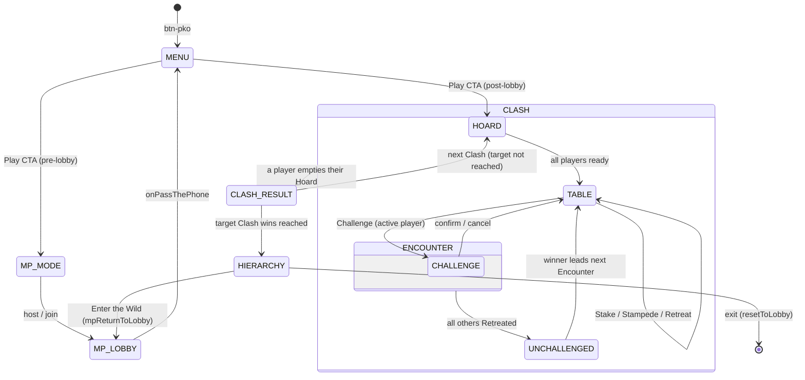

# New Game Technical Spec — Pecking Order
**Document type:** Phase 2 — Technical Specification
**Abbreviation:** `pko`
**Source brief:** `docs/new-ideas/new-game-brief-pko.md` (draft **v6**, 31 July 2026)
**Status:** ✅ **CONFIRMED — Stage 2 gate cleared 31 July 2026.** All of §16's questions are resolved and §17's deviations (D1 reversed to overlay, D2–D9 otherwise as spec'd) are confirmed. Stage 3 (Protocol B skeleton-first, per `docs/rules/phase-audit.md`) is the next phase gate — not yet started.

**Scope:** v1 = the core climbing loop, MDLM only. **Force of Nature (brief §7) is Phase 2 and is out of scope for this spec** — no event engine, no Mimic card, no FoN event screen. §12 records the Phase 2 shape only.

---

## Consistency Audit

Run against `game-identities.md`, `docs/code-map.md`, `engine.js`, and `css/styles.css` before anything else.

| Check | Finding |
|-------|---------|
| Terminology collisions across the 16 games | ✅ **Clean.** Grepped `game-identities.md` for Watering Hole, Apex, Hoard, Encounter, Stampede, Retreat, Clash, The Trail, Hierarchy, Bottom Feeder, Scavenge, Poacher, Ambush — **zero matches**. Checked NAT specifically (the other animal game): it owns a documentary/biologist register (The Specimen, The Mole, Lead Biologist, The Grouping, The Field Notes, The Selection, The Classification, The Last Stand). No overlap with PKO's predator/prey register. This matches brief §13's explicit intent. |
| `pill-active-[colour]` exists for the brand? | ❌ **Does not exist.** `yellow-800` has no Tailwind-utility brand set in the suite. Needs new `pill-active-pko`, `game-toggle-on-pko`, `pko-range`, `pko-cta`, `pko-label` in `css/styles.css`, following the DYB/GTH/FRT custom-colour precedent. CSS-only — no SW bump for this. |
| Abbreviation conflict? | ✅ **`pko` is free.** Existing prefixes: `li5`, `gm`, `ss`, `jec`, `ygi`, `lttp`, `nat`, `dsd`, `gth`, `dyb`, `bld`, `pass`, `nt`, `frt`, `shp`, `flw`. Grepped the whole repo for `pko` — zero hits. |
| Screen ID conflict in `allScreens[]`? | ✅ **None.** No `screen-pko-*` exists. |
| New data file needed? | ✅ **Yes** — `data/pko-data.json`. Cannot reuse `words.json` (needs `beaten_by` adjacency, `track`, `copy_formula`) or `ygi-data.json`. No existing data file collides. |
| Reusable engine functions / shared modules? | `showWhoFirst()` — **not applicable** (not a team game). `normaliseWord()` — **not needed** (no text input anywhere). `Cards` module (`js/lib/cards.js`) — **not reused**: it builds standard playing-card faces (rank+suit) and its CSS is `pass-`-prefixed and Pass-specific (flagged in `pass-impl-notes` Template Gaps). PKO gets its own `pkoRenderCard` seam, matching FRT/SHP/FLW. `assetFace`/`assetBack` (`js/secret-mode.js`) — **reused** for skins. `mpSendPrivate`/`mpStartPrivateListener` — **reused** for private Hoards. Pass-gate pattern — **not needed** (MDLM: every device shows its own private data; no physical handover). |

**Flags:**
1. ~~🔴 Blocking — see §16 Q1.~~ ✅ **Resolved 31 July 2026** — option (a), Poacher-on-board stays an unbeatable Mark via the normal chain (a single Poacher already clears it under the existing wildcard rule). §7 is finalised.
2. ⚠️ Four warm-yellow games now (JEC amber-500, BLD yellow-500, FRT banana `#FFC700`, PKO `yellow-800`). `yellow-800` is dark enough to read as brown and should separate on the lobby tile row — confirm visually at build time.
3. ⚠️ PKO is the **first game in the suite to precache bitmap art**. See §10 and §16 Q6.

---

## §1 — Identity

| Field | Value |
|-------|-------|
| Full name | Pecking Order |
| Short ID / abbreviation | `pko` |
| Plugin file | `js/games/pko.js` |
| Brand colour | `#854D0E` (Tailwind `yellow-800` — deep amber-brown, savanna) |
| Active pill class | `pill-active-pko` — **must be added** to `css/styles.css` |
| Lobby button ID | `#btn-pko` |
| Play CTA label | **Enter the Wild** |
| Menu tagline | Know the food chain. Become the Apex. |
| Emoji | 🐘 |
| Custom CSS classes needed | `pko-cta` (bg `#854D0E`, hover `#6B3E0B`, **must declare `display:flex; align-items:center; justify-content:center`** per the DYB lesson), `pko-label`, `pill-active-pko`, `game-toggle-on-pko`, `pko-range` (gradient `#F5E6C8 → #854D0E`), `pko-card-asset` |

---

## §2 — State Flow

MDLM-only. There is **no** single-device path and **no** name-entry setup screen — `mpPlayerSlots[i].nickname` is already populated when `onPassThePhone` fires.



**Turn-window rule (the loop's termination condition).** After every board change (Stake, successful Challenge, or Stampede), the response window **restarts clockwise from the player after the one who changed the board**, and `pkoRetreatedSince` resets to all-`false`. The Encounter ends when every player *other than* the board owner has Retreated since the last board change. A Retreat is not a lock-out — a player who Retreated re-enters the window on the next board change. This terminates: each board change requires N−1 Retreats to end, and each Challenge consumes cards from a finite Hoard.

**Sub-states within screens:**

| Screen | Sub-states | State variable |
|--------|-----------|----------------|
| `screen-pko-table` | `active-stake` (you lead, board empty) / `active-respond` (you may Challenge/Stampede/Retreat) / `waiting` (read-only, not your turn) | derived from `pkoTurnIdx === mpMyPlayerIdx` and `pkoMarks.length === 0` |
| `pko-challenge-overlay` *(overlay, not a screen — see §17 D1)* | `building` / `complete` (all slots filled → Confirm enabled) | derived from `pkoDraft.every(v => v !== null)` |

**Pass-the-phone gate points:** **None.** MDLM gives each player their own device; private Hoards go over the private Firebase channel. The `logic-engine.md` pass-gate rule is triggered by *physical handover*, which does not occur here. (Same reasoning as FLW.)

**`showWhoFirst()` usage:** Not applicable — individuals, not teams. First Clash leader is chosen randomly by the host (§6).

**Screen layout — every screen is the Stack.**

| Screen ID | Header | Stage | Controls |
|-----------|--------|-------|----------|
| `screen-pko-menu` | *(menu pattern — `absolute top-4 right-4` sound button, content-height section, no `min-h-screen`)* | 🐘 + title + tagline | Play CTA / How to Play / Settings / ← Back to the Box |
| `screen-pko-hoard` | "Clash N" + `[?]` 🔊 ✕ | Dealt Hoard fan + card count | "I'm Ready" |
| `screen-pko-table` | "Clash N · Encounter M" + turn indicator + `[?]` 🔊 ✕ | Active Marks row, player strip (name + Hoard count + Retreated flag), Trail button, FoN label slot *(Phase 2, hidden)* | Stake / Challenge / Stampede / Retreat *(active player only; all `.btn-mp-action`)* |
| `screen-pko-unchallenged` | *(no chrome — brief interstitial)* | Winner name + winning Marks | auto-advance (2.5 s) |
| `screen-pko-clash-result` | "Clash N complete" + 🔊 ✕ | Winner + points + standings | "Next Clash" *(host-gated)* |
| `screen-pko-hierarchy` | "The Hierarchy" + 🔊 ✕ | Ranked standings (Apex Predator / Bottom Feeder) + Clash history grid | "Enter the Wild" / "Leave the Wild" |

**Challenge builder is `pko-challenge-overlay`, not a screen** — see §17 D1 (reversed to overlay 31 July 2026) and §8 for its layout (Header "Answer the Marks" + `[?]` 🔊 ✕; content Marks row → Challenge slot row → Hoard fan; Controls Confirm / Reset / Cancel — same content, delivered as a Pattern 1 Data Overlay instead of a Stack screen).

All screens use `<section class="flex items-center justify-center w-full min-h-screen px-5 py-8 overflow-y-auto">` wrapping ONE `flex flex-col w-full max-w-sm gap-4` column. **No `h-screen` sticky-footer** — including `screen-pko-table`, which has the long Hoard fan. The fan scrolls horizontally *within its own row*; the Stack scrolls vertically as a unit. `pko-challenge-overlay`'s Hoard fan instead scrolls within the overlay's own `overlay-data-inner` (80vh cap) — see §8.

---

## §3 — Screen Registry

| Screen ID | Purpose | Notes |
|-----------|---------|-------|
| `screen-pko-menu` | Main hub | Play CTA branches on `syllyMultiplayerMode` (see §11) |
| `screen-pko-hoard` | Private deal reveal at the start of each Clash | Own Hoard only; confirm ready |
| `screen-pko-table` | Main play — Marks, player strip, actions | Read-only for non-active players |
| `screen-pko-unchallenged` | Encounter-winner interstitial | Auto-advances |
| `screen-pko-clash-result` | Clash winner + Match standings | Host-gated "Next Clash" |
| `screen-pko-hierarchy` | Game over — final standings + Clash grid | Play-again + exit |

**Total new screens: 6** — all must be added to `allScreens[]` in `engine.js`. The Challenge builder (`pko-challenge-overlay`) is registered in the overlay registry instead (§8), not `allScreens[]`.

Shared multiplayer screens (`screen-mp-mode`, `screen-mp-lobby-host`, `screen-mp-lobby-join`, `screen-mp-roster`) are **reused as-is**, not rebuilt.

**Team setup screens:** Not applicable — not a team game.

---

## §4 — State Variables

```javascript
// ── Settings (persist between play-agains) ─────────────────────────────────
let pkoClashTarget    = 3;         // 3 | 5 | 7      — Clashes to Win
let pkoHoardSize      = 12;        // 10 | 12 | 15   — cards dealt per player
let pkoPoacherSetting = 'perPlayer'; // 'none' | 'flat3' | 'perPlayer'
let pkoScavenge       = false;     // draw 1 from Reserve on Retreat
let pkoSyllyMode      = false;     // Force of Nature — PHASE 2, setting present but inert in v1

// ── Roster (from mpPlayerSlots — no setup screen) ──────────────────────────
let pkoPlayerCount    = 0;
let pkoPlayerNames    = [];        // populated from mpPlayerSlots[i].nickname

// ── Match state (reset each play-again) ────────────────────────────────────
let pkoScores         = [];        // int per player — Clashes won
let pkoClashNum       = 0;
let pkoClashHistory   = [];        // [[1,0,0,0], ...] one row per Clash — drives the Hierarchy grid

// ── Clash state (reset each Clash) ─────────────────────────────────────────
let pkoHoards         = [];        // HOST ONLY: array of arrays of card ids (all players)
let pkoMyHoard        = [];        // THIS DEVICE: own card ids — the only hand a client ever holds
let pkoHoardCounts    = [];        // public: int per player, mirrored to all devices
let pkoReserve        = [];        // HOST ONLY: undealt card ids
let pkoWateringHole   = [];        // HOST ONLY: discarded card ids
let pkoLeaderIdx      = 0;         // opens the current Encounter
let pkoEncounterNum   = 0;
let pkoTrail          = [];        // [{ enc, entries: [...] }] — match log, rebuilt each Clash
let pkoHoardReady     = [];        // readyCheck matrix for the deal screen

// ── Encounter state (reset each Encounter) ─────────────────────────────────
let pkoMarks          = [];        // array of card ids — ALWAYS one id per Mark, never nested
let pkoMarkOwnerIdx   = -1;        // who owns the current board (last successful play)
let pkoTurnIdx        = 0;         // whose turn it is
let pkoRetreatedSince = [];        // bool per player — resets on every board change

// ── Turn / UI state ────────────────────────────────────────────────────────
let pkoDraft          = [];        // Challenge builder: card id or null, one per Mark — same length as pkoMarks
let pkoSelectedSlot   = -1;        // Method A: selected Mark slot, -1 = none
let pkoChain          = null;      // loaded data/pko-data.json, keyed by id
let pkoBeatenByMap    = {};        // id -> Set(predator ids)   — from the data file
let pkoBeatsMap       = {};        // id -> Set(prey ids)       — DERIVED at load, never stored
```

**Variables derived at runtime (never stored):**
- `pkoBeatsMap` — inverted from `beaten_by` in `pkoLoadChain()`. The data file stores `beaten_by` only. *(Brief §9: storing both guarantees drift.)*
- `canStampede` — `pkoMarks.length > 0 && new Set(pkoMarks).size === 1 && countInHoard(pkoMarks[0]) >= pkoMarks.length + 1`
- Rank / Apex Predator / Bottom Feeder on the Hierarchy screen — computed from `pkoScores` at render.

**Note on `pkoHoards` vs `pkoMyHoard`:** the host holds every Hoard because it is authoritative for dealing, legality, and Clash-end detection. Clients hold **only** `pkoMyHoard`, delivered over `mpSendPrivate`. `pkoHoardCounts` is the public mirror every device uses to render the player strip.

---

## §5 — Settings

**Settings overlay title block:**
- Heading: `The Conditions 🌿`
- Subtitle: `Set the terms of the territory.`

| Setting name (display) | Options (display) | Default | Internal variable | Internal values |
|---|---|---|---|---|
| Clashes to Win | 3 / 5 / 7 | 3 | `pkoClashTarget` | `3` / `5` / `7` |
| Hoard Size | 10 / 12 / 15 | **12** | `pkoHoardSize` | `10` / `12` / `15` |
| Appetite | Sated / Ravenous | **Sated** | `pkoAppetite` | `'sated'` / `'ravenous'` |
| Poacher Cards | None / Three / One Each | **One Each** | `pkoPoacherSetting` | `'none'` / `'flat3'` / `'perPlayer'` |
| Scavenge on Retreat | OFF / ON | OFF | `pkoScavenge` | `bool` |
| ✨ Sylly Mode (Force of Nature) | OFF / ON | OFF | `pkoSyllyMode` | `bool` — **inert in v1, see §12** |

**Plain-English card descriptions:**

| Setting | Description text |
|---|---|
| Clashes to Win | How many Clashes it takes to win the Match. |
| Hoard Size | How many cards each player is dealt at the start of every Clash. Bigger Hoards mean longer Clashes. |
| Appetite | How far down the chain a predator will reach. Ravenous means a Leopard also takes Mice, not just Mongooses — fewer Encounters go unanswered, which suits smaller tables. Sated is the strict chain: you only ever eat your direct prey. |
| Poacher Cards | How many Human wildcards go into the Pool. A Poacher wins any single Mark outright — and nothing else. One Each keeps pace with bigger tables. |
| Scavenge on Retreat | Draw a card when you Retreat. More options for later — but this is a race to empty your Hoard, so it's one more card to shed. |
| ✨ Sylly Mode | *(Force of Nature — description per brief §7 when Phase 2 ships.)* |

**Difficulty-setting exemption:** PKO does not draw from `words.json`, so it has **no word-difficulty tier**. Exempt under the non-word-bank carve-out in `logic-engine.md` (same basis as PASS, DYB, GTH, FRT). **Hoard Size** is the velocity dial. Recorded here so the Phase-Gate audit does not flag the absence.

**Locked/disabled settings in Lobby Mode:** None — but every setting is host-owned and broadcast via `mpSerialiseSettings`. Clients' settings UI is read-only once in a lobby.

**Appetite is load-bearing, not cosmetic** *(added playtest round 2, July 2026)*. The host re-validates every Challenge with `pkoBeats()`, so a client on a different Appetite would have legal plays silently rejected — the dead-button shape of BUG-02. It **must** appear in both `mpSerialiseSettings` and the SETTINGS_SYNC applier.

**Why the default is Sated.** Appetite and Swarm (§7) both attack the same round-2 symptom — too many Unchallenged Encounters — by different routes. Shipping both on would make round 3 unattributable. Swarm is the stronger candidate (it fixes the observed mouse/fish stall directly), so it ships as a core rule and is measured against the known baseline chain; Appetite ships fully built but off, as a table-side A/B dial. Revisit the default once round 3 has data.

---

## §6 — Scoring Logic

| Outcome | Who scores | Points | Formula | Clash end? |
|---|---|---|---|---|
| Player plays their last card (via Stake, Challenge, or Stampede) | That player | 1 | flat | **Yes — immediately** |
| All other outcomes | Nobody | 0 | — | No |

**Clash-end detection is host-authoritative and fires *before* the board resolves.** The moment a play empties the player's Hoard, the host stops processing the Encounter, awards the point, and broadcasts `PKO_CLASH_END`. Emptying on a Stake counts identically to emptying on a Challenge.

**Match end:** `pkoScores[i] >= pkoClashTarget` → Match ends, `PKO_MATCH_END` broadcast, all devices show `screen-pko-hierarchy`.

**Ties:** In v1, exactly one player can empty their Hoard per Clash, so **simultaneous scoring is impossible** and no tiebreak is required. (Brief §4's "ties are possible" arises only from the Phase 2 Extinction Event.) Players may still finish the **Match** level-pegged on points below first place — the Hierarchy screen shares rank numbers for equal scores.

**Leadership:**
- First Clash of a Match: `pkoLeaderIdx = randomInt(pkoPlayerCount)`, chosen by the host.
- Every later Clash: opened by the previous Clash's winner.
- Within a Clash: each Encounter is opened by the previous Encounter's Unchallenged winner.

**Scoring function:** `pkoResolveClash(winnerIdxs)` — increments `pkoScores` for every winner, pushes one row onto `pkoClashHistory`, decides Clash-vs-Match end. Took a single index until Force of Nature; Extinction Event can empty several Hoards at once.

**Zero-sum check:** exactly 1 point enters the game per Clash, and a Match is 3–7 Clashes. Spread is tight and readable; the Clash history grid (brief §18) carries the narrative that a bare score can't.

---

## §7 — Validation Rules

**The single-source predicate.** All legality flows through **one** function, per the rule elevated during Protocol C:

```javascript
// The ONLY place "does A beat B?" is decided. Every call site uses this —
// builder highlighting, confirm gating, host re-validation, Stampede availability.
// Phase 2's Great Reversal becomes a one-line inversion here, not an edit at every call site.
function pkoBeats(markId, cardId) { … }

// The active predator set for the current Appetite (§5). pkoBeats reads through it, and so
// does the chain overlay — so Sated and Ravenous can never disagree at a single call site.
function pkoPredators(markId) { … }

// Per-SLOT legality — the Swarm predicate. One card => the chain. Two => a Swarm.
function pkoAnswers(markId, cards) { … }
```

### Swarm *(restored playtest round 2, July 2026)*

> A Challenge answers each Mark with one card. Alternatively, any single Mark may be **Swarmed** — answered with **two cards of that Mark's own species**. Each Swarmed card then becomes a Mark of its own, so the board comes back one Mark wider.

| Question | Ruling | Why |
|---|---|---|
| Swarm size | **Exactly 2** (Mark count + 1) | Mirrors Stampede's exact `pkoMarks.length + 1`. Stops a player dumping five cards onto one Mark to build an unanswerable board. |
| Species | **Must match the Mark** | It is a per-slot mini-Stampede. Any other species is just a Challenge. |
| Multiple slots per Challenge | **Allowed** | Answer one Mouse with a Mongoose and the other with 2× Mouse — three cards shed against a two-wide board. |
| Poachers | **Cannot Swarm, cannot be Swarmed** | Poacher is solo-only (brief v6): it cannot satisfy a Stampede threshold, so not a Swarm one either. |

**Why the brief-v6 cut does not apply.** Swarm was removed because of `pko_log1.md` blocker #1 — *"a slot holds Mongoose ×2; does one Leopard beat it, or two?"* That ambiguity only exists **if a slot can hold more than one card**. Here it cannot: a Swarm's cards immediately become one Mark each, so `pkoMarks` stays flat and a slot still holds exactly one card. The invariant v6 was protecting survives untouched. The separate v6 casualty **Mob** (cards answering one Mark and *staying* stacked) remains cut — that is the idea that created the depth-parity problem.

**Board growth is not new.** `pkoSubmitStampede` already returns the board one Mark wider. Swarm is the per-slot version of a shipped mechanic, which is also why it self-limits: every Swarm makes the next answer harder, so Encounters close faster rather than spiralling.

**Stampede vs Swarm.** Swarm beats **one Mark** with two of its own kind; Stampede beats the **whole board** with one more than it holds. Stampede is cheaper on wide uniform boards (a 3-board costs 4 cards vs 6 to Swarm every slot). They coincide exactly on a 1-Mark board — harmless, and noted in the how-to rather than special-cased away.

**Stampede button visibility — deviation from the table below.** The Stampede button is **shown disabled with its price** (`Stampede — needs 3 × Fish`) whenever the board is uniform but the player is short, and hidden only on a mixed board where it can never apply. Hiding it entirely meant the N+1 rule was invisible at the one moment it mattered, and a player could finish a whole match without learning the action exists. See §17 D10.

| Input | Block condition | Error message | Feedback |
|---|---|---|---|
| Stake | Cards are not all the same species | "A Stake is one species only." | shake the offending card |
| Stake | A Poacher is included | "A Poacher can't be Staked as an animal." | shake |
| Stake | Zero cards selected | Confirm button stays disabled | — |
| Challenge — per slot | `!pkoSlotAccepts(pkoMarks[i], group)` | **A named reason** under the slot row, e.g. "A Fish can't beat a Fish — you need two to Swarm it." Derived from `pkoPredators()` so it cannot drift from `pkoBeats`. *(Was silent; changed round 2 — see §17 D10.)* | shake the card in the fan; no assignment |
| Challenge — Swarm slot | `cards.length === 2` and both are the Mark's own species and neither is a Poacher | half-built Swarm shows a dashed slot + "Tap one more Fish to finish the Swarm." | — |
| Challenge — Swarm slot | `cards.length > 2` | *(silent)* | rejected — a Swarm is exactly 2 |
| Challenge — Poacher-Mark slot | *(never blocks)* — `pkoBeats(markId, cardId)` returns `true` whenever `cardId` is a Poacher, for **any** `markId`, including when `markId` is itself a Poacher-Mark left on the board from a prior Challenge (§16 Q1). This is the wildcard rule, not a chain lookup — no special-case branch needed in `pkoBeats()` beyond checking `cardId`'s species first. | — | — |
| Challenge — confirm | Any slot still `null` | Confirm button stays disabled | — |
| Stampede | `new Set(pkoMarks).size !== 1` | Button hidden entirely | — |
| Stampede | Real copies of the species in Hoard `< pkoMarks.length + 1` | Button hidden entirely | — |
| Stampede | Player tries to include a Poacher toward the threshold | Not offerable — Poachers are excluded from the count | — |
| Any action | `pkoTurnIdx !== mpMyPlayerIdx` | All action buttons hidden (read-only mode) | — |
| Any action | `window.syllySyncLocked` | `.btn-mp-action` greyed by the `mp-sync-locked` body class | — |

**Host re-validation is mandatory.** Every ACTION arriving at the host is re-checked against the host's own board state before being applied. A client's UI could be stale by one packet; the host is the authority. A rejected ACTION is dropped silently and the host re-broadcasts the current board (`PKO_BOARD`) to resynchronise the sender.

**Shake animation** — the standard re-trigger, which silently no-ops without the reflow:
```javascript
el.classList.remove('shake'); void el.offsetWidth; el.classList.add('shake');
```

**Stemmer / fuzzy match:** **Not needed.** PKO has no text input — `normaliseWord()` is not used anywhere.

---

## §8 — Overlay Registry

| Overlay ID | Pattern | z-index | Trigger | Notes |
|---|---|---|---|---|
| `pko-settings-overlay` | Data (slide-up) | z-[80] | `#btn-pko-menu-settings` | Title block "The Conditions 🌿"; `scrollTop = 0` on open |
| `pko-challenge-overlay` | Data (slide-up) | z-[80] | `.btn-pko-challenge-open` (from `screen-pko-table`'s Challenge action) | **Reversed from a full screen — §17 D1, 31 July 2026.** Header "Answer the Marks" + `[?]` 🔊 ✕; body (within `overlay-data-inner`, 80vh) is Marks row → Challenge slot row → Hoard fan; Controls Confirm / Reset / Cancel. Marks + slot rows should sit near the top so they stay visible as the Hoard fan scrolls beneath them. `pkoDraft` sub-state (`building`/`complete`) drives the Confirm button exactly as it would on a screen — see §2. |
| `pko-how-to-overlay` | Data (slide-up) | z-[90] | `#btn-pko-menu-how-to`, `#btn-pko-how-to` | Inline `[?]` links open the chain overlay |
| `pko-chain-overlay` | Data (slide-up) | z-[90] | `#btn-pko-chain`, tap-hold any card, inline `[?]` in how-to | The food-chain reference. **Three entry points, one overlay.** |
| `pko-trail-overlay` | Data (slide-up) | z-[90] | `#btn-pko-trail` | Clashes as left/right cards; Encounters collapsible within |
| `pko-quit-overlay` | Decision modal | z-[80] | `.btn-pko-quit-open` | `border border-[#C9A227]` |
| `pko-stampede-overlay` | Decision modal | z-[90] | `#btn-pko-stampede` | Confirms "Stampede with [species] ×N?" |
| `pko-new-match-overlay` | Decision modal | z-[90] | `#btn-pko-go-new` on Hierarchy | Required — never restarts directly |

**Shared tip overlay:** **Not needed.** The chain overlay is the game's one contextual reference, reachable from three places. There are fewer than 3 *distinct* tip topics, so the `[abbr]-tip-overlay` pattern would be overhead.

**Quit overlay copy:**
- Emoji: 🐾
- Heading: **Abandon your territory?**
- Subtext: This Clash ends here. Your Hoard, your Marks, and everything you've claimed go back to the wild.
- Confirm: **Yeah, walk away.**
- Cancel: **Not yet!**

**Play-again overlay copy:**
- Emoji: 🐘
- Heading: **New Match?**
- Subtext: Scores reset and the Pool is rebuilt from scratch. Same players, same conditions.
- Confirm: **Enter the Wild** *(host)* / **Leave Session** *(client)* — label set dynamically on open
- Cancel: **Stay here**

**Exact inner div class strings — verbatim:**

```html
<!-- Pattern 1 — data slide-up -->
<div class="overlay-data-inner settings-slide-up bg-stone-50 w-full max-w-sm rounded-t-3xl flex flex-col">

<!-- Pattern 2 — decision modal -->
<div class="overlay-modal-inner bg-stone-50 w-full max-w-sm rounded-3xl px-6 pt-6 pb-8 flex flex-col gap-4 text-center border border-[#C9A227]">
```

---

## §9 — Audio Map

| Game moment | Audio function | Notes |
|---|---|---|
| Game entry / Play CTA | `playLaunch()` | existing |
| Settings pill toggle | `playPillClick()` | existing |
| Close / confirm overlay | `playDone()` | existing |
| Quit confirm | `playExit()` | existing |
| Card assigned to a slot (valid) | `playSuccess()` — subtle variant | existing |
| Invalid card tap | `playBoing()` | existing |
| Retreat | `playWhoosh()` | existing — brief's "receding footsteps" is not synthesisable; a descending filtered whoosh is the nearest honest equivalent |
| Sylly Mode toggle | `playSyllyOn()` / `playSyllyOff()` | existing |
| Stampede confirmed | **[NEW AUDIO NEEDED]** `playStampede()` | Sub-bass swell (sawtooth ~40 Hz) + rising filtered-noise layer, ~1.2 s. Model on `playAbyssThud()`. |
| Unchallenged | **[NEW AUDIO NEEDED]** `playUnchallenged()` | Rising three-note sting, brass-ish (sawtooth + lowpass). The brief's "triumphant animal call" cannot be synthesised — see §16 Q4. |
| Poacher played | **[NEW AUDIO NEEDED]** `playPoacher()` | Dry mechanical click + short metallic ring — deliberately out-of-ecosystem. Synthesises cleanly. |
| Clash win (empty Hoard) | **[NEW AUDIO NEEDED]** `playClashWin()` | Deepened `playSuccess()` family. "Apex roar" is sample-only — see §16 Q4. |

**Hard constraint:** all audio is Web Audio synthesis; the suite ships no audio files. Four new functions, all added to `engine.js` (game-specific `play*()` in the engine is precedented — see DSD's `playSonarPing`/`playHullThud`/`playAbyssThud`). The remaining brief §19 moments (card rustle, ambient beds, scavenge crunch) are either covered by existing functions or deferred — see §16 Q4.

---

## §10 — Word Bank & Data

**Source:** new file — `data/pko-data.json`.

**Entry schema:**
```json
{
  "id": "elephant",
  "name": "Elephant",
  "emoji": "🐘",
  "track": "land",
  "beaten_by": ["bee"],
  "reach_beaten_by": [],
  "special": "giant-killer-target",
  "copy_formula": "2n",
  "force_of_nature_only": false
}
```

`beaten_by` is the **single source of truth** for the strict (Sated) chain. `beats` is **not stored** — `pkoLoadChain()` derives `pkoBeatsMap` by inverting it.

`reach_beaten_by` *(added July 2026)* carries the **Ravenous** two-tier edges only, and is never merged into `beaten_by`. `pkoLoadChain()` builds **both** predator maps at load — `pkoBeatenByMap` (Sated) and `pkoBeatenByWide` (= `beaten_by ∪ reach_beaten_by`) — because both are deterministic from the file; `pkoAppetite` then only *chooses* between them, so changing the setting never reloads the chain. `reach_beats` is likewise never stored.

**The six Ravenous edges** — one new prey each for six predators, symmetric across both tracks:

| Land | Sea |
|---|---|
| Leopard → Mouse | Seal → Fish |
| Bear → Mongoose | Polar Bear → Octopus |
| Elephant → Leopard | Orca → Seal |

**The apex band is untouched by design.** Nothing sits two tiers above Bear, Elephant, Polar Bear, Orca, Stingray or Eagle, so their predator sets are **identical under both Appetites** — big cards stay scary, and the change cannot flatten the top of the chain into numeric rank. `verify-pko-chain.js` asserts this directly.

**The full chain (from brief §9 — transcribe verbatim into the data file):**

| id | Track | `beaten_by` | Copies |
|---|---|---|---|
| `mouse` | land | `["mongoose","eagle"]` | 4n |
| `mongoose` | land | `["eagle","leopard"]` | 3n |
| `leopard` | land | `["bear"]` | 3n |
| `eagle` | land | `[]` | **1.5n** → 5 / 6 / 8 / 9 |
| `bear` | land | `["elephant"]` | 3n |
| `elephant` | land | `["bee"]` | 2n |
| `bee` | land | `["bear"]` | 3n |
| `fish` | sea | `["mongoose","octopus","eagle"]` | 4n |
| `octopus` | sea | `["seal"]` | 3n |
| `seal` | sea | `["polar_bear"]` | 3n |
| `polar_bear` | sea | `["orca"]` | 2n |
| `orca` | sea | `["stingray"]` | 2n |
| `stingray` | sea | `["orca"]` | 2n |
| `human` | wild | `[]` | 0 / 3 / **n** *(setting; default `n`)* |

**Four invariants that must not be "tidied" — and they hold under BOTH Appetites:** Eagle has no predator; Eagle and Leopard are siblings (neither beats the other); Orca↔Stingray is a closed pair; Mongoose and Eagle are the only cross-track reach. *(Under Ravenous, Seal also reaches Fish — but Seal is sea, so "only Mongoose + Eagle are cross-track" still holds.)* Track-locking is emergent, not a coded rule — do **not** add a track check to `pkoBeats()`. The harness runs every invariant twice, once per Appetite.

**Pool totals** (default settings — Eagle `1.5n`, Poacher `n`):

| n | Pool | Dealt (12×n) | Reserve | Dealt ratio |
|---|---|---|---|---|
| 3 | 110 | 36 | 74 | 32.7% |
| 4 | 146 | 48 | 98 | 32.9% |
| 5 | 183 | 60 | 123 | 32.8% |
| 6 | 219 | 72 | 147 | 32.9% |

*(Arithmetic verified independently against the copy formulas.)* `pkoBuildPool(n)` must reproduce these exactly — they are the cheapest correctness check available at Stage 3.

**Eagle rounds up:** `Math.ceil(1.5 * n)` → 5 / 6 / 8 / 9. Do not use `Math.round` (it gives 4 at n=3 via banker's-adjacent behaviour in some engines, and 8 at n=5 either way — `ceil` is unambiguous).

The dealt-to-Pool ratio is **~33%**, constant across table sizes. The design's stated intent was ~40%; what actually mattered was *constancy across n*, which holds. The level dropped as a side effect of Hoard 15 → 12 in the v7 balance pass. See §18.

**Content guide:** **not required.** The card set is fixed and deterministic — 15 entries, no authored content to expand. `docs/ygi-content-guide.md`-style guides exist for banks that grow; this one doesn't.

**Add `data/pko-data.json` to `sw.js` `PRECACHE_URLS` and bump the SW version.**

**Secret Mode:** `pkoApplyExpansionOverrides()` — plugin-prefixed, never bare. Called at the settings-apply point. There is **no word-pool substitution** (no word bank); PKO's Secret Mode surface is asset skins only.

**Custom assets (asset-pack readiness):**

| Field | Value |
|---|---|
| Visual primitive | Animal card |
| Render-seam function | `pkoRenderCard(id, opts)` → DOM node; `opts.faceDown`, `opts.alpha` *(Phase 2)*, `opts.size` |
| Id key | The card id string (`'elephant'`, `'human'`) — stable, packet-safe, identical across all skins |
| Asset `kind` string | `'pko'` |
| Default v1 look | Illustrated art (see below), **with emoji fallback** |

Seam contract — reuse the shipped system, do **not** invent a parallel `skin` parameter:
```javascript
const url = (typeof assetFace === 'function') && assetFace('pko', id);
// → if url, return an image node with class 'pko-card-asset'; else build the default face
```
Same for backs via `assetBack('pko')`. **No card DOM is built anywhere outside this seam** — a bypass is unskinnable (DYB's old cup-die bypass is the cautionary case).

Add `{ id: 'pko', label: 'PECKING ORDER', screen: 'screen-pko-menu' }` to `SM_GAMES` in `js/secret-mode.js` so skins are launchable from the terminal.

**Default art.** Brief §9A wants ~53 illustrated assets shipped as core precached files. Two consequences to settle before generation (§16 Q6):
1. The seam must render **emoji when art is absent**, so implementation is not blocked on the art run. This costs one `||` branch and de-risks the schedule; "no emoji fallback at launch" remains true as a *shipping* statement.
2. PKO is the first game to precache bitmaps. Set a byte budget up front — WebP at ~30–40 KB/card → ~2 MB install.

**Reskin name overrides — a genuine gap.** Asset packs currently carry **images only** (`assets.faces`, `assets.back`). Aussie Fauna renaming Fish → Barramundi needs a new optional `names` field on the pack manifest, read by `pkoRenderCard` for the card's label. Small and clean; spec it into `docs/expansion-guide.md` when the first reskin ships. Not required for v1.

---

## §11 — Multiplayer Configuration

| Field | Value |
|---|---|
| Multiplayer mode | **MDLM only** — Individual Devices. `supportedModes: ['mdlm']`, `multiplayerOnly: true` |
| New MP screens | None — reuses `screen-mp-mode`, `screen-mp-lobby-host`, `screen-mp-lobby-join`, `screen-mp-roster` |
| Roster | `rosterConfig: { type: 'none' }` — seating is turn order, assigned automatically. **Never `'individual'`** (unassigned players produce `reordered[-1]` and corrupt the slot array). |
| Player bounds | `getMinPlayers: () => 3`, `getMaxPlayers: () => 6` — **`getMinPlayers` is mandatory**; omitting it is what let BLD start under-strength |
| Authority | Host-authoritative, host-as-participant |

**`MP_GAME_CONFIGS` entry** — every display field present, or the mode screen renders the literal string `undefined`:
```javascript
pko: {
  gameName: 'Pecking Order', emoji: '🐘',
  brandBtnClass: 'pko-cta',
  ptpLabel: 'Enter the Wild', lobbyCtaLabel: 'Enter the Wild',
  menuScreen: 'screen-pko-menu',
  recommendedMode: 'mdlm', supportedModes: ['mdlm'], multiplayerOnly: true,
  rosterConfig: { type: 'none' },
  getMinPlayers: () => 3, getMaxPlayers: () => 6,
  onPassThePhone: () => { /* populate names from mpPlayerSlots, show screen-pko-menu */ },
}
```

**Menu Play CTA has dual context** and must branch — `onPassThePhone` returns players to the menu after lobby setup, so the CTA appears both before and after a lobby exists:
```javascript
document.getElementById('btn-pko-menu-play').addEventListener('click', () => {
  playLaunch();
  if (window.syllyMultiplayerMode !== 'single') pkoStartClash();  // post-lobby
  else mpShowModeScreen('pko');                                    // pre-lobby
});
```

**Name population:** `pkoPlayerNames = mpPlayerSlots.map(p => p.nickname)` — the slot object is `{ uid, nickname }`. **Read `.nickname`, never `.name`** (returns `undefined` silently). No name-entry screen.

**Per-phase intercepts:**

| Game phase | Behaviour | Multiplayer intercept |
|---|---|---|
| Deal | Host builds Pool, shuffles, deals | Host `mpSendPrivate(uid, PKO_HAND)` **per player**; broadcasts `PKO_CLASH_BEGIN { hoardCounts, leaderIdx, clashNum }` |
| Hoard ready | Each player confirms | Client → `ACTION PKO_HOARD_READY`; host marks **its own slot directly**; on `.every(Boolean)` → `SYNC PKO_ENCOUNTER_BEGIN` |
| Stake | Leader plays same-species cards | Client → `ACTION PKO_STAKE { cards }`; host validates → `SYNC PKO_BOARD` |
| Challenge | Active player fills every slot | Client → `ACTION PKO_CHALLENGE { assignments }`; host validates → `SYNC PKO_BOARD`. **`assignments` is one array of ids PER SLOT** — `[['bear'], ['mouse','mouse']]` — because a slot may hold a Swarm. The host flattens it into the new board. *(Shape changed July 2026; host and clients ship together, so there is no compatibility window.)* |
| Stampede | Board-level replacement | Client → `ACTION PKO_STAMPEDE { species, count }`; host validates → `SYNC PKO_BOARD` |
| Retreat | Active player sits out | Client → `ACTION PKO_RETREAT`; host updates + (if Scavenge ON) `mpSendPrivate PKO_DRAW` → `SYNC PKO_BOARD` |
| Encounter end | All others Retreated | Host → `SYNC PKO_UNCHALLENGED { winnerIdx, marks }` |
| Clash end | Someone empties | Host → `SYNC PKO_CLASH_END { winnerIdx, scores, clashHistory }` |
| Next Clash | Host-gated advance | Client button hidden; host → `SYNC PKO_CLASH_BEGIN` (+ fresh private hands) |
| Match end | Target reached | Host → `SYNC PKO_MATCH_END { finalScores, clashHistory }` |

**Missing-handler audit** — every phase where a non-host device can submit, and its required handler in `pkoHandleEnvelope`. All six confirmed present:

| Phase | Non-host can submit? | Required ACTION handler |
|---|---|---|
| Hoard ready | Yes | `PKO_HOARD_READY` ✅ |
| Stake | Yes | `PKO_STAKE` ✅ |
| Challenge | Yes | `PKO_CHALLENGE` ✅ |
| Stampede | Yes | `PKO_STAMPEDE` ✅ |
| Retreat | Yes | `PKO_RETREAT` ✅ |
| Unchallenged interstitial | No — auto-advance | none |
| Clash result → next Clash | No — host-gated | none |
| Hierarchy → play again | Yes | handled by `mpReturnToLobby()` |

**🔴 Host self-submission — the highest-risk item in this spec.** The host is a *full player* in PKO and can Stake, Challenge, Stampede, Retreat, and confirm ready. `engine-multiplayer.js` **drops every envelope where `originId === syllyDeviceUid`**, so a host that submits via `mpSendEnvelope({type:'ACTION'})` is silently ignored and the game hangs. Every one of those five actions must branch:
```javascript
if (window.syllyMultiplayerMode === 'host') {
  pkoApply<Action>(mpMyPlayerIdx, payload);     // mutate host state directly
  mpSendEnvelope({ type: 'SYNC', payload: { action: 'PKO_BOARD', ...state } });
} else {
  mpLockSync();
  mpSendEnvelope({ type: 'ACTION', payload: { action: 'PKO_<ACTION>', ...payload } });
}
```
Reserve `type: 'ACTION'` for clients only. *(This is the NT `NT_ALLOCATION_UPDATE` failure and the JEC/YGI readyCheck failure, generalised.)*

**Private information routing:**

| Information | Sent to | Method |
|---|---|---|
| A player's dealt Hoard | That player only | `mpSendPrivate(uid, { action: 'PKO_HAND', cards })` |
| Scavenge draw on Retreat | That player only | `mpSendPrivate(uid, { action: 'PKO_DRAW', card })` |
| Hoard **counts** (not contents) | Everyone | Public `SYNC PKO_BOARD { hoardCounts }` |

`mpStartPrivateListener()` is already called globally by the engine after room create/join — confirm it is live before the first deal.

**§16 Q1 confirms no new packet is needed.** Poacher-on-board resolved to option (a) — it stays an unbeatable Mark via the existing chain, with no board-shrink logic. `PKO_BOARD` stays exactly as spec'd above (Marks array unchanged in shape); there is no slot-removal event and no additional field to add for the Poacher-as-Mark case.

**Accumulator arrays must reset in the payload, not just locally.** `pkoTrail`, `pkoHoardReady`, `pkoRetreatedSince`, and `pkoClashHistory` all reset between Clashes. Each must appear in `PKO_CLASH_BEGIN` **at its reset value** — the host resets locally, clients never do, and will otherwise carry stale values. *(Elevated to `logic-engine.md` from flw-impl-notes BUG-01 during this phase's Protocol C.)*

**`mpSerialiseSettings`:** must cover all five settings — `pkoClashTarget`, `pkoHoardSize`, `pkoPoacherSetting`, `pkoScavenge`, `pkoSyllyMode`. A missing field means clients silently play different rules.

**readyCheck matrix:** `pkoHoardReady = []` — one bool per player on the deal screen. Host marks its own slot directly (never via a self-sent ACTION); advances on `.every(Boolean)`.

**Sync lock:** `.btn-mp-action` on Stake, Challenge Confirm, Stampede Confirm, Retreat, and I'm Ready.

**Mid-game quit contract** — follow the PASS reference, not the GTH/DYB/BLD divergence:
- **Host quits** → `resetToLobby()` (broadcasts `HOST_END_GAME`, tears down the room).
- **Client quits** → broadcast `PKO_PLAYER_LEFT`, then `resetToLobby()`. Host dissolves the match for everyone.

One player leaving dissolves the match. This is correct — a climbing game cannot continue with a missing Hoard, and it prevents ghost rooms.

---

## §12 — Sylly Mode Technical Spec

**v1: none built.** `pkoSyllyMode` exists as a setting variable and is serialised, but **no code branches on it**. The settings card renders with the Force of Nature description and the toggle functions, but has no gameplay effect in v1.

> **[RESOLVED — §16 Q7, confirmed 31 July 2026]** The v1 settings overlay **ships the `✨ Sylly Mode` card live** — not omitted, not disabled — matching the `ui-style.md` "every game has a Sylly Mode card" standard as written. The toggle is fully wired (`pkoSyllyMode` state, `mpSerialiseSettings`, `playSyllyOn()`/`playSyllyOff()`), but no gameplay branches on it yet. Owner's call: the app isn't live, so a temporarily-inert toggle costs nothing, and Force of Nature (Phase 2) is expected to follow shortly. This is a **documented exception** to the "omit if it does nothing" default in `ui-style.md` — flag it in the Phase-Gate audit so a future reader doesn't mistake the inert toggle for a bug.

**Phase 2 shape** (recorded, not spec'd): Force of Nature — a fixed opener (Invasive Mimicry) plus 9 random events, the Mimic card, an event screen, and per-event rule mutation. The known issues to resolve first are listed in the brief's §7 banner. The v1 architecture already accommodates it: `pkoBeats()` as the single predicate makes The Great Reversal a one-line inversion, and `pkoRenderCard(id, opts)` already takes `opts.alpha`.

---

## §13 — `resetToLobby()` Additions

```javascript
// PECKING ORDER teardown
['pko-settings-overlay','pko-challenge-overlay','pko-how-to-overlay','pko-chain-overlay','pko-trail-overlay',
 'pko-quit-overlay','pko-stampede-overlay','pko-new-match-overlay'].forEach(id => {
  const el = document.getElementById(id);
  if (el) el.style.display = 'none';
});
if (pkoUnchallengedTimer) { clearTimeout(pkoUnchallengedTimer); pkoUnchallengedTimer = null; }
pkoScores = []; pkoClashNum = 0; pkoClashHistory = [];
pkoHoards = []; pkoMyHoard = []; pkoHoardCounts = []; pkoReserve = []; pkoWateringHole = [];
pkoMarks = []; pkoMarkOwnerIdx = -1; pkoRetreatedSince = []; pkoTrail = [];
pkoDraft = []; pkoSelectedSlot = -1;
```

**Timer note:** `pkoUnchallengedTimer` is the auto-advance on the interstitial. Per `logic-engine.md` § Timer Lifecycle it must be cleared in **three** places — the quit-confirm handler, `resetToLobby()`, and any early transition out of the interstitial. There is no RAF loop in PKO.

---

## §14 — `index.html` Section Header

```html
<!-- ════ PECKING ORDER ════
     Screens : screen-pko-menu, screen-pko-hoard, screen-pko-table,
               screen-pko-unchallenged, screen-pko-clash-result, screen-pko-hierarchy
     Overlays: pko-settings-overlay, pko-challenge-overlay, pko-how-to-overlay, pko-chain-overlay, pko-trail-overlay,
               pko-quit-overlay, pko-stampede-overlay, pko-new-match-overlay
  ════════════════════════════════════════════════════════════════ -->
```

Placed after FLW's section, at the end of `index.html`.

⚠️ **This puts PKO's HTML after the `<script>` block.** `engine.js` wires `.btn-open-sound` via a top-level `querySelectorAll` at parse time, which cannot reach later HTML. PKO **must** re-wire its own sound buttons in `DOMContentLoaded`:
```javascript
document.querySelectorAll('#screen-pko-menu .btn-open-sound, #screen-pko-hoard .btn-open-sound, …')
  .forEach(btn => btn.addEventListener('click', openSoundOverlay));
```
FRT is the reference implementation. NT, SHP and FLW all shipped this bug first.

---

## §15 — Implementation Checklist

### Foundation
- [ ] `js/games/pko.js` created with dependency comment header
- [ ] `<script>` tag added to `index.html` after `flw.js`, before `secret-mode.js`
- [ ] All **6** screen IDs added to `allScreens[]` in `engine.js` — `pko-challenge-overlay` is an overlay, not a screen (§17 D1), and is not added to `allScreens[]`
- [ ] Teardown block added to `resetToLobby()` (§13)
- [ ] Section header comment added to `index.html` (§14)
- [ ] `pill-active-pko`, `game-toggle-on-pko`, `pko-range`, `pko-cta`, `pko-label`, `pko-card-asset` added to `css/styles.css`
- [ ] `pko-cta` declares `display:flex; align-items:center; justify-content:center` — not just `background-color`
- [ ] `'pko': 'pko-range'` added to `updateSliderTheme()`; `'pko': 'game-toggle-on-pko'` added to `getMuteToggleOnClass()`
- [ ] Lobby button: `playLaunch(); activeGameId = 'pko'; showScreen('screen-pko-menu');` — exact order, `playLaunch()` mandatory
- [ ] **`DOMContentLoaded` sound-button re-wiring** (§14) — PKO's HTML is after the script block

### Data & Chain
- [ ] `data/pko-data.json` written — 14 entries, `beaten_by` only, no `beats` field
- [ ] `pkoLoadChain()` derives `pkoBeatsMap` by inverting `beaten_by`
- [ ] `pkoBeats(markId, cardId)` is the **only** place legality is decided
- [ ] Unit-check the four invariants: Eagle `beaten_by: []`; Eagle↛Leopard and Leopard↛Eagle; Orca↔Stingray closed; only Mongoose and Eagle reach Fish
- [ ] No track check in `pkoBeats()` — track-locking is emergent
- [ ] `pkoBuildPool(n)` totals match **110 / 146 / 183 / 219** at n=3/4/5/6 (default settings)
- [ ] Eagle count uses `Math.ceil(1.5 * n)` → 5 / 6 / 8 / 9 — not `Math.round`
- [ ] Poacher count honours the setting: `0` / `3` / `n`, default `n`

### Game Menu & Settings
- [ ] Play CTA, How to Play, Settings, ← Back to the Box — all four, in order
- [ ] Menu section is content-height — **no `min-h-screen`** (or the sound button detaches)
- [ ] Play CTA branches on `syllyMultiplayerMode` (§11)
- [ ] Settings cards in order; Sylly Mode per §16 Q7
- [ ] `scrollTop = 0` on open via `.overlay-data-inner` — never `.overflow-y-auto` (returns `null` silently)
- [ ] `pkoApplyExpansionOverrides()` wired — plugin-prefixed, never bare

### Screens
- [ ] Every screen is the Stack — no `h-screen`, no `flex-1`/`flex-shrink-0` split, no `my-auto`
- [ ] `.btn-open-sound` + ✕ on every screen; `#btn-pko-how-to` in every gameplay header, always visible
- [ ] Contextual tip IDs distinct from `btn-pko-how-to` (duplicate IDs leave one permanently unwired)
- [ ] Mid-game ✕ → quit overlay → game menu. Post-game ✕ → `playExit(); resetToLobby()`
- [ ] Transient card-lift animations use an absolutely-positioned layer over a `relative` parent — never in-flow (an in-flow animation re-centres the whole Stack on every play)

### Challenge Builder
- [ ] Opens as `pko-challenge-overlay` (Pattern 1 Data Overlay) from `screen-pko-table`, not a separate screen — §17 D1
- [ ] Method A (Mark-first) and Method B (card-first auto-fill) both work and mix freely
- [ ] Tap-hold anywhere → chain overlay. **No drag.**
- [ ] One card per slot enforced structurally — `pkoDraft` is a flat array of ids, never nested
- [ ] Confirm enabled only when `pkoDraft.every(v => v !== null)`
- [ ] Reset returns all cards to the fan

### Multiplayer
- [ ] `MP_GAME_CONFIGS.pko` complete — all display fields, `getMinPlayers: () => 3`, `getMaxPlayers: () => 6`
- [ ] `rosterConfig: { type: 'none' }`
- [ ] Names from `mpPlayerSlots[i].nickname` — never `.name`
- [ ] **All five host actions use direct-mutate-then-SYNC, never a self-sent ACTION**
- [ ] All six ACTION handlers present in `pkoHandleEnvelope`
- [ ] Host re-validates every incoming ACTION against its own board
- [ ] Private hands via `mpSendPrivate`; `mpStartPrivateListener()` confirmed live
- [ ] `PKO_CLASH_BEGIN` includes every accumulator at its reset value
- [ ] `mpSerialiseSettings` covers all five settings
- [ ] `.btn-mp-action` on all five submittable buttons
- [ ] Quit contract matches PASS (host dissolves; client leaving dissolves for all)
- [ ] Play-again calls `mpReturnToLobby()`; confirm label set dynamically

### Assets
- [ ] All card DOM built in `pkoRenderCard(id, opts)` — zero bypasses
- [ ] Seam reads `assetFace('pko', id)` / `assetBack('pko')`, falls back to default
- [ ] Emoji fallback when illustrated art is absent (§16 Q6)
- [ ] `.pko-card-asset` CSS — cover/centre, transparent border
- [ ] `SM_GAMES` entry added for `pko`

### Service Worker
- [ ] `data/pko-data.json` + `js/games/pko.js` + card art added to `PRECACHE_URLS`
- [ ] SW version bumped (v142 → v143)

### Documentation
- [ ] `docs/code-map.md` — screens, overlays, key functions, ACTION/SYNC packet table (**during**, not at the end)
- [ ] `game-identities.md` — full new game entry (**during**, not at the end)
- [ ] `CLAUDE.md` — structure map, quick index, SW version, current focus
- [ ] `docs/implementation-notes/pko-implementation-notes.md` — created with the four standard sections
- [ ] `docs/decision-log.md` — entry for the v6 rules decisions + the FoN phase split
- [ ] `docs/content-prompts/new-game-brief-prompt.md` — roster table, taken-abbreviations line, Sylly-Mode name list, all from shipped reality
- [ ] Phase snapshot written to the **external** archive (not `docs/archive/`)

---

## §16 — Clarifications Required Before Implementation

| # | Question | Section | Default if unanswered |
|---|---|---|---|
| ~~1~~ | ~~What is a Poacher once it's on the board?~~ A Poacher played in a Challenge wins its Mark and becomes a Mark. Its `beaten_by` is empty. | — | ✅ **Resolved — option (a), confirmed by the project owner 31 July 2026.** Stays as an unbeatable Mark via the normal chain. No separate "beat it with 2 Poachers" mechanic is needed: `pkoBeats(markId, cardId)` already returns `true` whenever `cardId` is a Poacher, for *any* `markId` — including a Poacher-Mark itself — because Poacher's ability is "wins any one Mark outright" (a wildcard rule, not a chain lookup). One Poacher clears a Poacher-Mark under the existing rule text. See §7. |
| ~~2~~ | ~~Eagle copy count~~ | — | ✅ **Resolved in the v7 balance pass** — Eagle `1.5n`, paired with Poacher `n`. See §18. |
| ~~3~~ | ~~Poacher pill labels~~ | — | ✅ **Resolved** — None / Three / One Each, default One Each. |
| ~~4~~ | ~~Sound.~~ Which of brief §19's moments matter? | — | ✅ **Resolved, confirmed 31 July 2026** — build the four new synth functions in §9 (`playStampede`, `playUnchallenged`, `playPoacher`, `playClashWin`); drop the five sample-based moments (animal call, apex roar, night insects, herd thunder, scavenge crunch). |
| ~~5~~ | ~~Hierarchy CTAs.~~ Brief §18 uses "Abandon Territory?" as an end-of-match button. | — | ✅ **Resolved, confirmed 31 July 2026** — **"Enter the Wild"** (play-again) + **"Leave the Wild"** (quit) — the owner preferred the thematic pairing over the spec's originally recommended plain "Leave". |
| ~~6~~ | ~~Art delivery.~~ (a) emoji fallback; (b) byte budget. | — | ✅ **Resolved, confirmed 31 July 2026** — (a) emoji fallback yes; (b) 40 KB/card WebP ceiling confirmed. Illustrated assets themselves are still pending — the owner will point to the source location separately, and they'll need resizing to hit the ceiling. This is a content-delivery dependency, not a spec blocker. |
| ~~7~~ | ~~Sylly Mode card in v1.~~ Force of Nature is Phase 2, so the toggle would do nothing gameplay-wise. | — | ✅ **Resolved — reversed from the spec's original recommendation, confirmed 31 July 2026.** Ship a **live** `✨ Sylly Mode` settings card and how-to step in v1 — not omitted, not disabled. Toggle wired to `pkoSyllyMode` and included in `mpSerialiseSettings` from day one; no gameplay branch reads it yet. Owner's reasoning: the app isn't live, nobody's playtesting the inert control, and Force of Nature is expected shortly after — a documented exception to the "omit if it does nothing" instinct in `ui-style.md`. Needs a Phase-Gate audit note. See §12. |

---

## §17 — Deviations from Phase 1 Brief

| # | Brief said | Spec does instead | Reason |
|---|---|---|---|
| **D1** ⚠️ | Challenge builder: "screen vs overlay — UX decision at Stage 2" (§12) | **Overlay** (`pko-challenge-overlay`, Pattern 1 Data Overlay) | **Reversed after owner review, 31 July 2026** — this row originally chose a full screen (`screen-pko-challenge`) for the reason below, but the owner prioritised the overlay's easier back-out affordance (tap the backdrop / a clear cancel, same instinct as every other quit-style exit in the suite) over the full screen's layout headroom. Accepted trade-off: the Marks row and slot row stay pinned near the top of the overlay, and the Hoard fan scrolls within the 80vh cap (`overlay-data-inner`) rather than getting a whole viewport — exact internal layout is a Stage 3 implementation detail. *(Original reasoning, superseded: a full screen needs the Marks row, a mirrored slot row, and the full Hoard fan simultaneously; a slide-up overlay caps at 80vh and would force the fan into a cramped strip.)* |
| **D2** | "Player setup — player count selector, name inputs" (§11 screen 2) | **No setup screen** | MDLM-only: `mpPlayerSlots[i].nickname` is already populated when `onPassThePhone` fires. BLD is the reference. Building it would create a dead screen. |
| **D3** | `pkoRenderCard()` "must accept a `skin` parameter from day one" (§9A) | Seam calls `assetFace('pko', id)` — **no `skin` parameter** | The shipped cartridge system already provides device-local, ids-only skins — which *is* the mixed-skin multiplayer §9A describes. A parallel `skin` param would be a second system doing the same job. |
| **D4** | 14 screens listed (§11) | **6 new screens** + 1 overlay | Four are shared MP templates (reused, not built), one is the cut setup screen (D2), one is the Phase 2 FoN event screen, and the chain diagram is an overlay, not a screen. The Challenge builder was also a screen in this count originally; D1's reversal (31 July 2026) moves it to the overlay registry (§8), which is why the total is now 6 screens rather than 7. |
| **D5** | Sylly Mode is a listed v1 setting (§6) | Force of Nature deferred to Phase 2 | Owner decision, 31 July 2026. Recorded in brief v6 §12 Out of scope. See §16 Q7 for the settings-card consequence. |
| **D6** | "Trail is public except during Dark Forest" (§10) | Trail is fully public in v1 | Dark Forest is a Phase 2 event. No redaction machinery is built in v1. |
| **D7** | Sound design: 20 moments, several sample-based (§19) | 4 new synth functions + existing engine functions | Hard constraint: the suite ships no audio files. See §9 and §16 Q4. |
| **D8** | Card set is "15 (13 animals + Poacher + Mimic)" (§9A) | **14 entries** in `data/pko-data.json` | Mimic is Force-of-Nature-only, therefore Phase 2. Its entry is added when FoN ships. |
| **D9** | Hoard Size options `10 / 15 / 20` (§6) | **`10 / 12 / 15`**, default 12 | v7 balance pass. Dropping 20 removes the ~2-hour path that Hoard 20 + Clashes to Win 7 would otherwise still allow. The one change in the balance pass the owner did not explicitly request — flag on review if 20 should return. |
| **D10** | Brief v6: "per-slot **Swarm is cut**" (§12 Out of scope); §7 rejection feedback is *(silent)*; §7 Stampede button "hidden entirely" | **Swarm restored**; rejections give a named reason; Stampede shown disabled on a uniform board | **Playtest round 2, July 2026.** All three are the same finding: the game stalled and never explained why. (a) v6 cut Swarm over the "how deep is a swarmed slot?" ambiguity — which this formulation removes by construction (§7), while leaving **Mob** cut. Cutting it had also removed one of the two outlets `pko_log1.md` item F named for shedding Mouse/Fish, which is the stall the playtest found. (b) A silent shake taught nobody that a Fish cannot answer a Fish. (c) A hidden Stampede button meant the N+1 rule was invisible exactly when it applied. |
| **D11** | Brief §4: the chain is fixed | **Appetite** setting adds a Ravenous two-tier variant (§5, §10) | Playtest round 2. Board width outran the single-predator chain at 3 players (§18). Ships defaulting to **Sated** so round 3 measures Swarm against the known baseline. |

---

## §18 — Balance Model

Recorded so the first playtest has something to **measure against** rather than re-derive. These are modelled figures, not measurements — the point is to find out where the model is wrong.

### The two v7 levers

Eagle is answerable only by a Poacher on a mixed board. Because an Eagle anywhere in a Challenge makes the *whole* board answerable only by a player holding a Poacher **and** predators for every other Mark, an Eagle is close to a guaranteed Unchallenged — and going Unchallenged is what lets you lead and dump bottom-tier cards. Two paired levers, applied together:

| | v6 (Eagle 2n, 3 Poachers, Hoard 15) | v7 (Eagle 1.5n, n Poachers, Hoard 12) |
|---|---|---|
| Eagles in play per Clash | 3.3 | **2.0** |
| Poachers in play per Clash | 1.2 | **1.3** |
| P(a hand holds an Eagle) | 57% | **40%** |
| P(a hand holds a Poacher) | 27% | 28% |
| Counter-to-Eagle ratio | 0.36 | **0.67** |

"One Each" barely moves at n=4 (3 → 4) — it does its real work at n=5 (3 → 5) and n=6 (3 → 6), which is exactly where the extra Eagles live. The levers scale together.

### Expected card density, n=4 (Pool 146, 48 dealt, 12 per hand)

| Card | Copies | In play | Per hand |
|---|---|---|---|
| Mouse, Fish | 16 | 5.3 | 1.31 |
| Mongoose, Leopard, Bear, Bee, Octopus, Seal | 12 | 3.9 | 0.99 |
| Elephant, Polar Bear, Orca, Stingray | 8 | 2.6 | 0.66 |
| Eagle | 6 | 2.0 | 0.49 |
| Poacher | 4 | 1.3 | 0.33 |

### Structural properties that must survive any future tuning

1. **~~Shedding is symmetric.~~ Responders may now shed MORE than the Leader.** *(Rewritten July 2026 — Swarm, §7.)* Originally: a Challenge shed exactly as many cards as the Stake did, so the Leader's edge was *selection* and *width control*, not throughput — and that symmetry was the stated reason **winner-leads-next is kept** despite the old ruleset doc flagging it as a snowball risk. Swarm breaks the symmetry deliberately, but in the **safe direction**: the risk that property guarded was the *Leader* out-shedding responders, and Swarm gives *responders* the extra throughput. It relieves the concern rather than triggering it, so winner-leads-next stands. The rule to keep watching is the original one: **if a future change makes the Leader shed more than responders, re-examine winner-leads-next.**
2. **Mouse-killers must outnumber Mice.** Mongoose 12 + Eagle 6 = 5.9 in play vs 5.3 Mice. If Eagle drops further, a Mouse Stake becomes a free Unchallenged.
3. **Dead weight must stay sheddable.** Mouse + Fish are ~21.7% of a hand. `pko_log1.md` item F named exactly two outlets for them — *"a Stake or a Swarm"* — and brief v6 then cut Swarm, leaving only the Stake. The v7 model called that "just enough" (a player leads ~2× per Clash). **Playtest round 2 disproved it**: players sat on unshedddable Mouse/Fish and Encounters went Unchallenged. Swarm's restoration (§7) puts the second outlet back, and it is *self-targeting* — a board of species X is answerable by more X, and X being on the board is evidence X is common.

### Playtest round 2 — measured problem (July 2026)

At n=3 (Pool 110, 12-card hands, binomial approximation) a Stake of width `w` needs `w` predators, and most Marks have exactly one predator species:

| Board | Answer needs | Copies | P(one opponent answers) | P(Unchallenged) |
|---|---|---|---|---|
| 1× Leopard | Bear | 9 | ~75% (incl. Poacher) | ~6% |
| **2× Leopard** | 2 Bears | 9 | ~30% | **~49%** |
| 2× Mouse | 2 of Mongoose/Eagle | 14 | ~45% | ~30% |

Roughly half of width-2 mid-ladder boards go Unchallenged at 3p. At 5–6p the same ~30% is rolled five times instead of twice, so it self-corrects — more players never fixed the rule, it just hid it. Under **Ravenous** the same width-2 Leopard board has Bear 9 + Elephant 6 = 15 counters: P(answer) ~30% → ~49%, P(Unchallenged) ~49% → ~26%.

**Round 3 must attribute the fix.** Swarm ships on, Appetite ships defaulting to Sated. Play Clashes 1–2 on Sated, then flip to Ravenous and continue. Read the Trail afterwards and count, per setting: Swarms, plain Challenges, Stampedes, Unchallenged Encounters.

**First Sated + Swarm session (July 2026) — flowed "much better already".** Owner's read: the two-tier reach probably isn't needed; Appetite stays as a variant. That judgement was only available *because* Appetite shipped off — with both levers on, "it flows better" would not have been attributable to either. **But that session's Trail contains zero Swarms**: every `×2` in it is two Marks answered one-for-one (`pkoSummariseCards` groups duplicates; the `— N Swarms` suffix never appears). BUG-05 made mixed selection from the hand impossible during that session, pushing players into the builder or simpler plays — so it is **not yet evidence about Swarm's value**. Re-measure after the BUG-05 fix. The same log does show the chain working as designed: an Orca → Stingray → Orca ping-pong (the closed pair), a Poacher ending a three-deep Leopard climb, and a Stampede answering a Fish board.

**New watch item:** a Swarm costs 2 cards for +1 board width and usually wins the Encounter, so it may become the default play and make plain single-card Challenges rare.

### Length model

~8 Encounters per Clash at n=4 (48 cards in play, ~5 shed per Encounter, ending when the first player empties) × 60–100s per Encounter → **8–13 min per Clash**, **25–35 min** for a 3-Clash Match. Hoard 10 / 12 / 15 ≈ 20 / 27 / 35 min at 3 Clashes.

### Playtest watch items

- Count Encounters that end on an unanswerable Eagle — is 1.5n right, or did two levers overshoot?
- Time an actual 3-Clash Match at n=4 against the 25–35 min model.
- n=3 will be fast and swingy (only two Retreats to go Unchallenged); n=6 will be slow. The constant dealt ratio holds card *variety* across table sizes but does nothing for *pacing*.
- Watch for a player who never wins an Encounter and therefore cannot shed ~22% of their hand.
- ~~Does §16 Q1's Poacher-as-Mark ruling change the counter-to-Eagle maths in practice?~~ Resolved no — option (a) keeps the board the same size (no shrink), so the Poacher-count-as-counter-to-Eagle maths in the table above is unaffected. Still worth watching in actual play: how often a Poacher-Mark ends an Encounter is a separate question from the Eagle-counter ratio.

---

**Stage 2 gate: ✅ CLEARED.** §16 Q1 (blocking) and Q4–Q7 are all resolved; §17's nine deviations are confirmed, with D1 reversed to an overlay per the project owner's 31 July 2026 review. The project owner has explicitly signed off. *(Q2 and Q3 were resolved in the v7 balance pass — see §18.)*

Per `docs/rules/new-game-process.md`, Stage 3 (implementation) may now begin — but not before Protocol B (skeleton-first, `docs/rules/phase-audit.md` Steps 1–4: skeleton → scaffold → flow verification → exit routing) has run. Not a single line of game logic is written before Protocol B Steps 1–4 are confirmed.
