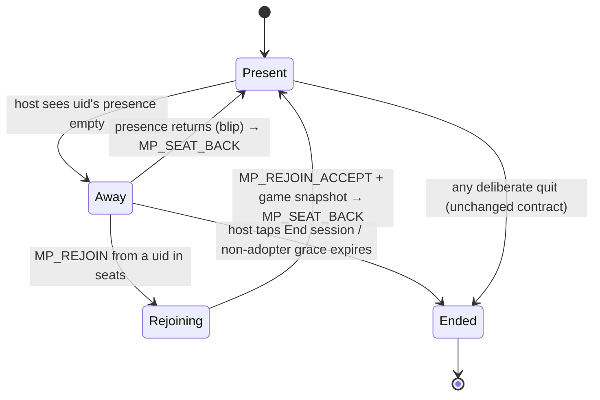

# MDLM Client Reconnect — Design

**Date:** 27 Sep 2026 · **Tier:** 2 (architectural — engine, cross-cutting) · **Status:** approved in
brainstorm, awaiting spec review
**Picks up:** `docs/deferred-work.md` § ⬆ HIGH PRIORITY — MDLM client reconnect (Honeycomb Hills Q20)
**Background analysis:** `docs/new-ideas/new-game-brief-honeycomb-hills.md` Appendix A (Option 1)

---

## 1. Decision (Confluence Snapshot)

**Decision.** A client whose device drops mid-match can get back into its **own seat** and carry on.
This is built once in the engine as an **opt-in hook**, and Honeycomb Hills is its only adopter this
round. Every other game still gets drop *detection*, so a dropped phone ends the session cleanly
instead of leaving the table waiting forever.

**Rationale.** Today a drop is not handled at all. The client's `onDisconnect` quietly deletes its
`/players` entry. The host stopped watching `/players` at `mpConfirmRoster()`, so nobody notices.
The reloaded phone boots into the lobby with no memory of the room, and every other device waits on
a turn that never comes. Honeycomb Hills makes this materially worse: a 50-minute Season with
permanent private hands. Stable identity (Firebase's default persistence returns the same anonymous
UID) and the state transfer (`combSerialiseState` / `combApplyState` / `combSendFullState`) already
exist, so what's missing is the engine half.

**Technical impact.** `js/engine-multiplayer.js` (seats, presence, away/rejoin packets, the
settings-applier extraction, the boot prompt), `js/games/comb.js` (the `reconnect` hook: pause and
resume for Daylight and open offers), `js/lobby/lobby-host.js` (a lobby teardown helper), two engine-owned
overlays (`#mp-away-overlay`, `#mp-rejoin-overlay`) in `src/screens/_mp.html` (then `node
tools/build-index.js`), `tools/verify-mp-reconnect.js` (new),
`tools/verify-comb-loopback.js` and `tools/verify-mp-configs.js` (extended), `sw.js` (version bump).

### Correction to the deferred note

The deferred entry said reconnect "redefines the Mid-Game Quit Contract" and needs
`verify-mp-configs.js` §6 rewritten. **It doesn't.** A drop never goes through the quit path (no
`MP_PLAYER_LEFT` is sent), so the contract only ever described deliberate quits, and those still
dissolve the session exactly as before. Reconnect adds behaviour for **drops**, which today have
none. §6 stands unchanged, and the risk to the 19 non-adopting games is much lower than the note
suggested.

---

## 2. Scope

**In:**
- engine drop detection for every MDLM/TLM lobby session;
- the away/pause overlay;
- blip healing;
- reload → rejoin for games that adopt the hook;
- Honeycomb Hills as the first adopter;
- the boot rejoin prompt and its storage key;
- a manual rejoin by re-typing the code;
- harnesses.

**Out:**
- **Host drops.** `fb.onDisconnect(mpRoomRef).remove()` still deletes the room, and host migration
  (Appendix A Option 2) remains a separate project.
- Serialisers for any game other than Honeycomb Hills.
- One UID open in two tabs.
- Pass-the-Phone (no room exists).

---

## 3. Data model

Two new children of `rooms/{code}`, both live only while a match is running:

| Node | Writer | Shape | Meaning |
|------|--------|-------|---------|
| `seats` | host, at `GAME_START` (rewritten at each `GAME_START` after a `LOBBY_RESET`) | `[uid0, uid1, …]` in seat order — `mpPlayerSlots.map(p => p.uid)` | **Who owns which seat.** Never mutated mid-match. Answers "does this room still have a seat for me?" without asking the host |
| `presence/{uid}/{pushId}` | each **client**, for itself (the host writes none — a host drop deletes the room anyway) | `true` | **Who is connected right now.** One child per *connection*, each with `onDisconnect().remove()`. A seat is present while **any** child exists under its uid |

**Why one child per connection** (Firebase's documented presence pattern): a locked phone's socket
can take up to about a minute to be declared dead by the server. If the player reloads first, a
single `presence/{uid} = true` would be written by the new connection and then **wiped** by the old
connection's late `onDisconnect`, marking a live player Away. With per-connection children, the old
socket only removes its own child.

**Blip healing:** every device listens to `.info/connected`. On each `true`, it pushes a fresh
presence child and registers its `onDisconnect().remove()`. A socket that drops and comes back
without a reload therefore restores its own presence, and no state transfer is needed, because
memory was never lost.

The lobby's `/players` node and its watcher (`mpStartPlayersWatcher`) are **unchanged**. The two
answer different questions and stay separate.

---

## 4. Flow



1. **Detect (host).** From `GAME_START` until the session ends or `LOBBY_RESET`, the host watches
   `rooms/{code}/presence`. A seated uid (not the host's own) whose presence becomes empty is added
   to `mpAwaySeats` (a `Set` of seat indices). The host broadcasts `LOBBY: MP_SEAT_AWAY { seats: [...] }`
   and, if the game adopted reconnect and this is the first absent seat, calls `cfg.reconnect.pause()`.
2. **Pause (all devices).** Every device, host included, shows `#mp-away-overlay`: *"Waiting for
   Theo…"* (names joined: *"Theo and Mia"*).
   - **Host:** an **End session** button that calls `resetToLobby()`, so the normal `HOST_END_GAME`
     goes out.
   - **Clients:** a **Leave** button that runs the normal quit contract (`mpNotifyPlayerLeft()` then
     `resetToLobby()`).
   - **Non-adopting game:** the overlay also runs a **20 s** countdown. When it reaches zero, the
     host calls `resetToLobby()`, and `HOST_END_GAME` carries `reason: 'dropped', name`.
3. **Blip return.** Presence reappears. The host removes the seat from `mpAwaySeats` and broadcasts
   `MP_SEAT_BACK { seats: [...remaining away] }`. When the set is empty, every device closes the
   overlay and the host calls `cfg.reconnect.resume()` (adopters) or cancels the countdown
   (non-adopters).
4. **Reload return.** The dropped device boots and shows the rejoin prompt (§6). On **Rejoin**:
   1. It loads Firebase and reads `rooms/{code}`, then checks that the room exists and `seats`
      contains its uid.
   2. It sets `mpActiveRoomCode` / `mpRoomRef` / `syllyMultiplayerMode = 'client'`.
   3. It writes presence and starts the event and private listeners, with `mpJoinListenFrom = Date.now()`
      set before the send.
   4. It sends `ACTION: MP_REJOIN { version }` and shows a *"Getting you back in…"* standby.
5. **Accept (host).** `MP_REJOIN` is accepted only when:
   - `originId` is in the host's own copy of `seats` (the envelope's `originId`, never a payload
     field — `logic-engine.md` § MDLM Patterns);
   - `version === SYLLY_VERSION`;
   - and the game adopted reconnect.

   On success, in this order:
   1. `mpSendPrivate(uid, { type: 'LOBBY', payload: { action: 'MP_REJOIN_ACCEPT', playerSlots,
      mpLobbyStyle, rosterData, gameSettings: mpSerialiseSettings(game), game } })`;
   2. `cfg.reconnect.sendState(seatIdx)`, which goes through the same private queue, pushed after
      the accept so it arrives after it;
   3. mark the seat back (step 3's path).

   The host accepts a rejoin **whether or not** the seat is currently marked Away (the stale-socket
   race in reverse). Refusal replies privately with `MP_REJOIN_REFUSE { reason }`, where `reason` is
   `'version' | 'not-seated' | 'unsupported'`.
6. **Restore (rejoining client).** On `MP_REJOIN_ACCEPT` the engine mirrors the `GAME_START` applier:
   - `mpActiveGame` / `mpActiveGameConfig` from `game`;
   - `mpApplySettings(game, gameSettings)`;
   - `mpPlayerSlots`, `mpMyPlayerIdx` (from `syllyDeviceUid`), `mpLobbyStyle`, `mpLobbyRoster`;
   - `cfg.onPassThePhone()`.

   The game's snapshot applier, arriving next, takes the device from standby to the live screen.
7. **Mid-match strangers.** A `HANDSHAKE` whose `originId` is not in `seats` while a match is live is
   refused (`MP_REJOIN_REFUSE { reason: 'in-progress' }` → *"That match is already under way."*).
   Today it would silently push a phantom slot into `mpPlayerSlots`.

**Unchanged:** the lobby phase, deliberate quits (`MP_PLAYER_LEFT` → dissolve), `verify-mp-configs`
§6, host drops, and `LOBBY_RESET` / play-again. `LOBBY_RESET` stops the presence watcher, clears
`mpAwaySeats` and hides the overlay; the next `GAME_START` rewrites `seats`.

---

## 5. The per-game hook

An **optional** `reconnect` object on the game's `MP_GAME_CONFIGS` entry. All three functions are
host-only.

```js
reconnect: {
  sendState(seatIdx),  // privately send that seat everything it is entitled to see — and nothing else
  pause(),             // freeze clocks; cancel anything that would auto-resolve against an absent seat
  resume(),            // re-arm clocks from the time remaining; broadcast any new deadline
}
```

**Contract for an adopting game** (both halves already hold for Honeycomb Hills):
1. Its **client** `onPassThePhone` is safe to run on a rejoining device. It sets up names and counts
   and shows a standby, and it must not start a match.
2. Its full-state **applier** takes the device from that standby to the live screen, and is
   idempotent.
3. `sendState` strips every other seat's private state before sending, the same rule as
   `combSendFullState`'s strip.

**Settings applier extraction.** The `SETTINGS_SYNC` `switch` inside `mpHandleEnvelope` moves
verbatim into `mpApplySettings(abbr, s)`. `SETTINGS_SYNC` then calls it, and so does the rejoin
path. This is a pure move with no behaviour change, and it stops the two paths drifting apart.

### Honeycomb Hills' adoption

| Hook | Implementation |
|------|----------------|
| `sendState(idx)` | `combSendFullState(idx)` — exists, already strips other hands and masks deck order |
| `pause()` | Save `combTurnEndTs - Date.now()` (floored at 0) as `combPausedDaylightMs`, then `combStopDaylight()`. Call `combClearOffer()`, so an open trade can't auto-decline or expire mid-pause, and log *"Trade called off — someone dropped out."* Let `combFlightTimer` run: the Scout Flight is a few seconds of host-only animation whose result travels as a normal SYNC |
| `resume()` | If `combPausedDaylightMs > 0` and `combPhase === 'actions'`, call `combStartDaylightAt(Date.now() + combPausedDaylightMs)` and broadcast a **new** `SYNC: COMB_DAYLIGHT { endTimestamp }`, whose applier calls only `combStartDaylightAt()` + `combRenderMeadow()`. Not a re-send of `COMB_ACTIONS_BEGIN`: that applier also clears `combPlacementMode`/`combLegalTargets`, which would throw away the active player's half-made placement |

**A gap to close:** `combTurnEndTs` is clock state and deliberately **not** in `combSerialiseState()`.
The rejoiner gets its countdown from `resume()`'s broadcast, because `resume()` runs after the accept
and snapshot are pushed. It never comes from the snapshot, which stays free of clock state.

The engine only calls `pause()` when the away set goes from empty to non-empty, and only calls
`resume()` when it becomes empty again. Two players dropping never pauses twice.

---

## 6. The boot prompt and `sylly_rejoin`

**New localStorage key `sylly_rejoin` = `{ code, game, ts }`.** It's a pointer to a session, not game
state: no hand, no board, no score. It becomes the fourth named exception (next to `sylly_nickname`,
`isMuted`/`masterVolume` and `sylly_controller`), recorded in `CLAUDE.md` § Anti-Patterns and
`logic-engine.md`.

- **Written** by a client in the `GAME_START` applier, **only** when `cfg.reconnect` exists. For a
  non-adopting game a reload can't be rescued, so a prompt would be a false promise.
- **Cleared** by `resetToLobby()` (every deliberate exit), by any `MP_REJOIN_REFUSE`, by a missing
  room or missing seat at prompt time, and by **Not now**.
- **Expires** 2 h after `ts`, the same age at which `mpCleanupStaleRooms()` treats a room as dead.
- Every read and write is wrapped in `try/catch`. Storage can be absent, and the app must still boot.

**At boot:** after `lobbyBoot()` sets `window.lobbyReady`, a fresh key whose `game` still has an
`MP_GAME_CONFIGS` entry with `reconnect` opens **`#mp-rejoin-overlay`**, an engine-owned Decision
Modal at z-[90], registered in `resetToLobby()`'s teardown:
- emoji: `cfg.emoji`;
- heading: *"Back to {gameName}?"*;
- subtext: *"You dropped out of room {code}. The table's waiting for you."*;
- **Rejoin**, styled with `cfg.brandBtnClass` + white ink;
- **Not now**, neutral stone, with id `btn-mp-rejoin-cancel` so the backdrop-tap dismissal works.

Buttons follow § Quit Overlay Checklist sizing (`min-h-14 … text-lg`). A failed rejoin shows *"That
match has already wrapped up"* in the same modal and clears the key.

**Manual fallback.** In `mpClientJoinRoom()`, after the room read: if `roomData.seats` exists and
contains `syllyDeviceUid`, skip the capacity check and the `/players` slot write and take the rejoin
path. Re-typing the code still works when iOS has wiped storage.

**Leaving the lobby cleanly.** A rejoin enters a game screen without going through `lobbyLaunch()`.
The pre-click teardown in `lobbyLaunch()` (today only `tvDrop(tvRoot)`) is factored into
`lobbyLeaveForGame()`, which both `lobbyLaunch()` and the rejoin path call. The Lounge already stops
itself whenever another screen takes over.

---

## 7. Edge cases

| Case | Behaviour |
|------|-----------|
| Stale socket outlives a reload | Per-connection presence children (§3) — the old socket removes only its own child |
| Locked phone still counted present (up to ~1 min) | Accepted. Its Daylight keeps running until the server declares it gone. Documented, not engineered around |
| Two seats away | `mpAwaySeats` is a set. The overlay names all of them; `pause()` on the first and `resume()` on the last |
| Rejoin arrives before the Away mark | Accepted — the check is membership of `seats`, not Away status |
| Version mismatch on rejoin | `MP_REJOIN_REFUSE { reason: 'version' }` → existing `mp-version-mismatch-overlay`, key cleared |
| Deliberate quit while someone is away | Quit contract as today — dissolves |
| Non-adopter, grace expires | Host `resetToLobby()`; `HOST_END_GAME { reason: 'dropped', name }`; clients' disconnect overlay reads *"{name} dropped out"* |
| Host drops | Unchanged — room deleted, clients' existing `mpRoomListener` shows the disconnect overlay |
| A Firebase-erased payload | `MP_SEAT_AWAY`/`MP_SEAT_BACK` send `seats` as an array that may be **empty** — rebuilt on receipt with `p.seats \|\| []` per `logic-engine.md` § "Firebase erases every EMPTY value" |
| Presence watcher in teardown | Stopped in `mpStopListeners()`, on `LOBBY_RESET`, and in `resetToLobby()`; the away countdown is a timer handle cleared in all three (§ Timer Lifecycle) |

---

## 8. Testing

1. **`tools/verify-mp-reconnect.js` (new).** It loads the **real** `js/engine-multiplayer.js` into a
   `vm` (accepts `MP_SRC=`), with a fake Firebase that has per-device connections
   (`goOffline`/`goOnline`/`reload`), `onDisconnect`, `.info/connected`, `push` ordering, and the
   emptiness-erasure rules the loopbacks already model. It uses a mock DOM of real elements, never
   `() => null`. Scenarios:
   - a blip heals and the overlay closes;
   - reload → prompt → rejoin lands in the right seat;
   - the stale-socket race doesn't mark a live player Away;
   - a stranger is refused mid-match;
   - the non-adopter's 20 s grace ends the session with a reason;
   - a deliberate quit still dissolves;
   - two players away at once, with `pause`/`resume` called exactly once each;
   - version refusal;
   - `LOBBY_RESET` rewrites `seats` and stops the watcher;
   - `sylly_rejoin` is written only for adopters and cleared by `resetToLobby()`;
   - manual re-typing of the code takes the rejoin path.

   Then a **mutation pass:** revert each load-bearing line (per-connection child, the `seats`
   membership check, the pause-once guard, the key clear) and confirm the harness goes red.
2. **`tools/verify-comb-loopback.js`** gains a drop/rejoin scenario. It checks that after restore,
   host and client `combSerialiseState()` match on everything public, that the rejoiner holds **only
   its own** hand and Instinct, and that the Daylight time left survives the pause within ±1 s.
3. **`tools/verify-mp-configs.js`** gains a section: where `reconnect` is present, all three
   functions exist, and the adopter list is exactly `['comb']`. §6 is untouched.
4. **Re-run:** the full Honeycomb Hills suite and `mutate-comb.js` (3–5×), then `visual-lobby.js`,
   which gains two checks: the prompt appears over the lobby when a fresh key exists, and a rejoin
   stops TV's loops.
5. **Owed afterwards, and no harness replaces it:** a real session on two or more phones. Lock the
   owner's iPhone SE mid-Season, reopen it, rejoin, and check the seat, the hand and the clock.

---

## 9. Documentation closure (Documentation Integrity Protocol)

- `docs/code-map.md`:
  - the new nodes, packets, overlays and functions (`mpApplySettings`, the presence watcher, the
    rejoin path, `lobbyLeaveForGame`);
  - COMB's `reconnect` hook.
- `docs/game-identities/comb.md`: the *"Waiting for…"* beat, if the player's journey section lists
  interruptions.
- `CLAUDE.md`:
  - the SW bump (v236) in Current Focus;
  - the harness table row;
  - the `sylly_rejoin` localStorage exception.
- `logic-engine.md`:
  - a new § Client Reconnect;
  - the Mid-Game Quit Contract gains one line: *drops are not quits*;
  - the localStorage exception;
  - the presence watcher added to Timer Lifecycle.
- `docs/implementation-notes/shared-implementation-notes.md`: the design decision and the
  stale-socket lesson.
- `docs/deferred-work.md`: mark the HIGH PRIORITY entry **RESOLVED** (engine half + COMB), and add a
  new entry for **per-game adoption** (the other MDLM games, longest matches first) and host
  migration.
- `docs/decision-log.md`: one entry.
- `sw.js`: bump `CACHE_NAME` (changed engine, plugin and markup). No new files join
  `PRECACHE_URLS` — the new harness lives in `tools/` and is never served.
