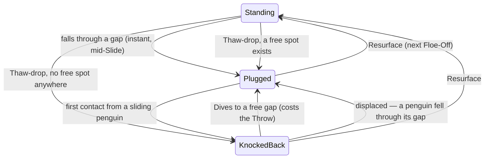

# Cold Shoulder — Drowned plugs, Throw-or-Dive, and the Ice Bath

**Date:** 28 Sep 2026 · **Game:** Cold Shoulder (`cld`) · **Tier:** 2 (rules + packets + physics option)
**Status:** design approved in conversation (owner, 28 Sep 2026); this document awaits owner review.
**Builds on:** SW v242's Berg ring (`cld-implementation-notes` DD-16). **Ships as:** SW v243,
`MP_PROTOCOL_VERSION` → `'v243'`.

**Out of scope — separate specs later, in this order:** the pool-style drag rework and the
Practice Arena (built together, the Arena is the drag's test bed); then the procedural art overhaul.

---

## 1. Intent

The owner's first live session (3 players) found Floe-Offs over too fast. SW v242 answered the
*ring*; this answers the *Drowned*. Today a Drowned penguin sits at one of N fixed rim slices
("Berths", 2 spots each), is an immovable bumper forever, and may Dive one slice left or right.
With an 80% ring of chunks that model no longer fits the picture: Drowned penguins sit on top of
chunks, and the rim slices have nothing to do with where anyone can actually fall.

**The new model, in the owner's words:** a penguin can only fall in **through a gap** in the ring.
A **Berth** is a gap with a Drowned penguin in it. A Berth gives **one** shove, then its penguin is
**knocked back** and the gap is open again. If someone falls through that gap afterwards, the
knocked-back penguin is moved to the nearest free gap. The plug happens **instantly**, mid-Slide, so
two penguins cannot slip through the same gap one after the other — the first one's bottom blocks
the second even while it is still tumbling in.

**Success looks like:** a gap reads as a gap (you can see where you could go in, and see it close
when someone does); a chain of plunges through one hole is impossible; a Drowned player has a real
choice every Slide; and nobody is ever benched, including in a Washout.

---

## 2. Terms (identity doc T5 — paired)

| Term | New meaning |
|---|---|
| **Gap** | An open stretch of the ring at least one penguin wide (`2 × CLD_PENGUIN_R`) at the ring's circle. Hairline cracks are not gaps. Not a displayed term — "gap" is plain English. |
| **Berth** | A Drowned penguin sitting **Plugged** in a gap. Replaces "a slice of the rim". |
| **Plugged** | The Drowned state that blocks: an immovable bumper that absorbs **one** contact. |
| **Knocked back** | The Drowned state after that contact: bobbing just outside its gap, not a body, the gap open. |
| **Dive** | A knocked-back penguin's move to any free gap, instead of throwing that Slide. Arrives Plugged. |
| **Ice Bath** | The sudden-death floe a Washout now starts (§6). |
| **Resurface** | Unchanged — every penguin back to Standing at a fresh Floe-Off. Never used for "surfacing at a Berth". |

Retired: Berth-as-rim-slice, the two-slot Berth, the multi-hop shunt, the rim capacity invariant
(DD-11), the Left / Stay / Right Dive, and the Berth tick marks.

---

## 3. The Drowned life cycle



| | Plugged | Knocked back |
|---|---|---|
| Is a body in the sim | Yes — immovable, `hits: 1` | No |
| Blocks its gap | Yes, for one contact | No |
| Throws a Snowball | Yes | Yes (unless it Dives) |
| Can Dive | **No** | Yes, instead of throwing |
| Drawn at | its seat on the ring's circle | just outside its gap, bobbing |

**Every arrival is Plugged.** Falling in, being displaced, and Diving are all "surfacing somewhere",
and all three arrive with a fresh one-time shove. One rule, not three.

### 3.1 Where a plug seats — the one geometric rule

A plug seats **on the ring's circle** (radius `cldBergInset()`, the same circle the chunks' centres
sit on — never the outer rim, where a penguin can squeeze past it; measured at design time). Within
the gap it fell through:

- if the gap is narrower than **3 penguin diameters**, the plug seats at the **gap's centre** — so
  every slip gap (max 2.4 diameters) is sealed by one plug;
- otherwise (a wide stretch after shatters, or the Ice Bath's open rim) it seats at the **exit
  angle**, clamped so it overlaps no chunk and no other plug.

`cldSeatSpot(x, y, blockers) → { angle, x, y } | null` is the single function that answers this, for
every arrival path (plunge, displacement, Dive, Thaw-drop). `null` means no free spot anywhere on the
ring. **A harness asserts the seal:** for every slip-gap width the ring can generate, a penguin driven
straight at a plugged gap at full power rebounds and does not plunge.

### 3.2 Instant plugging — the physics option

`js/lib/physics.js` gains one **generic, optional** parameter and keeps its contract (pure, total,
seeded, reports and never decides):

```js
params.seatOnPlunge = function (x, y, vx, vy, anchors) → { x, y } | null
```

- Called at the moment a movable body's centre crosses `world.radius`, with the **live** immovable
  bodies (`anchors`: `{ id, kind, x, y, r }`, active only — so a chunk shattered earlier this Slide is
  already gone).
- Returns a position → the body is **seated**: moved there, made immovable, `kind: 'drowned'`,
  `hits: 1`, still active. The `plunge` event is emitted as today, plus a `seat` event
  `{ t, type: 'seat', id, x, y }`.
- Returns `null`, or the option is absent → today's behaviour exactly (deactivated, plunged). Every
  other caller of `Physics.simulate` (the How-to practice sim, the harnesses) is unaffected.
- The callback must be pure and deterministic. `cld.js` passes `cldSeatSpot` bound to the current
  ring; the physics harness asserts byte-identical output with the option on.

**Breakable anchors generalise.** Today only `kind: 'berg'` has hit capacity. Any immovable body with
a numeric `hits` now takes one hit per contact through the existing `damageBerg` path (renamed
`damageAnchor`). At zero: a Berg emits `shatter` and deactivates (unchanged); a Drowned emits
`knockback` `{ t, type: 'knockback', id, x, y, by }` and deactivates. The once-per-contact `vrel >= 0`
gate is unchanged, so the contact that knocks a plug back still rebounds the penguin that made it.

**A Snowball landing on a plug still does nothing** (unchanged). Deliberate: a Drowned player who
could unplug a gap with a throw would turn Snowballs into the dominant play at the rim. Snowballs
still take one hit off a chunk (unchanged) — that is how the Drowned dismantle the barrier.

### 3.3 After the Slide — the aftermath, in order

1. Resting positions and chunk damage (as today). A `seat` event makes that penguin Drowned +
   Plugged at its seat; a `knockback` event makes it Knocked back, drawn outside its gap's angle.
2. **Displacement.** For each `seat`, in timeline order: any penguin *already* Knocked back in that
   gap (its angle falls inside the gap's span) is moved to `cldSeatSpot` nearest its current angle,
   Plugged. `null` → it stays Knocked back where it is. Beat: `{ type: 'displace', penguinId, from, to }`.
3. Stat line, The Thaw, Washout / Floe-Off end — order unchanged.

### 3.4 Throw or Dive (the Drowned's commit)

- **Plugged:** may throw a Snowball, or hold. No Dive.
- **Peck Off:** Throw-or-Dive is per **player**, per Slide — a player with one Standing and one Drowned penguin keeps today's rule (the Snowball comes from the Standing one), and may instead Dive their Knocked-back one.
- **Knocked back:** **either** throw **or** Dive — never both. The aiming UI is a two-pill switch
  `Throw · Dive`. In Dive mode the player taps the floe; the tap snaps to the nearest free spot
  (drawn as a ghost penguin in the gap), and a full ring greys the Dive pill with a reason line.
- **Dives resolve before the Slide** (unchanged ordering, owner-confirmed), so a Dive can seal a gap
  before anyone slides at it. **Contested spots — the closer penguin wins (owner, 28 Sep 2026).**
  All Dives resolve in order of **travel distance**, shortest first: the arc from the penguin's
  current angle to its target, the short way round, measured on the ring's circle. Equal distances
  (within 0.01 units) fall back to seat order. Each Dive in turn takes its target spot, or the free
  spot nearest its target if an earlier Dive took it; no free spot → it stays Knocked back. One
  ordering rule, so three Dives at one gap resolve the same way as two.
- **Commit shape (packet change):** `dive: -1|0|+1` becomes `dive: null | { penguinId, angle }` — the id because a Peck Off player can have two Drowned penguins. `dive` and
  `snowball` are mutually exclusive; a commit carrying both is rejected by the host (the Snowball is
  dropped, the Dive kept — deterministic, and it cannot happen through the UI).

### 3.5 The Thaw and the ring

- Plugs ride inward at their angle, like chunks, and Knocked-back penguins follow their angle.
- **Calving now treats plugs as fixed.** The v242 walk (`cldProjectBergsToRim`) keeps a plug and
  calves the chunk whenever the two would overlap. Two plugs that would overlap after a shrink: the
  later-seated one is knocked back.
- A **Thaw-drop** (a Standing penguin left outside the new radius — not through a gap) surfaces at
  `cldSeatSpot` nearest its angle, Plugged; `null` → Knocked back behind the nearest gap.

---

## 4. The Ice Bath — Washout becomes sudden death

**Today:** a Washout voids the Floe-Off and everyone Resurfaces to replay it.

**New:**
- **Who's in:** the owners of every penguin that was **Standing going into the step that washed
  out** — the Slide, or under the Thaw the melt step. `cldResolveSlide` snapshots the Standing set
  before the sim, and again before the Thaw step, and hands the right one to the bath.
- **The floe:** a fresh, **ringless** floe (no chunks — the whole rim is one open stretch) sized to
  the bath:
  `R_bath = max(1.25 × cldMinRadius(ice), CLD_FLOE_SIZE[size] × √(bathPenguins / totalPenguins))`.
  The Floe Size / Ice / Thaw settings otherwise stand. `R_bath`'s two numbers are tuning values —
  the plan measures them in the balance instrument before they are frozen.
- **Everyone else stays in.** Players Drowned before the Washout keep playing from the rim: each is
  re-seated on the bath's rim by `cldSeatSpot` at its old angle, Plugged.
- **The Fish:** same Floe-Off — `cldFloeOffNo` does not advance, and whoever is last Standing takes
  its Fish. A Washout in the Ice Bath starts another Ice Bath with the same rule (the set can only
  stay the same size or shrink, so it terminates).
- **Beat:** `WASHOUT!` holds for `CLD_WASHOUT_MS` as today, then floats `ICE BATH!` and the floe
  resets in place — no intro screen, no scoreboard.
- **Copy (identity doc T7b, paired):** the result/float lines `Washout!` / `Ice Bath!` and the
  sub-line `Nobody made it. Into the Ice Bath with {names}.` replace `Nobody made it. No Fish — back
  on the ice.`

---

## 5. Packets and wire (MP_PROTOCOL_VERSION → 'v243')

| Packet | Change |
|---|---|
| `CLD_COMMIT` (private, client → host) | `dive` is `null` or `{ penguinId, angle }`; `dive` + `snowball` mutually exclusive. |
| Slide timeline SYNC | Events gain `seat` and `knockback`; aftermath gains `displace`; the per-penguin post state carries `state: 'standing' \| 'plugged' \| 'back'` and `angle`, replacing `berth` / `slot`. |
| `CLD_FLOEOFF_START` | Gains `bath: true` and the bath `radius`; carries the full post-reset penguin list (it already does). `floeOffNo` unchanged on a bath. |
| Match start | `berthCount` removed. |

Firebase erasure (`logic-engine.md` § Firebase erases every EMPTY value): `dive: null` is erased in
flight — the applier reads `p.dive || null`; `events` / `aftermath` arrays keep the existing
`cldWireList` normalisers. `angle: 0` survives (zero is a value, not emptiness).

No new Firebase node and no new writer: `CLD_COMMIT` keeps its path, which the §2.7 `private` rule
already covers.

---

## 6. Code touched

| File | What |
|---|---|
| `js/lib/physics.js` | `params.seatOnPlunge`; `damageBerg` → `damageAnchor` for any immovable with `hits`; `seat` and `knockback` events. |
| `js/games/cld.js` | Delete the Berth-slice system (`CLD_BERTH_SLOTS`, `cldBerthCount`, `cldBerthArc`, `cldBerthOfAngle`, `cldSlotAngle`, `cldSlotTaken`, `cldFreeSlots`, `cldPickFreeSlot`, `cldShuntSide`, `cldAssignBerth`, `cldDiveTarget/Available/Apply`). Add `cldGaps()`, `cldSeatSpot()`, displacement, the Dive-to-spot resolver, the Ice Bath start, the new commit/wire shapes, the Throw · Dive switch and tap-to-dive, knocked-back drawing, removal of Berth ticks, and the `cld-val-floe` descriptor (which today counts Berths). |
| `src/screens/cld.html` | Dive row → `Throw · Dive` pills + reason line; How-to copy for Berths/Dive/Washout. |
| `tools/verify-cld-physics.js` | The option: seat, one-hit knock-back, absent-option parity, determinism, Snowball-on-plug no-op. |
| `tools/verify-cld-loop.js` | Replace the Berth/shunt sections: seat geometry, the slip-gap seal, displacement, Dive (both tie rules, full ring), Thaw-drop seating, calving with plugs, the Ice Bath's roster, radius and Fish. |
| `tools/verify-cld-loopback.js` | New commit shape both ways incl. `dive: null` erasure; `seat`/`knockback`/`displace` agreement host ↔ 2 clients; a bath's `CLD_FLOEOFF_START`. |
| `tools/mutate-cld.js` | Retire the Berth mutants; add mutants for the seal centring, displacement, the throw/dive exclusivity and the bath roster. |
| `tools/simulate-cld-balance.js` | Bots learn Throw-or-Dive; report plugs/knock-backs per Slide, Ice Bath frequency and length; re-measure Slides/Floe-Off against SW v242's table. |
| Docs | identity doc T3/T5/T6/T7b/T10, code-map, impl-notes, decision-log, CLAUDE.md SW entry, `docs/deferred-work.md`. |

**Harness rule check:** everything above is rules, packets, state or appliers — none of it is
presentation, so each assertion earns its place. The Throw · Dive switch and the knocked-back drawing
get one `visual-check` pass at 375×667 and 320×452 (owner's iPhone SE), not assertions.

---

## 7. Decisions recorded here (owner, 28 Sep 2026)

1. Plugs seat **instantly**, mid-Slide.
2. A Berth absorbs **one** contact, then is Knocked back.
3. Displacement is automatic; every arrival is Plugged.
4. Dive is **Throw or Dive**, targeted to any free gap, only while Knocked back, resolved **before**
   the Slide.
5. Washout → **Ice Bath**: the washed-out players on a ringless floe sized to them; the rest keep
   playing from the rim.

Made in this spec, for owner review: plugs seat on the ring's circle and centre in narrow gaps
(§3.1); a Snowball on a plug does nothing (§3.2); contested Dives resolve shortest-travel first, then seat order (§3.4 — amended by the owner);
plugs beat chunks when the Thaw squeezes them (§3.5).

## 8. Risks

- **The seal is geometry, not a flag.** If §3.1's centring were wrong, a plug would *look* like it
  blocks and not. That is why the seal is a sim-level assertion across every generated gap width,
  not a check on the seat coordinates.
- **Mid-Slide seating changes what a timeline sample means** for one body (a plunging penguin
  becomes a fixed one). The loopback's host/client timeline parity check is the guard.
- **Game length moves again.** Plugs make each gap single-use per Drowned; the instrument re-measure
  is part of the plan, and v242's numbers are the baseline.
